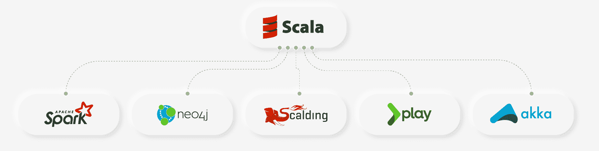

# 2023 年 50 个最好的 Scala 面试问答[更新]

> 原文：<https://hackr.io/blog/scala-interview-questions>

Scala 面试是学生们害怕的面试之一。然而，没有这样的事情，这些担忧只是不自信的学生编造出来的。因此，建议远离那些制造谣言或打击你积极性的学生或申请人。确保 Scala 面试是为了从所有知道答案并在回答中展示自信的申请者中选出一个最好的候选人。因此，即使您加入或不加入，选择过程仍将继续。

因此，最好通过学术知识、迅速的回答技巧和自信的微笑来确定自己在 Scala 面试中的位置，这将赢得招聘经理的信任，就好像你是这份工作的最佳候选人一样。

在对面临 Scala 面试问题的受访者进行研究后，我们发现大多数人都被问到了类似的问题。我们收集了 50 个最好的 Scala 面试问题和答案，可以帮助你更好地理解面试过程中可能会被问到的问题。此外，据观察，自信的学生是通过 Scala 面试测试的成功候选人之一。这些学生不仅准备好了他们的学术部分，还带来了他们对自己的信心，这有助于他们微笑着面对所有的问题。

因此，自信地回答 Scala 问题的受访者能够给招聘经理留下好印象，并成功获得这份工作。

## 最佳 Scala 面试问答

以下是 50 个最好的 Scala 面试问答。

#### 问题:定义 Scala？

**答案:** Scala 是一种基于 Java 的混合编程语言。它结合了面向函数和面向对象编程语言的特点。它与 Java 虚拟机集成使用，可以编译编写的代码。

#### 问题:Scala 是怎样一种结合了函数式和面向对象编程的编程语言？

**答案:** Scala 编程语言把每一个单值都当作一个对象，这也包括函数。这样，它是函数式编程和面向对象编程的结合。

#### 问题:Scala 支持哪些框架？

**回答:**Scala 支持的各种框架包括如下。

1.  Spark 框架
2.  游戏框架
3.  Akka 框架
4.  Neo4j 框架
5.  保龄球框架
6.  烫伤框架
7.  升降机框架



#### 问:Scala 中有哪些不同种类的变量？

**答案:**Scala 中的变量主要有两类，包括可变变量和不可变变量。

#### 问题:定义可变变量的特征？

**答:**可变变量可以用 var 关键字声明。这些变量中的值支持更改。

#### 问:定义不可变变量的特征？

**答:**不可变变量可以用 val 关键字声明。这些变量中的值不支持更改。

#### 问题:在 Scala 中定义 Stream？

**答:**流被定义为一个惰性列表，它只在元素被需要的时候帮助元素的评估。

#### 问题:Scala 中流的好处是什么？

**回答:**Scala 中流的好处是它有助于提高程序的性能。

#### 问题:Scala 的优势是什么？

**回答:**Scala 有几个优点，包括以下几点。

1.  可攀登的
2.  可维持的
3.  多产的
4.  并发编程
5.  由本地元组组成代码由可测试代码组成
6.  简明代码
7.  没有样板代码
8.  单例对象在解决方案中比静态对象更清晰

#### 问题:Scala 中有哪些不同的运算符？

**答案:**Scala 中不同的运算符包括以下几种。

1.  赋值运算符
2.  关系运算符
3.  逻辑运算符
4.  算术运算符
5.  按位运算符

#### 问题:什么是 Scala 中的递归？

**答案:**递归是指 Scala 中调用自身的函数。

#### 问题:举一个 Scala 中递归的例子？

**答案:**当函数 A 调用函数 B，函数 B 又进一步调用函数 C，那么在 Scala 中称为递归，多用于函数式编程。

#### 问题:什么是尾部递归？

**答:**尾递归是对应该是要执行的结束任务函数的函数的回调。

#### 问题:Scala 中的元组是什么？

**回答:**Scala 中的 tuple 将有限数量的条目组合在一起，这样程序员就可以将 tuple 作为一个整体来传递。

#### 问题:如何在列表中追加数据？

**答案:**在列表中追加数据，要用“:+”。这将向列表追加一个值。例如:

```
var a = List.empty[String]
a: List[String] = List()
a:+="pear"
```

如果要将一个列表添加到另一个列表中，则使用“++”，如下所示:

```
a++ = List("mango","banana")
```

#### **问题:解释一下 Scala 中函数声明的语法？**

**回答:**语法是:

```
def functionName(parameters : typeofparameters) : returntypeoffunction = {  
// function statements  
} 
```

请注意，没有使用关键字 return。Scala 通过查看最后一个参数来确定返回类型。使用“def”关键字创建函数。所有的参数和它们的返回类型都提到很清楚。添加等号运算符时，返回值；否则，如果没有使用等号运算符，该函数将不返回值。

#### **问题:如何在 Scala 中创建数组？**

**答:**创建数组，我们要声明一个引用数组的变量，并指定数组的类型。数组可以创建为:

```
var z:Array[String] = new Array[String](10)
or
var z = new Array[Int](5)
```

#### **问题:描述一下 Scala 中的异常处理？**

**回答:**Scala 中的异常处理和 Java 类似，只是没有检查异常。要抛出异常，我们使用**throw new<exception name>**，要捕捉异常，我们可以使用 **try{}catch{}** 块。还有一个在最后执行的 finally 块。我们可以使用 case ex: blocks 在 catch 块中捕获多个异常。示例:

```
try {
         val input = new FileReader("myinput.txt")
      } catch {
         case ex: FileNotFoundException => {
            println("File not found")
         }
         case ex: IOException => {
            println("Exception in I/O")
         }
      } finally {
         println("Exiting the code...")
      }
    }
```

#### **问题:什么是 Scala 集合’？可以对集合进行操作的方法有哪些？**

**答:**集合是具有唯一元素(无重复)的集合。集合有两种类型:可变的和不可变的(其值不能改变)。默认情况下，Scala 使用不可变集合。集合运算的几种方法是:

*   head:返回集合的头(第一个元素)
*   tail:返回除 head 元素之外的整个集合
*   isEmpty:检查集合是否为空，返回布尔值

#### **问题:解释 Scala 优于其他编程语言的地方？**

**回答:**几个原因是:

*   尽管 Scala 是面向对象的，但它也具有函数式编程语言的特性。
*   它简洁、易于编码、可读性强、易于编译并且没有错误。
*   部署并发性，从而简化同步。
*   第三方库可以很容易地以语言结构的形式添加。
*   在多核架构环境中工作。

#### **问题:解释 var 和 value 的区别？**

**答案:**var 和 value 都是用来声明变量的。然而，var 代表一个变量，其值可以在代码中更新，而 val (value)就像一个常量或最终值，不能更改。一旦为 var 或 val 赋值，就不能更改其类型。示例:

```
var var1 = new A(6);
var1 = new A(7);
val value = 6;
value = 7; // This will not work
```

#### 问题:提及不同类型的 Scala 文字？

**答案:**Scala 中有很多文字量:

*   **整数文字:** Int 或 Long，例如 12，0999L
*   **浮点文字:** Float，示例，1.3
*   **布尔文字:**真/假
*   **符号文字:**内部字符串，例如“世卫组织”
*   **字符文字:**单个字符，例如:' v '，' \t '
*   **字符串文字:**字符序列，例如，“嗨，你好吗？”

#### **问题:什么是 Scala 中的异常传播？**

**答:**在 Scala 中可以使用**抛出异常。**子句，并传播到下一个类。和 Java 等其他编程语言一样。示例:

```
 try{
  var fr = new FileReader(“data.txt”)
 }catch {
  case ex: FileNotFoundException =>{
            println("file not found")
  }
  case ex: IOException => {
            println("IO Exception")
         }
}
```

#### 问题:什么是比特集？

**答案:** BitSet 是较小整数的集合，表示为较大整数的位。我们可以使用类似 list 的' ++ '操作符在一个位集中添加多个项目。位集可以是可变的和不可变的，并且是非负整数的集合。

#### 问题:元组是不可变的吗？

**答:**是的，Tuple 大多在数组或列表的情况下是不可变的，其中可以保存不同数据类型的对象。

#### 问题:Scala 中的 Class 是什么？

**答案:**Scala 中的类结合了 Scala 中的数据及其方法。

#### 问题:什么是 Scala 中的对象？

**回答:**Scala 中的对象是类中的一个特殊实例。

#### 问题:我们在 Scala 中需要 App 吗？

**回答:**是的，我们确实需要 Scala 中的 App，这样它就可以作为一个助手类，将 main 方法及其成员保存在一起。

#### 问题:App trait 的好处是什么？举个例子？

**答:**一个 App trait 可以用来快速的把对象变成可执行的程序。例如，我们可以让我们的类扩展 App，目的是呈现可执行代码。

#### 问:定义高阶函数？

**答:**高阶函数定义为将一个或多个函数作为自变量，返回一个函数作为其结果的函数。

#### 问题:Scala 中变量的不同作用域是什么？

**答案:**Scala 中变量有三种不同的作用域，包括字段、方法参数、局部变量。

#### 问题:Scala 中的字段是什么？

**答:**字段是在对象内部声明的变量。根据访问修饰符的不同，可以从程序内部的任何位置访问它们。可以使用 val 或 var 来声明它。

#### 问:方法参数是什么？

**答:**方法参数是传递给方法的值。它们是严格不可变的，可以从方法内部访问。但是，可以使用引用从所提供的方法之外访问它们。

#### 问:什么是局部变量？

**回答:**如果我们从方法中返回局部变量，就可以访问它们。它们是在方法内部声明的，只能从那里访问。

#### 问题:Scala 中的闭包是什么？

**答案:**闭包是 Scala 中的一个函数，它的返回值依赖于在闭包外声明的一个或多个变量的值。

#### 问题:在 Scala 中定义性状？

**答案:** Traits 在 Scala 中是封装方法及其变量或字段的单元。

#### 问题:Scala 和 Java 有什么区别？

**答案:【Scala 和 Java 的区别包括以下几点。**

| **Scala** | **Java** |
| Scala 中的所有值都被视为对象。 | Java 中的所有值都不被视为对象。 |
| 它支持闭包 | 它不支持闭包 |
| 它有类型推理 | 它没有类型推理 |
| 它支持嵌套函数 | 它不支持嵌套函数 |
| 它支持并发性 | 它不并发 |
| 它有不同的特征 | 它不支持特征 |
| 它有特定领域的语言或 DSL 支持。 | 它没有特定领域的语言或 DSL 支持。 |

#### 问题:Scala 中的 extend 关键字是什么？

**答:**Scala 中的 extend 关键字有助于扩展一个 Scala 基类，这样你就可以设计一个继承类，就像在 Java 中使用 extend 关键字一样。

#### 问题:Scala 中 extend key 关键字有什么限制？

回答:在 Scala 中，扩展关键字有两个限制。这包括作为方法重写的第一个，它需要重写关键字，以及作为主构造函数的第二个，它可以将参数传递给基构造函数。

#### 问题:在 Scala 中用语法定义隐式类？

**答案:**Scala 中带语法的隐式类，当类在作用域内时，支持与类的主构造函数的隐式对话。它标有“implicit”关键字，在 Scala 2.10 版本中引入。

#### 问:Scala 中有哪些不同类型的访问修饰符？

**答案:**答案:Scala 中有三种类型的访问修饰符可用，包括 Private、Public 和 Protected。

#### 问:什么是私有访问修饰符？

**答:**私有访问修饰符支持将私有成员对类或对象的可访问性限制为一个集合或预先声明。

#### 问:什么是公共访问修饰符？

**回答:**公共访问修饰符不需要任何显式修饰符来允许公共成员获得访问，成员可以从任何地方访问。

#### 问:什么是受保护的访问修饰符？

**答:**受保护的访问修饰符只支持定义和授权成员的类的子类的可访问性。

#### 问题:在 Scala 中定义 Monad？

**答案:**Scala 中的 Monad 是宾语。它有助于按照小程序包装另一个对象，该小程序可以是执行数据操作的函数，特别是在底层对象上。它间接地操纵对象，并选择在底层对象上应用程序的方法。

#### 问题:什么是 Scala 匿名函数？

**答案:** Scala 匿名函数在源代码中也被称为 Function Literals’。在运行时，这些函数文字被实例化为对象，称为函数值，这为定义这些匿名函数提供了相对简单的语法。

#### 问题:为什么 Scala 优先选择不变性？

**回答:**Scala 中不变性是首选，因为它支持设计，并将其作为默认。它有助于处理并发程序以及平等问题。

#### 问题:在 Scala 中定义不同的包？

**回答:**Scala 中有三个不同的包。这些是，

1.  Java.lang._: 它是一个包，提供了 Java 编程语言设计的基础类。
2.  **Java.io._:** 它是一个为输入输出资源导入 Scala 中每一个类的包。
3.  **PreDef:** 它为 Scala 中常用的类型提供了类型别名。其中包括 Safe、Map 和 List 构造函数。

#### 问题:选项在 Scala 中的作用是什么？

**答案:**选项在 Scala 中有一个至关重要的作用，就是包装缺失的值。

#### 问:定义 Scala 标识符的类型？

**答案:**Scala 标识符有四种类型，包括，

1.  文字标识符
2.  字母数字标识符
3.  混合标识符
4.  操作员标识符

#### 问题:编译 Scala 代码有哪些步骤？

**答:**编译 Scala 代码的过程始于在 Scala IDE 或 Scala REPL 中编写代码，这些代码随后被转换成字节码，从而被转移到 Java 虚拟机或 JVM 中进行编译。

#### 问题:Scala 中 Yield 有什么特点？

**答:** Yield 有几个特点为，

1.  它被用作循环。
2.  它为每次迭代产生价值。
3.  它支持使用地图，平面地图，过滤器以及游牧民族。

#### 问题:在 Scala 中定义 Null、Nill、None、Nothing？

**答案:**Scala 中的 Null、Nill、None、Nothing 可以定义如下。

1.  Null 表示没有值。
2.  Nil 表示列表的结尾。
3.  None 是没有值的选项的值。
4.  没有什么是类型系统中最低的类型。

#### 问题:Scala 中有哪些不同的循环？

**答案:**Scala 中有三种不同类型的循环。

1.  当条件为真时，循环有助于重复语句或语句组，这样，它在执行循环体之前测试条件。
2.  Do-While 有助于测试循环体末尾的条件。
3.  对于，帮助多次执行一系列语句，并简化在循环变量中管理的代码。
4.  Break 充当循环控制语句，它终止循环语句，并将执行转移到循环后面的语句。

#### 问题:什么是无限循环？

**答案:**当一个条件永远不会变成假语句时，就出现了无限循环。

#### 问:有哪些不同的字符串方法？

**答:**有五种不同的字符串方法，包括:

String trim():它返回省略了前导和尾随空格的字符串副本。

1.  **字符串转换为大写:**它使用给定的语言环境规则将字符串中的所有特征转换为大写。
2.  **Char[] to CharArray():** 将字符串转换为新的字符数组。
3.  **String[]split(String regext):**它围绕给定正则表达式的匹配项拆分字符串。
4.  **Int length():** 返回字符串的长度。

#### 问题:在 Scala 中定义 Map？

答:Scala 中的 Map 是键或值对的集合，有助于基于键检索值。

#### 问题:Scala 中的模式匹配是什么？

**答案:**Scala 中的模式匹配由各种以关键字 case 开头的备选项序列组成。每个可用的替代方案都使用模式和表达式。当这些模式匹配时，Scala 会对它们进行求值，箭头符号“= >”用于将其与表达式分开。

**答案:**Scala 中的提取器被称为对象。它对其成员应用一个名为“Unapply”的方法，目的是匹配值并将其分离。

#### 问题:定义辅助构造函数和 Que？

**答:**一个辅助构造函数用于构造函数重载。它需要在其主体的第一行调用先前定义的或主构造函数。

队列是一种数据结构，就像堆栈一样。然而，它的附加特征是它遵循先进先出的数据处理过程。要应用队列，需要导入一个名为 import scala 的库。

```
Collection.mutable.Queue.
```

## 结论

仔细阅读以上问答后，建议联系一个朋友，和他们进行问答。这样你可以向你的朋友提问，答案来自另一边。同样的模式可以持续相当长的时间。有了这个程序，你会发现现在已经获得了回答问题的信心，可以勇敢地面对 Scala 面试问题了。

这里有一个很好的 Scala 课程可以帮助你准备面试: [Scala &初学者函数式编程|摇滚 JVM](https://click.linksynergy.com/deeplink?id=jU79Zysihs4&mid=39197&murl=https://www.udemy.com/course/rock-the-jvm-scala-for-beginners/) 。

用这本书准备热门面试问题:[破解编码面试:189 个编程问题及解答](https://geni.us/MmRP)。

一张微笑的脸和一个自信的回答是面试成功的关键。因此，建议真诚地努力完成所有学术部分，接受面试问题，准备好及时回复，勇敢地面对 Scala 面试。生活中没有不可能完成的事情，因此，带着勇气和决心去参加 Scala 面试吧。请记住，招聘经理不仅在寻找正确的答案，还需要一个合适的人，他真诚并致力于自己的工作，同时有足够的自信来应对工作中的各种情况。要掌握这些技能，达到招聘经理的期望，就要做好自信地参加面试的准备。

你有什么进一步的建议要分享吗？或者你在面试中遇到的其他问题？请在下面分享和评论，以帮助其他考生！

**人也在读:**