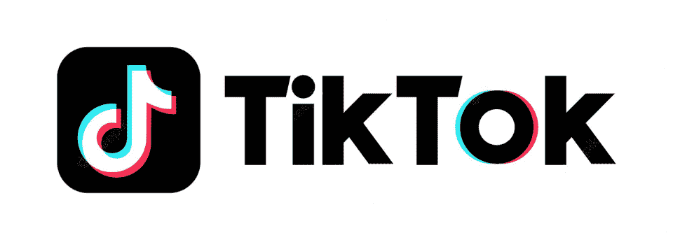

# 将你的职业转向科技，没有科技背景

> 原文：<https://hackr.io/blog/switch-career-without-a-tech-background>

以下是一些值得思考的问题:麦肯锡 [的一项研究](https://www.mckinsey.com/~/media/McKinsey/Featured%20Insights/Digital%20Disruption/Harnessing%20automation%20for%20a%20future%20that%20works/MGI-A-future-that-works_In-brief.pdf) 发现，虽然很少有职业是完全自动化的，但 60%的职业至少有 30%的活动在技术上是自动化的。

难怪很多人都在评估自己目前的工作，并怀疑转向科技可能不是一个真正明智的选择。此外，进入 IT 行业还有其他所有的好处，比如更高的薪水、丰厚的福利(谁不想要免费的午餐和唾手可得的咖啡师呢？)以及无尽的学习和发展机会。

但是如果你来自一个更传统的背景，有可能改变吗？的确如此——下面我们来看看三个成功的策略。

## 在科技公司找一份非科技工作

进入科技行业最简单的途径之一是在科技公司申请一个与你目前技能相匹配的非技术职位。

从那里，你可以利用现有的职业发展福利来学习新技能，你可以参加任何指导计划或相关的员工团体，你还可以在你想加入的团队中发展关系。

你也可以主动承担有助于你提升技能的项目。让你的经理意识到你愿意并且能够学习将是一个很好的开始。

参加课程

## 简历末尾的“兴趣”部分通常是一个垃圾场。让你的兴趣变得有价值，发展适合学习和发展的外部兴趣，从而为自己找到一份新工作。

从 [编码训练营](https://hackr.io/blog/free-coding-bootcamps) 到 [在线课程](https://hackr.io/blog/best-python-courses) 在这里你可以学习编程语言，或者钻研数据科学或 web 开发，你也可以开一个博客，摆弄它的 HTML 和[CSS](https://hackr.io/blog/css-cheat-sheet)模板。不要害怕建造和破坏东西——这都是过程的一部分。你可以在业余时间学习大量的技术技能，而且这对未来的雇主来说都很好。

重新装备你的工作

在某些情况下，可能有必要回到大学去获得专业证书，同时兼顾一份全职工作和一门强化课程的所有要求是很棘手的。

## 和你现在的雇主聊聊可能是个好主意:你能压缩你的工作周，这样你就能在四天内完成五天的工作吗？如果你能负担得起，而且你的雇主也同意，在你学习的时候去兼职是可能的。

询问是否有职业发展的预算，记住雇主通常只支付对他们有益的课程，之后你可能会被要求在公司呆一段时间。

要记住的最重要的事情是，那里有难以置信的机会。有了计划和决心，你就能做出完美的支点。

下面，我们将看到三家公司正在招聘各种各样的职位，为了获得更多的机会，请查看 [Hackr.io 工作板](https://jobs.hackr.io/) 。

**顶级公司正在招聘**

Shopify

## 

## 一个完整的商务平台，让你开始、发展和管理一个企业， [Shopify](https://jobs.hackr.io/company/shopify-5/jobs) 提供了一个简单的方法来快速启动一个在线商店，而不必涉及服务器和开发成本。它用户友好、直观，使用 Shopify 平台销售的商家超过 175 万。

该公司自 2019 年以来增加了 68 万个新商户，并被网飞、丝芙兰、特斯拉和 Fitbit 等公司使用。

该公司的公开职位包括税务分析师、高级基础设施软件工程师和数据工程师。 **见** [**所有在 Shopify**](https://jobs.hackr.io/company/shopify-5/jobs) **公开的角色。**

抖音

短格式移动视频的领先目的地，【的使命是激发创造力，带来欢乐。该公司现在在全球各地设有办事处，自 2018 年以来，该平台一直在稳步增长。数字在疫情期间飙升，从 6.8 亿月活跃用户增加到 2021 年的 11 亿月活跃用户。该平台在 2020 年第一季度的应用下载量最高，全球下载量超过 3.15 亿次。

## 目前，有一系列的职位可供选择，包括 IT 待命主管、网络安全控制保证计划经理和情报自动化开发人员，以及威胁导向防御。 **发现**[更在抖音](https://jobs.hackr.io/company/tiktok-2/jobs) **公开角色。**

北海巨妖数字资产交易所

全球最大、最值得信赖的数字资产平台之一，正在帮助其用户体验加密改变生活的潜力。由于其产品、服务和全球专业知识的独特组合，它受到全球 800 多万消费者、专业交易商、机构和权威机构的信任。

## 该公司正在招聘包括现场可靠性工程师和核心基础设施工程师在内的职位。 **浏览更多** [**北海巨妖**](https://jobs.hackr.io/company/kraken-digital-asset-exchange-1/jobs) **开放角色。**

One of the largest and most trusted digital asset platforms globally, [Kraken](https://jobs.hackr.io/company/kraken-digital-asset-exchange-1/jobs) is empowering its users to experience the life-changing potential of crypto. It is trusted by over eight million consumers and pro traders, institutions, and authorities worldwide thanks to its unique combination of products, services, and global expertise.

The company is hiring for roles including Site Reliability Engineers and Core Infrastructure Engineers. **Browse more** [**open roles at Kraken**](https://jobs.hackr.io/company/kraken-digital-asset-exchange-1/jobs)**.**