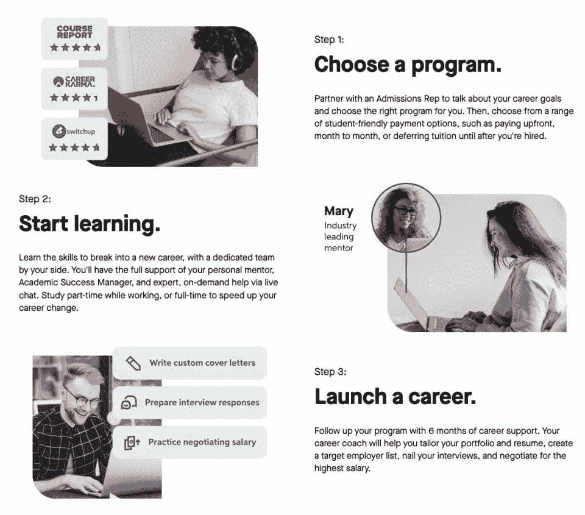
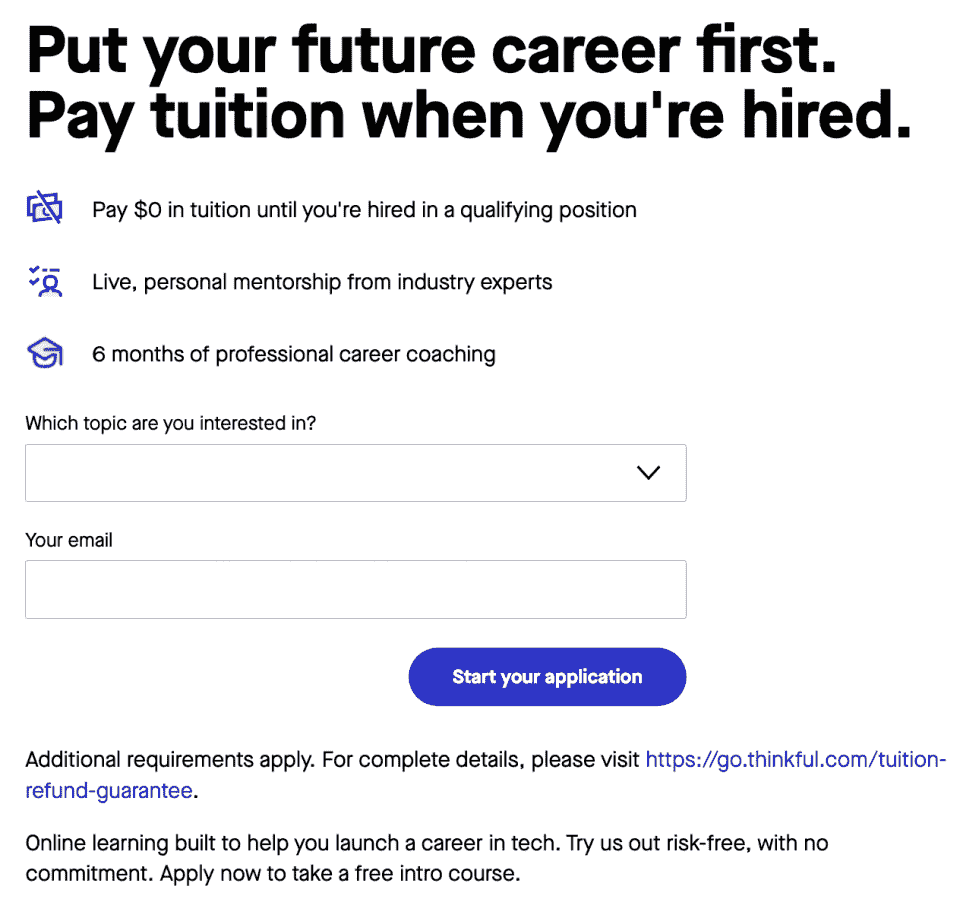
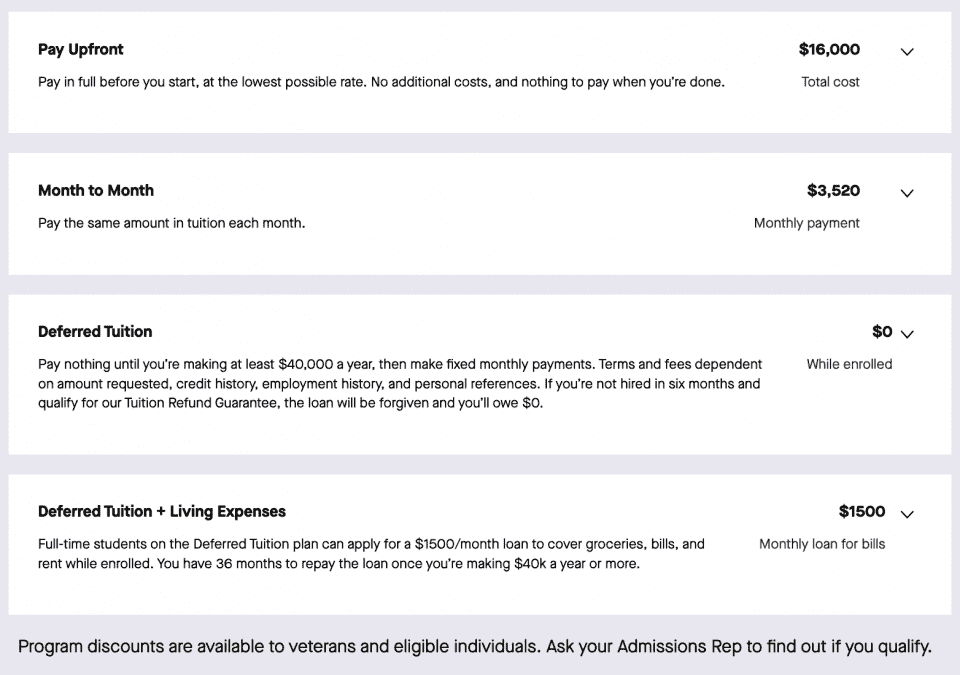
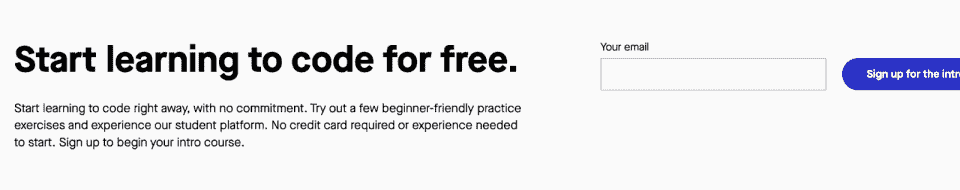
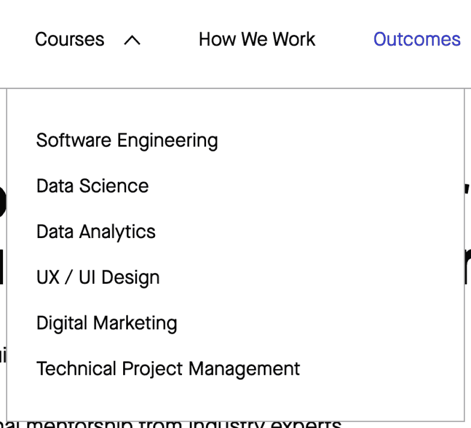
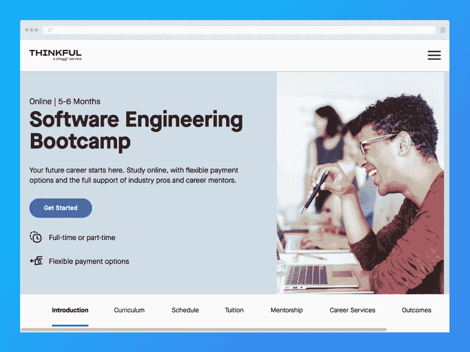
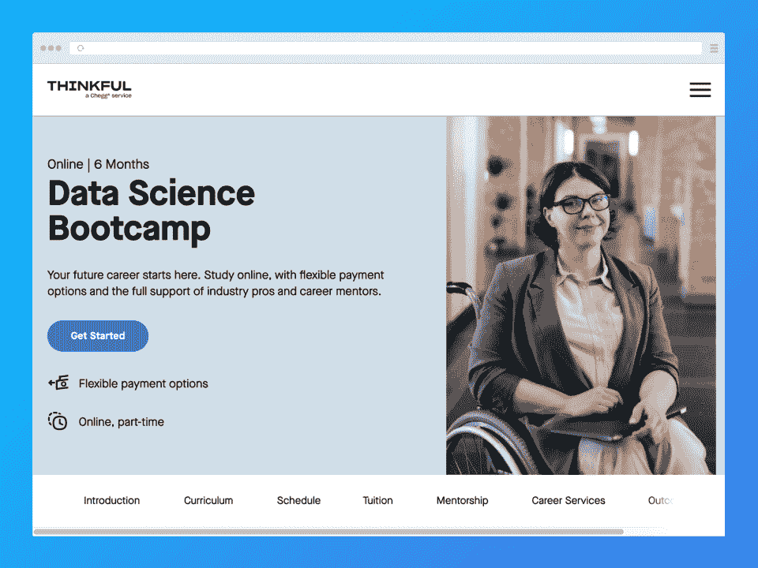
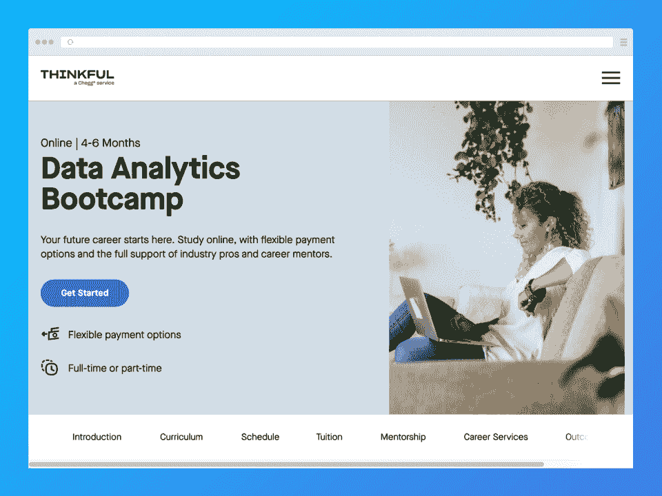
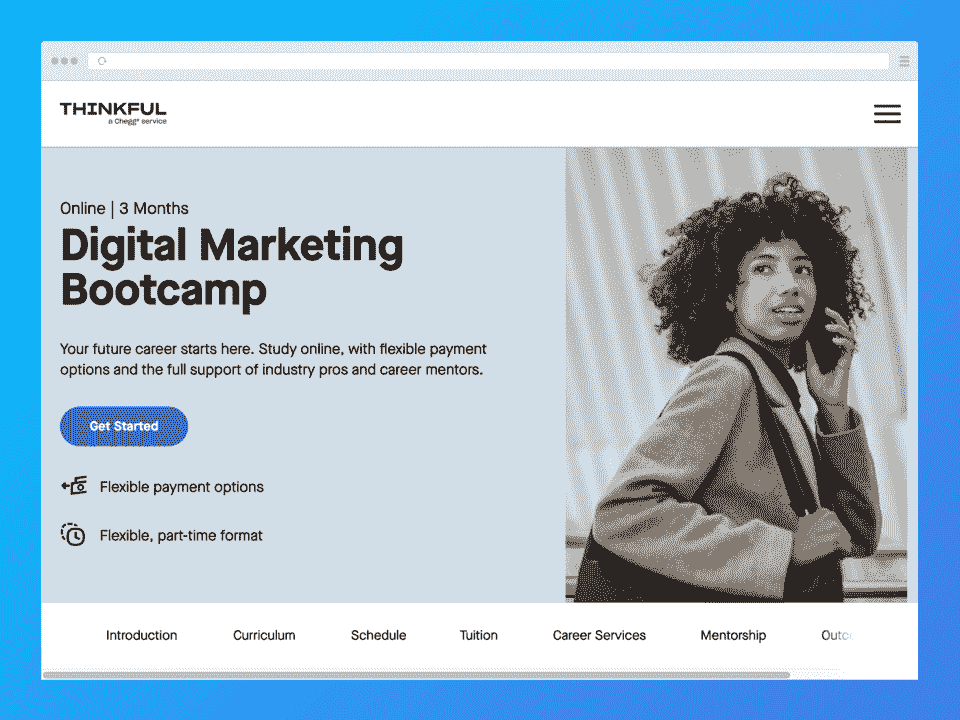
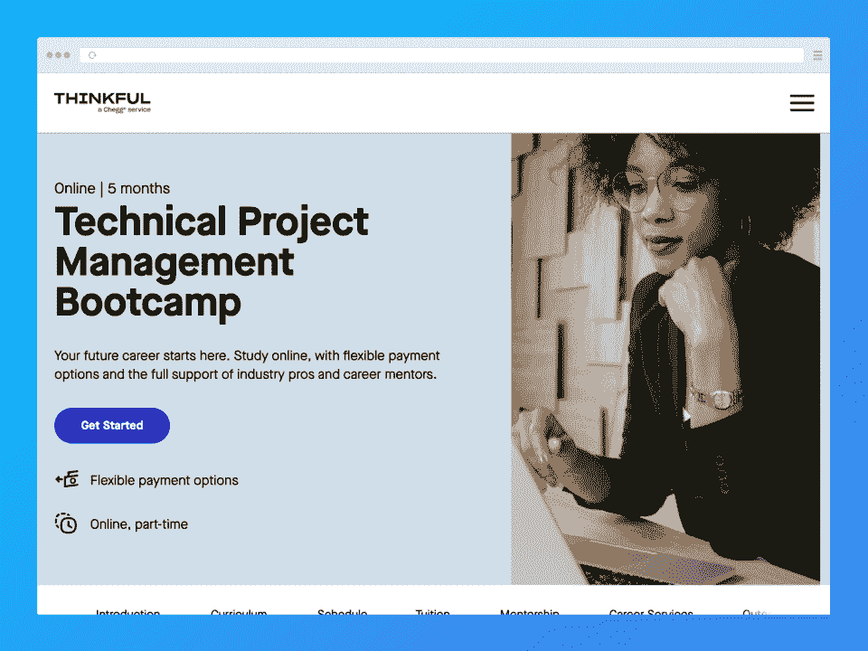

# Thinkful 点评:值这个价吗？优点、缺点和更多

> 原文：<https://hackr.io/blog/thinkful-review>

Thinkful 不仅仅是一个典型的 MOOC 提供商。它提供六个在线训练营来培训学生，并帮助他们毕业后就业。

| 教练 | 4.3/5 |
| 课程 | 5/5 |
| 经验 | 4.75/5 |
| 总数 | 4.7/5 |

**一览:**

*   提供一对一的指导体验
*   许多支付选择，包括延期学费
*   费用昂贵，起价从 4500 美元到 16000 美元以上
*   81%的毕业生在毕业后 180 天内找到工作
*   课程结束后，毕业生的薪水平均增加了 17，000 美元

那么，Thinkful 值得吗？

在这篇有思想的评论中，我们深入探究了所有与有思想相关的东西。我们会看课程，费用，经验，学费退款保证(没错！)，还有更多。请继续阅读这篇有趣的综述，看看它的[训练营](https://hackr.io/blog/free-coding-bootcamps)是否适合你！

## 什么是有思想的？

Thinkful 是一家在线课程提供商，拥有六个非常高质量的训练营，甚至可以帮助完全的初学者[在毕业后很快找到工作](https://www.cbc.ca/news/canada/tech-boot-camps-career-change-pandemic-1.6386112)。

Thinkful 是一家总部位于纽约的公司，成立于 2012 年。从那时起，它为那些想要开始或推进职业生涯的学生提供教育。

### Thinkful 合法吗？

绝对的！有思想的毕业生甚至去了科技巨头和大公司工作。该平台在第三方网站上的评分也很优秀。

### Thinkful 得到认证了吗？

Thinkful 的 [FAQ 页面](https://www.thinkful.com/faq/)声明其未获得美国教育部认可的任何地区或国家机构的认证(见下图截图)。

然而，该公司与 SNHU(南新罕布什尔大学)合作，帮助学生获得可转让的大学学分。例如，Thinkful 的软件工程、数据科学或数据分析训练营的毕业生可以获得适用于 SNHU 大学*学士或硕士学位的学分。*

### 谁应该使用 Thinkful？

任何希望在科技领域发展或开始职业生涯的人都可以从 Thinkful 受益——特别是因为它的职业服务专注于毕业后的就业保障。然而，如果你是一个爱好者，想要学习一些新的东西，它的一些程序的价格标签可能会觉得不合理。

## Thinkful 是如何工作的？

****

Thinkful 的工作非常简单。一旦你被录取并决定了付款方式，你就可以选择一个项目，申请，并开始学习。当你完成后，你就可以开始你的职业生涯了。

Thinkful 根据您选择的时间表提供不同的学习方法。例如，全日制训练营每天都有现场课程。非全日制课程通常更加自定进度。

在 Thinkful，您还可以获得一个支持网络，帮助您成功完成项目，并在毕业后尽快找到工作。你可以接触到你的导师、职业教练、同龄人和学业成功经理。

### **如何开立一个有创意的账户**

与其他课程提供商不同，您不能使用 Thinkful 创建帐户。相反，你必须在收到你的帐户之前申请(并被接受)。

申请并不意味着一旦被接受，你就必须注册或支付一毛钱。在决定这个平台是否适合你之前，你可以尝试一些免费的入门课程。

## **Thinkful 的利弊**

考虑到 Thinkful 课程的价格，毫无疑问，许多人对注册感到非常担忧。我们来看看平台的利弊，帮你决定。

| **优点** | **缺点** |
| Thinkful 的一对一指导经验是一种独特的学习方式，可以为您提供在训练营中取得成功所需的指导。 | 一些评论指出，导师的质量可以更好——一些导师比其他人好得多。 |
| 注册 Thinkful 训练营可以让你进入该平台的 Slack 社区，在那里你可以提问或回答问题，并分享你的经验。 | 你必须通过全日制项目的预备课程，否则你可能不会被训练营接受。 |
| 全日制课程都有预备课程。 | 你只能从六个程序中选择(尽管对某些人来说这并不总是一个决定性因素)。 |
| 全日制项目每天都有现场研讨会(这是强制性的)来帮助学习过程。 | 缺少一些科技方面的话题——例如，没有关于网络安全的项目。 |
| 因为只有六个项目，所以质量极高——Thinkful 设计了它的 bootcamps，帮助你毕业后找工作。 | 这些节目很贵！ |
| 项目登录页面信息丰富，网站易于使用。 | 一些评论指出平台/管理对于客户支持来说不是最好的。 |
| Thinkful 提供了许多支付项目费用的方法，让更多的人可以接受教育。

*   有思想的课程有多少？

 |

## 如果你来这里认为你可以负担得起学习，我们讨厌成为坏消息的传递者。有创意的程序要花费数千美元——至少要 4500 美元。最高端的项目可能要花费 16500 美元——这还只是你预先支付的费用。

按月支付或延期支付意味着您要支付利息，因此在某些项目中，您可以支付高达 30，000 美元以上的费用。让我们快速浏览一下 Thinkful 的支付选项:

如果你选择全职，你可以期待这些付款方式:

**预付，**一次性付清全部学费，毕业后不欠任何费用

*   **按月支付**，每月支付固定金额，直到学费全部付清——支付期限通常与项目期限一样长
*   延期学费，入学时你只需支付 0 美元，但毕业后每个月必须支付一笔固定的费用(一旦你找到一份最低收入为 4 万美元的合格工作)
*   **延期学费+生活费**，你每月可以获得 1500 美元的生活费(贷款)，毕业后(找到一份最低收入为 40000 美元的合格工作后)，你可以每月偿还这笔钱(加上学费)
*   非全日制学费支付方式相同，除了延期支付+助学金选项不可用。

Thinkful 提供免费课程吗？

### 这个问题的答案是响亮的**不**。与许多其他 MOOC 提供商不同，Thinkful 的小型精选课程是收费的。此外，您不能访问任何免费试用版。

然而，你至少可以通过注册一些初学者友好的练习来尝试它的学生平台。

**贴心的学费退款保证**

### 作为一家公司，Thinkful 似乎意识到其价格可能不会激发注册。这也正是 Thinkful 做出各种变通的原因。除了提供不同的支付选择，Thinkful 还有其[学费退款保障](https://www.thinkful.com/tuition-refund-guarantee/)。当然，Thinkful 提供这种保证主要是因为它对训练营的质量有信心，知道如果学生们努力工作，他们很可能找到工作。

但是到底是什么保证呢？

*根据以下条款，如果您在从 Thinkful 项目毕业后 180 天内(这 180 天称为“职业服务期”)没有获得“合格职位”(定义如下)，Thinkful 将全额退还您或第三方代表您支付的学费，并取消任何剩余欠款。*

根据 Thinkful 的说法，**符合条件的学生**如果在 *180* *天*的职业服务期内没有找到*符合条件的职位*，可以获得**全额退款和贷款豁免**。

很简单——但是怎样才有资格获得退款呢？

**Thinkful 学费退款保证资格要求**

### 要获得学费退款保证，您必须:

在预期的时间框架内完成你的项目

*   完成所有课程要求和职业服务检查点
*   从该项目毕业时年满 21 岁
*   要么是美国公民，要么有绿卡(并被合法永久授权在美国工作(无需担保))
*   流利/精通英语(口语+书面)
*   通过你申请的任何工作的背景调查
*   支付学费:
*   全额学费预付

*   带利息的逐月付款
*   传统或延期的全额/部分学费贷款融资
*   居住在或至少在 Thinkful 的[批准城市](https://www.thinkful.com/tuition-refund-guarantee/#:~:text=a%20STEM%20Degree.-,Approved%20Cities,-Each%20of%20the)之一的[一小时通勤](https://www.thinkful.com/tuition-refund-guarantee/#:~:text=live%20in%20or%20within%20a%20one%2Dhour%20commuting%20distance%20of%20one%20of%20the%20%22Approved%20Cities%22%20listed%20below%3B%20A%20one%2Dhour%20commuting%20distance%20is%20defined%20as%20the%20maximum%20distance%20during%20a%20one%20hour%20long%20rush%20hour%20commute%20that%20would%20allow%20for%20an%20arrival%20by%209%3A00%20am%3B)距离内

*   如果您打算从一个批准的城市搬到另一个城市，请通知 Thinkful 并在入学过程中获得批准，并在入学后一个月内证明搬迁
*   以*完成*的方式及时完成职业调查。
*   如果您打算学习数据科学训练营并希望有资格获得学费退款，您必须拥有学士或学士学位。如果你的学位不是 STEM，你必须有 BA/BS 学位，加上两年或两年以上相关职位的技术经验(程序员、数据分析师等)。

有关 Thinkful 的学费退款政策、资格要求、毕业后要求以及可能导致资格无效的原因的更多信息，请阅读 Thinkful 的页面[此处](https://www.thinkful.com/tuition-refund-guarantee/)。

| Thinkful 上有哪些课程？ |

## Thinkful 与其他 MOOCs 不同的一点是，它只有六个程序可用。没错——**六**。Thinkful 似乎完全致力于提供**训练营**而不是短期在线课程，所以你只能在他们的网站上看到以下六个项目:

在 Thinkful，你可以报名参加六个集训营中的一个:

**如何确保一个有创意的训练营适合你**

## 只有六个训练营，选择合适的课程是很容易的。你只需要选择你想了解的主题。除此之外，我们没有任何关于如何找到最好的课程的额外建议。

但是，在评估 Thinkful(总体而言)是否适合你时，你可以考虑以下建议:

**慢慢浏览训练营的登录页面**

### 由于 Thinkful 的 bootcamps 选择不多但很棒，该公司为每个 boot camps 开发了一个独特且非常详细的登录页面。浏览 bootcamp 登录页面时，请不要着急，因为您可以在其中找到您需要了解的关于该计划的几乎所有内容。在这些登录页面中，您可以找到以下信息:

训练营长度

*   日程安排选项(兼职或全职)
*   该计划的全日制和非全日制学习课程(如适用)
*   学费和可用的支付方式
*   职业服务(Thinkful 最大的卖点之一)
*   研究生成果和一些学生评论
*   您还可以在相应的登录页面上找到关于训练营的常见问题。然而，如果你有未在 FAQ 部分列出的问题，你可以在[与招生](https://calendly.com/thinkful-admissions-scheduling/thinkful-info-call?utm_campaign=sched)预约电话后随时提出。

**在网上寻找评论**

### Thinkful 的训练营培养出了高质量的毕业生，大多数学生在完成训练营后的 180 天内找到了全职工作。光是这些统计数据就能帮助你衡量 Thinkful 程序的质量。你可以相信 Thinkful 的话，或者在第三方平台上寻找一两篇 Thinkful bootcamp 的评论，以帮助你做出决定。

例如，你可以看看[职业因缘](https://careerkarma.com/schools/thinkful/)，Thinkful 在 875 条评论中的总体得分为 4.8/5。或者你可以看看[课程报告](https://www.coursereport.com/schools/thinkful)上的 Thinkful coding bootcamp 评论，该平台通过总共 911 条评论获得了 4.55/5 颗星的评级。

记得密切关注关于你正在考虑的特定训练营的有思想的评论。

**选择你的工作量/学习计划**

### 在决定训练营时要考虑的一件事是它是否提供你喜欢的工作量或学习时间表。平台上的一些训练营既提供兼职时间表，也提供全职时间表。但有些，如数据科学训练营，只提供兼职选择。如果你不能在课程上投入那么多的时间和精力，那么参加全职训练营可能是不明智的——你是在浪费金钱！

**考虑您的支付选项**

### 正如我们之前讨论过的，Thinkful 并不便宜。如果你预先付费，项目的费用从 4500 美元到 16000 美元不等。延期付款计划可能感觉更容易管理，但最终你会付出更多。所以，在做出决定之前，要彻底考虑所有的支付方式。

**Thinkful 编码训练营:详细视图**

## [****](https://www.thinkful.com/bootcamp/web-development/#introduction)

Thinkful 的软件工程训练营是在线编码训练营的绝佳选择。需要 5-6 个月完成，但你可以通过选择全日制或非全日制来决定你的学习强度。如果你选择全日制，你将受益于每日在线研讨会、讲座和为期四周的预备课程。为期四周的预科课程是自定进度的，并且**是必修的**——你能否进入全日制项目取决于你能否成功通过预科课程。

软件工程训练营教你成为全栈开发人员所需的各种工作技能，比如 [React](https://hackr.io/blog/react-courses) ，Node，JavaScript，后端开发，[前端开发](https://hackr.io/blog/how-to-become-a-front-end-developer)。

**定价**

#### **方法**

| **全职** | **兼职** | 预先付款 |
| $16,000 | $9,500 | 逐月 |
| 每月 3520 美元，直到支付为止 | *总计 17，600 美元* *每月 2000 美元，直到付清为止

*总计 12，000 美元**  | 延期学费那么，预付 0 美元每月 515-553 美元，直到支付 |
|  | *$18，554 - $19，909 总计*那么，预付 0 美元每月 431-474 美元，直到支付 | *$15，571 - $17，065 总计*延期学费+生活费申请每月 1500 美元贷款作为学习期间的生活费，然后 |
| 每月 890-980 美元，直到支付 | *$32，026 - $32，264 总计*不适用*要了解更多关于 Thinkful 支付选项的信息，请查看他们网站上的* [*这篇博文*](https://www.thinkful.com/blog/our-payment-options/) *。*[****](https://www.thinkful.com/bootcamp/data-science/) | 如果你想了解更多关于这个训练营的信息，你可以看看 Thinkful 数据科学评论。 |
| Thinkful 的数据科学训练营是一个为期六个月的项目，仅提供部分时间。该计划教你成为数据科学家、数据架构师、数据和分析经理、数据库工程师、机器学习工程师等所需的一切。除了数学、统计学和编程，你还可以学习机器学习和数据可视化。 |

如果你想参加这个项目并保持 Thinkful 学费退款保证的资格，你必须拥有 STEM 领域的学士或学士学位。或者，您必须拥有学士学位或学士学位，以及至少两年的数据科学相关技术经验。

**定价**

**方法**

**全职**

#### **兼职**

| 预先付款 | 不适用 | $9,500 |
| 每月 | 不适用 | 每月 2000 美元，直到付清为止 |
| *总计 12，000 美元* | 延期学费 | 不适用那么，预付 0 美元每月 431-474 美元，直至付清 |
|  | *$15，571 - $17，065 总计* | 延期学费+生活费不适用不适用*要了解更多关于 Thinkful 支付选项的信息，请查看他们网站上的* [*这篇博文*](https://www.thinkful.com/blog/our-payment-options/) *。* |
| [****](https://www.thinkful.com/bootcamp/data-analytics/) | *如果你想了解更多关于这个训练营的信息，你可以看看一个* [*Thinkful 数据科学评论*](https://www.coursereport.com/schools/thinkful) *。* | Thinkful 的数据分析训练营是一个受欢迎的高评级项目，面向有抱负的数据专业人士。训练营允许全日制或非全日制学习，在这里你可以学到成为营销分析师、数据记者、研究分析师、商业智能分析师或金融分析师所需的知识。你将学习统计分析、高级微软 Excel、 [SQL](https://hackr.io/blog/how-to-learn-sql) 、Python 和 Tableau 等技能。 |
| 与全日制软件工程训练营一样，该数据分析训练营也需要成功完成为期四周的自定进度预备课程。如果您没有成功完成预科课程，您可能无法加入该计划。 |

**定价**

**方法**

**全职**

**兼职**

#### 预先付款

| $12,250 | $8,000 | 逐月 |
| 每月 3400 美元，直到付清为止 | *总计 13，600 美元* | 每月 1666 美元，直到支付为止 |
| *总计 10，000 美元* | 延期学费那么，预付 0 美元每月 407-437 美元，直到支付 | *$14，668 - $15，756 总计*那么，预付 0 美元 |
| 每月 359-395 美元，直到支付 | *$12，931 - $14，221 总计*延期学费+生活费申请每月 1500 美元贷款作为学习期间的生活费，然后 | *$24，826 - $27，354 总计*不适用*要了解更多关于 Thinkful 支付选项的信息，请查看他们网站上的* [*这篇博文*](https://www.thinkful.com/blog/our-payment-options/) *。*[****](https://www.thinkful.com/bootcamp/ux-ui/) |
| Thinkful 的 UI/UX 设计训练营有兼职和全职两种形式，预计需要五到六个月的时间才能完成。如果你是一个有创造力的人，你可以报名参加这个项目，学习交互设计、线框图、信息架构、用户研究和用户同理心。这些技能将为你从事 UI/UX 设计师、[网页设计师、](https://hackr.io/blog/how-to-become-a-web-developer)、UX 研究员/设计师，甚至产品设计师等工作做好准备。 | 该训练营还要求您成功完成为期四周的自定进度准备课程，以便获得入学许可。**定价** | **方法** |
| **全职** |

**兼职**

预先付款

$12,150

#### $9,500

| 逐月 | 每月 2700 美元，直到付清为止 | *总计 13，500 美元* |
| 每月 2000 美元 | *总计 12，000 美元* | 延期学费 |
| 那么，预付 0 美元 | 每月 481-529 美元，直到支付*$17，311 - $19，053 总计* | 那么，预付 0 美元每月 431-474 美元，直到支付 |
| *$15，571 - $17，065 总计* | 延期学费+生活费申请每月 1500 美元贷款作为学习期间的生活费，然后*$26，767 - $29，477 总计* | 不适用*要了解更多关于 Thinkful 支付选项的信息，请查看他们网站上的* [*这篇博文*](https://www.thinkful.com/blog/our-payment-options/) *。*[****](https://www.thinkful.com/bootcamp/digital-marketing/)虽然有很多方法可以自学数字营销，但训练营是改变或开始你职业生涯的一个很好的投资。Thinkful 的数字营销训练营是一个灵活的三个月计划，你可以在三个月内完成。它教你内容营销、SEO(搜索引擎优化)、PPC(点击付费)广告、社交媒体营销和电子邮件营销等技巧。在课程结束时，你可以找到一份数字营销人员、SEO 专员、内容策略师、营销经理和社交媒体经理的工作。 |
| 该计划包含自定进度的课程，预计每周将占用您 15-20 个小时的时间。 | **定价****方法****全职** | **兼职** |
| 预先付款 |

不适用

$4,900

逐月

#### 不适用

| 每月 2066 美元，直到支付为止 | *总计 6200 美元* | 延期学费 |
| 不适用 | 那么，预付 0 美元 | 每月 217-239 美元，直到支付 |
|  | *$7，817 - $8，617 总计* | 延期学费+生活费不适用不适用 |
| *要了解更多关于 Thinkful 支付选项的信息，请查看他们网站上的* [*这篇博文*](https://www.thinkful.com/blog/our-payment-options/) *。* | [****](https://www.thinkful.com/bootcamp/technical-project-management/) | 你擅长组织大型项目并使其走上正轨吗？你可能会喜欢 Thinkful 的技术项目管理训练营。这个节目是同类节目中为数不多的！这是一门非全日制课程，预计需要五个月的时间来完成，您将学习目标分析、项目规划、预测、系统开发和 It 管理。有了这些技能，你就可以找到项目分析师、业务分析师、技术项目经理、流程工程师、技术总监等工作。**定价****方法****全职** |
| **兼职** | 预先付款 | 不适用 |
| $6,500 |

逐月

不适用

#### 每月 1600 美元，直到支付为止

| *总计 8000 美元* | 延期学费 | 不适用 |
| 那么，预付 0 美元 | 每月 285-314 美元，直到支付 |  |
| *$10，259 - $11，291 总计* | 延期学费+生活费 | 不适用不适用*要了解更多关于 Thinkful 支付选项的信息，请查看他们网站上的* [*这篇博文*](https://www.thinkful.com/blog/our-payment-options/) *。* |
| **我们深思熟虑的回顾:总结** | 有了如此详细的概述，我们可以简单回顾以下几个类别: | 用户友好度:5/5 - Thinkful 的网站和用户界面/UX 简单直观，即使对不太懂技术的人来说也是如此。**便利性:4.5/5** -虽然可以自定进度学习，但全日制选项提供的时间安排灵活性较小。可访问性:4/5 - Thinkful 似乎只用英语进行训练营，现场讲座是否有字幕令人怀疑。可负担性:3.5/5 -尽管 Thinkful 提供了许多支付选项，包括延期支付设置，但其价格仍然偏高。在一些大学，一些项目的费用高达一学期或一年。 |
| 认证:5/5 - Thinkful 不一定会像其他在线课程提供商那样为你提供证书。然而，在成功完成他们的训练营后，你可以很快找到工作——尤其是在 Thinkful 职业服务的指导下。 | Thinkful 知道自己的优势，并坚持将他们提供的项目数量限制在六个。我们只希望他们能有更多，尤其是在网络安全这样的话题上。 | **课程质量:5/5**——毕业生就业统计数据说明了一切。 |
| **用户支持:3.5/5** -我们喜欢一对一的导师制，但听到的关于平台上客户支持的评论褒贬不一。 |

## **支付方式:5/5** - Thinkful 试图提供多种支付选择，以补偿其项目的高成本。

退款政策:5/5 -虽然你需要有资格获得学费退款保证，但我们认为这是一个非常好的政策！然而，如果你只是想取消你的帐户，费用[不予退还。](https://www.thinkful.com/terms-of-service/#:~:text=paid%20hereunder%20are-,non%2Drefundable.,-All%20provisions%20of)

*   **最终裁决和评级**

*   Thinkful 提供了优秀的课程，尽管非常昂贵，但对于愿意投入工作的学生来说是值得的。通过一对一辅导、职业指导和学费退款保证，我们相信 Thinkful 有助于让那些需要的人更容易获得教育。

*   凭借在第三方评论网站上的高评级和对优秀的普遍共识，我们很高兴给予 Thinkful 高评级。我们扣了 0.3 颗星，只是因为有人抱怨导师们并不总是达到标准。此外，我们希望有更多的项目，如网络安全训练营。

*   **我们的最终评分:** 4.7/5

*   **Thinkful 的替代品**

*   Thinkful 很贵，即使有支付选项、退款保证和位置统计。如果您正在寻找一些替代方案，您可以考虑:

*   Udacity 提供名为 Nanodegrees 的单一课程和项目，在这里你可以学到你需要知道的关于特定角色的一切。它的课程和计划质量极高，证书得到了全球雇主的广泛认可。

*   **[跳板](https://www.springboard.com/)** 像 Thinkful 一样提供持续六到九个月的在线训练营。它提供类似的学费退款保证和一对一的指导。跳板项目的毕业生也去了微软、脸书、Zoom 和谷歌等大公司工作。

*   **结论**

*   Thinkful 是一个在线学习平台，与许多其他平台不同，因为它提供**训练营**而不是你典型的短期在线课程。Thinkful 并没有提供成千上万的课程，它只有六个 T2 的 T3 课程。然而，这六个训练营质量极高，有独特的登录页面为您提供更多信息。训练营很贵，但 Thinkful 的学费退款保证和支付方式让学习变得更容易。

## Thinkful 真的值得吗？这仍然是一个只有你能回答的问题。然而，高收视率，一对一的指导，以及实际上保证你毕业后有工作的职业服务都有助于回答是。

我们希望这篇有思想的评论能帮助你更仔细地了解这个平台，以及它的某个训练营是否适合你。

你在考虑专攻一个数据程序吗？你也可以考虑 Coursera 的一些著名项目:

[探索 Coursera 的数据程序](https://hackr.io/blog/kickstart-a-data-science-career)

**常见问题解答**

*   **1。Thinkful 的价格是多少？**
*   Thinkful 是**不便宜**。你可以预计花费**数千美元**——即使是兼职课程。因为 Thinkful 的课程形式更像训练营，所以定价也差不多。你可以期待支付低至 4500 美元的部分时间制课程和 16000 美元的全日制课程。Thinkful 的定位是花费和许多编码训练营一样多(甚至略多)。尽管最初的费用可能会让你想要逃之夭夭，Thinkful 为**提供了许多支付方式**，包括延期支付选项，在这种情况下，你无需提前支付任何费用。

## **2。Thinkful 适合初学者吗？**

是啊！即使你对这门学科一无所知，你仍然可以报名参加 Thinkful 课程。Thinkful 的程序从基础开始，即使对于那些完全没有知识或经验的人来说，这也是一个很好的选择。

**3。思考后你能找到工作吗？**

Thinkful 对你完成课程后会找到工作非常有信心，他们有学费退款保证。有了这项保证，**符合条件的学生**如果在一定时间内找不到全职工作，可以拿回全额学费。为了帮助你毕业后找到工作，Thinkful 提供了职业服务。该公司报告称，其 81%的毕业生在毕业后 180 天内找到了工作。

**4。Thinkful 教什么语言？**

Thinkful 根据你报名的[项目](https://www.thinkful.com/blog/coding-courses/)教授各种编码/编程语言。例如，在他们的软件工程训练营中，你可以学习成为一名全栈开发人员所需的所有语言，包括 C 和 C++、Java，当然还有 JavaScript。您可以从该平台学习的其他语言有 HTML、CSS、Python、R 和 Ruby。

**5。Thinkful 值得吗？**

## 这个问题的答案非常主观，因为只有你才能真正决定是否值得参加 Thinkful 的训练营。如果你真的想在开发或技术领域开始或推进自己的职业生涯，你可能会发现有创意的项目物有所值。另一方面，如果你是一个业余爱好者，你可能很难证明有思想的课程的成本是合理的。

#### **1\. How Much Does Thinkful Cost?**

Thinkful is **not cheap**. You can expect to spend **thousands of dollars** — even for the part-time courses. Because the courses at Thinkful are formatted more like bootcamps, they are priced similarly. You can expect to pay as “low” as $4,500 for some part-time programs and $16,000 on some full-time courses. Thinkful is positioned to cost about as much as (or even slightly more than) many coding bootcamps. Although the initial cost may make you want to run for the hills, Thinkful offers **many ways to pay**, including the deferred payment options where you pay no money upfront.

#### **2\. Is Thinkful Good for Beginners?**

Yes! Even if you know nothing about the subject, you can still sign up for Thinkful courses. Thinkful’s programs begin with the basics, making them a great choice even for those with absolutely zero prior knowledge or experience.

#### **3\. Can You Get a Job after Thinkful?**

Thinkful is so confident that you’ll get a job after finishing your program that they have a [Tuition Refund Guarantee](https://www.thinkful.com/tuition-refund-guarantee/). With this guarantee, **qualifying students** can get their full tuition back if they cannot find full-time employment within a certain period. To help you secure a job after graduation, Thinkful has career services in place. The company reports that [81%](https://www.thinkful.com/outcomes/) of its graduates find employment within 180 days after graduating.

#### **4\. What Languages Does Thinkful Teach?**

Thinkful teaches a variety of coding/programming languages depending on the [program](https://www.thinkful.com/blog/coding-courses/) you sign up for. For example, in their Software Engineering Bootcamp, you can learn all the languages you need to become a full-stack developer, including C and C++, Java, and of course, JavaScript. Other languages you can learn from the platform are HTML, CSS, Python, R, and Ruby.

#### **5\. Is Thinkful Worth It?**

The answer to this question is highly subjective, as *only you* can truly decide whether signing up for one of Thinkful’s bootcamps is worth it. You may find Thinkful programs worth the money if you’re serious about starting or advancing your career in development or tech. On the other hand, if you’re a hobbyist, you may struggle to justify the cost of Thinkful courses.