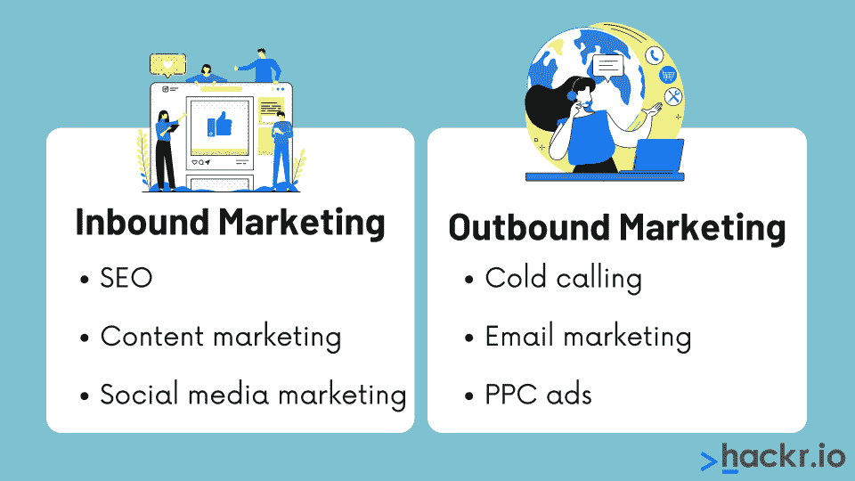
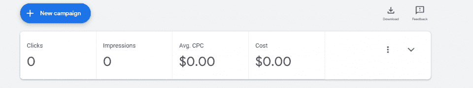
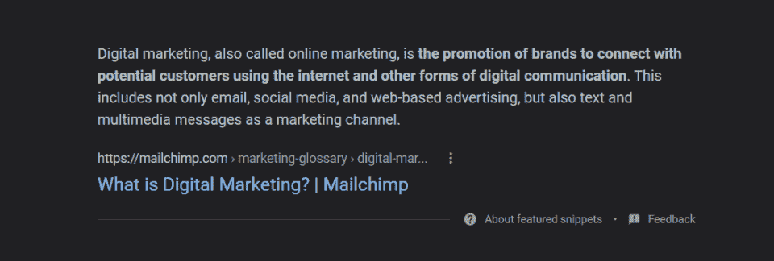
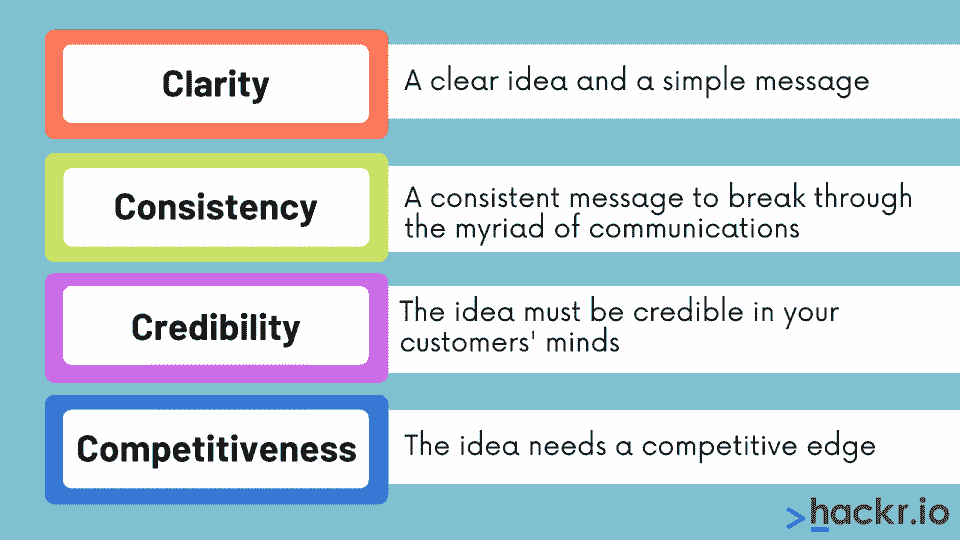

# 23 大数字营销面试问答[更新]

> 原文：<https://hackr.io/blog/top-digital-marketing-interview-questions-and-answers>

用这份全面的基本、中级和高级数字营销面试问题清单开始为你的下一次面试做准备。排练答案，找出知识差距，建立你的信心——无论你是进入这个行业还是一个经验丰富的专业人士。

## **数字营销面试问答**

为了确定你在数字营销方面的技能，面试官会问你一些关于营销过程的问题。有时，他们也是数字营销的专家。但其他时候，他们可能不太了解数字营销——他们可能对你如何思考更感兴趣。

无论哪种方式，你都需要有能力和自信地回答这些问题。因为数字营销确实在变化，这些数字营销面试问题可能并不总是有一个*客观*的答案。你可能会发现你必须说“我相信这种情况最近已经改变了”，或者“关于这一点有很多哲学观点。”

提前温习有助于你形成自己的观点，更新你对当前行业标准的认识。

### **基础数字营销面试问题**

这些入门级数字营销面试问题是刚进入数字营销的个人经常被问到的。对于一个入门级的职位，你需要有一个数字营销的基本知识，它是做什么的，以及它是如何工作的。

#### **1。什么是数字营销？**

数字营销是任何形式的在线营销，旨在提高品牌知名度，与客户建立联系，或推动客户做出承诺。数字营销具有显著的广度；它可以从搜索引擎优化到社交媒体营销。随着数字世界的不断扩大，数字营销也变得越来越重要。

#### **2。集客营销和外呼营销有什么区别？**



集客营销是指个人“进入”系统；他们已经有问题了，他们找到了你。“外向”营销是指直接联系潜在客户。

集客营销的例子包括搜索引擎优化、内容营销和社交媒体营销。

外向营销的例子包括电话营销、电子邮件营销和 PPC 广告。

集客营销更容易“赢”；向内销售线索更有可能提交。但出站营销更容易“实现”；更容易获得对外销售线索，即使他们不太可能做出承诺。

#### **3。数字营销有哪些不同的类型？定义它们。**

*   **搜索引擎优化(SEO):** 搜索引擎优化是改进和优化网站及其内容的行为，以便它在搜索引擎(如 Google 和 Bing)上尽可能高的相关搜索查询中显示出来。
*   **搜索引擎营销(SEM):** 搜索引擎营销是一种付费广告的形式，在某个搜索引擎的相关页面投放广告，比如 Google。
*   **内容营销:**内容营销(Content Marketing)指的是一种数字营销策略，公司生产有价值的内容，希望以此建立权威，打造自己的品牌。
*   **电子邮件营销:**电子邮件营销是任何类型的电子邮件，无论是时事通讯、电子邮件群发，还是告诉你购物车已满的触发式电子邮件。
*   **社交媒体营销:**社交媒体营销是指通过社交媒体账户进行的付费或免费营销。Twitter、Instagram 和脸书都可以包含社交媒体营销。
*   **电商营销:**电商营销是针对电商店面的，比如展示客户可能感兴趣的产品(“相关商品”)的插件。

#### **4。SEO 中的关键词是什么，为什么重要？**

关键词告诉搜索引擎网站是关于什么的。你可以写一整页关于管道的文章，但是如果你从来没有提到*这个词*“管道”，谷歌就不会知道你的行业是什么。

在互联网的早期，只要尽可能频繁地输入关键词，网站就能排名靠前。今天关键词需要穿插优质内容。

[完整的数字营销课程- 12 门课程合二为一](https://click.linksynergy.com/deeplink?id=jU79Zysihs4&mid=39197&murl=https%3A%2F%2Fwww.udemy.com%2Fcourse%2Flearn-digital-marketing-course%2F)

#### **5。什么是长尾关键词？**

长尾关键词是*一般*定义为长度为四个字以上的关键词。但这是有争议的。更重要的是，长尾关键词更小众，具体的关键词衍生出更宽泛的关键词。

“猫”是一个关键词。“长毛猫”甚至可能是个关键词。但是“长毛猫的品种”会被认为是一个长尾关键词。长尾关键词更容易胜出，对受众更有针对性。

与此同时，“鉴定古钱币”可能被认为是一个长尾关键词，尽管它的长度不超过四个词，因为它太具体了——这就是争论的焦点。

#### **6。黑帽和白帽 SEO 有什么区别？**

黑帽 SEO 涉及到一些通常不被认可的技术，比如建立 10 个站点并将它们相互链接。白帽 SEO 涉及谷歌自己偏爱的技术；遵循限制和模式，创建一个真正伟大的网站，提供良好的内容。

谷歌将会找出黑帽 SEO 技术并对其做出反应。但是白帽/黑帽确实处于灰色地带。那些所有网站都互相链接的媒体公司呢？通常，这很好，因为他们有重要的外部页面权限。如果他们只有链接，那就可疑了。

因为它处于灰色地带，营销人员能做的最好的事情就是遵循最佳实践——尝试制作高质量的内容，而不使用任何“棘手”的策略。总的来说，如果你试图“加速”你的数字营销，你可能正在从事一些黑帽 SEO。

#### 7 .**。什么是页面内与页面外优化？**

页面优化是发生在你自己网站上的优化，比如关键词饱和和链接建设。

离页优化是发生在你的网站之外的优化，比如来自其他流行网站的反向链接。这两者对确保你的网页排名都很重要。通常，良好的页面优化会带来页面外优化；你开始通过生产高质量的内容获得反向链接。

#### **8。什么是 Google AdWords，为什么它很重要？**

Google AdWords 是最流行的 PPC 广告方式之一。Google AdWords 网络覆盖了数百万个网站。Google Adwords 网络上的广告可以显示在这些第三方网站上，也可以显示在搜索引擎结果页面上。无论哪种方式，都会产生大量曝光率。

重要的是，Google AdWords 使广告制作过程变得简单——它有一个易于阅读的活动仪表板，显示你所有的主要统计数据。



#### **9。什么是脸书营销，为什么它很重要？**

长期以来，脸书营销一直是付费广告的重要组成部分，因为你可以根据爱好、收入甚至婚姻状况等非常有效地锁定个人。但随着选择定向广告的人越来越少，越来越多的人关注隐私，这种情况可能会消失。

如果你已经在这个行业工作了一两年，你应该知道这些问题的答案。这些问题不是基于技术和基础，而是基于数字营销的整体理念。

#### 10。你如何增加网站的流量？

这里有一个例子:从网站的技术搜索引擎优化和当前排名的关键字的审计报告开始。做一个竞争对手分析，看看竞争对手是怎么做的，竞争对手在做什么，以及你如何改进他们的战术。看看你想要排名的关键词，探索长尾关键词，根据你目前掌握的信息制定新的策略。

*   Moz: Moz 网站评分是一种简单的方法，可以确定你的域名目前的可信度。你的域名越可信，排名就越靠前。但是你不会排名很高，除非你产生好的内容。
*   Alexa 排名: Alexa 对网站进行排名，这是另一种确定你的网站是上升还是下降的好方法。在数字营销中，除了你非常直接的竞争，你通常是在和你自己之前的表现竞争。
*   **Google Analytics:**[Google Analytics](https://analytics.google.com/analytics/web/)可以插入到任何页面中，以提供关于页面浏览量和其他洞察的深层信息，例如人们在一个页面上停留的时间。
*   谷歌趋势: [谷歌趋势](https://trends.google.com/trends)可以给你人们目前正在搜索的信息。对于那些从事 SEO 工作的人来说，这是一个非常好的工具。
*   **Google Keyword Planner:** 这又是一个 SEO 工具，这次是一个可以帮你决定应该追哪些关键词的工具。
*   Kissmetrics: Kissmetrics 提供营销和分析信息，可以帮助您确定广告资金的投向以及广告活动的效果。
*   **[SEMrush](https://semrush.sjv.io/c/2890636/1008501/13053) :** 作为最受欢迎的 SEO 和 SEM 解决方案之一，SEMrush 将帮助您微调网站的 SEO 策略，同时开发可靠的 SEM 策略。
*   Ahrefs 是一个优秀的关键词研究工具，它可以给你更多关于你应该竞争的关键词的信息。
*   Buffer 应用程序: Buffer 是众多社交媒体管理工具中的一个，旨在使创建一个伟大的社交媒体活动的过程变得更加容易。Buffer 应用程序可以让你安排你的社交媒体帖子，这样你就可以一次完成所有的管理工作。
*   对于电子邮件营销来说，MailChimp 是目前最受欢迎的工具。MailChimp 将使您能够创建时事通讯、大规模电子邮件群发等。

这些只是一些流行的数字营销工具，但它们是你会遇到的最常见的工具。任何时候你在工作列表中看到一个数字营销工具，考虑在面试前看一看。许多网站都有免费试用版，让你至少体验一下它们的一些功能。

[了解更多关于 SEMrush 的信息](https://semrush.sjv.io/c/2890636/1008501/13053)


#### **12。你会如何提高转化率？**

客户仍然关注转化率，但通常是作为更广泛的宣传活动的一部分。

为了提高转换率，考虑在顶部、中间和终端漏斗位置制作更多内容，以吸引购买者旅程中每个部分的客户。

使用 A/B 测试来测试不同的登录页面和广告，查看转化率最高的页面，并根据买家的意图调整您的页面。

看看性能较低的页面，找出一些立竿见影的方法:为什么人们会弹跳？网站没有给他们需要的信息吗？

#### 13。直销和品牌有什么区别？

直接营销的目的是让顾客采取行动。它并不总是承诺购买；这可能是早在注册一份时事通讯。

同时，品牌设计是为了让顾客知道你的品牌，并帮助顾客理解你的使命、目标和价值观的复杂性。人们可能会购买一种产品，但他们会追随一个品牌。

#### **14。网络营销的局限性是什么？**

在线营销竞争非常激烈，而且竞争越来越激烈。此外，在线营销通常被视为具有内在的侵入性，越来越多的人开始忽视在线营销；安装广告拦截器、垃圾邮件过滤器等。这种对立的关系很难建立信任。

在线营销有一些非常现实的局限性，但这是推动营销人员走向更有机的方法来获得流量。社交媒体账户和搜索引擎优化都是营销的方式，可以用来为人们的问题提供答案，而不是先发制人地试图解决一个可能不存在的问题。

如果可能的话，今天的营销人员希望获得潜在客户；他们希望人们来找他们解决他们的问题。

这个问题有很多答案，但最重要的两个是:一致性和真实性。在社交媒体中，你必须始终如一才能获得追随者。你也必须是真实的；人们不想在社交媒体场所被“推销”。他们想谈谈。

#### 16。什么是内容营销，为什么它很重要？

内容营销是一种专注于构建有趣或独特内容的营销类型。这些内容吸引了那些致力于某种产品的观众，这种产品可以是实物产品、数字产品或服务。

内容营销是集客营销和 SEO 的重要组成部分——通过构建内容营销，公司可以不断地创造商机。

#### **17。什么是谷歌片段？什么是 Google schema？**

谷歌丰富的搜索结果提供了被称为 [Google Snippets](https://support.google.com/websearch/answer/9351707?hl=en) 的东西，它可以显示为常规搜索结果之外的小片段，位于页面的顶部。以下是你在查找“数字营销”时看到的内容:



赢得一个谷歌片段对于 SEO 营销来说非常有效。为了增加机会，您可以在页面中插入一个 Google 模式，比如 FAQ 模式。

**常见问题模式如下:**

```
<script type="application/ld+json">
{
"@context": "https://schema.org",
"@type": "FAQPage",
"mainEntity": [{
"@type": "Question",
"name": "Where are you located?",
"acceptedAnswer": {
"@type": "Answer",
"text": "<p>We're located in the historical district of Paseo, at the intersection of Broadway and Smith. Our hours are from 9:00 AM to 5:00 PM from Monday through Friday. Please call ahead for an appointment!</p>"
}]
}

</script>
```

如果有人搜索“[您的企业] +位置”，这个 FAQ 模式可能会弹出。

#### 18。数字营销的四个 C 是什么？

数字营销的四个 C 指的是清晰、可信、一致和竞争力。



说到数字营销，市场已经非常饱和了。人们不断地看到广告。他们真的想要一个他们可以信任的个人或公司。

数字营销的四个 C 提供了指导方针，广告商可以在每次创建新活动时询问自己。

是否清晰易懂？即使他们知道这是广告，这可信吗？与我们的品牌一致吗？它和我们的竞争对手一样好或者更好吗？

#### **19。分析来自多个渠道的数据时会出现什么问题？**

这是最重要的数字营销分析师面试问题之一；以至于如果没有人问你这个问题，你可能会想用另一种方式给出答案。

一般来说，在没有干预的情况下，分析来自多个渠道的数据很少有效，因为不同的渠道会以不同的方式记录数据。一个频道可以将每一次点击记录为一次“访问”，而另一个频道只能将每一次唯一的点击记录为一次“访问”试图对这类数据进行比较只会误导你。

为此，现在有了[分析工具](https://hackr.io/blog/top-data-analytics-tools)，可以从多个渠道获取信息，并对数据进行标准化。但是如果没有这些工具，你不太可能收集到重要的或可行的见解。

## **高级数字营销专员面试问题**

高级数字营销分析师面试问题往往更多的是关于你的思维方式。在你职业生涯的这个阶段，你已经证明了你对数字营销的基本原理和技术非常了解。但是面试官想听的是你的哲学，以及它是否和他们的相吻合。

#### 20。你认为数字营销的未来是什么？

这个问题旨在测试你对数字营销领域的洞察力。当然，实际上没有人知道数字营销在未来会如何发展，或者谷歌会做出什么样的改变。但是他们可以看到更大的趋势。

互联网的很大一部分正在走向移动化；移动营销变得越来越重要。与此同时，跟踪用户变得越来越难，因为用户被允许选择退出。元宇宙很可能为数字营销提供令人兴奋的新机会。与此同时，个人对整个营销过程越来越厌倦，不太可能买进。

因此，数字营销必须继续变得更加诚实、更加认真、更加个性化。

#### **21。PPC 和 SEM 应该投入多少？**

当被问及这个问题时，面试官通常想知道你是如何确定你已经“足够”投入的。通常，这需要计算一个拐点，确定你何时收到收益递减，并计算你的 roa(广告支出回报)和 ROI(投资回报)。

换句话说，你投资，直到你看到你每次都得到减少的结果；你已经达到饱和点了。

#### **22。你认为数字营销会取代面对面营销吗？**

至少可以说，这是乐观的。数字营销不会取代面对面营销，但它将变得与每个人的日常生活更加紧密地联系在一起，也许在某种程度上，这两者之间可能有一条非常灰色的线。许多传单和广告已经直接指向一个网站的网址。数字营销和现实营销正变得密不可分，但两者都不可能取代对方。

社交媒体是一个难以置信的难题，承认这一点并不是一件坏事。那些有几十年营销和网络营销经验的人已经做不到了。

谈到社交媒体，有几个因素往往很重要。一致性是关键，诚信也是关键。如果一个品牌出现在那里只是为了推广他们自己的产品，那么社区会很快转向他们。一致的发帖，一致的内容，才是游戏的制胜之道。

除此之外，你可能想要讨论创造性的策略(例如温迪的 Twitter 账户的讽刺回复)，或者任何你碰巧喜欢的社交媒体账户。

## 当你不知道答案时会发生什么？

除非你面试的是一个高级管理职位，否则这是会发生的。没有人指望每个人都知道所有数字营销面试问题和答案的每一个答案。

初学者认为自己一无所知。有经验的专业人士认为他们什么都知道。专家确切知道他们不知道多少。谈到在线营销面试问题，并不总是有一个正确的答案。

所以，如果你不知道一个问题的答案，就不要作假；告诉他们你将如何找到答案。说，“实际上我对[x]了解不多，但我会在[最喜欢的在线营销博客]中查找。”如果你发现自己在面试中磕磕绊绊，回家后发一封跟进邮件:“我考虑了[话题]，做了一点研究，现在我想了[结论]。”

尤其是涉及到入门级数字营销面试问题的时候，面试官知道你不是什么都知道。他们试图确定你有多少知识，你有多大的意愿去探索它。

### **如何赢得数字营销面试**

如果你要开始面试数字营销职位，你可以做一些事情来增加你的机会:

*   今天就开始阅读数字营销博客，比如尼尔·帕特尔。
*   熟悉数字营销技术，比如 SEMrush。
*   数字营销经理职位面试问题练习。
*   熟悉数字营销中的不同职位。
*   练习采访朋友和家人。

这些都会为你做好数字营销面试的准备。但是请记住，每次面试(和每个职位)都是不同的。因为数字营销发展如此之快，你甚至会发现来自*面试官*的一些信息已经过时了。

## **结论**

是时候学习更多关于数字营销的知识了。数字营销工具、认证和练习题都可以帮助你在下一次面试中胜出。考虑[参加数字营销课程](https://hackr.io/tutorials/learn-digital-marketing)或从 HubSpot 或谷歌等网站获得数字营销认证；他们是数字营销行业公认的品牌。

数字营销面试是你迈向令人兴奋和有回报的数字营销职业生涯的第一步。你事先学得越多越好。由于数字营销在不断发展，你需要始终跟上最新的策略。数字营销的职业生涯令人兴奋，而且总是在变化。祝你面试好运！

**人也在读:**