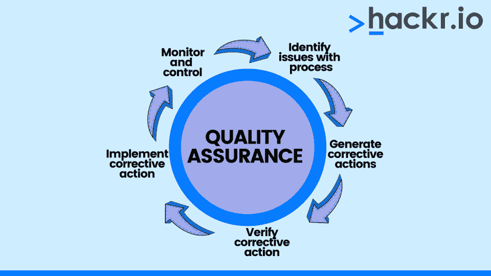
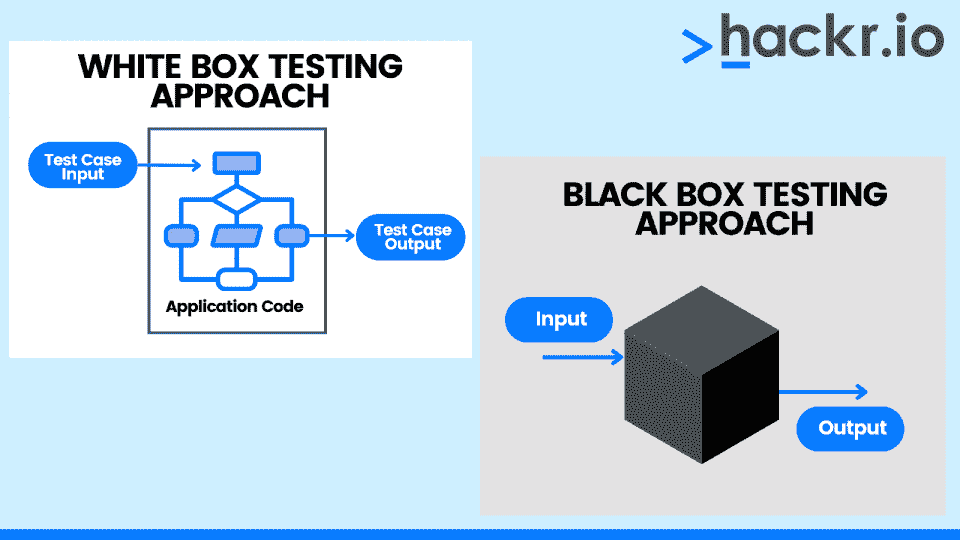

# 2023 年前 45 名 QA 面试问答

> 原文：<https://hackr.io/blog/top-qa-interview-questions-and-answers>

质量保证(QA)是确定软件产品或服务是否满足特定需求的系统化程序。这是确保软件产品正常运行和可伸缩性的关键步骤，有时通过[软件测试。](https://hackr.io/blog/software-testing-course)简而言之，质量保证是一个防止软件产品质量故障的综合过程。

对 QA 职业感兴趣？你需要用一份完美的简历和求职信给人留下最好的印象。然后，就是面试了。如果能事先复习一套面试问题来保证质量岂不是很棒？

我们为你准备了这套全面的问答面试问题，帮助你减少面试焦虑。

下一个是什么？入门级和助理职位面试的问答面试问题和答案。我们开始吧！

[点击这里](https://drive.google.com/file/d/1STWRjVcf-F9qiajp3GaOoth2Kk9jc4l3/view?usp=sharing)下载 Hackr.io 的 QA 测试面试问答 PDF。

## **QA 面试问答**

我们将质量保证面试问题分为三个级别:初级、中级和高级。

### **基础 QA 面试问题**

这里有一个入门级 QA 工程师面试问题和答案的列表，可以帮助你在即将到来的面试中胜出。专业提示？记录你在质量保证面试中遇到的任何问题。这样，你就知道以后再来找他们了！

#### **1。定义质量保证。**

****

质量保证(QA)确保软件符合关于维护、可靠性和性能的所有要求和规范。

#### **2。软件测试和质量保证的区别是什么？**

QA(质量保证)是一种验证正在开发的软件产品是否符合组织的质量标准的结构化方法。您可以使用软件测试来确认最终产品满足用户需求并按预期运行。

#### **3。描述测试软件。**

测试件是准备和执行测试所需的任何测试相关的工件，例如测试用例、测试数据和测试计划。

#### **4。构建和发布的区别是什么？**

**建造**

构建是开发团队交给测试团队的程序或应用程序的副本。测试需要在软件的构建版本上进行。通常，构建版本用于完整性测试。软件的构建版本比发布版本创建得更频繁。测试团队从开发团队收到一个可安装的软件构建，并分配了一个编号。

**发布**

发布是用来描述测试团队分发给最终用户的程序的术语。软件发布后不再需要测试。软件发布版本的创建频率低于构建版本。测试人员或开发人员在可安装软件对客户开放之前，将编号分配给可安装软件。

#### **5。“bug 发布”和“bug 泄露”是什么意思？**

当开发团队将软件产品转移到测试团队来解决缺陷时，就发生了“缺陷发布”。此时，在程序上线之前，有很多时间来修复错误，所以这是一个低严重性的问题。

当软件产品的最终用户或真实用户在测试团队发现缺陷后发现缺陷时，缺陷泄漏就发生了。

#### **6。你能解释一下数据驱动测试吗？**

数据驱动测试检查被测应用程序的各种输入值。这些数字直接从数据文件中读取，如工作表、csv 文件、数据池或各种其他格式。

#### 7 .**。描述 bug 周期中的步骤。**

1.  测试人员报告 bug，然后以开放状态与开发经理共享。
2.  开发团队确定这个 bug 是真正的 bug 还是其他不一致的地方。
3.  如果 bug 是合法的，团队将确定它是否在范围之内。如果 bug 在当前版本中不存在，那么缺陷就会被延迟。
4.  如果测试人员很早就注意到这个缺陷或问题，那么就会给出一个重复的状态。
5.  当一个 bug 被交付给开发人员解决时，它将获得“进行中”的状态

#### **8。测试策略包含了什么？**

测试策略包含测试活动的介绍、资源、范围和时间表，以及要进行的不同测试的信息。

#### **9。什么是边界测试和分支测试？**

分支测试一次测试代码的所有分支。边界测试集中于软件的有限环境。

[完整的质量保证课程-从零开始学习质量保证](https://click.linksynergy.com/deeplink?id=jU79Zysihs4&mid=39197&murl=https%3A%2F%2Fwww.udemy.com%2Fcourse%2Fthe-complete-quality-assurance%2F)

#### 10。什么是敏捷测试，为什么它很重要？

****

敏捷测试是在敏捷原则指导下进行的软件测试。与标准测试过程不同，敏捷测试要求测试团队在开发团队完成编码后立即进行测试。

#### **11。什么是测试用例？**

测试用例是被测软件产品应该满足的条件。它包含了关于测试过程、要求、测试环境和结果的细节。

#### **12。压力、负载和容量测试需要什么？**

**负载测试**

负载测试是在重大但预期的负载下测试应用程序的过程。在这里，负载基本上是用户、消息、请求、数据等的量。

**压力测试**

压力测试是将系统负载提高或加速到超过其典型范围的过程。

**音量测试**

容量测试是确定系统是否能够处理必要的数据量、用户请求等的过程。

#### 13。用例到底是什么，它包含了什么？

术语用例指的是详细描述用户活动和系统对特定功能的响应的文档。它包括封面、具体要求、前置条件和后置条件，以及目录、事件流程和修订历史。

#### **14。什么是 CRUD 测试，它们是如何进行的？**

CRUD 代表创建、读取、更新和删除。CRUD 测试是一种评估数据库功能的黑盒测试技术。

#### 15。什么是线程测试？

线程测试验证特定任务(称为线程)的关键功能。测试团队在集成测试开始时执行线程测试。

#### 16。什么是配置管理？

配置管理描述了对项目所做的任何修改的文档。发布控制、变更控制和修订控制是最重要的配置管理组件。

#### **17。什么是临时测试？**

在特别测试中，测试人员随机测试系统的功能，试图破坏它。这是非结构化的测试，没有任何计划和文档。因此，它不涉及任何测试用例准备、测试执行策略和需求规格。

临时测试具有以下特征:

*   它发生在正式测试结束之后。
*   它的主要目标是在不使用预定程序的情况下使程序发生故障。
*   临时测试人员应该了解他们正在测试的产品。

#### 18。什么是测试驱动和测试存根，为什么它们是必要的？

存根是需要测试的软件组件。它是以自上而下的方式使用的。

被测试的组件由驱动程序调用。它在自下而上的策略中使用。

当只开发了模块 X，而我们需要测试模块 X 和 Y 之间的接口时，就有必要了。因此，我们不能只测试模块 X；但是，如果有一个虚拟模块，我们可以用它来测试模块 x。

#### **19。列出软件质量保证工程师的角色。**

软件质量保证工程师有以下职责:

*   编写源代码
*   软件设计
*   源代码控制
*   审查代码
*   变更管理
*   结构管理
*   软件集成
*   程序测试
*   发布管理流程

#### 20。解释什么是 bug 分类。

Bug triage 审查 Bug，以确保它们是有效的、可重复的，并且包含解决这些 bug 所需的准确信息。一旦你对 bug 进行了分类，就会根据优先级对它们进行测试。

#### **21。什么是因果图？**

因果图是对输入及其对相应输出的影响的可视化描述，它可以用来创建测试用例。

现在，让我们来回答你可能在有经验的专业人士的质量保证面试中听到的问题。

#### **22。什么是软件测试度量，它包含什么数据？**

术语“测试度量”指的是测试软件的可接受的实践。这些数据描述了考试的形式或内容。它包括测试运行总数、通过的测试、失败的测试、延迟的测试以及首次成功完成的测试等详细信息。

#### **23。描述重测和回归测试的区别。**

**回归**

*   回归测试是一种分析类型，用于确定最近的代码更改是否对以前未受影响的特性产生了影响。
*   回归测试的主要目标是确保任何代码修改都不会对现有的功能产生负面影响。
*   一般测试；每当代码发生变化时，都可以执行该操作。
*   在通过的测试案例中，它被执行。
*   回归测试可以自动化，尽管手工测试更加昂贵和耗时。
*   回归测试不包括缺陷验证。
*   回归测试与重新测试同时进行，这取决于可用的资源。

**重新测试**

*   重新测试需要测试在前一次运行中不成功的模块。
*   重新测试是对已经纠正的缺陷进行测试。
*   计划好的；不是自发的。
*   无法自动化
*   包括缺陷验证。
*   总是在重新测试后执行，因为重新测试具有更高的优先级。

#### **24。列出软件开发周期中的软件质量步骤。**

*   在开始开发阶段之前审查需求。
*   查看代码。
*   编写全面的测试用例。
*   基于会话的测试。
*   基于风险的测试。
*   根据使用情况确定 bug 的优先级。
*   组建专门的安全和性能测试团队。
*   运行回归循环。
*   对生产执行健全性测试。
*   在生产中模拟客户账户。
*   包括软件质量保证测试报告。

#### **25。描述“测试驱动开发”的原则**

测试驱动开发要求您在编写实际代码之前制作测试用例。

#### **26。在 SQA 有哪些类型的文件？**

以下是 SQA 各种类型的文件:

*   需求文件
*   测试指标
*   交易组合
*   测试日志
*   测试事件报告
*   测试总结报告
*   用户配置文件
*   测试案例和测试计划
*   任务分配流程图

#### **27。你的质量保证文档应该包含什么信息？**

质量保证测试文件必须包括:

*   根据严重性列出发现的缺陷的优先级。
*   每个需求或业务功能的描述。
*   检查报告
*   配置
*   测试策略和测试用例
*   错误报告
*   用户指南
*   为管理层和用户提供不同的报告

#### **28。描述 MR 及其包含的信息。**

修改请求，通常被称为缺陷报告，被称为 MR。它的意思是报告软件缺陷、问题和想法。

#### **29。什么是可追溯性矩阵？**

追溯矩阵是一个将测试用例与用户需求联系起来的文档。它的主要目标是确保所有的测试用例都包含在内，并且在进行软件测试时不会忽略任何功能。

#### 三十岁。区分验证和确认。

**验证**

验证评估开发阶段的过程，看它们是否符合用户需求。比如静态测试就是验证。在确认之前，进行验证测试。它与运行代码无关。它需要的任务包括案头检查、走查、检查和审查。在开发周期之前，缺陷就被发现了。它符合 SRS 文件中概述的标准。

QA 团队提供验证，确保程序符合 SRS 文档中的规范。

**验证**

验证评估产品，以确保它在开发阶段和验证之后满足要求。

它使用像非功能测试、白盒测试和黑盒测试这样的技术。这些缺陷是在开发周期之后发现的。它决定了它是否满足需求。

#### 31。QA 团队在软件开发中的角色是什么？

通过关注整个开发过程，QA 团队保证了质量。QA 监控结果并根据需要修改程序以满足期望。

**质量控制的作用包括:**

*   关注正在进行的开发过程。
*   规划、测试和流程执行。
*   保证测试用例可以追溯到需求

#### 32。QA 中的风险维度有哪些？

质量保证中的风险维度如下:

*   **时间表:**在一天内开发一个大型软件的不切实际的时间表。
*   **客户:**不确定的需求，不明确的需求，变化的需求。
*   **人力资源:**缺乏足够的具备项目所需专业水平的人力资源。
*   **系统资源:**未能获得所有必要的资源，包括硬件和软件工具或软件许可，将产生负面影响。
*   **质量:**各种各样的环境，比如资源短缺、严格的交付时间表，以及对需求的频繁修改，都会显著地影响被测应用程序的质量。

#### 33。什么是猴子测试？

猴子测试是一种黑盒测试，它通过提供随机输入来检查系统的行为(例如，它是否崩溃)来评估应用程序。当用户给出随机输入来测试系统的行为时，这种类型的测试会自动进行。

猴子测试不需要测试用例。它也可以是自动化的，这意味着我们可以创建脚本或程序来生成随机输入，以监控系统的行为。在进行压力或负载测试时，这种方法很有帮助。

存在两种猴子:聪明的猴子和笨猴子。

**聪明的猴子**

*   聪明的猴子对应用有基本的了解。
*   他们知道哪个页面将从哪个应用程序页面被重定向。
*   此外，他们知道他们提供的投入是否有效。
*   他们很聪明，如果发现任何错误，就会报告错误。
*   此外，他们知道按钮和选项。

**哑巴猴子**

*   哑猴对应用一无所知。
*   他们不知道应用程序将重定向到的页面。
*   它们提供任意的输入，并且不知道应用程序的开始和结束。
*   尽管缺乏应用程序知识，他们仍然会发现硬件或环境故障等问题。
*   他们对应用程序的 UI 和功能的了解也很有限。

#### 34。预防性方法和反应性方法的区别是什么？

**预防方法**:这是一种用于避免问题的策略，也称为验证过程。测试是在软件开发生命周期的早期创建的，甚至在软件被创建之前。这种策略属于质量分析的范畴，测试人员试图在他们的轨道上阻止错误。

**反应策略**:也称为验证过程，反应策略是为了发现(或应对)缺陷。这种方法中的测试被创建为在软件开发之后运行，并且由质量控制来管理。

#### 35。质量审核是什么意思？

处理器质量系统的现场验证过程，如检验或检查，被称为审计。质量审核是由一组内部或外部的审核员对质量体系进行的系统检查。

为了确保组织有明确定义的与有效行动相联系的内部系统监控程序，质量审核按预定的时间间隔进行。确认程序的客观证据的一个关键管理技术是审计。

### **高级 QA 测试员面试问题**

在这一部分，让我们来探讨一下为专家设计的更棘手的问答面试问题。

#### 36。什么是测试计划？

测试计划文件是一份详细说明如何执行所有测试程序以交付高质量产品的文件。它是许多过程的结果，包括为所有即将到来的项目任务创建产品描述、SRS 或用例文档。测试经理或者测试领导通常负责创建一个测试计划，它的主要目的是概述谁将在何时进行哪些测试，以及需要测试什么。

#### 37。测试用例是如何创建的？

创建测试用例有两种方法:

**黑盒测试**

在这种基于规范的测试方法中，测试人员将软件视为一个具有输入和输出的黑盒。在“黑盒”测试中，测试人员不知道软件的内部工作原理；相反，他们只知道它执行的功能。当规范存在时，这种测试方法对于所有测试级别都是可接受的。

**白盒测试**

白盒测试评估代码的逻辑和内部组织。为了实现白盒测试，测试人员必须拥有编码技能，这样他们才能处理内部代码。他们调查代码并识别有问题的单元。

#### 38。你怎么知道什么时候已经进行了足够的测试？

这是最重要的 QA 测试面试问题之一。有时，作为项目经理或项目领导，我们可能不得不取消测试以更快地推出产品。在这种情况下，我们必须确定产品是否接受了测试人员的充分测试。

我们会考虑:

*   如果满足测试或发布的最后期限。
*   如果实时项目中的风险低于允许的水平。
*   如果所有的关键错误和障碍都被解决了。
*   如果我们的提交符合要求。

#### 39。探索性测试和临时测试的区别是什么？

**临时测试**

临时测试是一个没有任何计划、要求、规范或文档的测试软件的非正式过程。它的根本目的是在测试中达到完美。大多数入门级的专业人员可以进行特别测试——你不需要一个有经验的测试工程师。

**探索性测试**

探索性测试需要文档和适当的计划。它需要同时学习、测试设计和测试执行。探索性测试是一种系统化的策略，它的主要目标是熟悉应用程序。类似于临时测试，探索性测试不需要有经验的测试工程师。

#### 40。各种软件测试级别是什么？

**单元测试**

在软件测试级别中，单元测试是最低级别。软件的模块或应用程序被称为单元。测试模块的程序员也执行单元测试，并立即修复任何发现的错误。

**集成测试**

所有被测试的组件被组合起来形成集成，并且它们都被集体测试。从一个模块移动到另一个模块的数据作为集成测试的一部分进行测试。本质上，它考察了两个或更多模块之间的交互，而不仅仅是它们的功能。

**系统测试**

系统测试测试完整的或集成的系统。它评估软件以确保它符合 SRS 指南中概述的标准。它进行功能性和非功能性测试，并且是最后一个测试。

**验收测试**

客户或用户进行验收测试，以确定产品是否满足他们的需求。

#### 41。区分测试策略和测试计划。

**测试计划**

测试计划是对测试目标、位置、时间表、估计和期望以及测试所需资源的书面描述。它鼓励我们计算批准测试中的应用程序类型所需的工作量。

**测试策略**

测试策略是在软件测试中使用的一组指导概念，它定义了测试设计并规定了如何执行过程。它旨在为软件测试提供一个系统的方法来保证质量、可追溯性、可靠性和改进的计划。

#### **42。你对与质量控制相关的可追溯性矩阵(TM)了解多少？**

可追溯性矩阵连接任何两个需要多对多链接的基线文档，以确保完整的关系。它被用来监控需求，并确认它们在当前项目中得到满足。

#### **43。在质量控制的上下文中，缺陷泄漏率意味着什么？**

缺陷泄漏是软件测试人员用来评估质量保证(QA)测试效率的一种统计数据。它代表分配给一个阶段的缺陷总数(在后面的阶段中记录)与分配给一个阶段的缺陷总数(在后续阶段中捕获)之间的比例。

一种被称为缺陷泄漏的测量方法通过跟踪从一个测试步骤传递到下一个测试步骤的缺陷的百分比来显示软件测试人员测试的效率。另一方面，很少的缺陷泄漏只是用来确认测试团队的价值。

#### **44。你对数据驱动测试的理解有多深？**

使用表格或电子表格保存测试数据，数据驱动测试是一种软件测试方法。通过数据驱动测试，测试人员可以创建一个单一的测试脚本，该脚本可以对一个表中的所有测试数据执行测试，并预期测试结果将在同一个表中交付。您可能还会听到数据驱动测试，称为表驱动测试或参数化测试。

#### **45。你如何确保你的测试是详尽和彻底的？**

您可以使用需求跟踪矩阵和测试覆盖矩阵来确保彻底的测试。

## **奖励提示**

这些技术问答面试问题将帮助你获得质量保证概念的全面知识。您可以从这里挑选概念，并通过在线资源深入学习它们。

一旦你复习了这些问题，在你面试之前，记住这些额外的提示。

*   根据职位要求准备一份最新的简历。
*   在你的简历、求职信和面试中提到你参加过的任何软件测试认证或课程。
*   用最前沿的软件测试趋势来更新自己。
*   咨询你认识的任何质量保证工程师，以获得对当前工作前景的更多见解。
*   说说你的[手动测试](https://hackr.io/blog/manual-testing-interview-questions)和开源经历。

## **如何写好一份 QA 工作简历**

我们已经快进到面试了——但是如果你还在申请阶段呢？你需要精心制作一份诱人的专业简历。这里有一些这样做的提示:

*   包括你最新的工作经验。
*   添加你的实力和解决问题的能力的例子。
*   让过去的经理或同事审阅你的简历。
*   尽量不要超过两页。
*   注重结果胜于任期。

## **结论**

前面提到的质量保证面试问题是你的质量保证工程师面试的良好开端。我们希望它能帮助你在成为 QA 专家的道路上更加自信。

对其他扩展你 QA 知识的方法很好奇？

[探索顶级软件测试认证](https://hackr.io/blog/best-software-testing-certifications)

## **常见问题解答**

#### **1。如何准备 QA 面试？**

在 QA 面试之前，你应该:

*   研究角色和公司。
*   研究公司的质量保证流程。
*   回顾你过去的问答经历，想出雄辩的方式来交流。
*   和朋友一起练习问答面试问题。

#### **2。QA 面试问什么问题？**

一些软件 qa 面试问题包括:

*   什么是 bug？
*   软件测试和 QA 有什么区别？
*   QA 应该从哪里开始？

这些问题涵盖了 QA 在项目中的实际用例。在这篇文章中，我们展示了对你下一轮面试有帮助的顶级面试问题。

#### **3。QA & QC 有什么区别？**

QA 致力于验证软件产品质量的过程和程序，而 QC 则关注开发后的产品缺陷和 bug。

#### **4。QA 工作容易吗？**

QA 工作需要大量的注意力。这些过程可能感觉重复，所以很容易忘记手头的任务。QA 专业人员应该有很强的纪律性，以在他们详细、乏味的任务中保持专注。

#### **5。面试需要多长时间？**

四十五分钟到一小时之间。当然，更高级的 QA 职位面试可能需要更长时间，甚至多次面试。