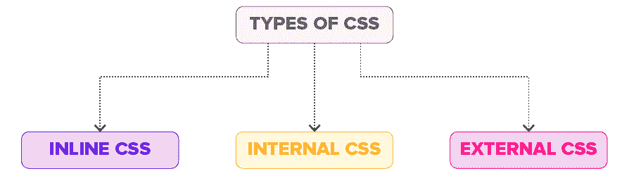

# CSS 的类型[内联、内部和外部 CSS]

> 原文：<https://hackr.io/blog/types-of-css>

级联样式表或 CSS 是一种标记语言，它决定网页或网站向访问者显示的方式。它有助于操纵各种网站元素的颜色、字体和布局。

CSS 还允许在网站上添加动画或效果，如动画背景和点击按钮效果。如果没有 CSS，网站将呈现为普通的 HTML 网页，这显然没有吸引力。

## **3 种 CSS 样式**

有一些不同的方法来实现 CSS 代码。这些被称为 CSS 样式。有三种类型的 CSS 样式可用；内联 CSS、外部 CSS 和内部 CSS。



虽然每种 CSS 样式都服务于相同的目标，即样式化 HTML 代码，但是它们是如何完成的却各不相同。我们将在下一节探讨每种 CSS 样式:

### **1。内部 CSS**

也称为嵌入式 CSS，内部 CSS 是指将 CSS 代码添加到与我们希望添加 CSS 样式的网页相关的 HTML 文档中的做法。

要添加内部 CSS，需要在 HTML 文件的部分添加

#### **如何使用内部 CSS**

*   步骤#01 -打开 HTML 文件并转到标签。
*   步骤#02 -在此添加
*   步骤#03 -现在，从下面一行开始添加 CSS 代码。
*   步骤#04 -使用关闭
*   步骤#05 -保存 HTML 文件以使更改生效。

#### 赞成的意见

*   不需要上传多个文件，因为 CSS 代码被添加到对应于网页的同一个 HTML 文件中。
*   可以使用类和 ID 选择器。

#### 骗局

*   向 HTML 文件添加 CSS 代码会导致页面大小增加，从而降低加载速度。
*   将它用于多个网页是无效的，因为需要为每个网页添加相同的 CSS 规则。

看看这个全面的 [CSS 备忘单](https://hackr.io/blog/css-cheat-sheet)！

### **2。外部 CSS**

为了符合外部 CSS 样式，网页需要链接到包含 CSS 代码的外部文件。外部 CSS 是开发大型网站时超级有效的 CSS 样式化方法。

一个人可以创造外在的。css 文件使用一些文本编辑器，如记事本和快速 CSS 编辑器。这里，CSS 代码驻留在一个文档中，而不是包含相关网页的 HTML 代码的文档中，因此得名。

一个利用外部 CSS 的网站的所有小的和大的改变都可以仅仅通过编辑单个外部 CSS 来完成。css 文件。

#### **如何使用外部 CSS**

*   步骤#01 -打开一个文本编辑器，创建一个新文件。在此添加您希望应用于 HTML 网页的 CSS 代码。
*   步骤#02 -将文件另存为。css 文件并退出。
*   步骤#03 -打开你想要应用 CSS 代码的 HTML 文档。
*   步骤#04 -导航到 HTML 文件中的部分，并在<title>标签后插入一个对外部 CSS 文件的引用。</title>
*   步骤#05 -保存 HTML 文件。

#### 赞成的意见

*   一个外部 CSS 文件可以用来设计几个网页的样式。
*   利用外部 CSS 的 HTML 文件具有更清晰的结构和更小的尺寸。

#### 骗局

*   链接或上传多个外部 CSS 文件可能会降低网站的下载速度并影响其性能。
*   在完全加载之前，需要外部 CSS 文件的网页可能无法准确呈现。

[CSS-2023 年完整指南(包括 Flexbox，Grid & Sass)](https://click.linksynergy.com/deeplink?id=jU79Zysihs4&mid=39197&murl=https%3A%2F%2Fwww.udemy.com%2Fcourse%2Fcss-the-complete-guide-incl-flexbox-grid-sass%2F)

### **3。内嵌 CSS**

与内部和外部 CSS 样式不同，内联 CSS 样式用于样式化特定的 HTML 元素，而不是整个 HTML 代码。为了实现内联 CSS，需要将 style 属性添加到每个需要样式化的 HTML 标签中。这里不用选择器。

仅仅使用内联 CSS 来维护一个网站是不切实际的。这是因为按照内联 CSS 样式，每个 HTML 标签都必须单独设计。因此，不推荐使用它。

然而，内联 CSS 在一些特定的场景中非常有用。例如，在以下情况下:

*   CSS 样式必须只应用于一个元素，或者
*   当无法访问 CSS 文件时。

这种类型的 CSS 样式主要用于预览/测试更改，以及对网页/网站应用快速修复。

#### **如何使用内联 CSS**

*   步骤#01 -打开需要添加内嵌 CSS 的 HTML 文件。
*   步骤#02 -现在，导航到你想要插入内联 CSS 的元素。
*   步骤#03 -将 style="code "添加到您希望使用内联 CSS 的标签中。在这里，code 是您需要添加的 CSS 代码。例如，如果我们希望将内联 CSS 添加到

    # 标签，它看起来会像这样:

    ```
    <h1 style="code">
    ```

#### 赞成的意见

*   允许即时插入 CSS 代码到任何 HTML 文件。
*   不需要创建和上传单独的文件来添加 CSS 代码。

#### 骗局

*   向每一个 HTML 元素添加 CSS 代码都是浪费时间。
*   几个元素的样式会影响页面大小和下载速度。
*   太多的内联 CSS 会导致混乱的 HTML 结构。

## 如果我在一个网页中使用所有 3 种 CSS 样式会怎样？

在一个网页中可以使用三种 CSS 样式中的每一种。然而，将导致的结果是内联 CSS 样式将覆盖其他两个 CSS 样式，即内联 CSS 代码将生效，而不是其他两个。三种 CSS 样式的优先级遵循以下特定顺序:

内联 CSS >内部 CSS >外部 CSS

正如您可以使用的，当内部和外部 CSS 样式用于网页时，内部 CSS 样式将覆盖外部 CSS 样式。

## **结论**

至此，你将对 3 种类型的 CSS 非常熟悉，即外部、内部和内联。每一种都有自己的优缺点。

所以，一定要做研究，选择一种 CSS 风格的方法，完全符合你的网站/网页的要求。祝你好运！

想加强你的 CSS 游戏？看看这些[最好的 CSS 教程](https://hackr.io/tutorials/learn-css)。

**人也在读:**