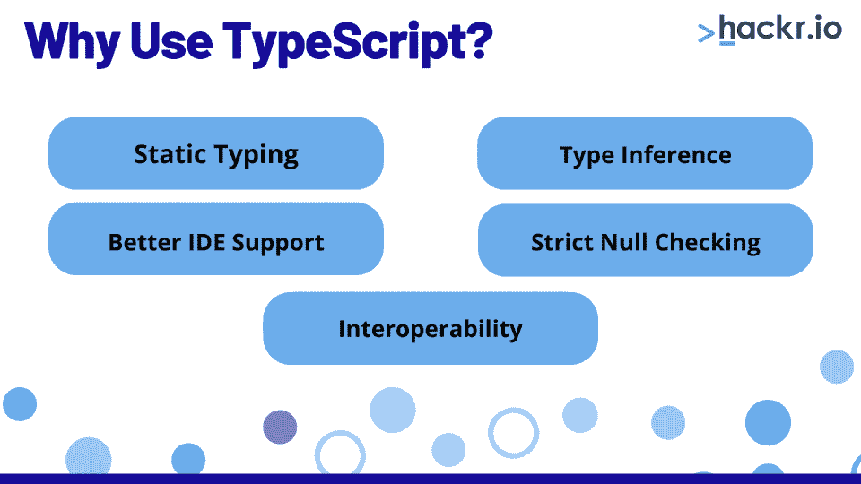
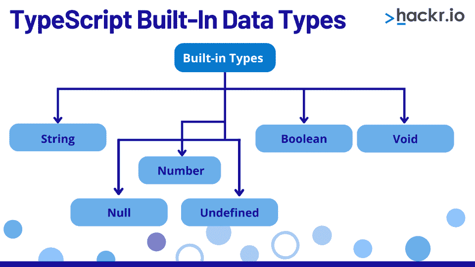
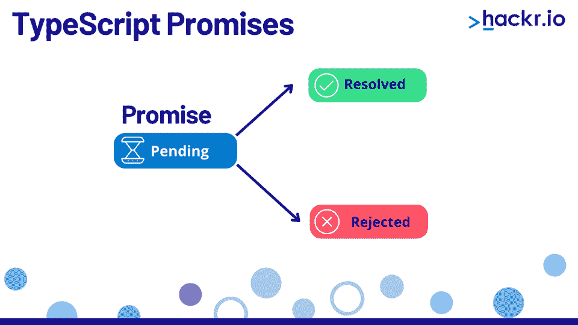

# 2023 年 50 大打字稿面试问答

> 原文：<https://hackr.io/blog/typescript-interview-questions-and-answers>

TypeScript 是一种免费的开源编程语言，您可以将其应用于任何由 [JavaScript](https://hackr.io/blog/how-to-learn-javascript) 支持的应用程序——这意味着前端和后端编程。

TypeScript 由微软设计和维护，是 JavaScript 的超集。然而，与 JavaScript 不同，TypeScript 执行类型检查，这使它成为许多大型复杂 web 应用程序的合适选择。

渴望一个 web 开发的职业生涯吗？你可能正在搜索招聘广告，寻找绝佳的机会。学习打字稿会打开很多门，但是你应该准备什么样的打字稿面试问题呢？

继续阅读我们的 50 个打字稿面试问题和答案的综述，以成功通过你的下一次面试！

## **所有经验水平的顶级打字面试问题**

你是一名打字高手，正在寻找职业发展的机会吗？或者你是编程游戏的新手，正在寻找一份入门级的工作。

无论你是 TypeScript 的天才还是新手，这些面试问题都会在你的职业旅程中帮助你。我们已经将我们的列表分成基本、中级和高级打字稿问题。

### **打印基本面试问题**

如果你是一个新手，有打字稿经验，期待以下打字稿上的面试问题。

#### **1。什么是 TypeScript？**

TypeScript 是 JavaScript 的超集，用于创建基于 web 或 JavaScript 的应用程序。它是开源的，可用于前端和后端编程。 [TypeScript 和 JavaScript](https://hackr.io/blog/typescript-vs-javascript) 共享相同的初始语义和语法。

您可以将 TypeScript 代码转换成 ES5，允许重要的特性，如装饰器、泛型和接口、枚举和模块。您还会发现原生的 JavaScript 特性，如扩展箭头函数和解构器。

#### **2。TypeScript 的主要特性是什么？**

*   **快速代码:** TypeScript 重用现有的 JavaScript 代码，并支持 JavaScript 库，允许更干净、更快速的代码。
*   **静态类型:**程序员可以很容易地在调试过程中发现问题，从而加快测试和调试过程。
*   **用户友好:**开发人员可以通过 TypeScript 使用高效的开发工具创建健壮且用户友好的 web 应用程序。
*   **强历史:**虽然您可以更改或更新数组元素的值，但不能删除它们。

#### **3。TypeScript 中的“任何”是什么？**

构建应用程序时，您可能需要描述您不熟悉的变量。这些值可能源自可变类型的动态内容。我们希望在这些情况下放弃类型检查，而是允许值通过编译时检查。为了实现这一点，我们给这些分配了 *any* 类型标签。我们可以在变量中存储任何类型的*而不会遇到类型错误。*

#### **4。区分 TypeScript 中的“let”、“var”和“const”。**

**let** :允许你定义全局和局部范围的变量。

全局变量声明:使用*让*在函数外面。

局部变量声明:在函数中使用 *let* 。

**var** :使您能够只定义具有全局范围的变量，而不管变量是在哪里定义的。

**常量**:类似于 *let* ，除了常量变量的值在定义后不能修改。

#### **5。什么是“tsconfig.json”文件？**

您可以在 tsconfig.json 文件中列出各种设置，该文件采用 json 格式。这告诉编译器如何编译项目。该文件是 TypeScript 项目的根目录，因为它位于目录中。

#### **6。TypeScript 中的“从不”是什么？**

“从不”类型表示从未发生过的值。此外，由类型保护约束的、永远不会为真的变量也会获得类型 never。

例如，never 是函数表达式的返回类型。

#### 7 .**。TypeScript 的扩展名是什么？**

TypeScript 定义文件(扩展名为. d.ts)为外部 JavaScript 库提供定义。

#### **8。TypeScript 和 JavaScript 有什么不同？**

Javascript 是一种动态类型语言；因此，没有编译器告诉你是否有问题。相反，您必须运行代码来评估功能是否正常。此外，由于 JS 中的所有东西都被声明为变量而不是类型，所以直到运行时才能保证类型。因此，用 JavaScript 维护一个相当大的代码库是具有挑战性的。

相反，TypeScript 是静态类型的，并且包括[类型检查](https://www.cs.princeton.edu/courses/archive/fall98/cs441/mainus/node4.html)来确保我们的应用程序没有错误。

#### **9。我们为什么需要 TypeScript？**

****

以下是公司需要 TypeScript 的一些主要原因:

**静态类型:** TypeScript 允许 JavaScript 拥有类型支持，否则就是动态类型。

**类型推断:** TypeScript 使用类型推断来简化键入。这些类型仍然存在，以防止运行时错误。

更好的 IDE 支持: TypeScript 编程是对 JavaScript 开发的巨大改进。众多的[ide](https://hackr.io/blog/web-development-ide)，包括 Atom、Visual Studio & VS Code、IntelliJ/WebStorm、Sublime 都有很好的类型脚本支持。

**严格的空值检查:**在 JavaScript 编程中，你会经常遇到无法读取 undefined 的属性‘x’这样的错误。因为不能使用 TypeScript 编译器未知的变量，所以可以避免 TypeScript 的这些错误。

**互操作性:**因为 TypeScript 和 JavaScript 密切相关，所以 TypeScript 提供了出色的互操作性。这意味着您可以同时编写两种编码语言。

#### 10。采用 TypeScript 有哪些好处？

使用 TypeScript 有以下优点:

*   快速:它与 JavaScript 共享的语法和语义使得代码编写更快。

*   **集成** : TypeScript 重用 JavaScript 代码，允许它与现有的 JavaScript 框架和库无缝集成。

*   **ES6 和 ES7 功能:** TypeScript 具有 ES6 和 ES7 功能，这些功能在 JavaScript ES5 引擎中运行，如 [Node.js.](https://hackr.io/blog/what-is-node-js)

#### **11。TypeScript 有哪些缺点？**

*   **手动键入:**如果您为您的项目实现了严格的 TypeScript，您可能需要手动键入代码，这很耗时。

*   属性需求: [单元测试](https://hackr.io/blog/what-is-unit-testing)使用 TypeScript 更加棘手，因为你必须对每个属性使用特定的类型。

*   **转换成 JavaScript 的额外步骤:**您必须经历一个编译步骤才能将 TypeScript 转换成 JavaScript。

*   **定义文件要求:**任何第三方库在使用前都必须有一个定义文件。此外，定义文件的质量不一致。

#### **12。谁创建了 TypeScript？**

Anders Hejlberg 在为微软工作时开发了 TypeScript。你可能知道他是 C#语言开发团队的主要贡献者。TypeScript 的 0.8 版本于 2012 年 10 月 1 日首次以该名称发布。

然而，微软在 Apache 2 许可下维护 TypeScript。

[了解 TypeScript - 2023 版](https://click.linksynergy.com/deeplink?id=jU79Zysihs4&mid=39197&murl=https%3A%2F%2Fwww.udemy.com%2Fcourse%2Funderstanding-typescript%2F)

#### 13。TypeScript 的哪个稳定版本目前可用？

TypeScript 的最新稳定版本 3.2 版于 2018 年 9 月 30 日推出。任何支持 ECMAScript 2015 框架的浏览器都可以执行 TypeScript，因为它可以转换成简单的 JavaScript 代码。它还支持最新的和正在开发的 JavaScript 特性。

#### **14。什么是设计模式？**

设计模式是用来解决常见软件问题的可重用代码片段。如果您采用设计模式，您的项目将产生更加模块化、可伸缩和优化的软件。因为您将能够立即识别代码的设计模式，理解代码将会更容易。

常见的设计模式包括单例、工厂方法、装饰、外观等等。

#### 15。列出 TypeScript 的所有内置数据类型。

****

*   **数字**:表示数字类型的值。在 TypeScript 中，整数保持为浮点值。

*   **String** :字符串是使用 Unicode UTF-16 编码的字符集合。

*   **布尔**:布尔表示的逻辑值。当使用布尔类型时，我们只接收 true 或 false 作为输出。

*   **Null** : Null 表示一个未知值的变量。直接引用空类型值是不可行的。

*   **Undefined** :所有未初始化的变量都用 Undefined 类型表示。

*   **Void** :不返回值的函数有一个返回类型，叫做 Void。

#### 16。什么是 TypeScript 变量，如何创建它们？

变量是一个专门命名的内存区域，用于保存值。在 TypeScript 中声明变量时，冒号(:)放在变量名之后，后跟类型。

以下是在 TypeScript 中声明变量时要遵循的一些准则:

*   变量名必须有数字或数字。

*   该名称不能以数字开头。

*   名称中唯一可以使用的特殊字符是美元符号($)和下划线(_)。

以下是一些有经验的开发人员的顶级面试问题:

#### **17。TypeScript 接口是做什么的？**

接口(结构)定义了你的应用契约。接口指定了您必须使用的语法类。只包括成员声明；派生类负责定义成员。TypeScript 编译器使用接口对对象进行类型检查，并确定它们是否具有特定的结构。

```
interface interface_name 
{ // variables' declaration 
// methods' declaration }​
```

#### 18。什么是单例设计模式

Singleton 是对象生产的一种设计模式。它属于“创造性”设计模式的范畴，允许我们拥有一个类的单一实例。

单例对象经常用于提供配置应用程序或全局环境的选项。例如，当您的应用程序启动时，它创建或初始化一个全局环境，并用已经提供或预先完成的配置参数填充它。应用程序的几个部分可能会使用这些配置设置。

#### **19。TypeScript 模块是做什么的？**

TypeScript 模块对相关函数、变量、接口和类进行分组。您可以在模块自己的作用域(而不是全局作用域)中使用模块。

本质上，您不能从模块外部直接访问模块的已定义变量、函数、类和接口。您可以使用 export 关键字构建一个模块，使用 import 关键字将一个模块包含在另一个模块中。

示例:

```
module Module {
class A {
export sum(x, y){
return x+y;
}
}
```

#### 20。内部模块和外部模块的区别是什么？

**内部模块**

内部模块包含可以导出到其他模块的类、接口、函数和变量的集合。内部模块是 Typescript 早期版本的一个特性，它们将接口、函数、变量和类组合在一起。您可以使用 ModuleDeclarations 来定义内部模块的名称和主体。

**外部模块**

您可以用外部模块隐藏模块定义的内部语句，只允许连接到已定义变量的方法和参数保持可见。

#### **21。什么是模型-视图-控制器(MVC)架构？**

MVC 的主要原则是将程序分成三个部分:

*   作为数据库蓝图的模型；
*   控制器，调节视图和模型之间的交互；以及视图(UI 和表示)。

**型号**

模型用于描述业务逻辑和数据形式。除了在数据库中访问和存储对象模型状态之外，它还保存应用程序数据。它响应用户的数据读取请求，并更改数据。当接收或发布数据时，模型与数据库进行交互，接收与数据库相关的查询，处理它们，然后通过浏览器将结果发送回用户。

**视图**

视图是允许用户访问程序资源并向服务器或应用程序后端发出请求的用户界面。通常，用户可以使用 web 浏览器或移动应用程序发送请求来访问特定的资源，如特定的网页。您可以使用像 Vue 或 [React](https://hackr.io/blog/react-courses) 这样的工具和框架，或者完全用 HTML 编写视图。

**控制器**

那么，当您想要请求数据并接收响应时会发生什么呢？您将需要适当的业务逻辑——一种接收用户请求、验证它或者将它发送给另一个组件的算法。这个责任落在了管制员身上。

#### **22。什么是混合蛋白？**

在 JavaScript 中扩展功能时，我们可以考虑从 Mixins 继承作为一种策略。每个新创建的对象都有一个原型，允许对象继承其他属性。为任意数量的对象实例定义属性的能力比从其他对象原型继承的能力更加重要。您可以使用这些信息来鼓励功能重用。

以尽可能低的复杂度，混合使对象能够交换或借用功能。该模式允许我们使用一种相当灵活的方法来共享来自不止一个 Mixin 的功能，实际上是通过多重继承来共享多个 Mixin 的功能，因为它可以很好地处理 JavaScript 的对象原型。Mixins 帮助系统增加功能重用，减少功能重复。

#### **23。JSON 是什么？**

JSON 用基于文本的标准描述数据结构和对象。您可能会经常使用 JSON 进行客户端或服务器端编程。

#### **24。变量的“作用域”是什么？**

变量的作用域描述了变量的访问是开放的还是封闭的。术语“全局”和“局部”经常用来表示变量的范围。

**全局**:在整个程序中可用的变量具有全局范围。这些变量的声明独立于任何编程块或函数。在[面向对象编程中，全局变量通常在类级别指定，并且可以跨类访问。在该类的所有功能中都可以访问和修改。](https://hackr.io/blog/oops-concepts-in-java-with-examples)

**局部**:变量声明的作用域是你唯一可以访问它的区域。因为它们是在内存中定义的，所以它们只在函数或代码块加载到内存中时才存在。只有声明该变量的函数才能访问它或对它进行更改。

#### **25。Typescript 中的“declare”关键字是什么？**

“declare”关键字通知编译器，指定的实体已经存在于将来的代码中，并且可以被其他代码引用。它还用于表示语句不需要编译成任何 JavaScript。

也许它是来自另一个领域的脚本。当脚本被评估时，它将使用一些实用的 API 方法产生一个对象，并将其分配给一个全局范围标识符。编译器使用该语句静态检查其他代码；然而，没有 JavaScript 被转换编译成结果。

#### **26。TypeScript 中的泛型是什么？**

泛型是许多[编程语言](https://hackr.io/blog/best-programming-languages-to-learn)的一个特征，它们为不同种类的变量定义相同的函数——它们不是 Typescript 独有的。通常，您为接受整数的操作编写一个函数，但是编译器可以为您处理各种数据类型，而不必重复编写相同的代码。通过一般化类型，泛型为您实现了同样的目标。

假设您希望创建一个整数数据结构。稍后，您想要创建一个字符串数据结构。这导致大量相同的代码在大多数语言中重复两次，这需要加倍的工作。当在程序中使用泛型时，这种额外的工作就减少了。

#### **27。什么是 JSX？**

JSX 是一种嵌入式 JavaScript，可以从可嵌入的类似 XML 的语法转换而来。

#### **28。什么是编程中的断言？**

断言是程序正常运行必须满足的条件。在调用函数或方法之前或之后，通常使用断言作为先决条件。

前提条件列出了成功调用函数或方法所必须具备的前提条件。后置条件是对被调用的函数或方法设置的条件，用于确保正确的计算。断言保证代码不会因为无效的情况而被破坏。

#### **29。声明 Rest 参数适用什么规则？**

下面是声明 Rest 参数的三个规则:

*   在一个函数中，只允许一个 rest 参数。

*   它必须是一种数组类型。

*   它必须是参数列表中的最后一个参数。

#### 三十岁。TypeScript 中的“as”关键字是什么？

“as”关键字类型断言提示编译器以不同于其类型描述对象的方式来寻址对象。

### **打印高级面试问题**

现在让我们为有经验的开发人员解释一些常见的打字稿面试问题。

#### 31。TypeScript 的方法重写是什么意思？

方法重写是将方法添加到父类中已经存在的子类或子类的实践。基类方法本质上是在派生类或子类中重新定义的。

重写方法的规则:

*   该方法的名称必须与父类的名称相匹配。
*   重写方法中的参数必须与父类中的参数一致。
*   继承或关系必须存在。

#### 32。什么是类型脚本环境，什么时候需要它们？

环境修饰告知编译器位于别处的真实源代码。如果源代码发生变化，您必须更新文档；否则，您会遇到编译器问题。

#### 33。什么是 Lambda/Arrow 函数？

没有名字的函数称为 lambda 函数。TypeScript ES6 版本为构造匿名函数(lambda 函数或 arrow 函数)提供了更短的函数表达式语法。

#### 34。解释 TypeScript 装饰器。

类、方法、访问器、属性和参数声明都可以通过应用装饰器来进行特殊处理。装饰器对代码进行注释并包含元数据。

#### 35。TypeScript 中的函数如何支持可选参数？

您可以将可选参数与问号符号('？')一起使用)以避免在不指定参数种类的情况下调用函数时出错。它显示可选参数可以通过附加“？”来表示给那些可能收到也可能没有收到值的人。

#### 36。描述方法重写和方法重载的区别？

**方法重载:**当一个类中的两个或多个方法共享相同的名称，但有不同的参数。

**Method overriding:** 指的是在派生类和超类中有相同参数但不同实现的两个方法。

#### 37。实参和形参的区别是什么？

尽管这两个术语在[编程语言](https://hackr.io/blog/best-programming-languages-to-learn)中经常作为同义词使用，但它们并不相同。

参数(也称为形参)是指函数声明中指定的变量。

Argument(也称为 real 参数)指的是提供的*实际*输入。

例如，函数定义“f(x) = x*10”使用变量“x”作为参数，函数调用“f(2)”使用值“2”作为函数参数。您可以将实参视为实例，将形参视为类型。

#### 38。Typescript 是一种什么类型的语言？

TypeScript 是一种面向对象的编译语言和 JavaScript 超集。

#### 39。TypeScript 支持面向对象的编程概念吗？

是的，TypeScript 支持面向对象的编程概念，如类、接口和继承。

#### 40。TypeScript 有多少组件？

TypeScript 有三个组件:

*   语言
*   类型脚本编译器
*   打字稿语言服务

TypeScript 支持单行和多行注释。

#### **42。在 TypeScript 中分号是可选的吗？**

是的，分号在 TypeScript 中是可选的。

#### **43。枚举的两种类型是什么？**

**数字**枚举和**字符串**枚举是枚举的两种类型。

#### **44。数字枚举的第一个值默认是什么？**

数值枚举的第一个值默认为 0。

#### **45。TypeScript 的三个“简单类型”是什么？**

Boolean、Number 和 String 是 TypeScript 中三种主要的“简单类型”。

#### **46。什么是立面设计模式？**

一个系统的复杂性被一个外观模式所隐藏，使得它更容易使用。它遵循结构化设计的模式，客户程序可以访问系统。然而，它通过给客户提供一个更加用户友好的界面来隐藏其功能。

#### **47。什么是终结？**

简单地说，闭包是一个即使在外部操作也能访问其外部作用域的函数。在 JavaScript 中，每次在另一个函数内部声明一个函数时，都会产生一个闭包，因为由于语言的函数作用域特性，每个函数都有自己的作用域。

#### **48。同步任务和异步任务有什么不同？**

**同步**:在同步调用期间，程序必须等待调用完成后才能继续。这意味着您的应用程序在 API 响应之前不会继续运行，用户可能会体验到延迟或性能滞后。如果您的应用程序具有只能在收到 API 响应后才能使用的功能，那么同步 API 调用可能会很有用。

**异步**:异步调用不会因为服务器响应 API 调用而暂停。当服务器响应调用时，应用程序仍在运行，这时会调用“回调”函数。

#### 49。TypeScript 中的“承诺”是什么？

****

承诺是模块、库或函数返回的对象，它将在将来被实现或拒绝。

#### 50。什么是枚举？

变量上的枚举符号意味着它只能从预定范围内取一个值。声明枚举时，必须提供所有可能值的列表。

## **奖励提示**

练习打字稿面试问答会让你更接近职业目标。但你能做的还不止这些！

打字稿面试可能不仅仅需要口头提问。你可能需要通过编码练习(打字稿编码面试问题)来展示你的技能。

以下是一些在打字面试中自信表现的额外建议:

*   参加课程:为什么不通过网络课程来提高自己的技能呢？你可以探索像 [Coursera](https://hackr.io/blog/coursera-review) 和 Udacity 这样的平台，或者尝试一些[typescript 教程](https://hackr.io/tutorials/learn-typescript)。

*   构建项目:如果你是初学者，你的文件夹中可能没有太多的打字稿。幸运的是，您可以通过构建一个 TypeScript 项目来添加一些！大量的课程和教程为你提供了这样做的工具，当你详细阐述你的技能时，它们是一个极好的演讲点。

*   更新你的简历和求职信:在大多数情况下，一份可靠的简历和求职信会为你赢得面试机会。确保你用相关的、最近的经验更新他们，并且展示你的职业道德。记住要根据招聘广告量身定做每一封求职信，因为你会希望每一份申请都能迎合每一位雇主。

*   模拟面试:你可以单独练习这些打字问题，但是如果你找一个朋友来进行模拟面试，你会收获更多。他们可以帮助你抓住你需要温习的领域。

## **结论**

如果你正在准备一个 TypeScript 开发人员面试，你完全有能力得到这份工作！只需单独或与朋友一起练习这些打字稿面试问题，就能熟悉这些材料。

你是否申请了其他使用 Java 或 HTML 等语言的开发人员职位？我们掩护你！

**人也在读:**

## **常见问题解答**

#### **1。TypeScript 是做什么用的？**

TypeScript 是一种用于开发服务器端应用程序的编程语言。

#### **2。什么是真正的 TypeScript？**

与 JavaScript 不同，True TypeScript 执行变量类型检查。

#### **3。TypeScript 是前端还是后端？**

TypeScript 用于开发后端应用程序。

#### **4。Typescript 中的“符号”是什么？**

在 TypeScript 中，符号是一种基本数据类型。除了没有属性或不可变的方法之外，基本数据类型不是对象。与符号类型类似的类型包括数字、字符串、布尔值等。Symbol function Object(){[本机代码] }用于产生符号值。