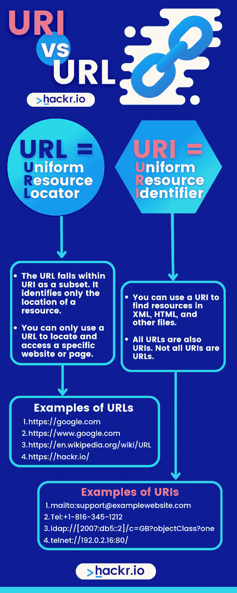

# URI 与网址:比较，特点和应用[更新]

> 原文：<https://hackr.io/blog/url-vs-uri>

我们每天都在使用许多网址。有时我们输入它们，而有时，我们只是被另一个重定向到一个 URL。有趣的是，我们大多数人都认为 http://google.com 或 http://facebook.com 只是网址，但只有少数人知道我们也可以称它们为 *URI。*

许多第一次听说 URI vs URL 的人可能会很困惑，因为他们试图区分两者。那么这两者到底有什么区别，你又怎么区分呢？

## 什么是 URI？

URI 代表统一资源标识符。它可能是名称、定位器或两者都是。URI 可以包含 URL 和 URN。然而，当 URI 只是一个名字，这意味着它不是一个网址。

URI 以相同的顺序包含方案、授权、路径、查询和片段。我们使用的一些最常见的 URI 方案有 HTTP、https、ftp、ldap、mailto、telnet、gopher、news 等

通用 URI 语法遵循 IEFTs RFC 3986。

语法是–

```
URI = scheme ":" hier-part [ "?" query ] [ "#" fragment ]
```

在我给你举一些例子之前，我想知道它为什么被称为“制服”会很好。为什么不仅仅是资源标识符？

一致性不仅允许在相同的上下文中使用不同的资源标识符，还允许跨资源标识符的通用约定的统一语义表示。这也意味着更容易引入新的资源 id，而不会干扰现有的资源 id。

现在来看例子——

https://hackr.io/blog——这是我们所知的典型的 URI，我们称之为 URL。

这个怎么样？

电话:+1-816-345-1212

以上是 URI，但不是网址。它标识一个资源。资源可以是任何东西。它不必总是 web 服务。它可以是一幅图像、一个文档或几个资源的集合。

### **URIs 的例子**

1.  mailto:support@examplewebsite.com
2.  电话:+1-816-345-1212
3.  ldap://[2007:db5::2]/c=GB？objectClass？一个
4.  远程登录://192.0.2.16:80/

### **使用 URI 的重要原因**

如果你想知道为什么你应该使用 URIs，这里有几个原因可以帮助回答你的问题:

*   我们所知的 URI 对我们当前的语义网至关重要，因为它有助于防止歧义
*   URI 使用统一的格式搜索资源或文件的名称*和位置*
*   URI 可以提供一些方法，其他系统可以通过这些方法访问 internet 或网络上的资源；因此，点对点或 P2P 文件共享软件，如 BitTorrent 和网络浏览器使用 URI 来查找下载文件

*   URI 允许您在不影响任何旧文件的情况下定义新的文件类型

## 什么是网址？

URL 代表统一资源定位器。

永远记住——URI 可以包含一个 URL，但是 URL 只指定一个资源的地址。顾名思义，就是一个‘定位器’。因此，URI 比 URL 更宽泛。

URL 包含以下信息:

*   用于访问资源的协议——HTTP:https:FTP:等等
*   使用 IP 地址或域名的服务器位置，例如，hackr.io 是域名。http://198.152.1。1–这里使用资源的 IP 地址(198.152.1.1)来定位资源
*   服务器上的端口号。例如 http://localhost:8080，其中 8080 是端口。不强制提及端口。
*   服务器目录结构中的确切位置。例如，如果用户想去网站的博客部分，http://hackr.io/blog 就是确切的位置。
*   可选的片段标识符。例如，[https://www.google.com/search?ei=ARDsXO-1EL7az7sPvbWigAo&q=URL](https://www.google.com/search?ei=ARDsXO-1EL7az7sPvbWigAo&q=URL)其中 q = URL 是用户键入的查询字符串。

### **网址示例**

1.  [https://google.com](https://google.com)
2.  [https://www.google.com](https://www.google.com)
3.  [https://en.wikipedia.org/wiki/URL](https://en.wikipedia.org/wiki/URL)
4.  [https://hackr.io/](https://hackr.io/)

### **使用 URL 的重要原因**

如果你想知道为什么应该使用 URL，下面的理由会有所帮助:

*   写在 URL 中的信息允许你点击一下就可以从一个网站切换到另一个网站(或者从一个网页切换到另一个网页)
*   URL 明确地告诉你如何访问资源
*   URL 遵循一种清晰易记的固定格式
*   URL 使得在页面和目录之间导航更加容易
*   单击任何超链接文本或在任何浏览器中键入 URL 都会使您的 web 浏览器向 web 服务器发送下载文件的请求
*   URL 可以用作在 web 上找到的任何唯一资源的地址。它可以用于网站和页面、文件、图像、视频、web 应用程序等等
*   URL，也称为网站的域名，通常是网站最重要的部分之一。使用以 TLD 或顶级域名结尾的简单单词或短语，如。com，。网，。org，还有。edu 可以让人们更容易找到网站，从而增加流量



## 什么是骨灰盒？

一个 URN，或者一个**U**N form**R**e source**N**ame，标识了互联网上的一个资源(通过名字)。URL 使用网络地址，如域、目录和文件名，而 URN 使用独立于协议和位置的常规单词。

URN 是持久的(意味着它永远不会改变),并且提供了更高层次的抽象。它需要一个解析服务，很像 DNS 系统，将一个名字转换成一个真实的地址。

在 URI 和 URL 的争论中，骨灰盒有点被搁置了。你会看到人们使用术语 URI 或网址，但你很难发现人们在日常生活中使用骨灰盒。

## **所有的网址都是 URIs 的，但并不是所有的 URIs 都是网址**

事实上，URI 是 URL 和 URN 的组合。因此，我们可以有把握地得出结论，所有的网址都是 URIs。然而，反之则不然。

所有的 URL 都是 URIs，而不是相反的主要原因是，URI 可以是资源的名称或位置，而 URL 只是位置。

理解这一点的一个快速的真实例子是:

约翰，你的名字是骨灰盒。你的地址，比如坎特街 34 号，就是网址。用你的名字**或地址**你可以被识别为一个独特的人。这个独特的身份就是 URI。

虽然您的姓名可以是您的唯一标识符(URI)，但它不能是 URL，因为您的姓名不能帮助您找到您的位置。换句话说，URI(URN)不是 URL。

## **如何鉴别某物是否是 URI vs 网址**

如果你想知道某个东西是 URI 还是 URL，你应该总是把它标记为 URI，因为所有的 URL 都是 URIs。

然而，如果你还在挠头，想知道“URL 和 URI 有什么区别？，“您可以在下面看到它们的主要区别:

*   **URI 包含 URL 和 URN** ，它们分别标识资源的位置和名称。URI 也可以只是一个 URL 或者只是一个 URN，允许它仍然只标识资源的名称或位置。
*   该 URL 属于 URI 的一个子集。它只标识**一个资源的位置**。
*   您可以使用 URI 在 XML、HTML 和其他文件中查找资源。
*   您只能使用 URL 来定位和访问特定的网站或页面。
*   所有的网址也是 URIs。并非所有的 URIs 都是 URL。

### **势均力敌的对比:URI vs 网址**

让我们做一些并排的比较，以便我们到目前为止讨论的任何内容都得到加强，并且您不会再对错误地使用 URI 和 URL 感到困惑！

| **URI** | **网址** |
| 通过名称、位置或两者来标识资源 | 资源的定位器 |
| URL 的超集 | URI 的类型 |
| 语法–

```
scheme:[//authority]path[?query][#fragment]
```

在哪里

```
authority = [userinfo@]host[:port]
```

 | 语法–

```
[protocol]://www.[domain_name]:[port 80]/[path or exaction resource location]?[query]#[fragment]
```

 |
| 该方案可以是任何内容，如协议、名称或规格等 | 该方案总是像 HTTP，https，ftp，LDAP 等协议… |
| URI 的主要目的是标识资源，并使用位置或名称将其与其他资源区分开来 | 主要目的是获取资源的地址或位置 |
| 示例–联系人:+1 883-345-1111，瓮:国际标准书号:1234567890 | 示例—[https://hackr.io/blog](https://hackr.io/blog) |
| 在 HTML、XML 和标记库文件(如 XSLT 和 JSTL)中使用，用于标识资源和二进制文件。 | URL 仅用于查找网页 |

## **Java API 差异**

我们在 Java 中实例化 URI 和 URL 对象的方式有一些不同。URI 有一个特定的构造函数来分别给出语法的所有部分，而 URL 没有。在这种情况下，URL-URI 的区别在于 URL 有打开远程连接的方法，以获取所指向资源的内容。

## URI vs 网址:你应该使用哪一个？

当人们不再问“什么是 URI vs 网址？”并开始争论哪个更好，人们开始互相纠正并坚持自己的观点是正确的，这并不罕见。

但是哪个才是真正正确的呢？你应该使用 URI 还是网址？

答案是——嗯，这要看情况。都是讨论话题的问题。如果人们谈论的是像 hackr.io 或 google.com 这样的普通网站(有域名)，你最好使用 URL。这背后的原因是，当有人提到一个域时，它暗示了 HTTP 协议。因此，它是一个 URL。

在大多数情况下，特异性是最好的。使用 URL 是因为它更具体(尽管你仍然可以把 hackr.io 或 google.com 称为 URI)。

例如，如果你正在与某人交谈，他们问他们可以从哪里开始学习编程，你可以告诉他们可以尝试资源网站。或者，你可以具体说一下 URL Hackr.io，这是一个编程资源网站。给他们提供网址可以让他们更容易找到他们要找的东西。

最后，您可以使用 URI，因为它在技术上是正确的，但是如果您想更具体一些(在大多数情况下您可能希望如此)，您可能最好使用 URL。

**结论**

## 虽然越来越多的人每天都知道并使用术语 URL，但是你也可以在一般的上下文中使用 URI，因为它是一个更广泛的术语。

URL 和 URN 都是特定且有限的。URI 和 URL 之间的区别非常微妙，只有当 URI 只指定名称时才会出现。说到位置，URI 和网址是一样的。

我希望这篇探索 URI 和 URL 的文章能帮助你更好地理解它们的相似之处和细微差别。希望，你现在知道什么时候使用网址或 URI！

准备找工作？用这些示例 [**网络服务面试问题**](https://hackr.io/blog/web-services-interview-questions) **为你的面试做准备。**

**人也在读:**

**常见问题解答**

## **1。URI 和网址一样吗？**

#### 所有的网址都是 URIs 的。这是因为 URI 由 URN 或 URL 组成，或者两者都有。然而，并不是所有的 URI 都是 URL。

**2。举例说明 URL 和 URI 的区别？**

#### URL 是资源的定位器。另一方面，URI 可以通过名称、位置或两者来标识资源。

例如 URI: ldap://[2007:db5::2]/c=GB？objectClass？一个

*   示例 URL:http://google.com
*   **3。域名是 URI 吗？**

#### 可以的。域名(例如，google.com)是 URL 的一部分，有助于在互联网上定位网站。例如，只需在浏览器中输入 google.com，你就会进入谷歌网站，有效地定位资源。

**4。URI 是 API 吗？**

#### 不一定。URI 和 REST API 之间可能有些混淆。如果你想知道更多，你可以在 StackOverflow 上看到这个[线程](https://stackoverflow.com/questions/7550795/how-does-a-rest-api-differ-from-uri#:~:text=A%20URI%20is%20used%20to,operations%20on%20a%20web%20service.&text=e.g.)。

**5。我如何改变我的网址到 URI？**

#### 如果你想了解更多关于把你的网址改成 URI 的信息，这个教程可以告诉你如何用 Java 来做这件事。

If you’d like to learn more about changing your URL to URI, this [tutorial](https://www.geeksforgeeks.org/url-touri-method-in-java-with-examples/#:~:text=The%20getURI()%20function%20of,if%20converted%20to%20URI%20format.&text=Parameter%3A%20This%20method%20do%20not%20accept%20any%20parameter.) can show you how to do it in Java.