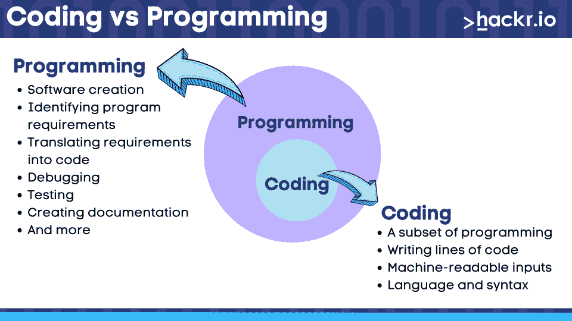

# 什么是编码？为什么你需要在 2023 年学习编码

> 原文：<https://hackr.io/blog/what-is-coding-used-for>

您可能正在通过电脑、手机或其他设备阅读这篇文章。这是可能的，因为有人编写了代码对您的设备进行编程，允许它为您显示本文的内容。

如果你听到这个，你想知道，嗯，什么是编码？那么，你来对地方了，因为这篇文章将回答这个问题。

因此，请继续阅读，因为我们涵盖了各种主题，包括什么是计算机编码，它的用途是什么，以及它为什么重要。如果您对编码职业感兴趣，我们也将绕一个小圈子来讨论您可以做些什么来开始。准备好了，太好了，我们走吧！

## **什么是编码？**

那么，编码是什么意思，编码是做什么的？让我们从简单的编码定义开始。计算机中的编码是为计算机编写指令的过程，我们称之为代码。通过编码，人类可以创建计算机可以理解和执行的指令。

计算机中的编码是使用由符号、单词和语法规则组成的编码语言来完成的。当程序员用一种代码语言编写代码时，一种叫做编译器的特殊软件，汇编器把它转换成机器语言(后面会详细介绍)，让计算机读取并执行他们的代码。

这个过程允许计算机执行诸如数据处理、自动化重复任务、创建网站和应用程序等任务。

### 编码与编程:有什么区别？

****

你会经常听到术语*编码*和*编程被*互换使用，但重要的是要注意它们不是一回事。

编码是编写代码的练习，它需要对编码语言的语法有正确的理解。然后，您可以使用这种理解来编写构成您的程序的代码。

另一方面，[编程](https://hackr.io/blog/what-is-programming)是指创建程序(或软件)所涉及的所有过程。这包括明确定义要解决的问题、确定解决方案、确定折衷方案、选择有效的解决方案、编码、测试和调试。

写小说的类比是形象化这种差异的好方法。编码就像写作过程，因为它涉及选择单词和遵循语法规则。编程是对整个过程的模拟，包括定义剧情、人物发展等。希望这有助于澄清这一点！

### **计算机在编码中的重要性**

计算机对编码至关重要，因为它们是执行的代理。在计算机中编码的想法是创建供计算机执行的指令，因为它们拥有我们执行编码过程所需的处理能力、存储和用户界面。

计算机也有能力快速正确地处理大量数据。他们也可以持续地执行重复的任务，而不会感到无聊或疲倦。这些属性使它们成为处理自动化和解决复杂问题的理想选择。

## **什么是编码语言？**

****

编码语言非常类似于人类的口语，因为它只是一组符号和单词。当与组合规则(语法)结合时，它允许我们创建计算机可以执行的代码。简而言之，编程语言是程序员用来编写指令计算机做事情的程序。

有许多高级编码语言，每一种都有自己的语法和最适合的领域。常见的语言例子有 [JavaScript](https://hackr.io/blog/what-is-javascript) ，Python，Java，Ruby，C++，C#，Swift 等等。

每种编码语言都有优点和缺点，所以选择正确的语言通常取决于您的项目需求。例如，JavaScript 等一些语言更适合 web 开发，而 Python 等其他语言则非常适合复杂的数据分析或科学计算。

### **什么是二进制码？**

二进制代码是一种在计算机中只用两个符号来表示数据的系统:1 和 0。这些符号被称为二进制数字或“比特”。如果你听说过这些编码术语，但不确定它们的意思，那么，现在你知道了！

有了这个系统，我们可以用 0 来表示“关”或“不”，用 1 来表示“开”或“是”。通过将多个位串在一起，就有可能表示复杂的数据结构，如计算机可以理解和执行的数字、字符或指令。

为了证明这一点，我们来看一个例子。在下面的代码片段中，我们使用二进制代码来表示字符串“hello”的 ASCII 版本。

```
01101000 01100101 01101100 01101100 01101111 
```

计算机使用二进制代码，因为它们可靠，易于存储和传输。毫不夸张地说，二进制代码对于现代计算的发展至关重要。

二进制代码在编码环境中的另一个用途是产生机器语言。这是编码的另一个重要方面，由计算机的 CPU 用来执行我们的高级代码。

### **机器语言的局限性**

机器语言使用由计算机 CPU(中央处理器)执行的二进制代码。

虽然这是控制计算机的最基本方式，但当人类编码者(你或我)接近机器语言时，它有一定的局限性。

*   高度复杂:机器语言复杂且难以编写，因为它需要对计算机硬件和二进制数学有深入的理解..
*   特定于硬件:机器语言是特定于计算机架构的，这意味着它们不容易移植到其他系统。
*   **难读:**与更高级的语言相比，机器代码非常难读，即使是有经验的程序员。
*   没有抽象:机器语言是低级的，所以它们缺乏我们在高级语言中享受到的抽象能力。

出于这些原因，像 Python、JavaScript、C++等高级编程语言使得程序员编写代码变得容易得多。这些提供了高度的抽象，这使得编写易于阅读和维护的代码变得非常方便。

### **JavaScript 代码示例& Python**

为了吊起您的胃口，让我们来看一些执行简单计算(将两个数字相加)的代码，并用 JavaScript 和 Python 打印出答案。您会注意到这两种非常流行的语言的语法和编码风格不同，但是总体逻辑和最终结果是相同的。

**JavaScript 代码示例:**

```
# Define two numbers
let num1 = 5;
let num2 = 3;

# Calculate the sum
let answer = num1 + num2;

# display the answer
console.log("the sum of" + num1 + "and" + num2 + "is" + answer);
```

**Python 代码示例:**

```
# Define two numbers
num1 = 5
num2 = 3

# Calculate the sum
answer = num1 + num2

# display the answer
print("the sum of", num1, "and", num2, "is", answer)
```

## **编码是用来做什么的？**

编码可以用来做什么？这个问题问得好。嗯，科技已经成为你能想到的人类努力的几乎每个领域的一部分。编码也是如此。

从通信、交通和娱乐到医疗保健、农业、金融等等，编码已经被用于推动许多使我们生活便利的技术。

尽管如此，编码是用来做什么的？让我们看一些常见的例子:

*   **软件开发:**开发桌面应用、手机应用、游戏等计算机软件。
*   **Web 开发:**创建网站和 Web 应用，包括前端(客户端)和后端(服务器端)开发。
*   **数据库管理:**与数据库交互，比如创建、读取、更新、删除数据库中的数据。
*   **自动化:**创建脚本来自动化重复的任务，例如数据处理、备份和文件管理。
*   **数据分析:**用 Python、r 等语言处理和分析大型数据集。
*   **人工智能(AI) &机器学习(ML):** 开发算法和模型，使计算机能够从数据中学习，做出预测，并自动化决策。
*   **网络安全:**编写代码保护计算机系统和网络免受恶意威胁和攻击。
*   **机器人学:**使用代码对机器人、无人机和其他物理设备进行编程和控制。
*   科学研究:使用代码对物理、生物、金融等领域的复杂系统和过程进行建模和模拟。

### **编码算法的重要性**

算法是解决问题的步骤。出于以下几个原因，编码算法是编程的重要组成部分:

*   **解决问题:**算法提供了一种定义问题和可能解决方案的系统方法。
*   效率:它们被设计成以高效的方式运行，减少了解决问题所需的时间和资源。
*   一致性:它们提供了解决问题的可重复方法，减少了人为错误的可能性。
*   **可扩展性:**算法可以被设计为处理大量数据，并且可以扩展以适应增长。

在您的编码之旅中，您将学到的编码算法的流行示例包括二分搜索法和合并排序。我们不会在这里深入讨论这些，所以我们只是把它们留给你去期待！

## 你应该学习如何编码吗？

如果你正在考虑学习如何编码，你应该！编程是各种职业中最受欢迎的技能之一，[趋势只会继续上升](https://www.statista.com/statistics/627312/worldwide-developer-population/)。如果你仍然不确定，让我列举一些你应该采取这一行动的理由来说服你:

**提高你解决问题的技巧:**编码涉及大量的批判性思维。在学习编码时，你将学习如何恰当地定义问题，识别可能的解决方案，考虑每种方案的利弊，并选择最有效的方案。

获得广泛的职业机会:众所周知，编程是一项技能，可以打开无数职业机会的大门。编码是许多行业都需要的技能，包括技术、金融、医疗保健、农业等。通过学习编码，你可以探索游戏开发人员、网页开发人员、机器学习工程师、数据分析师等职业。

重复性任务的自动化:计算机不像人类，因为它们不会感到疲劳或厌烦。只要你有足够的权力，他们就会继续工作。这使得它们非常适合执行数据分析、网页抓取、传输大文件等任务。通过学习编码，您可以编写脚本来自动为您执行这些任务。

**提高数字素养:**数字素养是指有效地理解和运用数字技术。当你学习如何编码时，你会更好地理解技术是如何工作的，这可以帮助你更有效地使用技术来解决问题。

## **如何开始编码**

如果你想开始学习如何编码，良好的开端很重要。让我们来看看您可以采取的一些步骤。

*   **决定你想做什么:**编码的范围很广，你可以涉足很多领域，比如 web 开发、机器学习、数据科学等等。花时间阅读不同领域的书籍，然后决定你感兴趣的领域。
*   **选择编程语言:**有很多编程语言可供选择，对于初学者来说比较流行的选项有 Python、JavaScript、Ruby。但是要知道，没有完美的语言。最好选择最符合自己兴趣和目标的。
*   建立开发环境:你需要一台电脑和一个代码编辑器或 IDE 来编写你的代码。Visual Studio 代码甚至 Atom 代码编辑器对于初学者来说都是不错的选择。
*   从基础开始:学习你选择的编程语言的语法和结构，以及像变量、数据类型和控制结构这样的基本概念。
*   构建项目:从简单的项目开始，逐步推进到更复杂的项目。试着做一些要求你学以致用的东西，同时要求你学习新的技能。
*   **练习:**提高 at 编码最好的方法就是每天编码一点点。你也应该用新问题挑战自己。

另一个好主意是考虑获得认证。这是一个向招聘人员和潜在雇主展示你是专业人士的绝佳方式，因为这将为你的技能和专业知识提供正式的证明。

为了帮助你，我们列出了一些广泛认可的编码专业人员认证，你可以考虑一下。

## **编码职业的例子**

所以你决定要学习如何编码，太好了！让我们来看看了解如何编程的人的热门职业选择。

软件工程师:如果你[成为软件工程师](https://hackr.io/blog/start-career-in-software-engineering)，你将负责设计、开发、测试和维护软件应用程序。你将使用 Java、Python、C++、C#等编程语言。也可以选择去大公司或者创业公司工作。

**Web Developer:** 负责前端、后端，或者两者兼而有之。通常需要精通 HTML、CSS、JavaScript 和其他技术。大多数公司都有网站，他们需要熟练的开发人员来维护这些网站。

**移动应用开发者:**你可以成为为移动设备开发应用的智囊之一。你可以专门为 iOS 或 Android 等平台创建应用程序。您的职责通常包括编写代码、测试应用程序和修复错误。

**游戏开发者:**你可能有一些喜欢的游戏，对如何创作游戏很好奇。如果你学会了如何编码，你可以通过使用 Unity 和 Unreal Engine 这样的工具来探索游戏开发。Udemy 提供了一门关于 C# 中的 [Unity 的课程，教你如何为 web、Mac 和 PC 制作游戏。](https://click.linksynergy.com/deeplink?id=jU79Zysihs4&mid=39197&murl=https%3A%2F%2Fwww.udemy.com%2Fcourse%2Funitycourse%2F)

**数据科学家:**如果你对数据感兴趣，成为数据科学家是一条很好的职业道路。数据科学家收集、分析和解释大型数据集，并使用机器学习技术来帮助理解数据。

云工程师:他们使用亚马逊网络服务(AWS)、微软 Azure 和谷歌云等平台设计、部署和管理云计算系统。您将负责确保云基础架构的安全性、可扩展性和可靠性。您还将帮助将现有的应用程序和数据迁移到云中。

**人工智能工程师:**人工智能涉及计算机科学、数学和工程的结合，以构建用于自动化任务、进行预测和改善决策的智能系统。Coursera 为每个人提供了“[人工智能](http://imp.i384100.net/XxQyxG)”，这提供了一个可靠的介绍。

## **结论**

现在你知道了！如果你已经做到了这一步，你现在知道问题的答案了，什么是编码？这是指示计算机执行任务的一种方式。如果你不得不为别人定义编码，你现在应该感到舒服了。

编程是当今每个人都在讨论的活动之一，因为它已经进入了许多职业道路。尽管毫无疑问，编码是一项有趣且有益的活动，但它也具有挑战性。

如果你想提高你新学到的编码知识，成为一名 10 倍的开发人员，要知道这需要时间和努力。也就是说，学习如何从头开始编写代码并成为一名专业的程序员现在比以往任何时候都容易，因为我们都可以访问许多资源来帮助我们学习。

**想成为一名程序员？结账**

**[完整的 Python 训练营](https://click.linksynergy.com/deeplink?id=jU79Zysihs4&mid=39197&murl=https%3A%2F%2Fwww.udemy.com%2Fcourse%2Fcomplete-python-bootcamp%2F)**

## **常见问题解答**

#### **1。编码到底是什么意思？**

编码定义:通过使用编码语言，编写计算机可以用来执行任务的指令。你创建的代码被编译成机器语言，你的计算机用它来执行你的命令。

#### **2。编码和编程有什么不同？**

编码是编程的一个子集。这是编程的一部分，包括编写组成程序的代码。另一方面，编程涉及到其他事情，比如确定需求、测试、调试等等。

#### **3。有哪些不同类型的编码？**

有几种类型的编程(范式)，像函数式编程、面向对象编程、过程式编程等等。但这并不能转化为不同类型的编码。实际的代码编写很简单，不管您采用什么样的编程范式。

#### **4。编码就像数学一样吗？**

编码不完全像数学。它确实涉及批判性思维和逻辑推理，如果你经常练习解决数学问题，这些技能是可以提高的。

**人也在读:**