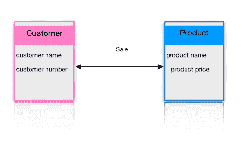
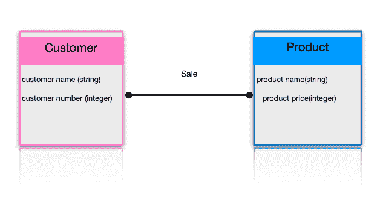
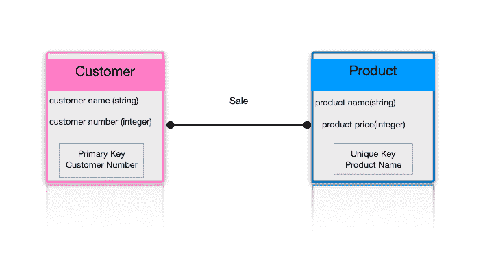
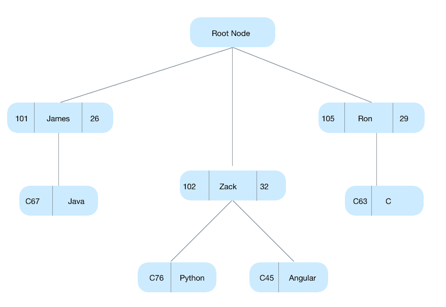
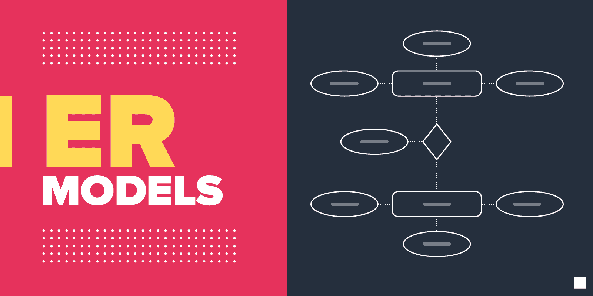
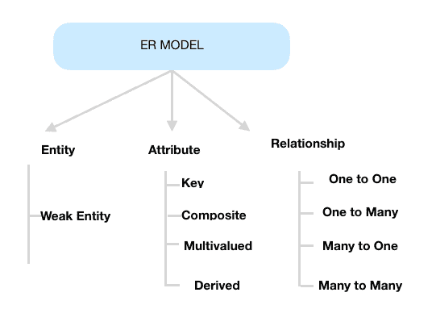
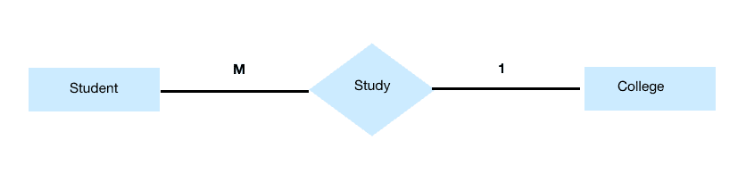

# 什么是数据建模？-数据模型的类型

> 原文：<https://hackr.io/blog/what-is-data-modeling>

## 什么是数据建模？

数据模型表示数据库中关系的框架。数据仓库是一个关键的组成部分，因为它提供了支持决策者分析需求的结构。

数据模型的建立是数据仓库设计的关键步骤；这一步要求业务涉众通过与数据架构师一起参加引导式会议来参与到流程中。

数据模型只是一个没有填充数据的外壳。这只不过是一幅画。数据仓库项目中真正的开销和负担不在于模型的设计，而在于从不同的来源填充模型。当用户设计他们的数据仓库时，数据模型可以被认为是一个指南，因为他们会与供应商认为的“标准”有许多偏差

### 数据建模过程中涉及的关键步骤

1.  确定建模的数据集中表示的实体或业务对象。
2.  确定每个实体的关键属性，以便在数据模型中区分它们。
3.  绘制实体关系模型的草图，以显示实体之间的联系。
4.  确定需要合并到数据模型中的各种数据属性。
5.  将属性映射到实体，因此模型属性反映了数据的业务含义。
6.  最终确定并验证数据模型，并对其进行优化，使其随着数据的变化而保持最新。

### 数据模型的使用

*   通过提供开发人员用于创建物理数据库的数据的整体情况，以数据的可视化表示帮助改进数据分析。
*   数据模型包含企业的所有关键数据。因此，它减少了数据遗漏的机会，从而避免错误的报告和不正确的结果。
*   数据模型更好地描述了业务需求。
*   它有助于创建一个健壮的设计，将一个组织的所有数据都放在同一个平台上。它还有助于识别冗余、重复和缺失的数据。
*   合格的数据模型有助于在企业的所有项目中提供更好的一致性。
*   数据模型提高了数据质量。
*   它帮助项目经理更好地管理范围和质量，并从根本上提高绩效。
*   它定义了关系表、存储过程、主键和外键。

### **数据模型的视角**

#### 1.概念数据模型

模型定义了系统包含的内容。模型的目的是建立实体及其属性之间的关系；在这个数据建模结构中，实际数据库结构的细节并不多。目标是组织、界定和定义业务概念和规则。数据架构师和利益相关者通常会创建它。

数据模型有三个基本租户:

*   **实体:**现实世界的东西
*   **属性:**实体的特性或属性。
*   **关系:**两个实体之间的依赖或关联。

例子

考虑两种产品，客户和产品。

*   客户名称和编号是客户实体的属性
*   产品名称和价格是产品实体的属性
*   销售是顾客和产品之间的关系

概念模型的特征

*   向任何组织提供业务概念的全面覆盖
*   该模型主要是为商业受众开发和设计的
*   该模型独立于硬件规范(如存储容量、位置)或软件规范(如 DBMS 供应商和技术)。它侧重于以用户在真实世界中感知的方式来表示数据。

#### 2.逻辑数据模型

逻辑数据模型通过定义数据元素的结构和设置它们之间的关系，向概念模型元素添加更多的信息。

该模型广泛地包括了需要捕获的所有类型的数据，比如表、列等。业务分析师和数据架构师通常会设计这个模型。

逻辑数据模型的优势在于为形成物理模型的基础提供了基础。然而，建模结构仍然是通用的。

在此数据建模级别没有定义主键或辅键；用户只需要验证和调整先前为关系设置的连接器细节。

逻辑模型的特征

*   描述了单个项目的数据需求，但是可以根据项目的范围与其他逻辑模型集成。
*   它是独立于数据库管理系统开发和设计的。
*   数据属性具有精确长度和精度的数据类型。
*   [对模型的归一化处理](https://hackr.io/blog/dbms-normalization)大部分应用到 3NF。

#### 3.物理数据模型

物理数据模型描述了数据模型的特定于数据库的实现。该模型在数据库管理系统的帮助下定义了数据模型的实现。它从表、CRUD 操作、索引、分区等方面概述了实现方法。数据库管理员和开发人员创建它。

物理模型的特征

*   描述了单个项目的数据需求，但是可以根据项目的范围与其他物理模型集成。
*   它包含表之间的关系，这些关系解决了关系的可空性和基数性。
*   它们是专门为某个版本的 DBMS、位置、数据存储或技术开发的。
*   列具有精确的数据类型、分配的长度和默认值。
*   定义主键和外键、视图、索引、访问配置文件和授权等

[掌握数据建模基础知识](https://click.linksynergy.com/deeplink?id=jU79Zysihs4&mid=39197&murl=https%3A%2F%2Fwww.udemy.com%2Fcourse%2Fmastering-data-modeling-fundamentals%2F)

## 数据模型的类型

### 1.层次模型

这种数据库建模基于树状结构，每个记录有一个根或父记录，兄弟记录按特定顺序排序。该顺序用作存储数据库的物理顺序。这种类型的建模用于许多现实世界的模型关系。该模型中的节点之间只能有一对多的关系。IBM 的信息管理系统( [IMS](https://searchdatacenter.techtarget.com/definition/IMS-Information-Management-System) )是分层方法的一个主要例子，这种方法在商业领域，尤其是在银行业得到了广泛的应用。

示例:

假设我们有几门课程和几个学生。每门课程只能分配给一名学生。然而，一个学生可以想选多少门课就选多少门。

### 2.关系数据建模

在这个模型中，关系和数据由一组相互关联的表来表示。每个表都是一组列和行，其中列代表实体的一个属性，行代表记录。

示例:

| 身份证明 | 名字 | 年龄 |
| 101 | 五月 | 22 |
| 105 | 约翰 | 25 |
| 121 | 公园 | 28 |
| 125 | 詹姆斯 | 32 |

| 身份证明 | 课程 ID | 课程名称 |
| 105 | C45 | 计算机体系结构 |
| 105 | C80 | 算法 |
| 121 | C76 | java 描述语言 |
| 121 | C67 | Java 语言(一种计算机语言，尤用于创建网站) |

ID、NAME 和 AGE 是学生表的属性，ID、COURSE_ID 和 COURSE_NAME 是表的课程属性。有值的行是记录，也称为元组。

### 3.实体关系模型

实体关系模型(ER 模型)使用图表来图形化地描述数据库中的元素，并简化对底层模型的理解。ER 模型是数据库的蓝图，可以作为数据库表/模式来实现。实体集和关系集是 ER 模型的主要组成部分。

#### 实体关系图(ER 图)

ER 图描述了实体集之间的关系。相似实体的集合是一个实体集，这些实体可以有属性。

#### ER 图的组件

ER 图由三个主要部分组成:

1.  实体
2.  属性
3.  关系

##### 1.实体

实体是数据的一个组成部分，在 ER 模型中表示一个矩形—下面的 ER 图有两个实体:学生和学院。这两个实体有多对一的关系，因为学生在同一个学院学习。

##### 2.弱实体

一个实体没有能力被其属性唯一地识别是一个弱实体。弱实体依赖于与其他实体的关系。双矩形表示 ER 图中的弱实体。例如，如果不知道一个银行帐户属于哪家银行，就无法对该帐户进行唯一标识，因此银行帐户是一个弱实体。

##### 3.属性

属性描述实体的属性。在 ER 图中，属性表示为椭圆形。

##### 4.关系

菱形描绘了实体之间的关系。

### 4.图形模型

图形模型与图形数据库一起，越来越多地用于描述数据集内的复杂关系，特别是在社交媒体、推荐和欺诈检测应用中。科学家使用图模型将他们的系统描述为关系和节点的连接图。图形数据模型用于文本分析，创建揭示文档中数据点之间关系的模型。

### 数据建模的优势

*   准确地表示功能团队提供的数据对象是设计数据模型的主要目的。
*   建立数据库需要一个详细的数据模型。
*   借助于数据模型定义的信息来定义表、主键和外键以及存储过程之间的关系。
*   数据模型帮助企业跨组织进行交流。
*   数据模型记录了 ETL 过程中的数据映射。
*   在数据模型的帮助下，识别填充模型的正确数据源。

### 数据建模的缺点

*   要开发一个数据模型，应该知道物理数据存储的特征。
*   它是一个导航系统，产生复杂的应用程序开发、管理。
*   即使在结构上做了较小的改变，也需要对整个应用程序进行修改。
*   DBMS 中没有一套数据操作语言。

## 结论

开发用于在数据库中存储数据的数据模型的过程就是数据建模。它们通过提供数据质量来确保默认值、语义、命名约定和安全性的一致性。模型结构有助于定义关系表、外键和主键以及存储过程。存在概念、逻辑和物理类型的数据模型。设计数据模型的主要目的是确保功能团队的数据对象得到准确的表示。最大的缺点是细微地改变结构也需要修改整个应用程序。

**人也在读:**