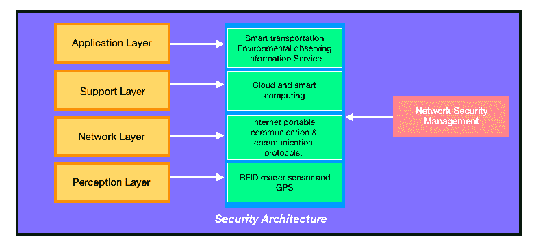
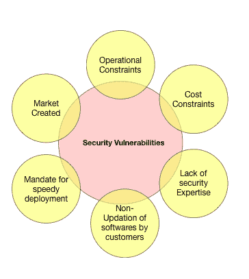
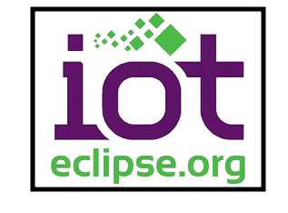

# 什么是物联网安全(物联网)？-工具和技术

> 原文：<https://hackr.io/blog/what-is-iot-security-technologies>

## 什么是物联网安全？

物联网安全(IoT Security)包括保护连接到无线网络的支持互联网的设备。物联网安全是与物联网相关的安全组件，它致力于保护物联网设备和网络免受网络犯罪的侵害。

物联网传感器收集的数据包含大量的隐私信息，需要保存。谈到物联网安全，有两个关键问题需要注意:隐私和安全。

## 安全基础知识-基础知识

物联网有 5 个主要组成部分:

1.  传感器
2.  设备
3.  数据处理
4.  反馈和控制
5.  云/服务器(物联网平台)

安全性和隐私被认为是重要的组成部分，必须添加到组件列表中。

物联网安全已被引入行业，并以多种方式使用:

*   信息物理系统
*   网络交通系统(CTS)
*   机器对机器(M2M)交互

## 体系结构

安全体系结构由安全分析的四个基本层组成:

### 1.感知层

这一层也被称为识别层，是最基本的一层，它在物理设备(传感器)的帮助下收集所有类型的信息，并识别和读取外部世界。来自设备传感器的信息包括对象或事物的属性、环境条件等。RFID 阅读器、GPS、各种传感器和其他设备等物理设备都在这一层之下。虽然涉及到不同的组件，但这一层中的关键组件是用于捕获和表示物理世界的传感器，即传感器提供的数据连接到这一层。

### 2.网路层

连接到广播数据和在众多基本网络(如移动通信网络、WiFi 网络、卫星网络等)上收集的数据的层。这一层负责提供我们从前一层获得的可靠的数据广播。最重要的是，从传感器收集的数据广播到下一级进行处理。对通过传感器收集的数据进行初步处理、分类和聚合。

### 3.支撑层

这些层充当上层和下层之间的媒介。考虑将它作为建立适当的应用层的平台，因为它有助于合并向上的应用层和向下的网络层。网格和云计算使用各种创造性的计算能力。

### 4.应用层

在这一层，应用程序的个性化交付发生，无论用户想要什么应用程序，无论向用户呈现什么应用程序，都在这一层得到处理。它可以来自智能水、智能交通、智能环境支持、智能空气系统等等。它可以通过电脑、移动设备、电视等完成。

## **物联网安全挑战**

****

1.  严重依赖加密的安全方法不太适合受限设备，因为它们不能快速执行复杂的加密和解密。这些资源受限的保护最容易受到旁道攻击，并且算法的逆向工程是可能的。
2.  在保护物联网产品和系统时，设备授权和身份认证至关重要。

*   *   他们必须先建立自己的身份，然后才能继续进行网关访问和其他与云相关的活动。
    *   具有双因素身份认证和使用强密码或证书的物联网平台有助于解决这一问题。
    *   它们还有助于确定每个设备在整个系统中可以访问哪些服务或应用。

3.  设备更新也需要有效管理。固件或软件的安全补丁将面临几个挑战，因此它们需要有效地更新。各种物联网设备可能都无法实现空中更新。设备所有者也可能对应用系统更新不感兴趣。
4.  通信信道也需要得到保护。使用传输加密和采用 TLS 之类的标准比在传输之前加密消息要好。
5.  应该安全地存储和处理传感器数据。数据完整性(包括校验和或签名)有助于确保原始数据在传输过程中不会被修改。不需要的数据应以更好的方式处理或检测，不应保留在系统的任何部分。保持对法律和监管框架的投诉是该项目的另一个挑战。
6.  当管理人员处理访问物联网设备以及传感器数据时，所有应用程序和服务也应受到保护。

安全漏洞和违规是不可避免的，但需要尽可能采取措施来避免利益冲突。

## **最佳物联网安全技术**

根据 Forrester 的分析，下面提到的是最流行的物联网安全技术

### 1.物联网网络安全

物联网网络安全比传统网络安全更具挑战性，因为通信协议、标准和设备功能的范围更广，所有这些都带来了重大问题并增加了复杂性。它涉及保护连接物联网设备和互联网后端系统的网络连接。功能包括传统的终端安全功能，如防病毒和反恶意软件，以及防火墙和入侵预防和检测系统。示例供应商有 Cisco、Darktrace 和 Senrio。

### 2.物联网认证

它允许用户对物联网设备进行身份认证，包括管理单个设备的多个用户，从多个静态密码到更强大的身份认证机制，如双因素身份认证、数字证书和生物识别。与大多数身份认证流程需要人工输入凭据的企业网络不同，许多物联网身份认证场景都基于 M2M，不涉及任何人工干预。样本供应商:Baimos Technologies、Covisint、Entrust Datacard 和金雅拓。

### 3.物联网加密

使用标准加密算法对物联网边缘设备和后端系统之间的静态和传输数据进行加密，维护数据完整性，并防止黑客嗅探数据。一些物联网设备和硬件配置文件限制了拥有标准加密流程和协议的能力。此外，所有物联网加密必须伴有等效的完整加密密钥生命周期管理流程，因为糟糕的密钥管理会降低整体安全性。示例供应商:思科、HPE。

### 4.物联网安全分析

这项技术包括收集、聚合、监控和规范来自物联网设备的数据，并在可疑活动或活动超出既定政策时提供可操作的报告和警报。

这些解决方案添加了复杂的机器学习、人工智能和大数据技术，提供了更多的预测建模和异常检测，但这些能力仍在不断涌现。越来越需要物联网安全分析来检测防火墙等传统网络安全解决方案无法识别的特定于物联网的攻击和入侵。示例供应商:思科、Indegy、卡巴斯基实验室、SAP 和 Senrio。

### 5.物联网 API 安全性

这项技术使我们能够使用记录在案的基于 REST 的 API 来验证和授权物联网设备、后端系统和应用程序之间的数据移动。API 安全保护边缘设备和后端系统之间传输的数据的完整性，以及使用记录的 rested APIs 的应用程序，并检测针对 API 的潜在威胁和攻击。示例供应商:Akana、Apigee/Google、Axway、CA Technologies、Mashery/TIBCO、MuleSoft 等等。

[打造 IOT 事物从无到有走向市场的完整指南](https://click.linksynergy.com/deeplink?id=jU79Zysihs4&mid=39197&murl=https%3A%2F%2Fwww.udemy.com%2Fcourse%2Fcomplete-guide-to-build-iot-things-from-scratch-to-market%2F)

## **工业黑客和物联网漏洞**

### 1.震网病毒

Stuxnet 是一种复杂的计算机蠕虫，旨在检测核工业中使用的特定机器。Stuxnet 有几个安全措施，防止它被运行特定安全程序的机器检测到，如自禁用和自擦除。Stuxnet 开始寻找离心机(用于分离铀同位素的机器)，并对它们进行重新编程，以执行不同的循环，导致离心机解体。离心机是物联网设备的一种形式，Stuxnet 是破坏现实世界设备的计算机蠕虫之一，而不是入侵它们来破坏软件。

### 2.Mirai 未来组合

Marai 是一种物联网恶意软件，它使用常见的用户名和密码访问物联网设备。例如，运行 Linux 并使用默认凭据(如“admin”和“password”)访问的 IP 摄像机、监视器和记录器等物联网设备，允许恶意软件快速访问系统并将其转化为机器人。数百万台设备的组合允许称为僵尸网络的僵尸网络集合在主要网络上执行 DDoS(分布式拒绝服务)攻击，因为单个物联网设备无法执行大部分攻击。Mirai 未来组合的一个显著特点是，它被硬编码为忽略特定的 IP 范围，甚至是 HP、GE 和美国国防部拥有的 IP 地址。Mirai 未来组合是一个很好的例子，展示了集成了公开可用软件的物联网设备的设计者如何认识到默认登录凭据应该被更改，并可能被严重攻击滥用。

### 3.赌场数据泄露

黑客攻击服务器获取敏感信息被误认为是通过后门或一些智能安全漏洞(如 Heartbleed)对中央服务器的巧妙渗透。

黑客利用智能温度计中的一个微不足道的漏洞来访问网络，检索数据，然后通过温度传感器将数据提取回云中。事实上，即使是最简单的互联网接入设备也可以关闭最严格的网络，这使得这种攻击令人生畏。工程师需要决定(或忘记)不在像温度传感器这样简单的东西上实现安全性。

### 4.吉普黑客

两名白帽黑客证明了使用互联网远程入侵吉普切诺基是多么容易。这两个人表演的范围很广，从开空调这样的小恶作剧，到能够驾驶汽车和关闭发动机。该漏洞来自 Jeep 使用的一个名为 Uconnect 的仪表板系统，该系统提供了一个重写 hip 上固件的接入点。凭借重写固件的能力，该芯片可以通过 CAN 总线访问汽车控制的其余部分。

据信，许多使用 Uconnect 系统的汽车存在风险，因为只有少数汽车针对这一弱点进行了测试。随着汽车制造商不顾一切地将智能手机技术集成到他们的汽车中，随之而来的漏洞并没有得到充分考虑。

### 5.医用植入物

FDA 在 2017 年召回了近 50 万台起搏器，担心它们可能被远程黑客攻击。虽然这并没有看到设备被从患者体内移除，因为该过程可能是危险的，但是，固件更新是由医务人员远程应用的。设备被远程控制，几乎没有安全措施。召回背后的担忧是改变固件，例如，导致电池没电。该示例展示了安全性对于患者健康和幸福的重要性。这也说明了这些简单设备的复杂性。

### 1.M2MLabs 主弹簧

M2MLabs Mainspring 是一个开源应用程序框架，用于构建 M2M(机器对机器)应用程序，如车队管理、远程监控或智能电网。其功能包括设备配置、设备的灵活建模、应用程序和设备之间的通信、数据的标准化和验证、数据检索功能、长期数据存储以及。它基于阿帕奇卡珊德拉 NoSQL 数据库和 Java。M2M 的应用程序可以在几个小时而不是几周内完成原型开发，并最终转移到基于标准 J2EE 服务器和高度可伸缩的 Apache Cassandra 数据库的高性能执行环境中。

### 2.摆动

Flutter 出名是因为它是远程的，是一个用于电子项目的可编程处理器核心，是为工程师、学生和爱好者设计的。它的基于 Arduino 的电路板有一个无线发射器，可以到达半英里以上。再加上，你不需要路由器；飞板之间可以直接通信。它包括 256 位 AES 加密，并且易于使用。

### 3.Eclipse 物联网项目

听说过 Lua 编程语言吗？Eclipse 赞助了几个围绕物联网的不同项目。它们包括应用程序框架和服务、物联网协议的开源实现以及与 Lua 合作的工具，Lua 是 Eclipse 推广的理想物联网编程语言。与 Eclipse 相关的项目包括 Mihini、Koneki 和 Paho。

### 4\. Kinoma

Kinoma 是一个 Marvell 半导体硬件原型开发平台，由三个不同的项目组成:

*   Kimona Create 是一个开源的 DIY 构建工具包，用于原型电子设备。
*   Kimona Studio 是开源的，它提供了一个与 Create 和 Kinoma 平台运行时协同工作的开发环境。
*   Kimona Connect 是一款免费的 iOS 和 Android 应用程序，可以将智能手机和桌子与物联网设备连接起来。

### 5.红色节点

Node-RED 是一个可视化工具，它以令人兴奋的方式将 API、物联网硬件设备和在线服务连接在一起。Node-RED 建立在 Node.js 的基础上，将自己描述为“连接物联网的可视化工具”。它允许开发人员使用基于浏览器的流编辑器连接设备、服务和 API。它可以在 Raspberry Pi 上运行，并且有超过 60，000 个模块可用于扩展其功能。

## **物联网的利弊**

### 赞成的意见

1.  通过鼓励 M2M 通信，它允许随时随地在任何设备上访问信息。物理设备能够保持连接；因此，完全透明，质量更高，效率更低。
2.  通过连接的网络传输数据包可以节省时间和金钱，因为通过允许数据在电子设备之间进行通信和共享，然后将其转换为我们所需的方式，物联网正在使我们的系统变得高效，从而节省成本和能源。
3.  自动化任务有助于提高业务服务的质量，并减少对人工干预的需求。由于物理对象通过无线基础设施进行数字化控制和连接，因此工作中存在大量的自动化和控制。

### 骗局

1.  随着不同设备和技术的介入，互联设备的数量不断增加，它们之间共享的信息也越来越多。它增加了黑客窃取机密信息的机会，这直接引发了安全和隐私问题。存储和数据检索也变得非常重要。
2.  对于所有复杂的系统，失败的可能性都会增加。在物联网的情况下，故障可能会急剧增加，因为企业可能需要处理大量甚至数百万的物联网设备，从所有这些设备中收集和管理数据变得非常具有挑战性。
3.  如果系统有问题，每个连接的设备都可能被破坏。
4.  由于没有物联网兼容性的国际标准，不同制造商的设备之间的通信不是最基本的。
5.  日常活动的自动化最终会导致对人力资源的需求减少，员工受教育程度降低，这可能会在社会中产生就业问题。

## **结论**

毫无疑问，物联网将改变开发服务流程。虽然跟随最新的技术是被鼓励的，但是研究和分析消极的方面并为结果做好准备也是明智的。数字企业需要明白，尽管物联网产品提供了毫不费力的支持，但同样的设备已经成为黑客和网络犯罪分子寻求破坏和泄露敏感数据的诱人攻击平台。

**人也在读:**