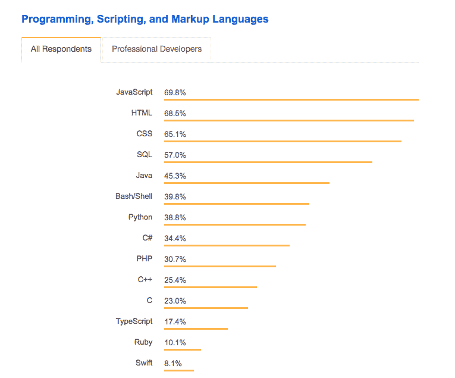

# 什么是编程语言？[初学者指南]

> 原文：<https://hackr.io/blog/what-is-programming-language>

几千年来，语言一直是我们交流和人类互动主要手段。对于一个社区来说，语言包含了人们交流所需要的词汇，词汇本身是抽象的，但它们表示意义，它们指向物体或动作，等等..

当你看着你的电脑，你会发现它并没有太大的不同。有许多硬件和软件需要相互通信。你的应用程序对鼠标和键盘甚至麦克风有反应，它可以从你的磁盘存储器中读取文件等等。但是到了最后，机器除了比特、1 和 0 之外什么都不懂，它们的组合创造了意义。

最早的计算机实际上是通过手动改变 1 和 0，改变电路和线路来编程的。当然，创建许多程序并不容易，因为大多数程序仅用于特定的应用程序，而且它们的规模巨大，所以它们非常有限。这就是为什么[编程语言](https://hackr.io/blog/best-programming-languages-to-learn)的诞生是革命性的一步，将这个领域带到了另一个高度。与普通语言不同，编程语言中的关键字是有限的，通过组合这些关键字，开发人员能够创建不同类型的程序。有一些特殊的软件可以把你写的代码转换成机器能理解的机器语言。那么什么是编程语言呢？简而言之，**编程语言是人类与计算机交互的指令集。**

## 什么是编程语言？什么是代码？

代码很像给计算机写一段指令或创建一个待办事项列表。与我们人类不同，你为计算机编写的待办事项列表和指令必须极其详细，并以某种逻辑编写。

通过代码和编程，您可以让计算机绘制复杂的形状并创建丰富的计算机图形，然后创建理解游戏机制的程序，并帮助您创建感觉真实的重力和粒子碰撞游戏，使用这些程序，您可以创建各种最激烈和沉浸式的游戏。

通过代码和编程，你可以用你的博客和个人网站在世界各地创建和发送内容，并使你的博客符合你的风格。您可以构建技术驱动的业务解决方案，接触更广泛的客户，满足更广泛的需求。

此外，通过代码和编程，您可以创建智能家居应用程序，如自动宠物喂食器、智能镜子，甚至可以创建一个机器人来帮助完成家务，并成为您的虚拟助手，与您交谈并理解您。与许多人认为的不同，计算机工程和计算机科学中涉及了很多艺术。您可能对我们的[什么是编程感兴趣？](https://hackr.io/blog/what-is-programming)博文了解更多。

下面是编写“Hello World！”在 C 编程语言中:

现在，我们来看看编程语言有什么用途。

## 编程语言的使用

### Web 开发

如果你对建立网站感兴趣，有两个相互交织的部分值得研究。

首先是**前端开发**，这是 web 开发的一部分，它创建在您的浏览器上运行的应用程序，并调整样式、颜色和交互。它基本上与网站用户看到的内容有关。你正在通过前端代码显示的屏幕上阅读这篇博客。前端基础从 HTML 和 CSS 开始，使用 JavaScript。在过去的几年里，Javascript 已经成为前端工作最主要的语言之一。

另一个用于创建网站的部分是**后端开发**，与服务器相关，即运行网站软件并服务于全世界的电脑。它主要关注路由，当用户访问某个 URL 时，将哪些页面发送给用户，它还与存储网站信息的数据库通信，并将这些数据发送给用户。后端开发是神奇的地方，当谈到编程语言时，有许多选项可供选择，你可以像前端开发一样坚持使用 Javascript，或者使用 PHP、Ruby、C#、Elixir、Python、Erlang。

### 游戏开发

游戏开发是最有趣的领域之一，许多开发者喜欢它，有些开发者开发游戏只是为了娱乐。创建游戏需要所谓的游戏引擎，这是一种软件，用作构建游戏的基础设施，并定义游戏拥有什么以及它能做什么。如果你熟悉史诗游戏和两周，事实上，史诗游戏是一个游戏引擎，两周是建立在它之上的。游戏开发中使用的语言大多是 C++，C#，因为它需要大量的内存优化和快速的性能来创建丰富的图形。然而，它并不局限于 C++和 C#，它有点像是关于你正在使用的引擎和你的目标平台，Lua 和 Java 也是这个行业中非常著名的候选语言。

### 移动开发

创建移动应用程序有点棘手，因为手机有不止一个操作系统，不同的操作系统需要不同的语言来运行这些应用程序。操作系统是设备上负责处理设备硬件的软件，它是位于您创建的应用程序和硬件(无论是麦克风、触摸屏还是 GPS)之间的一层。最常见的两个操作系统是 Android 和 IOS。三星最常用的是安卓，而苹果用的是 IOS。要创建 Android 应用，你需要 Java 或 Kotlin，而要创建 IOS 应用，你需要 Objective-C 或 Swift。最近，使用 Javascript 或 Dart 为 Android 和 IOS 创建移动应用成为可能。

## 如何学习一门编程语言？

学习编程语言主要需要专注和实践，不写代码就不能成为程序员。也就是说，你可以通过你喜欢的入门课程开始了解计算机科学，我的推荐是哈佛大学的 CS50(T1 ),可以在他们的 youtube 频道上公开获得。熟悉编程和基本概念后，就可以拿起自己喜欢的领域和语言，搜索资源了。你可以在 [Hackr.io](https://hackr.io/) 上找到数百个关于许多语言和技术的有用资源、教程和常见问题。您还可以找到不同方向的编程路线图，以及比较和探索软件开发不同部分的博客文章。

[100 天代码:2023 年完整的 Python Pro 训练营](https://click.linksynergy.com/deeplink?id=jU79Zysihs4&mid=39197&murl=https%3A%2F%2Fwww.udemy.com%2Fcourse%2F100-days-of-code%2F)

## 最流行的编程语言是什么？

根据 2018 年的 Stack Overflow Developer [调查，超过 100，000 名开发人员接受了关于其开发职业的调查。最受欢迎的行业领域是 web 开发，超过 57%的开发人员从事后端开发，37%的开发人员从事前端开发。这使得 Javascript 成为最受欢迎的编程语言，其次是 Java，然后是 Python。Github 的 2017 年 Octoverse 显示了类似的结果，Javascript 是最受欢迎的语言，其次是 Python，Java，然后是 Ruby。
对编程语言有任何问题/疑问吗？欢迎在评论中提问。](https://insights.stackoverflow.com/survey/2019)

**人也在读:**