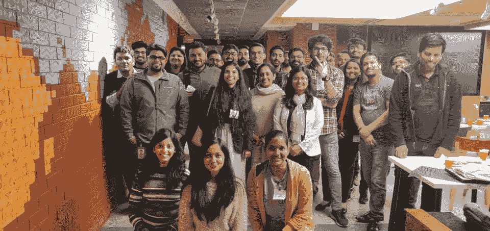

# 为什么你应该成为社区的一部分？

> 原文：<https://hackr.io/blog/why-should-you-be-a-part-of-the-community>

## 这一切是如何开始的？

在做了近 5 年的全职妈妈和休假后，我想重新开始我的职业生涯，回到前端开发，我开始花很长时间学习，在 5 年的时间里前端发生了很大的变化，Javascript 框架几乎开始统治这个行业，我感到几乎迷失了，未经训练的学习热情和对技术的热爱一直是我继续学习的巨大动力。

社区领袖:最初是一种激情，打算学习、分享和探索新技术，最终建立网络并结识志同道合的人。

我的心一直在开发，但我对 UX 的兴趣越来越大，因为它像解渴一样渴望理解和指导设计，策划软件，以一种有意义的方式添加更多的功能，并使软件对一个非技术人员来说更容易理解。

一个简单的错误会让你沮丧，但是一个有意义的完整句子可以帮助你找到解决方案。

社区参与改变了我的生活，这要归功于 [IDF](https://www.interaction-design.org/) ，在那里学习设计思维触动了我的心灵，课程让我的创造力流淌，然而学习更多的热情引导我组建了社区，热情地追求学习 UX 的实际应用，让聚会开始，我很幸运地发现我的联合组织者 [IDF_NewDelhi](https://twitter.com/IDF_NewDelhi) 和 [ReactDelhiNCR](https://twitter.com/reactdelhincr) - [括号](https://twitter.com/BracketsJs)有着相似的疯狂&热情，这使它一帆风顺并持续下去现在，可以自豪地说成功经营了三个社区。

第二个社区与 ReactDelhiNCR 合作倡导 JS 框架有关，该社区通过接受行业专家的培训并在研讨会期间像专家一样解决问题，进入了另一个层次。从教程中学习对你有帮助，但是你需要练习，直到你能自己得到那段代码，只有研讨会鼓励你边做边学。

### **学习**

成为社区的一部分有利于你的个人成长，社区给你导师、伙伴、志趣相投的人、和你一样在奋斗的人。学习并与社区分享知识，倡导回馈社会的价值观。

### **联网**

你会找到无条件帮助你、给你指导的人，他们走过你即将开始的同一条路，给你在这个行业生存的生活窍门。建立网络，拓展可能性，获得创造性的想法，与多个机构合作，从不同档案的社区获得工作帮助。

### 寻找机会

招聘人员有时也会去聚会寻找合适的候选人。参与或参加有助于建立关系网的社区活动。

任何相信终身学习，渴望每天学习新东西的人，爱好者，业余爱好者，探险家，在另一边寻找知识的人都想分享他们的知识和经验，并让其他人有机会从他们的经验中获益。

形成一个社区是一项相当艰巨的任务，但是如果你充满激情和决心，你会找到方法，一旦事情进入状态，你就会开始更加热爱它。试着保持免费！

## 组织第一次聚会

组织 IDF 会议并将其提升到另一个水平并不困难。新德里的 IDF，当联合工作场所(91springboard)出现时，每月举行聚会变得更加容易，他们张开双臂赞助我们组织免费聚会，他们不仅允许我们举行聚会。

这个社区让你认识新的人，他们有同样的问题，同样的欲望，同样的问题，寻找同样的解决方案。

你最终会找到周末伙伴、灵魂伴侣、像你一样的奋斗者、有类似情况的人，同时也有机会找到那些在你身上发现潜力的人。它帮助公司招聘员工。就我个人而言，我找到了理解我的导师，帮助我认识到自己的潜力，并向我展示最适合我的道路。

一个演讲者——一个行业专家，愿意分享知识，有足够的经验传递知识，清除疑惑。

决定适合你所在地区的日子、日期和时间，就像我们通常选择星期天一样，在那里人们休息，在漫长而疲惫的一周后醒来很晚，但一个好的话题可以激励他们从懒惰模式中走出来。会场，最好是一个所有人都可以接近的中心位置，否则一半人会打退堂鼓，或者懒得去远的地方。

制作一张海报或创意来宣布你的聚会，包括所有细节、会议议程和演讲者描述…让它看起来值得参加，因为人们会牺牲周末的时间。另一方面，也要做好登记工作，以了解到会人数的大概情况。在社交媒体上宣传你的活动——在活动页面上发布你的活动，比如脸书，它让你可以创建活动，现在有很多选择，比如 Eventbrite、meetup.com(付费)、GDG 社区领导发起的 Commundle。传播给 Whatsapp、LinkedIn、脸书、Twitter 上的相关群体。让它到达相应的质量。

*   建立网络，拓展可能性，获得创意，
*   学习并与社区分享知识，倡导回馈社会的价值观。
*   与多个设置协作，从不同档案的社区获得工作帮助。
*   你并不孤单:帮助你在公共场合演讲恐惧，舞台恐惧
*   工作机会，回报社会，激发我回报社会的热情

*   当你在 It 行业工作时，追求聚会是很有挑战性的，工作日你工作，周末聚会很累，但就像我说过的，如果你有激情，没有什么可以阻止你。

当 Hackr.io 投入我的怀抱时，我感受到了这种社区参与的力量。我找到了我梦寐以求的工作角色，成为 Hackr Bootcamp 的社区经理，我对这份工作充满热情，并完全爱上了它。