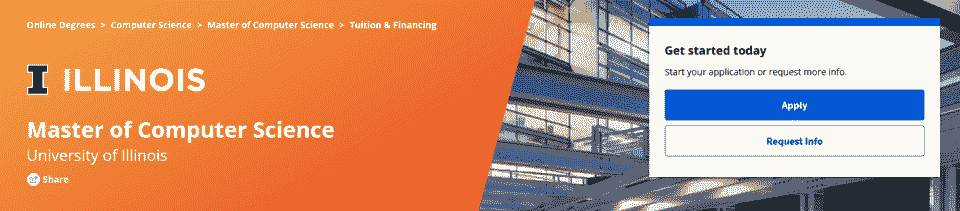
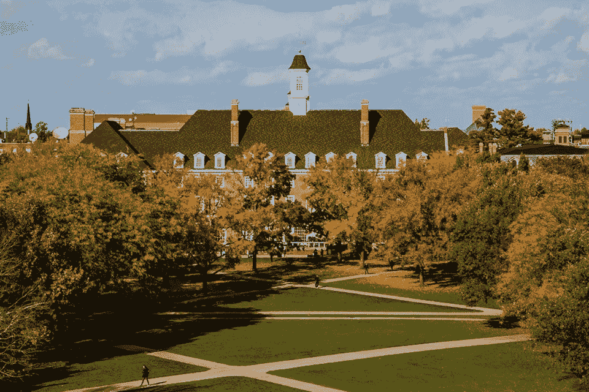

# 伊利诺伊州 MCS-DS:数据科学的未来

> 原文：<https://hackr.io/blog/your-future-in-data-science-illinois-mcs-ds>

由于越来越多的企业和组织寻求转向数据驱动战略，数据专业人员的需求非常高。在 2016 年的一项研究中，麦肯锡&公司预测，到 2024 年，数据科学家的缺口可能达到 250，000 人——即使数据科学毕业生每年增长 7%。这种不断增长的需求意味着在这个领域开始职业生涯可以带来丰厚的薪水和稳定的工作。

有许多方法可以让你为从事数据科学职业做好准备。你可以自学，从在线课程中学习，或者参加训练营，但是没有什么比得上一所受人尊敬的大学的灵活的、高质量的学位。

获得数据科学的高级学位会让你比其他申请者更有优势。伊利诺伊大学厄巴纳-香槟分校通过 Coursera 提供最好的数据科学在线硕士学位之一。有了这个学位，你可以学习成为成功的数据科学家所必需的重要职业技能。

想了解更多？让我们仔细看看 UIUC 提供的数据科学中的计算机科学硕士学位。

## **UIUC 计算机科学硕士在数据科学方面是什么？**

伊利诺伊大学香槟分校提供的 MCS-DS 是一个完全在线的非论文学位课程。学生可以选择 MCS 或 MCS-DS 课程，这与以数据科学为重点的课程基本相同。

MCS-DS 是一个在线学位，可以灵活地构建职业生涯所需的数据科学技能，由行业先驱教授。为了让你更好地了解它的质量， [Fortune](https://fortune.com/education/information-technology/masters/rankings/best-online-masters-in-data-science/) 将这个项目列为 2022 年数据科学最佳在线硕士学位。

参加这个项目可以教会你在机器学习、数据可视化、数据挖掘和云计算方面的核心能力。如果你渴望更多的学习，你可以随时进入 UIUC 统计系和该国排名第[的](https://www.usnews.com/best-graduate-schools/top-library-information-science-programs)信息科学学院的额外跨学科课程。

## **通过这个完全在线的计划灵活学习**

****

如果你想在 UIUC 和 Coursera 的#1 在线数据科学硕士项目中获得实用的实践经验，你需要知道以下内容。

UIUC 的数据科学计算机科学硕士课程可能需要 12 到 36 个月才能完成。该计划包括八门研究生水平的课程，每门四个学分，总共 32 个学分。完成这个项目可以让你获得高等教育委员会认可的学位。

申请每年开放三次，分别在秋季、春季和夏季开始。2023 年 5 月开始的夏季学期申请于 2022 年 10 月 26 日开放，截止日期为 2023 年 2 月 15 日。

### 你能学到什么？

选择 MCS-DS 方向可以让您学习侧重于数据科学的 MCS 学位。你将学习数据挖掘和可视化、机器学习和云计算方面的核心能力，以及一些对数据科学有益的跨学科课程。

如果你想了解更多关于这个项目的课程，你可以访问[这个链接](https://www.coursera.org/degrees/master-of-computer-science-illinois/academics)。你也可以在这里找到更多关于潜在职业成果的[。](https://www.coursera.org/degrees/master-of-computer-science-illinois/careers)

### **入学要求**

****

要加入这个项目，你需要完成标准的申请要求，比如成绩单、推荐信、申请费等等。然而，像任何研究生水平的项目一样，UIUC MCS-DS 对入学有更多的要求。以下是你需要知道的。

第一个也是最重要的要求是符合条件的学士学位。虽然该项目对国际学生开放，但你必须通过访问这个[链接](https://grad.illinois.edu/admissions/countries)来确认你的学士学位是否合格。要获得入学资格，你必须没有完成计算机工程、计算机科学或其他相关领域的研究生学位。

GRE 是不需要的，所以你不用担心参加任何标准化的入学考试。在 4.0 分制下，**的最低 GPA 要求是 3.2** ，尽管只考虑你学士学位最后两年的表现和课程。

MCS-DS 项目需要在数据结构、面向对象编程和算法方面有很强的背景知识。理想情况下，这将包括数据结构课程或类似的经历。UIUC 表示，他们会优先录取在他们的记录中有先修课程的申请人。

如果你没有这些领域的计算机科学课程，这并不意味着你不能申请。只要你有四到五年的相关计算机科学经验和 3.2 的平均绩点，UIUC 推荐你参加 Coursera 上的[计算机科学基础速成专业](https://www.coursera.org/specializations/cs-fundamentals)。它可以帮助你准备参加[数据结构熟练考试](https://cs.illinois.edu/admissions/graduate/applications-process-requirements/data-structures-proficiency-exam)。在这方面做得好，你可能会加强你的整体应用。

国际学生可能需要在申请时提交他们的**托福或雅思成绩**。或者，如果托福/雅思考试因新冠肺炎疫情而无法进行，UIUC 将暂时接受多林哥英语考试成绩。Duolingo 成绩必须来自 2020 年 2 月 1 日至 2023 年 8 月 1 日期间参加的考试。

值得一提的是，如果你以前有计算机科学的研究生课程，你可以将 12 个学分转入这个项目，尽管这需要经过批准。学分不得超过五年。

### **成本和融资**

****

UIUC 数据科学项目的计算机科学硕士学费为每学分 670 美元。按 32 学分计算，这意味着总费用为**21，440 美元**。

您可能会遇到其他费用，例如:

*   在线监考的监考费用，在安排考试时会直接向您收取。30 分钟的考试费用为 8.75 美元，1 小时的考试费用为 14.75 美元，90 分钟或 2 小时的考试费用为 21.50 美元，3 小时的考试费用为 30.25 美元。

*   AWS(亚马逊网络服务)等云计算服务的费用可能会有所不同。UIUC 可能会免费提供学分作为课程或课堂的一部分。

如果你担心预先支付全部费用，你不必这样做，你可以随用随付。你可以在选修每门四个学分的课程时付费。此外，如果你因为任何原因需要暂停学习，UIUC 不会收取你的费用。

那些需要的人可以得到经济资助的机会。如果你想了解更多关于贷款、付款计划等等，你可以点击[这个链接](https://www.coursera.org/degrees/master-of-computer-science-illinois/tuition-financing)了解更多信息。

## **获得顶级数据科学学位，开启您的职业生涯**

伊利诺伊大学厄巴纳-香槟分校数据科学专业排名第一的计算机科学硕士课程是学习在该行业开始职业生涯所需技能的绝佳方式。该计划是由先驱教师谁可以提供指导和导师，你需要的成功。

[准备好开始了吗？点击此处了解更多关于招生程序的信息。](https://www.coursera.org/degrees/master-of-computer-science-illinois/admissions)