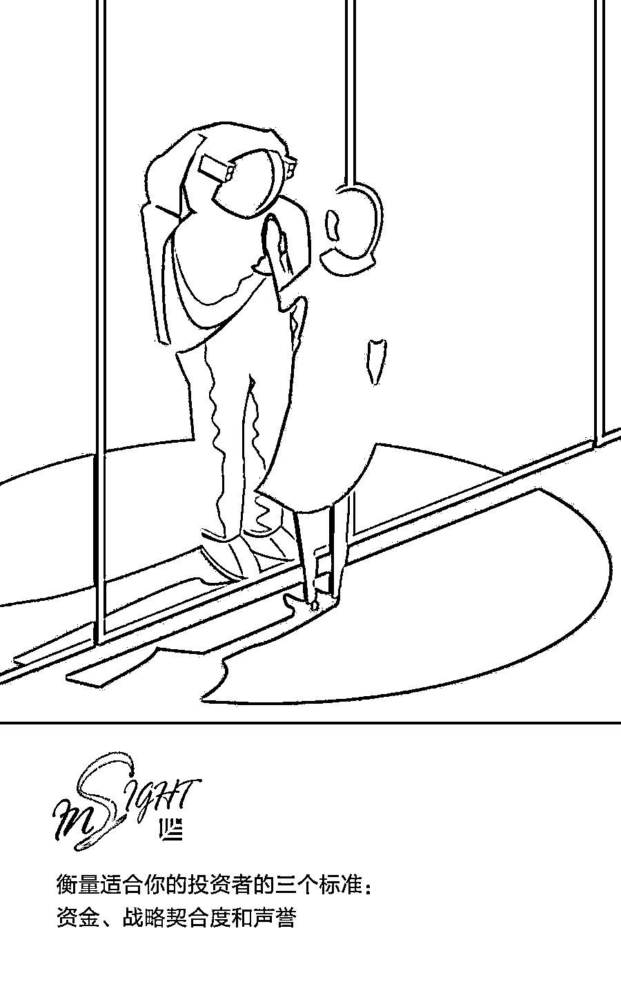
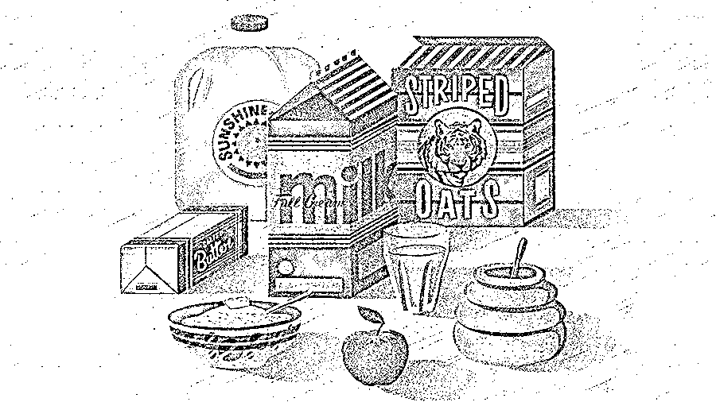
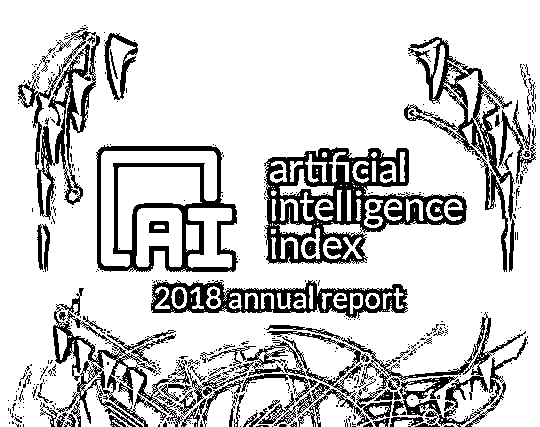

# 对号入座，你在 2019 年最适合创业的行业吗？| 红杉汇内参

> 原文：[`mp.weixin.qq.com/s?__biz=MzAwODE5NDg3NQ==&mid=2651226341&idx=1&sn=5c20ad078091f63ab8f5e1ded331a8ae&chksm=8080beb1b7f737a76d1b8036f148f13541c8d8400375d2e0df487847605b2ada4b4ac312a634&scene=21#wechat_redirect`](http://mp.weixin.qq.com/s?__biz=MzAwODE5NDg3NQ==&mid=2651226341&idx=1&sn=5c20ad078091f63ab8f5e1ded331a8ae&chksm=8080beb1b7f737a76d1b8036f148f13541c8d8400375d2e0df487847605b2ada4b4ac312a634&scene=21#wechat_redirect)

[ 编者按 ] 任何一次伟大的创业都必然发生在一个有巨大增长潜力的行业，如何判断行业的潜力以及自己是否能获得机会，就成了伟大创业者的第一块试金石。

作为以发展中的企业管理层为关注点的知名商业刊物，Inc.杂志通过分析最新数据、与专家对话来判断可能腾飞的行业，而判断的维度则包括了行业的增长性、竞争、市场挑战、不利因素、主要参与者和所需技能。

Inc.杂志指出，所有首次创业的人都有自己擅长的领域和优点，但如果创业者能够辨别具有独特增长优势的行业时，他们的创业将独具优势。

每期监测和精编中文视野之外的全球高价值情报，为你提供先人一步洞察机会的新鲜资讯和升级思维方式的深度内容，是为** [ 红杉汇内参 ]**。

** 内参**

对号入座，

**你在 2019 年最适合创业的行业吗？**

作者 / Emily Canal、Graham Winfrey

编译 / 洪杉

伟大的创业者往往能在一些不同寻常的行业发掘巨大的潜力。

尽管所有首次创业的人都有自己擅长的领域和优点，但创业者如果能够提前辨别具有独特增长优势的行业，那么创业就更有优势。

这正是 Inc.杂志整理出“最适合创业的行业”的方法。每年，Inc.杂志都会整理最新的数据、与行业专家交谈，以确定最有可能腾飞的行业。接下来我们一起看看，哪些行业未来最可能出现快速增长的初创公司。

**微型交通工具**

———

据联合国经济和社会事务部的数据，到 2030 年，预计将有超过 60%的世界人口生活在城市。微型交通工具产品将替代传统地面交通和公共交通，并广受欢迎。

福特在 2018 年 11 月斥资 1 亿美元收购了一家电动摩托车初创公司。投资者对这个行业的关注度骤升。

▨ **所需技能：**相关企业家需了解小型电池制造领域的最新技术进展，而提供运输设备的公司则必须开发软件来跟踪这些设备，并管理订阅服务。

▨ **市场挑战：**大规模制造微型交通工具需要大量资金投入。

▨ **不利因素：**微型交通工具大都面临着合法化的问题，很多地区限制了摩托车等交通工具。

▨ **竞争：**到 2020 年，将有包括微型汽车在内的 150 多款微型交通工具上市。

▨ **主要参与者：**包括 Bird 和 Lime 在内的电动摩托车巨头在 100 多个城市拥有车队。

▨ **增长：**2018 年前 10 月，全球投资者向电动摩托车和电动自行车公司投入了 37 亿美元，高于 2017 年全年的 28 亿美元和 2016 年的 3.43 亿美元。Navigant Research 预计，到 2025 年，全球电动自行车营收将从 2016 年的 157 亿美元增至 243 亿美元。

**数字疗法**

———

数字疗法可满足各种各样的医疗需求。已上市或仍在开发中的产品包括改善哮喘和慢性阻塞性肺病的软件程序，这些产品还被用于药物滥用门诊治疗的辅助治疗、小儿多动症和抑郁症的治疗。

▨ **所需技能：**初创公司需能够开发移动应用程序和交互式数字游戏等各类软件产品，并能在美国医疗行业的监管环境中游刃有余。

▨ **市场挑战：**通过美国食品药品监督管理局的测试来证明治疗的有效性是巨大障碍。

▨** 不利因素：**虽然医生可能会使用数字疗法，但保险公司是否会覆盖这些疗法还有待观察。如何给数字治疗产品定价也存在不确定性。

▨ **竞争：**2018 年，美国食品药品监督管理局就批准了大约 30 款数字治疗应用。

▨ **主要参与者：**Click Therapeutics 公司近期获得了制药巨头赛诺菲那 1700 万美元投资，治疗抑郁症和帮助人们戒烟的应用程序在早期试验中取得了不错的成果。

▨** 增长：**美国数字疗法市场在 2017 年价值 8.89 亿美元，预计到 2023 年将达到 44.2 亿美元。

**个性化营养**

———

基因蓝图可以帮助人们准确了解自己怎么才能进入最佳状态，帮助消费者做出定制、基于数据的饮食决定。

根据《科学》杂志上发表的一项研究，全球约有 1500 万人进行了基因检测。由于医疗行业的许多领域将重点从治疗转向预防，营养正成为预防疾病的最佳途径之一。

▨ **所需技能：**创始人应该具备食品和营养方面的专业背景，并且最好具备人类生物学、运动生理学、生命科学或行为心理学方面的专业知识。

▨ **市场挑战：**将营养学、人类生物学和行为心理学的核心要素整合到公司可能需要大量的资金投入。

▨ **不利因素：**政府机构尤其是卫生监管部门可能不允许企业涉及某些直接面向消费者的诊断性测试。

▨ **竞争：**有十多家个性化营养公司使用家庭测试包、问卷或可穿戴设备来跟踪健康数据。

▨ **主要参与者：**2018 年 11 月，Arivale 推出了一款名为“食疗”的营养师点播应用。用户可在五分钟内从注册营养师那获得关于营养和健康问题的答案。去年 4 月，族谱检测公司 Family Tree DNA 与基于 DNA 的保健和健康个性化服务公司 Vitagene 合作，为其客户提供保健产品。

▨ **增长：**据市场调研，全球基因检测市场预计将从 2018 年的 95 亿美元增长到 2024 年的 191 亿美元。到 2020 年，个性化医疗行业市场价值将达到 6000 亿美元。

**健康牛肉干**

———

当下流行的饮食潮流比如“生酮饮食法”（keto diet） 和 “原始人饮食法”（paleo diet）鼓励人们多吃蛋白质，少吃碳水化合物，人们对健康牛肉干的需求在快速增长。

一些初创公司尝试用新配方、新口味和优质的肉类重塑牛肉干，将牛肉干从不健康零食升级为优质主食。

▨ **所需技能：**行业研究公司称，这个行业的企业家应了解食品制备、饮食趋势以及美国农业部和美国环境保护署的食品法规。

▨** 市场挑战：**公司需要获得美国农业部和环境保护署的批准，并遵守他们的标准。此外，初创公司必须在零和的食品市场开辟空间，市场不会因为零食的种类多了而扩大。

▨ **不利因素：**高品质、不含抗生素的肉类对企业来说意味着更高的成本。

▨ **竞争：**虽然初创公司没有传统品牌那样的市场影响力，但有机、不含转基因成分和防腐剂的产品让它们在市场上崭露头角。

▨ **主要参与者：**比如 Krave，它在专业运动群体里很有影响力。

▨ **增长：**行业研究预测，牛肉干行业在美国的销售额预计将以每年 3.3%的速度增长，2022 年将达到 16 亿美元。

**婴儿科技**

———

智能健康追踪器可以监测成人的身体状况，这种科技需求正扩展到婴儿。初创公司正在研发生育跟踪、母乳喂养、甚至让婴儿睡觉的科技。

国际消费电子展开设了婴儿科技峰会，峰会组织者吉尔伯特说，最近有越来越多的产品帮助人们怀孕和跟踪生育过程。

▨ **所需技能：**创始人必须了解婴儿健康，并能够结合技术和营销专长。

▨ **市场挑战：**尽管婴儿科技产品有市场，但该行业的初创公司尚未吸引到大量风险资本。

▨ **不利因素：**想要在这个行业生存，公司必须不断改进现有产品，或者针对儿童护理的不同阶段发明新产品，以便与家庭建立长期的关系。

▨ **竞争：**该行业最大的四家公司占在线婴儿用品行业销售额的 40%左右，但这份行业报告中并未区分婴儿科技和普通婴儿产品。吉尔伯特说，婴儿科技行业竞争并不激烈，初创公司可以在婴儿护理领域瞄准更多方向。

▨ **主要参与者：**这一领域的顶尖初创公司包括生产便捷抽乳器的 Willow 公司；销售排卵追踪手环的 Ava 公司；以及尿布垫、智能体重称生产商 Hatch Baby。

▨ **增长：**美国在线婴儿用品市场 2022 年将实现 97 亿美元的收入，高于 2018 年的 74 亿美元。

**自拍服务**

———

一个配有摄像头、道具、能提供拍照提示的照相架，能帮助用户更好地拍照。这种新型的照相亭不需要参与者把自己塞进盒子里，就可以让人们拍出更棒的照片。

人们非常喜欢用照片和视频记录生活中的事件，以便在社交媒体上分享。一些企业正在利用这些照片进行营销，或者收集潜在客户的数据。

▨ **所需技能：**创业者必须精通技术和软件，能够轻松地将图片或视频直接传输给用户或社交平台。

▨ **市场挑战：**为这个行业构建硬件是很棘手的，摄像机设备必须高度可靠。

▨ **不利因素：**初创公司面临的问题是怎么让他们的 App 简便易学。大多数用户第一次使用新 App 后就不使用了，所以一定要关注 App 操作的用户友好度。

▨ **竞争：**这个领域有很多初创公司。一些公司正同时解决硬件和软件的问题，而另一些公司则专注于其中一个方面或者为必要平台争取上线的许可证。

▨ **主要参与者：**Simple Booth 公司——今年 Inc. 5000 榜单排名第 414 位的公司——同时生产软件和硬件，还有 Curator 和 Snappie。

▨ **增长：**这个新兴行业的市场价值还没有可靠的统计数据，但 2018 年，美国整个摄影行业的价值将达到 106 亿美元，2022 年有望增长到 112 亿美元。

**职场休闲服**

———

消费者喜欢时尚与舒适结合的衣服，方便他们出入办公室、健身房或其他任何地方。

越来越多的品牌开始生产适合办公室穿着的服装，比如领尖有纽扣的衬衫和休闲裤，它们的舒适性和耐用性与运动装不相上下。

▨ **所需技能：**需要把握时尚趋势、价格点以及可持续性，因为 80 后、90 后的年轻消费者喜欢有环保意识、社会责任感的公司。

▨ **市场挑战：**最大的障碍就是鱼龙混杂。

▨ **不利因素：**分销可能是企业面临的最大挑战之一，因此越来越多的大品牌选择直接面向消费者，它们正在削减成本，为消费者提供更低的价格。初创公司会面临更大的压力。

▨ **竞争：**太多公司正从运动休闲向工作休闲过渡，初创公司将与知名品牌正面竞争。

▨ **主要参与者：**ADAY、Ministry of Supply、Lululemon 等都是该行业的知名品牌。

▨ **增长：**这是一个新兴的领域，市场价值的统计数据很少。然而，一个好的迹象是初创公司融资明显增长，ADAY 有 300 万美元，Mizzen + Main 有 400 万美元，Ministry of Supply 则拿到了 1000 万美元的融资。

** 读数**

**4.5 倍**

刚刚发布的《AI index》年度报告公布了一系列有关全球 AI 发展的数据。该报告是由斯坦福大学主导，并由来自 MIT、OpenAI、哈佛大学、麦肯锡等机构的多位专家所组成的小组进行研究和撰写，从去年开始定期发布，全面追踪人工智能的发展现状和趋势。主要数据摘要如下：

▨ 美国的 AI 论文发布数量虽然不是第一，但美国学者论文被引用的次数却是全球第一，比全球平均水平高出 83%。

▨ 2018 年美国 AI 创业公司的数量，比 2015 年增长 2.1 倍。从 2013 年到 2017 年，美国 AI 初创企业获得的融资额增长了 4.5 倍，高于平均水平一倍以上。

▨ 中国 AI 的追赶速度惊人。清华大学 2017 年学 AI 和机器学习的学生数量，是 2010 年 16 倍。

▨ 基于经同行评议论文数据库 Scopus 的数据，2018 年发布 AI 论文最多的地区是欧洲（28%）、中国（25%）和美国（17%）。

▨ 与 2000 年相比，2016 年中国 AI 学者论文被引用的次数，提高了 44%。

▨ 中国一年的机器人部署安装量，从 2012 年到现在增长了 500%。

▨ 2017 年，全球机器学习人才需求已经是 2015 年的 35 倍。

▨ 全球 AI 发展提速但仍不均衡。

（回复“2018AI 报告”可查看、下载报告全文。）

** 情报**

#融资，不仅是融钱#

**科技创业公司融到“聪明钱”的 3 种方法**

对创业者来说，筹集资金比较有效的方法是：在与理想的投资者联系中占据主动。

▨ 投资者的专业性。专业投资者具有帮企业成长的经验、技术和专业知识，甚至可以把公司和其他公司组合起来，创建协同效应。

▨ **衡量投资者的三个标准：**资金、战略契合度和声誉。符合所有条件的理想投资人并不存在，创业者需要权衡。

▨ 最后接触最心仪的投资人。在 20 个最符合标准的投资人名单中，你可能很想去联系前几名投资人，但实际上应该从底部开始接触。这样当你联系更心仪的投资人时，你和你的方案已经经历了足够的锤炼。

#像埃隆·马斯克那样？#

**同时经营多家公司的科学之道**

平行创业的意义：对于雄心勃勃的、拥有强烈工作责任感的人来说，这是一种完成更多工作、实现更大价值的途径。

▨ 平行创业的成本很低。互联网工具极大地节约了成本。

▨ 平行创业不会耗费过多时间。《平行企业家》的作者瑞安·巴克利经营着多家公司，他认为：“处于萌芽阶段的公司非常适合平行创业模式，你可以同时逐渐发展起几家公司，其中任何一家都不会占用你太多时间。”

▨ 平行创业增加了成功的几率。就像是在赛道上往好几匹马身上下注。可以利用数字服务和众包服务来测试新想法，经营多家企业实际上比只经营一家风险小。

▨ 风险：精力可能被耗尽。是否拥有同时管理两个复杂创业公司的能力很重要。平行创业适合那些擅长处理多任务和擅长管理时间的人。** **

** 推荐阅读**

壹

[总结 20 年经验教训：每家公司都能找到价值创造之路 | 红杉汇内参](http://mp.weixin.qq.com/s?__biz=MzAwODE5NDg3NQ==&mid=2651226281&idx=1&sn=58880574ed2e885672b43c67d6a764dd&chksm=8080befdb7f737eb00eb72190947828d4afad8610ab6f9b6e1c146e9e14208d73c74d6047553&scene=21#wechat_redirect)

贰

[创业企业的扩张=向下授权的扩大 | 红杉汇内参](http://mp.weixin.qq.com/s?__biz=MzAwODE5NDg3NQ==&mid=2651226255&idx=1&sn=b8f02e1cc1c52bf8402bee56d0b58217&chksm=8080bedbb7f737cdbfab4d1d5debbb0d2efc2329457824bfd335ead4e3a8ac68227e13a5428d&scene=21#wechat_redirect)

叁

[只要一个问题，就能帮你判断出产品与市场的契合度 | 红杉汇内参](http://mp.weixin.qq.com/s?__biz=MzAwODE5NDg3NQ==&mid=2651226183&idx=1&sn=de1c656134b6212429127e8dfa314fb7&chksm=8080be13b7f7370538c6a14e314657c689a190f0881dd108a48740fa20b0da86b29292eea44c&scene=21#wechat_redirect)

肆

[「红杉汇内参」百期特刊｜我们做了 50 万字的分词分析，只为给你一个创业的锦囊福袋](http://mp.weixin.qq.com/s?__biz=MzAwODE5NDg3NQ==&mid=2651226152&idx=1&sn=482208df50e82f189f09f94b30ee96d0&chksm=8080be7cb7f7376abd458f1850b8b92a88972b1dfd130ab586ce7a9bcdaa5f7ce23a6bbf1d26&scene=21#wechat_redirect)

伍

[新手创业“套路”深：钢铁执行力是如何炼成的｜红杉汇内参](http://mp.weixin.qq.com/s?__biz=MzAwODE5NDg3NQ==&mid=2651226066&idx=1&sn=1578613f2a3cd0a0f1f7b98fe2ec5b59&chksm=80804186b7f7c890f077f614176c64b5f99eba24207dde89a98603cf33d922a870d57dae1108&scene=21#wechat_redirect)

