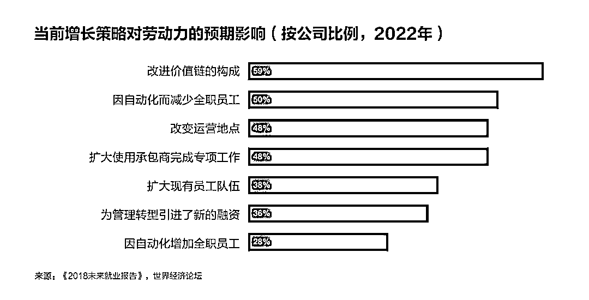
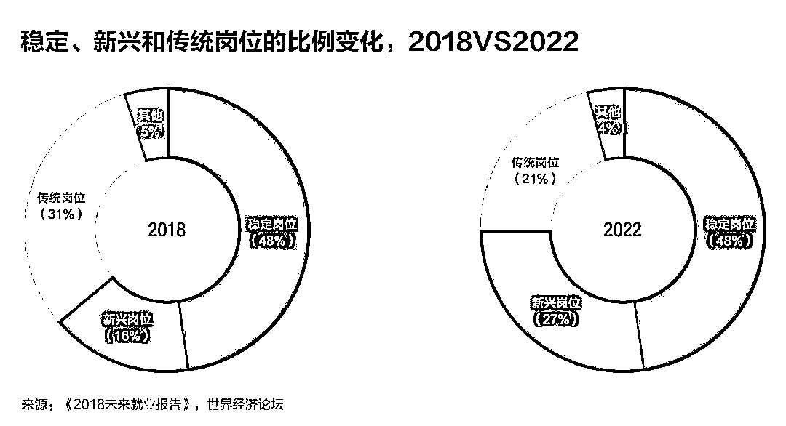
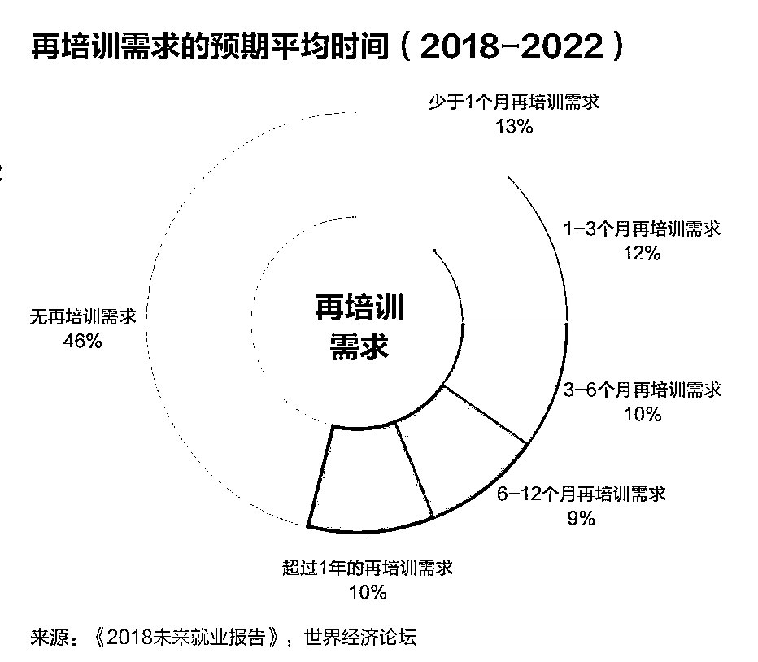
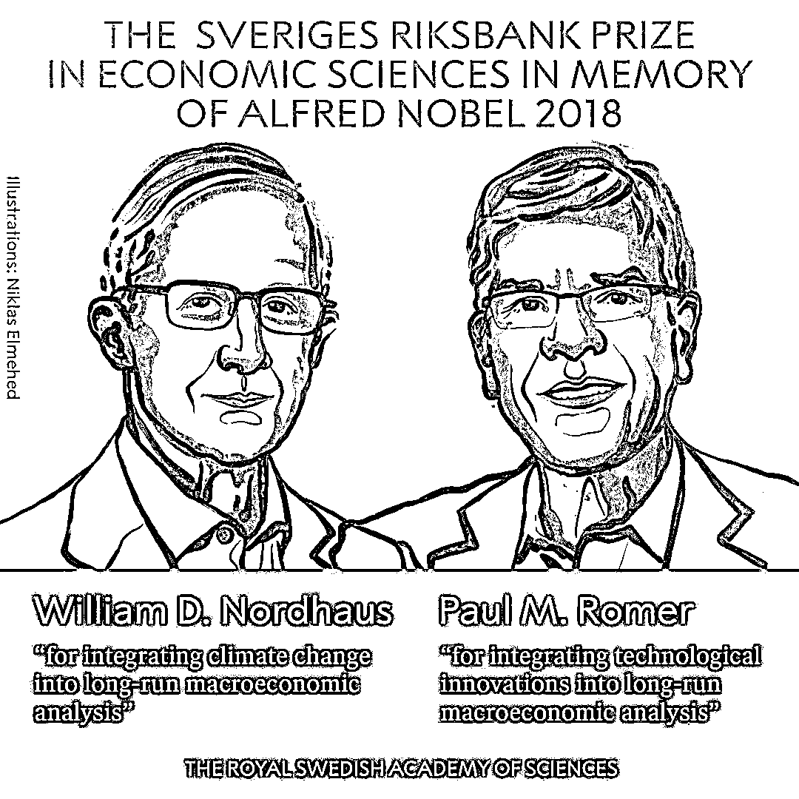
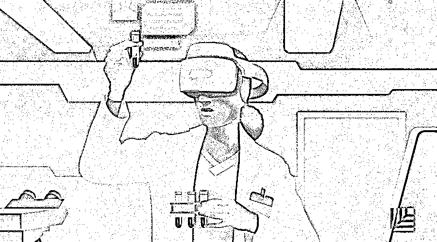

# 世界经济论坛报告：关于未来工作的 12 个趋势判断｜红杉汇内参

> 原文：[`mp.weixin.qq.com/s?__biz=MzAwODE5NDg3NQ==&mid=2651225721&idx=1&sn=1b7f0ad694fa1d6263860eb6df3cffad&chksm=8080402db7f7c93b0e79fe1cf2599500942dc9646e2b5d1fde4472546a905b686c4368c9bd0c&scene=21#wechat_redirect`](http://mp.weixin.qq.com/s?__biz=MzAwODE5NDg3NQ==&mid=2651225721&idx=1&sn=1b7f0ad694fa1d6263860eb6df3cffad&chksm=8080402db7f7c93b0e79fe1cf2599500942dc9646e2b5d1fde4472546a905b686c4368c9bd0c&scene=21#wechat_redirect)

[ 编者按 ] 未来还有多少工作留给人类？

人工智能、无人驾驶、算法……这些科技名词不仅每天都在冲击着人们对世界的认知，也正在冲击着每个人的工作。

埋头工作的各位需要把目光投向未来。世界经济论坛近日发布了《2018 未来就业报告》（The Future of Jobs Report 2018），它虽然不能提供未来就业的解决方案，但却是政府、企业、员工关于未来就业市场的一份指南，它不仅关乎每一个人的职业发展，也关乎所有企业的人力资源战略，更关乎整个社会的繁荣与进步。

这就是，面对自动化的趋势、人工智能的勃兴、人机边界的变化等挑战，所有人都需要有灵活学习的思维模式，才能找到能让人创造更大价值的工作。

每期监测和精编中文视野之外的全球高价值情报，为你提供先人一步洞察机会的新鲜资讯，为你提供升级思维方式的深度内容，是为 **[ 红杉汇内参 ]**。

** 内参**

**关于未来工作的**

**12 个趋势判断**

来源 /世界经济论坛

编译 / 洪杉

随着技术的突破性发展，在工作当中，人类与机器和算法的界限不断发生变化。全球劳动力市场正在经历重大变革。如果管理得当，这些变革会带来一个新时代，工作和职业变得更有创造力，所有人生活质量将显著提高；反之，如果管理不善，就会拉大技能差距，加剧不平等和两极分化。

在第四次工业革命浪潮中，企业寻求可以利用的新技术，以提高生产效率和消费水平。然而，为了让第四次工业革命发挥变革潜力，需要所有行业和地区的领导人制定全面的劳动力战略，从而在加速变革和创新的时代更好地迎接挑战。

这份报告发现，随着劳动力转型加速，留给企业和高层主动采取应变管理策略的时间窗口正在加速关闭。企业、政府和管理者必须积极规划、实现全球劳动力市场的新蓝图。报告的主要发现包括：

▨ **变革的驱动力：**四大技术进步——无处不在的高速移动互联网、人工智能、大数据分析的广泛应用和云技术——作为业务增长的有利驱动因素，将在 2018 年至 2022 年占据主导地位。这些变革伴随着一系列的社会经济趋势，与新技术的传播一起推动商机。这些社会经济趋势包括：国民经济增长轨迹出现变化；教育和中产阶级的扩大，尤其在发展中国家；新能源技术带来的全球性绿色经济运动。

▨ **技术应用的加速：**到 2022 年，85%的公司将广泛采用大数据技术来分析用户，并且让商业更加智能。同样，绝大多数公司可能已经扩大技术应用，比如物联网、手机软件和网络支持的消费行为，并且广泛使用云计算。机器学习、增强现实、虚拟现实也将获得可观的投资。

▨ **自动化趋势：**报告估计，2018 至 2020 年，仿人机器人的使用仍然有限，但越来越多的新机器人已经或正在商业化，除了机器算法和人工智能外，还包括机械型陆用机器人和全自动无人机。机器人的使用率在各个行业之间存在显著差异，在不同产业中，有 23%至 37%的公司计划进行这项投资。相比人形、空中和水下机器人，企业最有可能采用固定式机器人。而金融服务行业领导者最有可能在 2022 年前使用仿人机器人。

▨ **改变地理位置：**59%的企业领导人预计，到 2022 年，他们将通过改变价值链的构成，大大改变生产和分销的方式，近一半的企业领导人预计将重构全球运营布局版图。决定工作地点时，74%的公司会把“是否可以招聘到更多的本地技术人才”视为关键考虑因素，64%的公司将劳动力成本作为主要考虑因素。其他因素如当地劳动法的灵活性、产业集聚效应或原材料的接近性，会显得不那么重要。

▨ **改变就业类型：**近 50%的企业预计，到 2022 年，自动化进程将导致全职员工的数量有所减少。超过四分之一的企业预计，自动化进程会促进企业的角色创新。此外，企业将扩大与承包商的合作，让承包商完成许多专项任务。许多企业打算更灵活地雇用员工，更多采用远程办公，实现业务的去中心化。

▨ **人机边界变化：**报告预测，在 2018 年到 2022 年之间，在现有工作任务中，人和机器的边界将发生重大变化。2018 年，在报告涵盖的 12 个行业中，人类的平均工作时间占 71%，机器占 29%。到 2022 年，预计人类的平均工作时间占比 58%，而机器达 42%。2018 年，就总工作时间而言，还没有一项工作任务是由机器或算法主导完成。到 2022 年，机器和算法对特定任务的平均贡献增加到 57%。例如，如今 46%的信息组织、数据处理以及信息搜索、传输任务由机器完成，而到 2022 年，这一比重将达到 62%。

▨ **乐观的就业前景：**对新机会和就业增长的乐观估计抵消了就业下降的影响。

接受调查的公司总共有 1500 多万名员工，这些公司目前估计将减少 98 万个工作岗位，增加 174 万个工作岗位。到 2022 年，由于人机劳动分工变化，7500 万个工作岗位可能被取代，同时有 1.33 亿个新岗位出现，这些新岗位更适应新的劳动分工。然而这些预测和其背后的假设应谨慎对待，主要是因为它们仅反映全球就业市场变化的一小部分，代表着劳动力转型变化的两面：

1.许多岗位实现自动化或变得多余，将会大规模消失。

2.新技术的应用和社会经济的发展，将促进新产品和服务的大规模增长，带来新工作机会。

▨ **新兴热门岗位：**到 2022 年，企业对现有岗位中的数据分析师和科学家、软件和应用程序开发人员、电商和社交媒体专家的需求会与日俱增，这些岗位在很大程度上伴随新技术使用而出现，并利用新技术来提高价值。需求还有望增加的岗位是掌握特殊“人类”技能的岗位，如客户服务、销售和营销专业人员，以及培训与发展领域、人类和文化领域的专家。此外，企业越来越需要大量新技术专业人员，如人工智能和机器学习专家、大数据专家、用户体验和人机交互设计师、机器人工程师和区块链专家。

▨ **技能不稳定性提高：**人类劳动力和机器人在劳动力市场所占比例不断变化，这也改变了现有的工作职能。受访的绝大多数雇主预计，截至 2022 年，胜任多数工作所需的技能会发生明显改变。全球平均技能稳定率（即胜任同样工作所需的核心技能比例）约为 58%。也就是说，在 2018-2022 年间，所需的劳动力技能平均转变率为 42%。

▨ **再培训的迫切性：**至 2022 年，至少有 54%的雇员需要学会新的重要技能或提升自己的技能。 

对一些技能的需求会显著上升，包括分析思维、创新以及自主学习和学习策略。技术设计和编程类技能愈加重要，然而，熟练操作新技术只是 2022 年技能等式的一部分。“人类”技能包括创造力、原创性和主动性、批判性思维、说服力和谈判能力。同这类技能一样，关注细节、适应性、灵活性和解决复杂问题的能力也会提升自己的价值。情商、领导力、社会影响力以及服务导向意识，在未来会变得更加重要。

▨ **弥补技能缺陷的现有策略：**因采用新技术而导致技能缺陷扩大，怎么办？企业可能会用三种方案来解决这一问题：聘用全新的、已掌握与新技术相关技能的长期员工、试图让有关工作完全自动化、再培训现有员工。但是，约 1/4 的企业尚未决定、或不太可能再培训现有员工，2/3 的企业希望员工能在跳槽期间适应并学习技能。1/2 至 2/3 的企业可能会转向让外包公司、临时工和自由职业者来弥补技能缺陷。

▨ **学习新技能和提升已有技能的机会不足：**雇主表示，对于目前很有价值的员工，他们会优先考虑并培训其尽快掌握新技能。54%的企业表示他们想吸引重要岗位员工，而 53%的企业则想吸引会使用相关新技术的前沿岗位员工。而且，41%的雇主强调要让高绩效员工学习新技能，然而，对于那些最有可能受到技术影响的高风险员工，愿意优先考虑他们的企业则少很多，只有 33%。换言之，最需要学习新技能和提升技能的员工，反而最不可能接受这类培训。

新技术、工作和技能之间有复杂的反馈循环。新技术能带动企业增长、创造新的就业岗位并提高对专业技术的需求，但新技术也会取代那些变得过时或自动化的岗位。技能差距既存在于员工之间，也存在于企业领导层之间，在一些情况下它能推动自动化的需求，也会给采用新技术造成障碍，从而阻碍企业发展。

此次调查结果表明，企业需要一种全面的“增强策略”，即：让一些工作变得自动化的同时，来突出和增强人类劳动力的比较优势，最终让员工发挥自己的全部潜力。这一增强策略不只是关注因自动化而减少的劳动力成本，还要考虑哪些工作适合人类创造更大价值——这些工作通常与技术相辅相成。

然而，为了实现这一美好愿景，员工要掌握适当的技能，还要接受再培训。因此，精心构建公司内部的终身学习体系、投资于人力资本以及广泛的合作，都应是企业的首要任务。

** 人物**

**威廉·诺德豪斯和保罗·罗默**

他们成为 2018 年诺贝尔经济学奖的获得者，以表彰他们将“气候变化与技术创新纳入长期的宏观经济学分析”。

经济学所处理的核心问题是对稀缺资源的管理。**自然**决定了制约经济增长的主要因素，而我们的**知识**决定着我们能如何应对这些制约因素。今年的两位获奖者通过构建用以解释市场经济与自然和知识间相互作用的模型，大大地拓宽了经济分析的范围，以解决我们这个时代所面临的一些最基本、最紧迫的问题——我们如何才能创造出长期可持续的经济增长？

*点击文尾左下角的“阅读原文”，可取阅完整报告（英文版，PDF）

** 情报**

#除了规模庞大以外#

**你的品牌真的与众不同吗？**

▨ 朋友和家人对你的公司表示羡慕。如果你和你的员工经常被热情的朋友和家人们询问有关工作的问题，说明你的品牌很与众不同。

▨ 你在媒体上的花费更少。如果你在广告和媒体宣传上的花费几乎为零，或比竞争对手要少，或随着客户增长而减少——那你的确与众不同。

▨ 员工喜欢为你工作。特别的企业不仅通过创造体验或愿望来让顾客产生购买欲，还创造了能激起员工归属感的公司环境。

▨ 将顾客对产品的购买欲转变为一种必不可少的新需求。当 iPhone 于 2007 年发布时，苹果公司将顾客的购买欲——哦，这些产品太酷了，我真想要一个！——转变为需求的目标达成了。

#每一项都应该得诺贝尔医学奖#

**医学领域的五大顶级技术创新**

▨ 癌症纳米疗法。纳米治疗装置在治疗癌症方面具有更高的精确度和更低的总成本，并因此大受欢迎。

▨ 脑机接口。一种外部设备，能够将神经信息转换为外部硬件（如机械臂）可解读的指令，对机械义肢有很大帮助。

▨ 电子阿司匹林。一种电子植入物，会产生电荷刺激神经细胞，以阻止信号被发送到大脑中，从而防止偏头痛和头痛发作。

▨ 无针糖尿病护理法。一种可以用传感器贴片取代针刺的技术，可以在不刺破肌肤的情况下检测血液分析物。

▨ 机器人检查技术。可在医院常规巡逻、查看患者的状态、管理患者病情数据图表，专为医疗服务资源不足的偏远诊所而生。** **

** 推荐阅读**

壹

[4 个 X 要素告诉你，伟大领导者和优秀领导者的差别 | 红杉汇内参](http://mp.weixin.qq.com/s?__biz=MzAwODE5NDg3NQ==&mid=2651225616&idx=1&sn=a16ffd468d319865b4dce414a65dd693&chksm=80804044b7f7c952fb4502afa2afbebbc08d0b9f52466415aee577ad7e3ea0a4f92bd722748b&scene=21#wechat_redirect)

贰

[比想象更快，开始依赖虚拟现实的 7 个行业 | 红杉汇内参](http://mp.weixin.qq.com/s?__biz=MzAwODE5NDg3NQ==&mid=2651225582&idx=1&sn=4d5dd23f7095da37881e259f10de2f3f&chksm=808043bab7f7caac24f459baa12cd46e1b11e62b7a872b625199e88054356b927521cfed9a5c&scene=21#wechat_redirect)

叁

[未来，你的健康将由 AI 做主 | 红杉汇内参](http://mp.weixin.qq.com/s?__biz=MzAwODE5NDg3NQ==&mid=2651225547&idx=1&sn=2963478adcd0f2814acd0d5f4adc3eb4&chksm=8080439fb7f7ca89a0e28338e844b0eea9ed608357cc4a0a69e76cff0ebc1b74541e9e11a9b1&scene=21#wechat_redirect)

肆

[自测：你是那个值得员工信任的领导者吗？ | 红杉汇内参](http://mp.weixin.qq.com/s?__biz=MzAwODE5NDg3NQ==&mid=2651225510&idx=1&sn=b5f833b59d40c5ceb20bce70218b3e49&chksm=808043f2b7f7cae4b170a7530327a8d39af6df1f325aa1d681e2d12f500e17d0b61d097878c6&scene=21#wechat_redirect)

伍

[殿堂级商业领袖留下的 6 条最佳商业建议｜红杉汇内参](http://mp.weixin.qq.com/s?__biz=MzAwODE5NDg3NQ==&mid=2651225455&idx=1&sn=8e5f288e8aff4d59e46122914148ba3f&chksm=8080433bb7f7ca2d1d5c5c691b76d964850254c6a6bfdedc48bbf36cf5df14a8dbf66400abda&scene=21#wechat_redirect)

