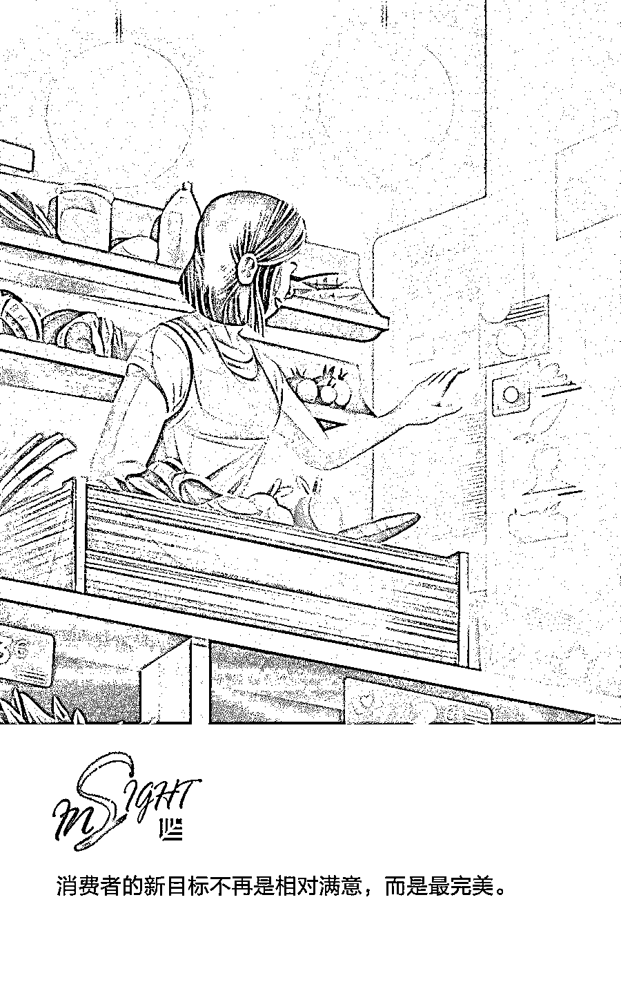
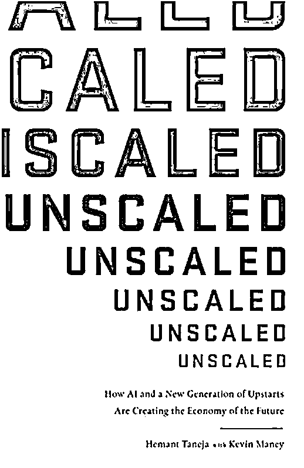

# 去规模化：人工智能和新一代企业如何创造未来经济 | 欧美新书推荐

> 原文：[`mp.weixin.qq.com/s?__biz=MzAwODE5NDg3NQ==&mid=2651225606&idx=1&sn=519e2e3c2baca63eac6b7cd23fc454ae&chksm=80804052b7f7c944572fbeeb67830464bcee38391235988319850a8bbb57fb54c87a40c5a5db&scene=21#wechat_redirect`](http://mp.weixin.qq.com/s?__biz=MzAwODE5NDg3NQ==&mid=2651225606&idx=1&sn=519e2e3c2baca63eac6b7cd23fc454ae&chksm=80804052b7f7c944572fbeeb67830464bcee38391235988319850a8bbb57fb54c87a40c5a5db&scene=21#wechat_redirect)

过去，大众市场消费品牌一直在说服我们追求流行，渴望其他人拥有的东西。星巴克、GAP 等品牌的最大优势是能为全世界的消费者提供完全相同的体验。但技术的革新让每个人越来越倾向于个性化的产品和体验，甚至开始追求“绝对完美”，这让企业未必越大越好。

风险资本家赫曼特·塔内加（Hemant Taneja）与作家凯文·马尼（Kevin Maney）在二人合著的《去规模化：人工智能和新一代企业如何创造未来经济（Unscaled：How AI and a New Generation of Upstarts Are Creating the Economy of the Future）》一书中认为，人工智能与其催生的技术浪潮，使得高度专注的小型创新企业能够与传统的老派规模经济进行有力抗衡，他们称之为“去规模化”。而规模定制的未来掌握在独立创造者手中，新兴企业能够为针对性强的市场和个性化需求强的用户提供全新体验。

** **

**Unscaled**

How AI and a New Generation of Upstarts Are Creating the Economy of the Future

Hemant Taneja，Kevin Maney **/ 著**

Piatkus 2018 年 3 月

**科技催生“去规模化”**

一个世纪以来，大众市场的消费品牌常常令我们随波逐流。我们一直都在购买星巴克咖啡、GAP 牛仔裤等标准化的产品，它们的设计初衷和优势是尽可能多地吸引消费者，并给予全世界的消费者完全相同的消费体验。但现在，情况似乎发生了转变，我们不再想和别人买一样的东西，而科技也使得个性化成为可能。私人定制公司和提供 3D 打印服务等新兴公司都在重新定义一个新的时代，使我们每个人都得到心之所想：专属一人而非众人皆有的产品和消费体验。

Protolabs 是一家原型定制和按需生产零部件的制造商，它的首席执行官维姬·霍尔特（Vicki Holt）表示：“对个性化产品和大规模定制的需求是趋势，且将持续发力。今天，企业需要令自己的产品与众不同，售得高价，与消费者建立联系。正如传统汽车制造行业走向末路时，黑色福特 T 型汽车带来流水装配线一样，如今具有一定规模的定制也同样是时代所需。”

作家凯文·马尼（Kevin Maney）与风险资本家赫曼特·塔内加（Hemant Taneja）在合著的《去规模化（Unscaled）》一书中对行业大势做出了预期，消费者市场的转变是其中一环。这并非是初创企业在妨碍老牌企业，而是人工智能与其催生的技术浪潮，使得高度专注的小型创新企业能够与传统的老派规模经济进行有力抗衡，他们称之为“去规模化”。

人工智能能够进行学习，了解单个消费者，因此，小企业可以专门针对那些个性化需求强但潜力巨大的市场，甚至是整个市场，通过进行针对性的生产和服务从中获利。

**规模定制的未来**

**掌握在独立创造者手中**

传统的办法通常是凭借工厂规模大、分销网络庞大、商店货架占位多等规模化优势致胜，但现在，这些越来越成为一种麻烦和负担。例如，在剃须刀行业，尽管宝洁拥有丰富资源，但还是在与 Dollar Shave Club（一家主打剃须刀产品的美国独角兽企业）这类灵活度更高的新兴企业竞争时，丢掉了市场份额。这些新兴企业免去了供应商和承包商，能直接面对消费者，上市速度也更快，能够针对一个较窄的市场为新用户提供全新体验。凭借这些优势，它们可从当下的市场占有者手中抢走大量的市场份额。

从 Stitch Fix（美国时尚电商）的例子中也可以看出更为个性化的消费者体验是如何奏效的。Stitch Fix 由卡特里娜·莱克（Katrina Lake）成立于 2011 年，它将人工智能与人力结合，可为每一位消费者提供定制造型。Stitch Fix 销售的产品是大规模生产的，但服装风格和尺寸却都是为每位消费者量身定制的。

Stitch Fix 的新用户首先要完成一份在线风格特写，说明自己的尺寸、身材，回答一些问题，透露一些有关自己生活方式的信息，比如“你从事什么职业？”、“你有孩子吗？”。然后造型师会根据你的风格特写选出五件衣服寄出。消费者可以购买自己喜欢的衣服，然后把其他的衣服寄回去，而人工智能又可以根据这些衣服的选取情况，加深对消费者风格的了解。每隔几周，具体间隔由用户设定，Stitch Fix 都会重新寄出一批衣服，这些衣服会被消费者留下或寄回。借助这些交易，软件可以了解消费者的个人喜好，长此以往，它们甚至可以更好地为造型师提供指导，使造型师寄出的衣服正对用户的胃口。

现在，Stitch Fix 的评价毁誉皆有，它在 Facebook 上的得分只有 3.6 星（满分 5 星）。但即便这个模型并非十全十美，它仍是规模定制的一个案例，可以代表一种趋势。衣服或许不是定制的，但消费体验绝对是。Stitch Fix 的目标是了解消费者，找到适合他们但他们本人可能并不自知的衣服。过去，只有依靠私人采购员这种需要付出大量人力的方式才能实现这种愿景。人工智能和数据在消费者与企业之间建立了一种私人关系，尽管这种关系并不是真实存在，但也正因如此，这种私人订制才更可能实现大规模发展。

另一个案例就是去规模化的消费者产品将借助 3D 打印成为现实。目前，3D 打印尚在萌芽阶段。但也许十年之内，你订购的新鞋或新椅子就不再是出自大规模生产的偏远工厂。与之相反，许多公司会按照订购情况进行小规模的定制化生产。

3D 打印定制平台 Shapeways 成立于 2007 年，借助上述设想，它已经筹得 1 亿多美元的资金，其中包括今年年初筹得的 3000 万美元。Shapeways 可以向任何一个有设计内容或在设计上需要帮助的用户提供 3D 打印服务。下一步，Shapeways 希望帮助特定行业内的创造者，对他们的产品进行包装和营销，同时为消费者提供服务。2018 年 4 月，Shapeways 的首席执行官格雷格·克雷斯（Greg Kress）说： “我们相信，规模定制的未来掌握在独立创造者手中。3D 打印这一生产技术只是实现这一目标的驱动力。”

**“满意度法则”正在被抛弃**

人工智能、数据和 3D 打印的结合使得企业可以加深对单个消费者的了解，然后为他们提供或者打造专属产品。如果你可以在自己的专属产品和大众产品之间做出选择，你会选择哪一个呢？

普华永道的一项研究指出：“今天的消费者，尤其是年轻消费者，正在抛弃根深蒂固的‘满意度法则’。该术语由经济学家赫伯特·西蒙（Herbert Simon）提出，指由于可接触到的事物有限且缺乏信息，消费者倾向于满足于‘足够好’，而不再去追求‘绝对完美’。情况已经发生转变；消费者的新目标不再是相对满意，而是最完美。如今，绝对完美似乎已经触手可及。”

随着“去规模化”这一趋势的持续发展，像星巴克、GAP、苹果这类巨头公司将必须要作出调整。大规模所带来的优势正在渐渐失色。

在去规模化的新时代，如果一个小公司目标明确，把个体消费者和消费者体验视为一切工作的中心，那么在与那些对消费者不加以区分、面向大众市场的公司进行竞争时，它们获胜的可能性会更大。** **

** 推荐阅读**

壹

[“破碎的星球”变出雨果奖“帽子戏法” | 欧美新书推荐](http://mp.weixin.qq.com/s?__biz=MzAwODE5NDg3NQ==&mid=2651225568&idx=1&sn=4aa51751abae4ac60055f9270a7aad99&chksm=808043b4b7f7caa230fb732c09dfede5d54ef607b868242c4c3337e0c09ef85fbf20b74d46a8&scene=21#wechat_redirect)

贰

[初创公司如何利用同理心取得商业成功？| 欧美新书推荐](http://mp.weixin.qq.com/s?__biz=MzAwODE5NDg3NQ==&mid=2651225470&idx=1&sn=807b3aa94bb0f603c23ae5b710df414e&chksm=8080432ab7f7ca3cd61d2cec943f5d9dae04b9b50dcd6fd1cf3d0141690afbc932f07e2817a4&scene=21#wechat_redirect)

叁

[终极书单：50 本书帮你理解宇宙万物 | 经典重读](http://mp.weixin.qq.com/s?__biz=MzAwODE5NDg3NQ==&mid=2651225445&idx=1&sn=6d3c9563a25fa8c482b68e22bcc02513&chksm=80804331b7f7ca2720335a3225d225e6f13a77460d22de527c8422423f140f7aee1f1f7659e5&scene=21#wechat_redirect)

肆

[让创业置之死地而后生的决策智慧是什么？| 经典重读](http://mp.weixin.qq.com/s?__biz=MzAwODE5NDg3NQ==&mid=2651225407&idx=1&sn=3033f8f2e8d424c48085d37c46345bda&chksm=8080436bb7f7ca7dd8ec35a8f7fd49775e2627f4735dc825cbafcf8f8aed08c31f46cd29ca5f&scene=21#wechat_redirect)

伍

[灾难性风险是永远悬在管理层头上的达摩克利斯之剑 | 欧美新书推荐](http://mp.weixin.qq.com/s?__biz=MzAwODE5NDg3NQ==&mid=2651225375&idx=1&sn=3e719d99beb895498d8657469c65c13c&chksm=8080434bb7f7ca5d8ec061d9fbbc019d9d9c92d8f96df1474b8c551b4cc5763f8464f3c61840&scene=21#wechat_redirect)

