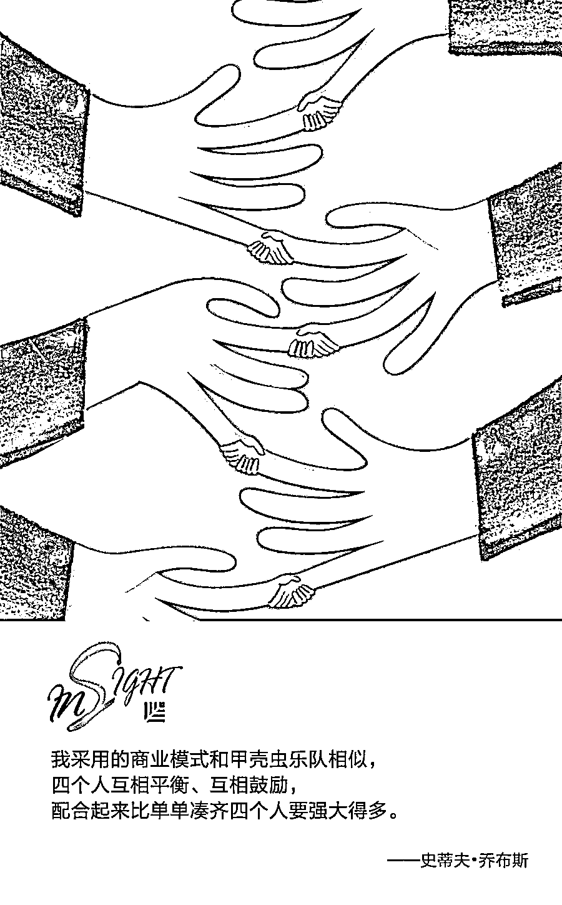
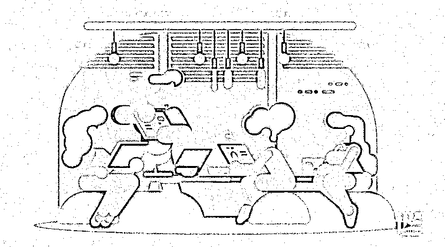
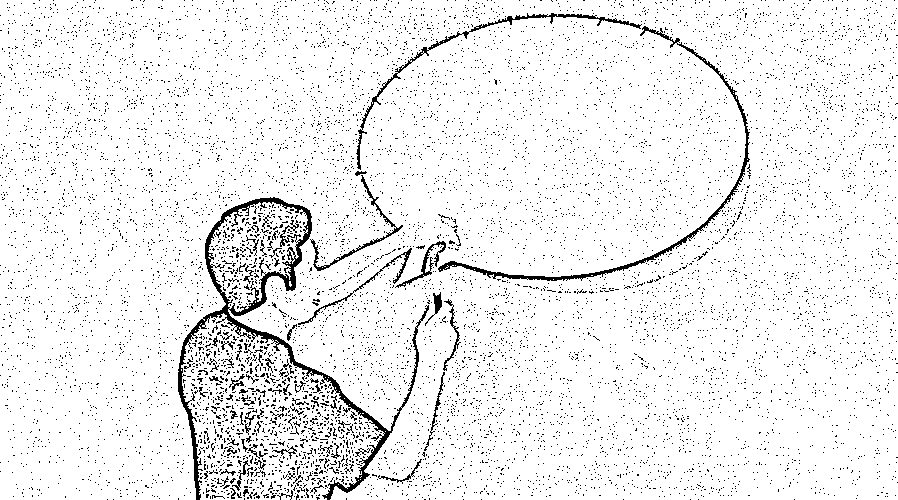

# 比想象更快，开始依赖虚拟现实的 7 个行业 | 红杉汇内参

> 原文：[`mp.weixin.qq.com/s?__biz=MzAwODE5NDg3NQ==&mid=2651225582&idx=1&sn=4d5dd23f7095da37881e259f10de2f3f&chksm=808043bab7f7caac24f459baa12cd46e1b11e62b7a872b625199e88054356b927521cfed9a5c&scene=21#wechat_redirect`](http://mp.weixin.qq.com/s?__biz=MzAwODE5NDg3NQ==&mid=2651225582&idx=1&sn=4d5dd23f7095da37881e259f10de2f3f&chksm=808043bab7f7caac24f459baa12cd46e1b11e62b7a872b625199e88054356b927521cfed9a5c&scene=21#wechat_redirect)

[ 编者按 ] 虚拟现实技术，对今天的创业者而言并不陌生。过去，这一技术大多应用于医疗、训练等领域，如医生远程操作手术，或者飞行员在模拟器中联系飞机驾驶。但今天，虚拟现实技术正在深入普通人的日常生活。一些新兴科技公司正在探索利用虚拟现实技术，满足购房者足不出户参观样板房的需求；谷歌纸盒等创新产品使得老师可以不用离开教室，就带着同学们到世界各地进行实地考察，甚至逃离地球，跑到外太空去。

每期监测和精编中文视野之外的全球高价值情报，为你提供先人一步洞察机会的新鲜资讯，为你提供升级思维方式的深度内容，是为 **[ 红杉汇内参 ]**。

** 内参**

**开始依赖虚拟现实的**

**7 个行业**

作者 / Andy Heikkila

编译 / 洪杉

科技发展日新月异，那些我们孩童时期看过的科幻小说情节正在变成现实。例如，自动驾驶汽车走进我们的生活，可以装进口袋的触屏笔记本电脑也出现了。虚拟现实技术的普及程度越来越高——事实上，正是因为这样，各行各业也开始对虚拟现实技术格外依赖。

下列七个行业常常借助虚拟现实的创新应用，将想法变为现实，或准备把想法应用到实际生活中。

**建筑和房产业**

即便现在手绘建筑设计稿还没有彻底成为历史，但这一天的到来也不远了。如今的建筑师在进行设计时，对 3D 软件的应用日益娴熟，这使得他们可以将设计范围延伸到建筑的外观之外，对建筑内部进行设计。这不仅对设计师是件好事，对房产经纪人和购房者也是如此。

许多新兴科技公司正在探索利用虚拟现实技术，为购房者提供全方位的虚拟现实体验。借助这项技术，购房者可以首先按照价格、位置、房间数目等条件进行搜索，然后进入虚拟现实，参观满足条件的房屋。这种新型的房产技术可以彻底改变购房方式。

**度假服务和旅游业**

虚拟现实技术可以让购房者在家就舒舒服服地看新房、找新家，同样，它也可以让游客在度假前就对度假地仔仔细细地看上一遍。一些人甚至会利用这一技术来为整个假期增色！

目前，虚拟现实技术在度假服务业中最为常见的应用就是借助 360 度全景视频创造虚拟旅行体验。借此，用户可对旅行中的各个方面进行虚拟体验，从乘坐航班到抵达目的地后参观一些重要景点。

对于许多想要提供娱乐和沉浸式体验的服务供应商来说，虚拟现实技术无疑正中下怀。用户体验虚拟世界时，企业就会开始借助虚拟方式做广告，用虚拟市场营销、公关项目和增强版的“现实”来吸引消费者。最终，虚拟现实技术不仅会在旅游度假领域得到应用，更是会融入到教学这类日常工作中。

**教育和学习**

全世界的教育工作者都正把目光投向虚拟现实技术，借此为学生带来沉浸式体验。与虚拟现实技术在度假旅游业的应用一样，谷歌纸盒等创新产品使得老师可以不用离开教室，就带着同学们到世界各地进行实地考察，甚至逃离地球，跑到外太空去。

一些人认为，教室本身就将经历一场虚拟大变革，它将完全变为在线模式。事实上，互联网和双向摄像头可以协助远程学习和远程工作。然而，随着在线学习的发展，虚拟现实技术赋予了学生更多选择，使他们的学习体验更为丰富，沉浸式体验的效果更好。

**飞行和跳伞**

虚拟现实技术在军事训练中的应用可能不计其数， 其中一些还被隐藏在了一册册的机密文件中，不为世人所知。但这项技术最主要的还是被应用在跳伞和飞行项目上，且它的功能不止局限于军事训练设施。一些其他训练也在逐渐使用跳伞护具将学员悬吊起来，借助虚拟现实技术对特定场景下的跳伞进行模拟。

模拟训练中，虽然学生和受训学员被悬吊的离地高度不超过 1 英尺，他们也穿戴了整套的救生设备，但模拟中，他们相当于从 4000 英尺的高度跳下降落。这套训练的电脑系统与用来模拟风的风扇连接了起来，训练中还展现了各种地貌，这些结合起来可以最终模拟出各种天气状况，帮助学员为实战做好准备。这套设备堪称飞行模拟中的终结者！

**外科医生和医疗保健**

医治病人时，内外科医生必须要像一个经验丰富的汽车修理师一样技能娴熟，知识储备丰富。但不幸的是，汽车零件放错可以挽回，治病时犯了同样的错误就会对病人造成生命威胁。所以，除了使用人体标本来练手外，医学院现在还会借助虚拟现实训练，演示正确的手术步骤，帮助专业医师做好准备。

有趣的是，一些人认为随着物联网和 5G 技术的发展，虚拟现实与远程医疗的结合可能将使得内科医生无论身在何处，都能进行远程手术。

伦敦国王学院的教授米沙·多勒尔（Mischa Dohler）和移动通讯设备公司爱立信的皮特·马歇尔（Peter Marshall）向人们展示了一款触敏医疗工具，它可以远程向医师提供触觉反馈，诊断出病人皮肤下的早期癌肿块，使医生获得像在微创手术时那样灵敏的触觉感受，并且发送软组织中硬核的实时精确位置。

随着这项科技的进步，虚拟现实将在医疗领域获得越来越多的远程应用成果。

**执法和急救**

和外科医生一样，执法人员与急救人员可以说都必须“一次成功”。急救人员具体包括消防员、防爆小组等一切需要实战训练来应对紧急事件的人。克里斯潘·安德鲁斯在电气和电子工程师协会从事写作工作，他具体描述了虚拟现实是如何应用到急救行业上的，并给出了应用案例。

“研究者为 MIRTE 在弗吉尼亚州麦克莱恩市的公司建造了一个 3D 模型，模型中涵盖了楼层平面图，大楼的具体结构材料，供暖系统、冷却系统和电力系统的布局。然后他们将数据上传到了 Unity 游戏平台上，但由于信息超载，他们移除了管道的具体布置等不必要的细节。他们特意强调了疏散楼梯等关键区域，使急救人员能够轻易地找到位置。这样，用户在大楼中走动时也可以通过虚拟现实模拟器浏览全部相关信息。” 

关键在于，任意一家公司都可以仿照公司的周围情况设计出自己的虚拟现实环境，使急救训练更有针对性，也更有效。

**焊接和制造**

焊接是个高危工作。水下焊接更甚。所以，越来越多的焊接工人正在使用虚拟现实技术进行训练，同时完善自己的工艺，远离危险。例如，水下焊接时可能会出现以下危险：氢氧气流的结合造成爆炸，高血压造成氮气积聚，水下设备问题造成触电。那么，外科医生可以通过 5G 技术进行远程手术，焊接工人也同样可能会进行远程焊接。

除了在海水中进行焊接的工人外，一些生产加工商也可从虚拟现实中受益。例如，虚拟现实技术与无人机的结合将把生产业和建筑业的发展推向一个新高度。

Dronegenuity 公司的亚当·肖尔写道：“虚拟现实与无人机的应用尤其能够使检查行业得到改善，用户只需戴上虚拟现实头戴式显示设备，就能用无人机检查所需的设施，角度的多样性是人力难以匹及的。在建筑业中，这两种科技的结合能够用来监控建筑材料的运送移动情况和施工进程，还可以在不会造成监察人员受伤的前提下进行安全监察，分析周围环境的影响等等。同样，从事制造业的人员也可使用这种结合科技来对材料的运送移动情况进行分析，找出提高生产能力或进行空间优化的方法。所谓‘站得高，看得远’，借助无人机从高空中观察可以帮助工作人员获得有关空间优化和使用的灵感。”

以上这些职业都正在逐步推动虚拟现实技术的广泛应用，因为它们都表明，虚拟现实可在现实生活中得到有效的创新应用。虚拟现实渗透到生活的方方面面只是时间问题，所以抓紧时间享受现实世界吧！

** 预测**

**新金融危机**

**  2020 年将爆发？**

摩根大通（JPMorgan Chase）最新发布的一份报告预测，2020 年将成为下一个金融危机的时点。但“好消息”是，其糟糕程度可能比过去要低。

JPMorgon 通过建构模型，对下一次金融危机的时间和烈度进行推演。模型考虑了多种可能因素，包括经济增长持续时间、衰退持续时间、债务负担水平、资产评估、放松管制程度和金融创新水平等。模型对下一次危机导致不同资产的变化情况作出预测：

美国股市下跌约 20%；

美国公司债券收益率增长 1.15 个百分点；

能源价格下跌 35％，有色金属下降 29％；

新兴市场政府债券利差扩大 2.79%；

新兴市场股市下跌 48%，本币下跌 14.4%。

** 情报**

#创业也讲里应外合#

**内部创业是企业风险投资的新机遇**

大型产业组织可以组建一支专属创业团队并提供相应支持以开发新产品线，难点在于如何利用初创企业“新型”商业模式、公司的经验和资源等各个方面的突出优势以加快产品和业务的开发过程。

▨ 与外部合作伙伴组建创业团队。团队内部人员仍将利用与母公司的关系持续获取资源，而外部人员将引入新的技能、观点和文化。

▨ 为创业团队成员划定合理的职责范围。内部人员应该负责那些与母公司运营流程类似的任务，而任何超出内部人员能力范围的任务必须由创业团队中的外部人员来主导进行。

▨ 主动管理冲突。创业团队的领导者应该与双方成员都比较熟悉，还要优先考虑母公司的长期利益并在双方争夺资源时做出正确判断。

#既可识别陷阱，又能发现机会#

**提高你的全球化思维**

▨ 语言流利。宾夕法尼亚州立大学的研究人员发现，学习一门新语言会改变大脑并加强神经网络，它甚至可以提高决策能力。

▨ 文化适应。32%的全球领导者工作失败是因为不适应异域文化，其次 40%是因为无法在团队成员之间建立关系。

▨ 建立平衡。全球企业通常致力于建立一致的全球文化，最好能在全球和本地之间找到平衡点，同时培养包容的价值观和原则。** **

** 推荐阅读**

壹

[未来，你的健康将由 AI 做主 | 红杉汇内参](http://mp.weixin.qq.com/s?__biz=MzAwODE5NDg3NQ==&mid=2651225547&idx=1&sn=2963478adcd0f2814acd0d5f4adc3eb4&chksm=8080439fb7f7ca89a0e28338e844b0eea9ed608357cc4a0a69e76cff0ebc1b74541e9e11a9b1&scene=21#wechat_redirect)

贰

[自测：你是那个值得员工信任的领导者吗？ | 红杉汇内参](http://mp.weixin.qq.com/s?__biz=MzAwODE5NDg3NQ==&mid=2651225510&idx=1&sn=b5f833b59d40c5ceb20bce70218b3e49&chksm=808043f2b7f7cae4b170a7530327a8d39af6df1f325aa1d681e2d12f500e17d0b61d097878c6&scene=21#wechat_redirect)

叁

[殿堂级商业领袖留下的 6 条最佳商业建议｜红杉汇内参](http://mp.weixin.qq.com/s?__biz=MzAwODE5NDg3NQ==&mid=2651225455&idx=1&sn=8e5f288e8aff4d59e46122914148ba3f&chksm=8080433bb7f7ca2d1d5c5c691b76d964850254c6a6bfdedc48bbf36cf5df14a8dbf66400abda&scene=21#wechat_redirect)

肆

[先营销，再创业：淹没初创公司的 8 个营销教训 | 红杉汇内参](http://mp.weixin.qq.com/s?__biz=MzAwODE5NDg3NQ==&mid=2651225396&idx=1&sn=8a887bd4009c13bbad38e43cdd71af40&chksm=80804360b7f7ca76fb3faed641e9524a977108337df83184345d4a697f81f4faeb7f6df99882&scene=21#wechat_redirect)

伍

[为什么创始人要坚持与员工当面交流？｜红杉汇内参](http://mp.weixin.qq.com/s?__biz=MzAwODE5NDg3NQ==&mid=2651225362&idx=1&sn=ee808d6650139ae93a26017e600b2382&chksm=80804346b7f7ca50aed671ccd66e6ed7e038bab3cd24f0da991a98f384925e3653cc974613ff&scene=21#wechat_redirect)

