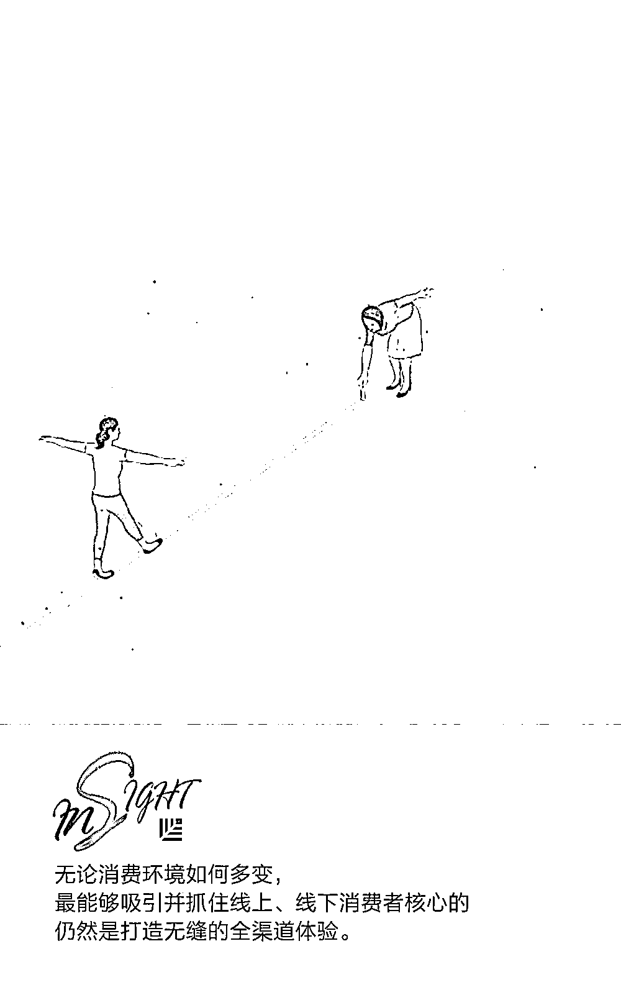
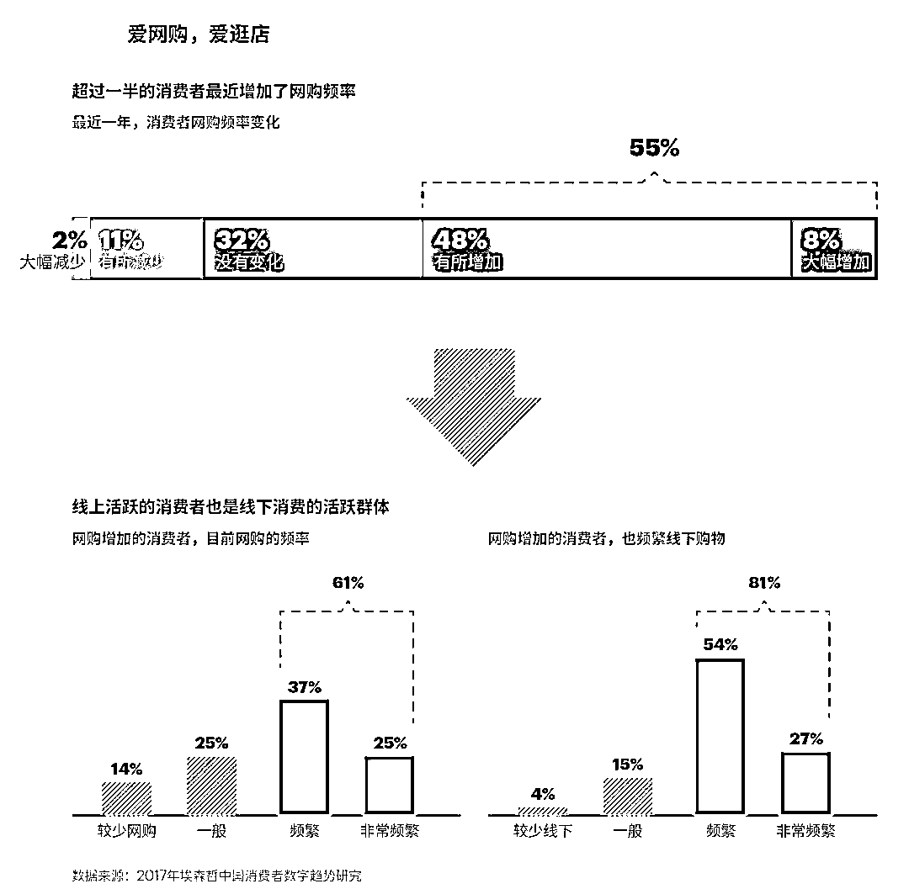
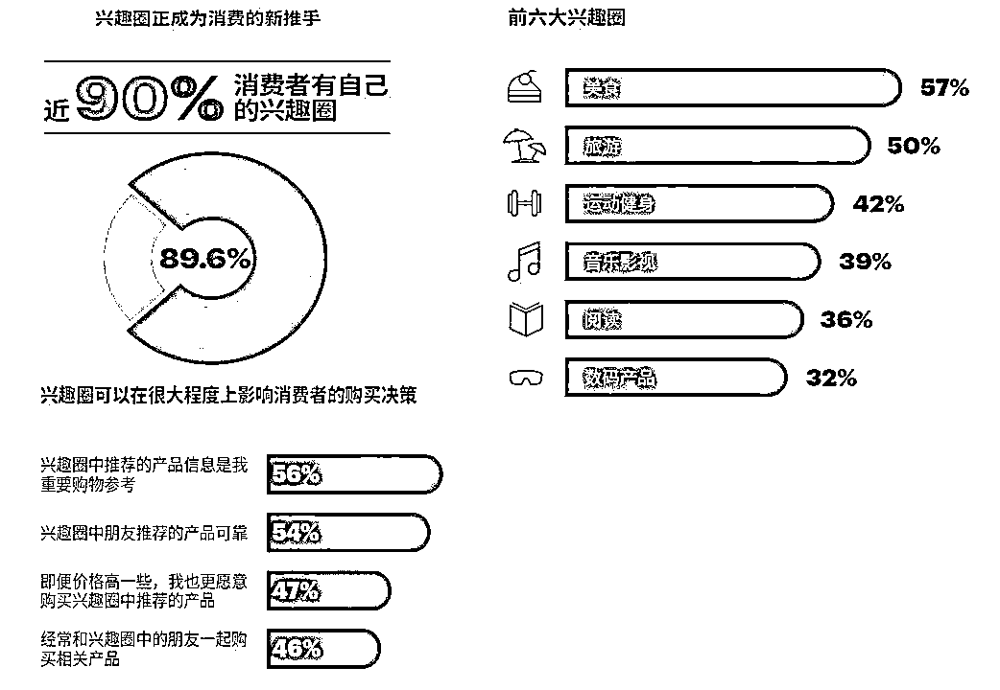
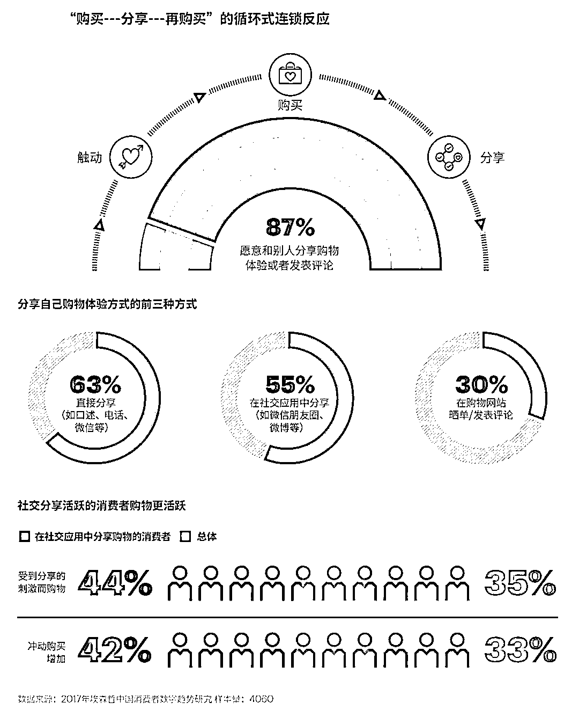
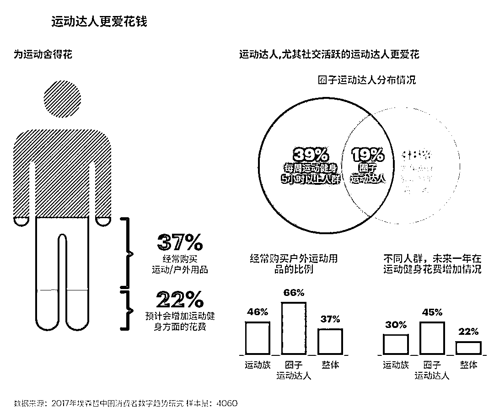
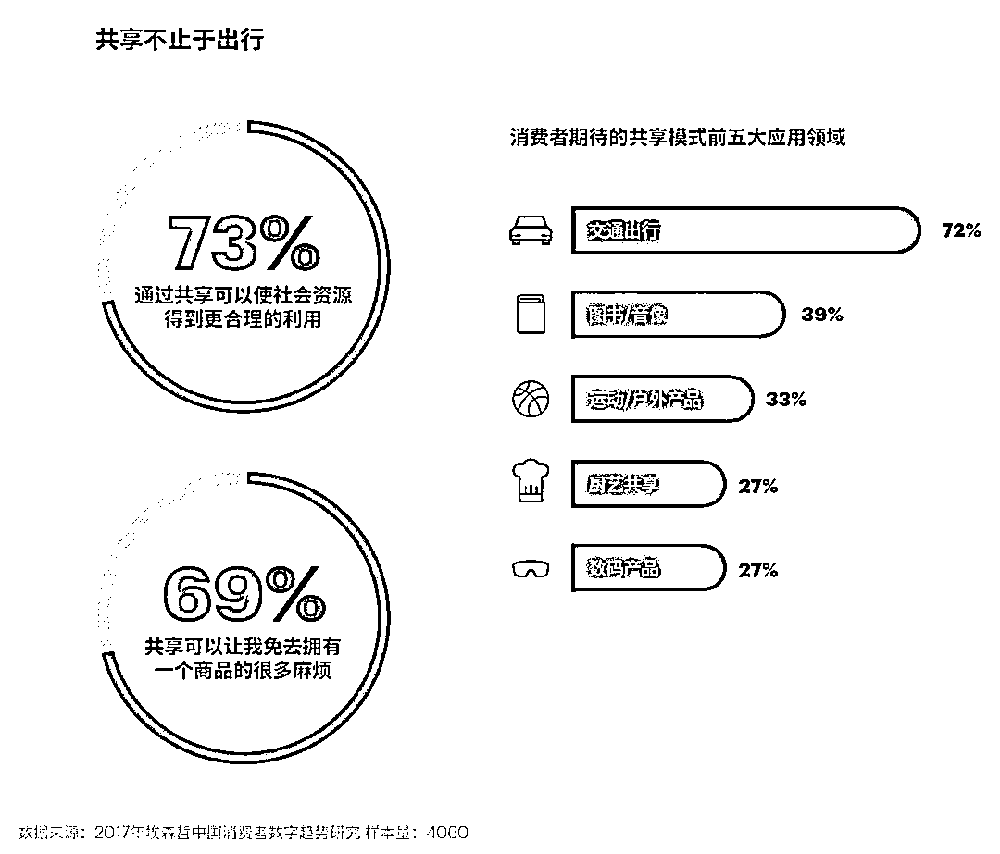

# 新消费浪潮下，想抢红利必须知道这五大趋势

> 原文：[`mp.weixin.qq.com/s?__biz=MzAwODE5NDg3NQ==&mid=2651225061&idx=1&sn=059a769941a88cc292560de46624b9cc&chksm=808045b1b7f7cca7069ef8e8c2ebd7f3a245b5e02f54530d69cfb1e6ceed39d0097cdb44068d&scene=21#wechat_redirect`](http://mp.weixin.qq.com/s?__biz=MzAwODE5NDg3NQ==&mid=2651225061&idx=1&sn=059a769941a88cc292560de46624b9cc&chksm=808045b1b7f7cca7069ef8e8c2ebd7f3a245b5e02f54530d69cfb1e6ceed39d0097cdb44068d&scene=21#wechat_redirect)

数字技术正推动消费市场加速升级，它放大了中国消费者的购买能力，裂变出全新的消费市场结构和消费者行为。那么如今的消费市场呈现哪些变化？

近日，埃森哲发布《2018 埃森哲中国消费者洞察》，研究发现，价格、数量、新品、商标和可炫耀程度不再是消费者选择商品的主要标准，买什么、何处买、为何而买，以及购物后反思，受到更多关注。在对代际消费者行为习惯的研究基础上，埃森哲总结了新消费浪潮下全新的五大趋势，并为想要获得中国消费市场全面升级红利的企业提出了五大建议：

▨ 构建企业“无缝能力”

▨ 深耕社交媒体

▨ 打造体验一以贯之

▨ 赢得健康消费者

▨ 走出“卖卖卖”

**趋势一：两线买**

是网购，还是逛店？要便宜，还是要便利？对于零售商来说，这两个二元对立的问题几乎成了生死存亡的终极挑战。如今，二者正逐渐形成一种平衡，从对立走向结合。

网购持续发展的同时，实体店也在逐渐完善。线上购物主打方便快捷，实体店消费则强调餐饮/购物/休闲/娱乐一体化的无缝综合体验，而消费者对“逛”式体验的追求、对休闲与社交的需求都进一步推动着线下消费迅速回春。

随着购物信息更加透明，比价行为正变得越来越大众化，呈现出“数字烙印”。50%的消费者表示在店内购物时会经常使用手机比价，45%表示会经常使用折扣网站寻找更低价格。值得注意的是，消费者“货比三家”不再是追求更低的价格，而是会比较商品的各方面信息，做一个“精明的消费者”。

与此同时，对消费者而言，个人的时间成本更是金钱，他们热衷比价的同时也意识到时间的重要性，超过一半的消费者认为花钱省时间是值得的，其中 71%的消费者希望能够在信息查找和价格比较上节约更多时间。

**趋势二：购物社交化**

中国消费者相信朋友口碑胜于一切，微信上的种种推荐、分享，刺激着围观朋友的好奇心和购买欲。

近年来，消费社交化趋势愈加明显，购物已然成为社交生活的副产品。年轻和高收入群体中，这一现象更为显著；而在这一趋势中，愈加细分的社交圈层，社交分享的力量最具影响力。在“圈子经济”中，可以说越分享，越冲动，越爱购。

埃森哲 2018 中国消费者研究显示，近九成消费者有自己的兴趣圈子，以美食、旅游、运动健身等最为普遍。兴趣圈子对消费者购买行为产生了极为可观的影响力，多数消费者表示更愿意相信和购买兴趣圈子中推荐的产品，哪怕价格偏高也接受。

此外，87%的消费者愿意和别人分享购物体验或者发表评论，其中 55%的消费者会在社交应用中分享自己的购物。这部分消费者更容易受到社交分享的影响和刺激，从而增加冲动购买，使消费呈现出“购买—分享—再购买”的循环式连锁反应。

**趋势三：体验至上**

中国消费者期盼全渠道的无缝购物体验。在 59%的受访者心中，购物购买的不仅仅是商品，更是购买一种体验。这无形中需要企业全面提升零售的每一个环节，优化每一个可能的消费接触点。为消费者提供“智能购物体验”——如场景化体验和参与性购买体验——尤其值得关注。

调研显示，57%的消费者购买或表示有兴趣购买虚拟现实或增强现实产品；其中，有 45%的消费者希望可以通过虚拟现实和增强现实设备体验希望购买的商品。对此，企业一方面需要提前投资有助于加强这类“智能购物”体验的技术手段，另一方面还要在营销上同步升级。

“参与”也是消费者寻找适合自己产品的一条特殊途径，是购物的又一种全新体验。从消费者的反馈来看，参与性购物能带来十分积极的效应，最突出的就是帮助消费者找到最适合自己的产品和品牌。 

**趋势四：健身消费**

运动健身已成为最新生活方式，并孕育着庞大的消费市场——运动并消费着，正成为中国消费新趋势。每周运动 5 小时以上的运动达人和经常活跃在运动社交圈的“圈子运动族”是运动消费的主力军，他们在购买运动产品和运动健身方面的预算很高；如果既是运动达人又是圈子运动圈，购买力则更胜一筹。 

此外，“运动+新技术”渐渐成为运动消费者期待的组合。44%的消费者表示希望 AR/VR 技术应用于运动健身领域，41%的消费者希望人工智能和万物互联在运动健身辅助方面得到广泛应用，还有 29%的消费者希望户外运动产品也能像共享单车一样共享。

**趋势五：拥抱价值经济**

调查显示，近一半的消费者表示：有很多商品在买来一段时间后变得很少使用，超过六成的消费者使用过二手交易平台。

新时代不仅带来了冲动消费，也带来了反省意识，以及对于平衡物质消费和精神消费的追求。越来越多的消费者希望物品可以更有价值、更合理地使用，比如通过共享使商品使用价值最大化。“共享经济”已渗透到各行各业，这片共享蓝海正留待互联网公司和传统企业共同开发。

面对新消费主义和新消费力量的形成，企业如何洞察先机、以变应变，依靠敏捷行动及时获取中国消费市场全面升级的红利？埃森哲给出了五大建议：

▨ 构建企业“无缝能力”：无论消费环境如何多变，最能够吸引并抓住两线（即线上和线下消费）消费者的核心仍然是⸺打造无缝的全渠道体验。企业需要具备在任一时刻、任一触点为任一消费提供连贯性且个性化体验的能力，即企业的“无缝能力”。

▨ 深耕社交媒体：面对社交与购物紧密融合的趋势，企业既需要打通接触消费者的前端⸺做好内容营销，创造分享和评论的平台，也需要有整合后台交易数据，匹配库存与物流等诸多综合能力。

▨ 打造体验一以贯之：打造消费者体验，首先应贯穿企业产品全生命周期管理的全过程，从消费者认知、了解、购买、使用、售后，一直到再次购买。同时，需要以消费者为中心，具备客户的内在思维，真正能站在消费者的角度出发，打造出符合客户真实需求的消费体验。

▨ 赢得健康消费者：随着拥有固定、良好健身习惯的人群不断扩大，运动产业成为直接受益者，利用先进的 AR/VR/XR（扩展现实）和人工智能等新技术可以为运动消费者带去身临其境的体验。

▨ 走出“卖卖卖”：更积极的拥抱共享经济和价值经济，加强对社会责任的履行，利用大数据制定更精准的生产计划，减少浪费与碳排放，加强回收与再利用。

原标题 / 《2018 埃森哲中国消费者洞察》重磅发布！

来源 / 埃森哲中国（ID：accenture_china）

点击 阅读原文 查看文章出处

** 推荐阅读**

壹

[对自身创造力的怀疑，是创新最大的阻碍](http://mp.weixin.qq.com/s?__biz=MzAwODE5NDg3NQ==&mid=2651225024&idx=1&sn=85415e8b11eb83f23fe0c24c80c7fd32&chksm=80804594b7f7cc829fdd675af65541745fbea836d615b2ee525751bc80ba82bcd9b09ec22182&scene=21#wechat_redirect)

贰

[微软 75 亿美金收购 GitHub，红杉资本鼎力参与有史以来第三大并购案](http://mp.weixin.qq.com/s?__biz=MzAwODE5NDg3NQ==&mid=2651225035&idx=1&sn=ae651e7816932f86bedbb2a5204dfd2e&chksm=8080459fb7f7cc8987601c4563d1b1f9a8eece54af25122ba7245d408ecbbb950e003c322669&scene=21#wechat_redirect)

叁

[未来职场：人机搭配，干活不累](http://mp.weixin.qq.com/s?__biz=MzAwODE5NDg3NQ==&mid=2651225037&idx=1&sn=5fc291cc625e166b5e8ed0e0ed9d11c7&chksm=80804599b7f7cc8f4df89c13e21bce9ceb1487662195e6d78fd360b971f0db6f843331a345e3&scene=21#wechat_redirect)

肆

[2018，即将引领医疗行业深刻变革的五大力量](http://mp.weixin.qq.com/s?__biz=MzAwODE5NDg3NQ==&mid=2651225041&idx=1&sn=b7cbc361b32d102f7ce1e632d954aab7&chksm=80804585b7f7cc93e17744517dc1fe42df1c411cabab18e182c9417f5963b17e07e3d29014ab&scene=21#wechat_redirect)

伍

[很忌讳决策失误？一时冲动？错失良机？诺贝尔经济学奖得主给你解决方案](http://mp.weixin.qq.com/s?__biz=MzAwODE5NDg3NQ==&mid=2651225048&idx=1&sn=943ee74ac8ac605549e8287653e88995&chksm=8080458cb7f7cc9a21d74d44912b464934a038295f03c5fb9e25fd40c1371aa7f1a551cb87ab&scene=21#wechat_redirect)

