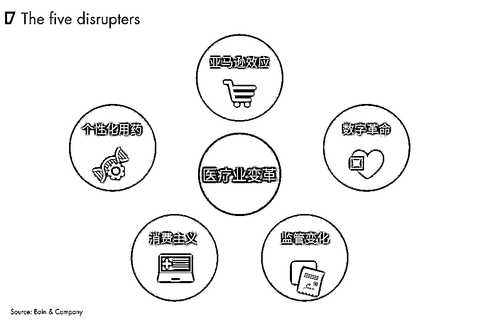
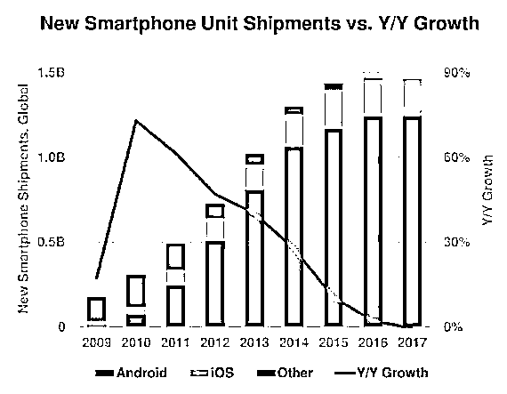

# 2018，即将引领医疗行业深刻变革的五大力量｜红杉汇内参

> 原文：[`mp.weixin.qq.com/s?__biz=MzAwODE5NDg3NQ==&mid=2651225041&idx=1&sn=b7cbc361b32d102f7ce1e632d954aab7&chksm=80804585b7f7cc93e17744517dc1fe42df1c411cabab18e182c9417f5963b17e07e3d29014ab&scene=21#wechat_redirect`](http://mp.weixin.qq.com/s?__biz=MzAwODE5NDg3NQ==&mid=2651225041&idx=1&sn=b7cbc361b32d102f7ce1e632d954aab7&chksm=80804585b7f7cc93e17744517dc1fe42df1c411cabab18e182c9417f5963b17e07e3d29014ab&scene=21#wechat_redirect)

[ 编者按 ] 全球经济扩张的速度正在进入逐渐缓慢。在投资者的眼中，这不是个好事。所幸，医疗行业一直被认为是反周期并能抵御经济衰退的投资好选择。

公开披露数据显示，2017 年医疗领域的融资交易总额达到了最高水平的 426 亿美元，交易量也从 2016 年的 206 笔增加至 265 笔。那些成功达成巨额交易的私募基金，往往都是巧用创新手段的能手，同时它们也都关注到了医疗领域的五大颠覆性力量。这五大力量部分已帮助其他主要行业改头换面，如今它们将继续引领变化，在未来几年里深刻改变医疗行业。

这是一份来自贝恩咨询的重磅报告，为你呈现在欣欣向荣的医疗行业，如何抓住新的投资机遇，并消除变革过程中伴随的风险。

每期监测和精编中文视野之外的全球高价值情报，为你提供先人一步洞察机会的新鲜资讯，为你提供升级思维方式的深度内容，是为 **[ 红杉汇内参 ]**。

** 内参**

**重塑医疗业的五大力量**

来源 / 贝恩咨询

编译 / 洪杉

2017 年，对于医疗领域的投资者来说又是硕果累累的一年。披露交易总额高达 426 亿美元，是 2007 年以来的最高水平。交易量也从 2016 年的 206 笔增加至 265 笔。

那些成功达成巨额交易的基金，往往都是巧用创新手段的能手。它们或采用分拆上市和后续收购的策略；或与其他基金、甚至跟企业买家携手合作；或转向公开市场，将目标企业私有化。它们也开始考虑，该如何应对即将变革整个医疗行业架构的趋势，并从中实现盈利。这些趋势包括数字化、患者至上主义、以及如亚马逊等非传统医疗企业的加入。

在今天瞬息万变的环境中，医疗行业的投资者应注意以下几条重要原则：

▨ 颠覆性变革中，机遇和风险并存。与其回避医疗颠覆者所带来的不确定性，投资者更应努力找寻合适的目标企业，通过多种手段推动交易完成。医疗行业中不断涌现数字化程度快速加深的新技术和新方法，能从中获益的企业便是最佳的投资选择。此外，投资者也应调整投资战略，以减少颠覆者所带来的风险。

▨ 占据某个领域的领军地位仍是制胜良策。在医疗行业的各个细分领域中，领域巨头一直保持着出色的盈利表现，也更有能力抵御住经济的动荡。在寻求扩大交易战略的时候，私募基金应重点收购或打造在领域高居领先地位的资产，以获取数额可观的回报。

▨ 商业优化和改善经营是提高回报的利器。在目标有限和估值高的行业中，如果不注重提高资产的营业收入和净利润，再好的交易战略也不能提高回报。私募基金应当制定并执行清晰的市场进入策略以及强大的利润提高方案，以充分发挥每项收购资产的潜力。

**2018 年及更远的未来**

考虑到如今全球经济扩张的速度极度缓慢，在投资者的眼中，医疗行业一直是反周期并能抵御经济衰退的投资好选择。PE 基金将会重点关注那些一直保持高回报的领域，如合同服务、零售医疗保健和医疗信息技术等。

要想在合理的价位完成规模较大的交易，私募基金可能需要考虑扩大战略。它们会对企业分拆上市会表露出更大的兴趣，更多的私募基金可能会选择和企业买家强强联手。

私募基金将继续寻找合适机会，实现公有资产的私有化。2018 年初的股市波动驱使公有资产卖家考虑 PE 基金能够提供的稳定估值，推动了上述趋势的发展。

不管 PE 基金对医疗方面的交易有何计划，它们将继续选择向该领域内的领军资产进行投资。全球医疗服务需求在基本要素的推动下不断增加，在这样的形势中，领域内的领军者将是最大受益方。

在估值一直保持高位的情况下，私募基金不能奢望仅通过市盈率倍数扩张来获得回报，而是应该在收购时制定详尽计划来提高利润，以此提升企业的价值；还要重点关注企业的营业收入和净利润。PE 基金要想打造出制胜战略，必须进行细致严谨的商业尽职调查和业务尽职调查。

而在变革性力量颠覆医疗行业的过程中，私募基金也会寻找新方式，占据优势地位。

**重点关注：变革医疗行业的五大力量** 

▨ **亚马逊效应**

亚马逊已在美国数州取得了药品分销许可证。 2018 年 1 月，它宣布与摩根大通和波克夏合作，共同组建一家公司，为旗下员工提供医疗服务。据报道，亚马逊也在计划发展其医疗设备业务，希望成为美国医疗服务提供商的主要供应商之一。

在中国，阿里巴巴和腾讯已经进行相关投资，发展用于帮助病情诊断的人工智能。苹果在 2018 年初宣布将电子病历整合进旗下的 Health 应用程序中，并在美国 12 家医疗机构开始试用。另外，三星生物制药公司（Samsung BioLogics）也已经进入了医药合同制造领域。

私募基金在对当前和潜在医疗投资进行估值时，应考虑这些新竞争者利用规模和技术优势去挑战传统医疗竞争对手的能力，它们将突入医疗界的各个领域，包括医药分销、零售诊所和保险等。除此之外，也可寻找机遇，向意欲进军该行业的非医疗企业出售资产。

▨ **数字革命**

大型的医疗公司在利用数字化发展上具有绝对优势。一些投资公司采取了先收购后搭建的策略，将小公司与一个大型数字化平台结合起来。医疗科技和医疗信息科技公司提供的设备和系统是医疗数字化的前提，所以投资公司也可以选择这类公司。

尽管数字化能够大大提高效率，但投资公司需要高度警惕，确保自己所投资的企业能够对客户的保密信息进行严格保密。数据泄露可能会摧毁顾客的信任，影响企业价值。

▨** 监管措施的变化**

过去几年，全球很多地区的监管措施都发生了变化。欧盟正在迎接一个新的医疗设备体系，中国也已经对药物和医疗设备分配系统进行重组。在美国，食品及药物管理局审批程序的变化也加剧了仿制药的市场竞争，企业正享受巨额的税务宽减，强制参保的废除使得《平价医疗法案》发生了一些变化。

投资公司可将投资转向合同服务机构等不会直接受到政策或费用报销影响的企业，将法律上的风险降至最低。为了更好地了解潜在政策变化所带来的影响，投资公司可着力进行商业尽职调查，从而量化不同情景所带来的影响。投资公司也可对政策发展动向进行广泛研究，锁定那些受益公司。表面看来，一些公司可能会受到政策变化的冲击，但实际上，它们的恢复能力和价值都超出了市场预期，投资公司也可以从这些企业中获得良机。

▨ **消费主义**

现在，消费者有多种医疗选择。多年来，消费者在就医时可选的地点、时间、方式、对象都较为有限，而现在有各种各样的就医模式可供选择，比如远程医疗、家庭健康护理、特约医疗、在线自助服务。这些就医途径满足了消费者原本在进行其他消费时才会有的期待，比如便利、专注、及时、价值、价格公开透明。

投资者认识到，医院需要改变其服务模式，以应对消费者的需求变化，同时还要缩减开销，以在新的竞争中保持盈利能力。

▨ **个性化用药**

个性化用药综合考虑了病患的健康史、基因信息、个人需求与偏好，从而进行个性化治疗。医疗投资者正在关注那些开发这种个性化治疗的生物制药和医疗科技公司。它们对那些可对病患的生物标记物进行测试的合同研究组织及可对不同来源的患者数据进行整合分析的医疗信息技术公司也饶有兴趣。

然而，投资公司仍然不能掉以轻心，以免超过了人们的接受能力，过犹不及。与其他新兴技术的情形类似，那些已经进行了彻底研究的投资公司应该找到那些供应商愿意尝试、病患愿意接受、保险公司愿意理赔的前沿创新技术并从中获利。

** 读数**

**0**

5 月 30 日，“互联网女皇”玛丽・米克尔在一年一度发布的《互联网趋势报告》里称，2017 年全球新智能手机出货量的增长为**零**。与此同时，全球互联网用户预计也将在超过总人口的 50%后很难再继续增长。

** 情报**

#不仅是装裱在墙上#

**企业文化到底有什么用？**

▨ 文化是公司的基因。尽管这听起来很老套，但基因的确会制造差异。

▨ 强大的文化有助于扩大公司规模。如果前 100 名员工都能维护公司文化，你就可以轻松迅速把规模扩大到 500 人。

▨ 文化孕育信任、团结和效率。这通常意味着会议和微观管理会减少，生产力和成果会增加。

▨ 你可以依据优秀的文化招兵买马。知道自己在寻求什么，就能注意到哪类人最适合这个团队，或者有潜力为这个团队带来新事物。

▨ 得到的越多越难维护。快速扩张导致不同的利基团体和派系出现，维护公司文化归根结底在于个人。

▨ 害群之马会危及整个团队。如果有人心存不满，他们就不太会关心公司的文化和愿景，还会将这种不满传达给最帮不了他们的人。

▨ 强大的文化长盛不衰。员工们认为即使无偿工作都是赚了，因为他们相信公司的愿景。

#可能改变你一生的观念#

**超级成功人士如何思考？**

▨ 一切都是暂时的。低谷时刻是你人生的一部分，无需担心，因为新的事物将会取而代之。

▨ 即使对一件事一无所知，你也要试着去做。任何值得一做的事情都需要你为之付出实践。

▨ 无关紧要的事也是成功的一部分。譬如，来一次旅游，与现实世界切断联系，并思考下一步该如何发展。

▨ 过度工作将导致失败。活着的每时每刻都要辛勤工作的说法是愚蠢的，恢复元气是得以成长的必要基础。

▨ 珍惜痛苦。痛苦是最难对付的事情之一，值得珍惜。

▨ 实话实说永远是正确的选择。即使有些时候从表面上看来并非如此。

** 推荐阅读**

壹

[对自身创造力的怀疑，是创新最大的阻碍](http://mp.weixin.qq.com/s?__biz=MzAwODE5NDg3NQ==&mid=2651225024&idx=1&sn=85415e8b11eb83f23fe0c24c80c7fd32&chksm=80804594b7f7cc829fdd675af65541745fbea836d615b2ee525751bc80ba82bcd9b09ec22182&scene=21#wechat_redirect)

贰

[微软 75 亿美金收购 GitHub，红杉资本鼎力参与有史以来第三大并购案](http://mp.weixin.qq.com/s?__biz=MzAwODE5NDg3NQ==&mid=2651225035&idx=1&sn=ae651e7816932f86bedbb2a5204dfd2e&chksm=8080459fb7f7cc8987601c4563d1b1f9a8eece54af25122ba7245d408ecbbb950e003c322669&scene=21#wechat_redirect)

叁

[未来职场：人机搭配，干活不累](http://mp.weixin.qq.com/s?__biz=MzAwODE5NDg3NQ==&mid=2651225037&idx=1&sn=5fc291cc625e166b5e8ed0e0ed9d11c7&chksm=80804599b7f7cc8f4df89c13e21bce9ceb1487662195e6d78fd360b971f0db6f843331a345e3&scene=21#wechat_redirect)

肆

[爱奇艺龚宇：80 亿播放量的现象级爆款是如何炼成的？](http://mp.weixin.qq.com/s?__biz=MzAwODE5NDg3NQ==&mid=2651225013&idx=1&sn=e5171074f966d6c260e54b633adaf3f9&chksm=808045e1b7f7ccf7dfc84788ebf2ae78fd9cad3743ab02ca6db2206a6379093d45e88e85df3b&scene=21#wechat_redirect)

伍

[“硬撑”不是唯一的路，你明明知道自己可以活得更好](http://mp.weixin.qq.com/s?__biz=MzAwODE5NDg3NQ==&mid=2651225018&idx=1&sn=679e2a702b6ffce3dd1ebdaf37611b87&chksm=808045eeb7f7ccf82444fdb3b5e491e7aab36dbec5fc2662ed80e4969b728f5b43b646ee4c22&scene=21#wechat_redirect)

