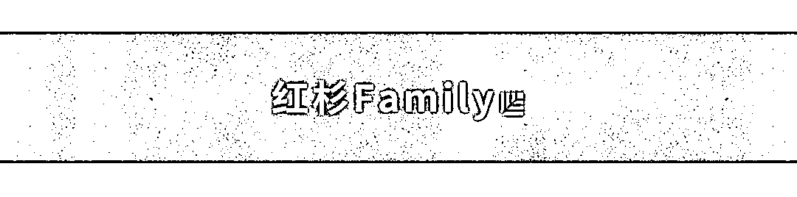
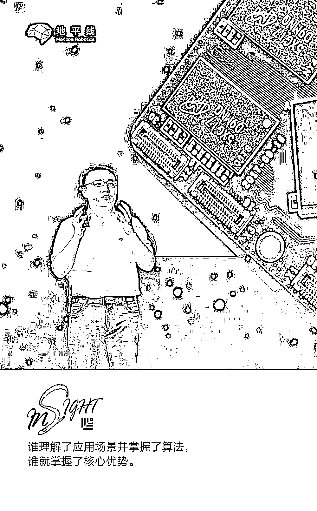
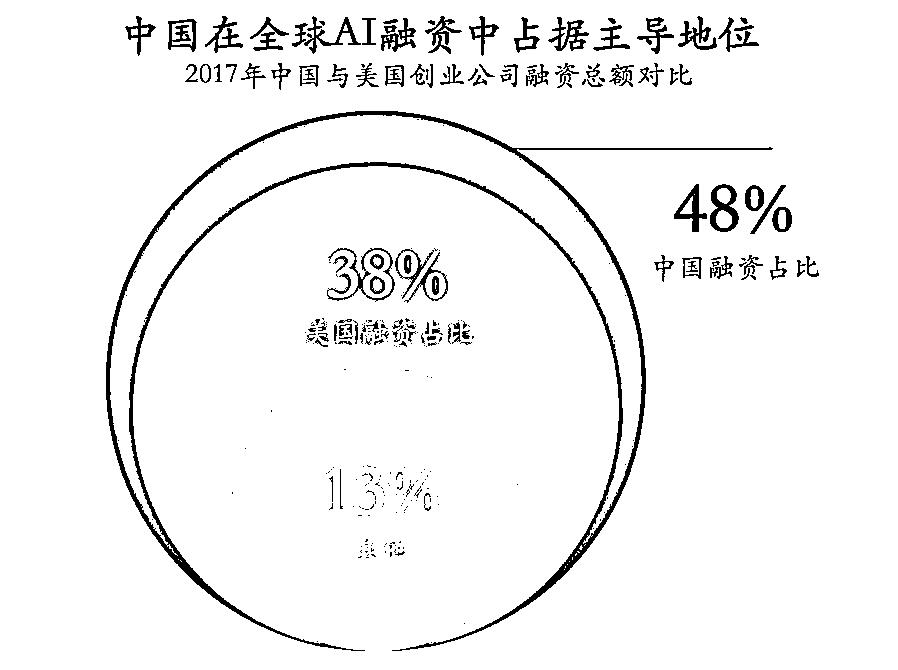
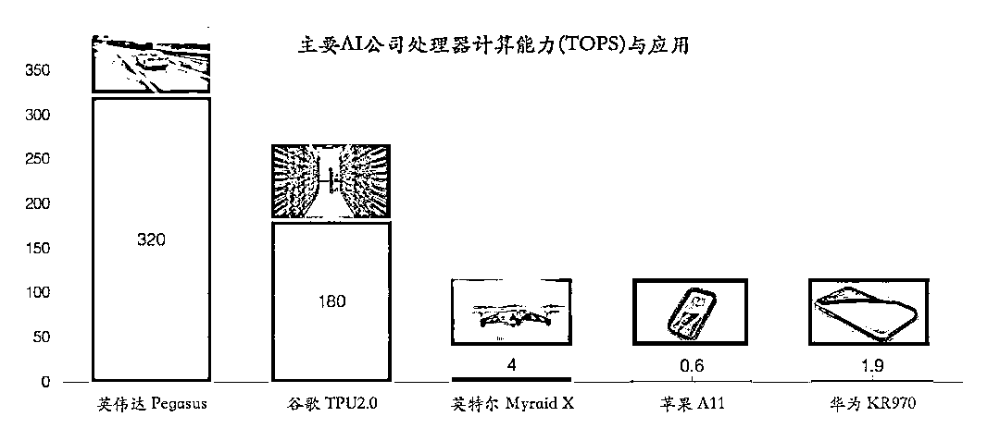
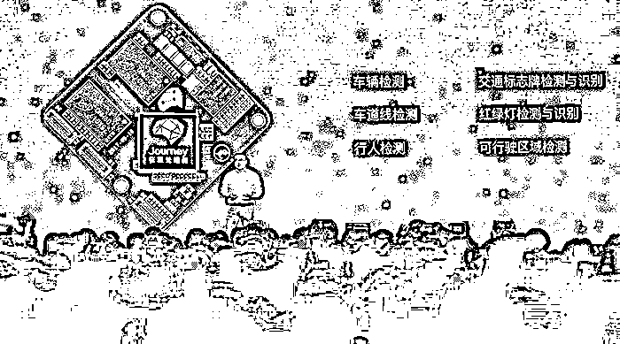

# AI 芯片卡位战：谁赢得自动驾驶处理器，谁就赢得了 AI 时代

> 原文：[`mp.weixin.qq.com/s?__biz=MzAwODE5NDg3NQ==&mid=2651224818&idx=1&sn=fbf118382d471f439da4d71625415b4d&chksm=808044a6b7f7cdb088491f414d2ab60d55df4d2b3d708d391a9ce1ba35548a1aaf6d9938994e&scene=21#wechat_redirect`](http://mp.weixin.qq.com/s?__biz=MzAwODE5NDg3NQ==&mid=2651224818&idx=1&sn=fbf118382d471f439da4d71625415b4d&chksm=808044a6b7f7cdb088491f414d2ab60d55df4d2b3d708d391a9ce1ba35548a1aaf6d9938994e&scene=21#wechat_redirect)

在 PC 时代和手机时代，尽管我国的整机产量、手机出货量均为全球第一，但遗憾的是，芯片、系统的主导者却是外国公司。再到如今大热的人工智能，中国的创新应用可谓是层出不穷，但核心技术占主导地位的依旧是外国公司。

中国还有望领跑人工智能时代吗？若想牢牢占据主导地位，我们应该怎么做？

地平线创始人兼 CEO 余凯博士基于对行业的洞察得出了一个结论：谁赢得了自动驾驶处理器，谁就赢得了人工智能时代。如今我们身处 AI 技术引领全球科技的时代，加之中国也疾行于千年以来又一次民族复兴的进程之中。所以尽管问题是存在的，但前途还是光明的。余凯博士在本文中深度剖析中国人工智能产业爆发背后的巨大隐忧及自动驾驶处理器的研发现状，为中国领跑人工智能时代提出了建设性建议。以下是部分要点摘录：

▨ 人工智能大规模产业化的关键，首先在于人工智能处理器的突破，而人工智能处理器的制高点必然来自于最具规模效应和最具技术挑战性的行业应用。

▨ 面对诸多挑战，需要人工智能在感知和决策等基础理论和算法方面的基础性创新。

▨ 深刻理解人工智能的软件将促进处理器架构的研发效率。

▨ 自动驾驶处理器的突破不仅意味着自动驾驶核心技术的突破，更代表了人工智能核心软硬件的突破，必然带动整个人工智能产业的腾飞。

▨ 应用场景决定算法，算法定义芯片，软硬件协同设计，这就是 AI 时代的新摩尔定律。

**中国人工智能产业爆发**

**背后的巨大隐忧**

前不久，英国权威杂志《经济学人》以封面文章的形式，发表题为《中美数字霸权之争》的深度分析报道，而人工智能正是竞争的主战场。近年来，中国在人工智能应用方面的进展令人印象深刻，表现为四个核心优势：政府高度支持、风险投资活跃、占优势的人才资源和海量数据。

据调研机构 CB Insights 统计，2017 年全球人工智能初创企业融资额达 152 亿美元，其中中国公司达 73 亿美元，占全部融资额的 48%，超过美国的 38%，成为全球第一。

2018 年更被认为是中国人工智能产业爆发的元年，但在一片火热的行业发展背后，却潜藏着巨大的隐患：目前我国的人工智能产业绝大部分都是应用创新，在人工智能技术最核心的处理器和操作系统方面，现实却是冰冷的：国外公司依然牢牢占据主导地位。 

人脸识别是最早的人工智能应用之一，市场迅速膨胀，但打开一款市面上的智能摄像机或视频人脸分析服务器，里面的核心处理器不是英伟达就是 Intel，或者赛灵思。自动驾驶是国家确定的四大人工智能关键应用领域之一，科技部在去年底宣布，依托百度公司建设国家级自动驾驶创新平台，但百度本身不掌握任何核心处理器或者操作系统。

▨ 在 PC 时代，我国的整机产量全球第一，但主导者却是 Intel 和微软；

▨ 在手机时代，我国手机出货量还是第一，但主导者却是高通和 ARM；

▨ 在人工智能时代，我们看到英伟达和 Google 在持续扩大其优势，当我们还沉浸在产业爆发的狂欢中时，美国凭借强大的基础硬件与核心软件实力，又一次提前卡位。

这不得不引起我们的警惕：中国会不会再次输掉一个时代？

早在 2014 年，习近平主席在中科院院士大会上发表讲话时，就着重提到人工智能的迅猛发展，并指出：「机器人革命」有望成为第三次工业革命的一个切入点和重要增长点，是衡量一个国家科技创新和高端制造业水平的重要标志。人工智能已经明确上升到国家战略。

PC 行业和手机行业的历史表明，信息产业的核心就是处理器和操作系统，人工智能大规模产业化的关键，首先在于人工智能处理器的突破，而人工智能处理器的制高点必然来自于最具规模效应和最具技术挑战性的行业应用。英伟达是目前人工智能行业的执牛耳者，其最先进的处理器首先面向自动驾驶，并非偶然，英伟达清楚地意识到：拿下自动驾驶应用，面对其它应用就是降维打击。

自动驾驶处理器在性能、可靠性、实时性、功耗效率以及对应的算法等方面都提出了人工智能行业应用中最高标准的要求。其突破不仅意味着自动驾驶核心技术的突破，更代表了人工智能核心软硬件的突破，必然带动整个人工智能产业的腾飞。

▲ 面向自动驾驶的人工智能处理器拥有业界最高的计算能力

**自动驾驶处理器**

**将撬动难以估量的巨大经济规模**

来自美国交通部的数据显示，到 2025 年，智能驾驶的软硬件销售（不含整车）将达到 262 亿美元，但其社会效益将放大到 1 万亿美元，这其中包括了缓解交通拥堵、节省燃料、减少事故以及提高生产效率。

可以说，每 1 美元的自动驾驶处理器销售，将带来 40 美元的社会效益！这就是基础技术的作用，有极强的产业放大效应。

在今年 CES 展上，英伟达公布了其最新、也是迄今为止最复杂的处理器「Xavier」，并将其命名为「全球首款自主机器处理器」，表示其「将揭开人工智能时代的新篇章」。

事实上，Xavier 处理器首先应用于自动驾驶，但其「自主机器处理器」的命名暗示，该处理器不仅可用于汽车，还可应用于更广泛的机器人领域。从技术角度看，自动驾驶汽车是机器人应用的集大成者，其工作场景最为复杂、技术难度最高，搞定了自动驾驶，只做减法就可以拿下泛机器人的各种应用。

资本市场充分看好该市场，英伟达的市值自三年前以来，已经增加了一个数量级，达到 1500 亿美元；Intel 在去年收购了 Mobileye 之后，这艘半导体航母的市值竟然也上涨了接近 50%，达 2400 亿美元。

国务院去年发布《新一代人工智能发展规划》，明确提出，到 2030 年，人工智能核心产业规模超过 1 万亿元，带动相关产业规模超过 10 万亿元。

著名咨询公司普华永道预计，与人工智能相关的增长到 2030 年将把全球 GDP 提升 16 万亿美元，其中半数来自中国。

而自动驾驶处理器，恰好站在人工智能技术革命和汽车产业革命的交汇点上。

**自动驾驶处理器研发**

**面临最复杂的技术挑战**

芯片曾经是中国工业界的短板，经过多年的努力，中国已经在消费电子领域有了长足的进步，涌现出了 MTK、海思等公司，跻身全球前二十大芯片公司行列（不包括代工厂），但在汽车电子领域，NXP、英飞凌、瑞萨、TI 和 ST 等跨国公司仍占据了绝大部分市场份额。中国的芯片公司在这个领域的市场占有率，几乎是零。能够符合前装汽车电子质量和可靠性规范的产品，甚至今天还没有出现。

从整个自动驾驶产业链的格局来看，主要是传感器、处理器和控制器三个主要部分，在传感器领域，无论是摄像头还是激光雷达，都有几十家以上的供应商，控制器领域的供应商更多，但处理器领域，真正得到认可的就是英伟达和 Mobileye 两家。相比照众多涌现出来的的新造车企业，高集中度的格局折射出自动驾驶处理器的开发难度之高。

自动驾驶事关生命安全，整个系统必须保证在任何时候都要可靠工作，及时响应。而对应的自动驾驶处理器，将面临四个方面的关键挑战：计算能力、低功耗、可靠性、和安全性。

目前 AI 芯片业界的算力最高记录是英伟达最新推出的 Pegasus，计算能力达到 320TOPS（万亿次运算/秒），其目标正是自动驾驶。事实上，业界已经在严肃地讨论 POPS（1 千万亿次运算/秒）时代何时到来，这相当于要把「天河一号」超级计算机（2010 年建成，当时排名全球第一）装进一台汽车！

但计算能力和低功耗永远是一对矛盾。英伟达的 Pegasus 的算力最高，但功耗也达到了恐怖的 500 瓦。这将带来一系列麻烦的问题，包括芯片的工作寿命缩短、需要可靠的散热系统、巨大的功耗对于电动汽车的续航里程也带来了很大的负担。事实上，低功耗对于自动驾驶系统至关重要。

与手机这样的消费电子产品相比，汽车电子面临的工作环境要复杂恶劣得多，为了严格保证整车品质和可靠性，汽车电子始终追求的是实现零缺陷（Zero Defect）的目标，AEC-Q100 作为汽车电子的通用标准，是自动驾驶处理器需要跨过的第一道坎。

自动驾驶处理器需要满足 ASIL（汽车安全完整性等级）规范，需要达到 B 或者 C 级，这是第二道坎。为了确保在功能上的可靠性，自动驾驶系统需要在各个方面都有可靠的冗余备份系统。这就好像电网系统的设计一样，某一处供电系统的故障不会让整个电网瘫痪。

同时，我们还要确保整个计算系统中的数据是高度安全的，不被篡改、破坏或者窃取。设想一下，如果黑客攻破了自动驾驶系统，将其中的图像数据进行篡改，本来传感器已经探测到前面有个横穿马路的孩子，但篡改后的数据却显示什么都没有，后果可想而知。

AlphaGo 在围棋领域的成功，代表了人工智能在决策方面一个里程碑式的成就，但是对于围棋这样的应用，是一个环境封闭、规则完备、信息完整的决策场景，但即使是这么简单的场景，Google 都要用算力高达 180TOPS 的 TPU 去支撑，才能够满足要求。自动驾驶面临的是一个开放的环境、不完备的规则、不全面的感知信息、多智能体的博弈场景，而且还不能出错。

面对这么多的挑战，需要人工智能在感知和决策等基础理论和算法方面的基础性创新。而对应的计算任务所需的计算模式、计算复杂度、实时性和功耗指标，都要求基于自动驾驶处理器开发软硬件完美结合的系统级设计。

可以说，支持自动驾驶软件系统是核心目标，而硬件处理器架构是关键路径，两者必须紧密配合。这就意味着，自动驾驶处理器也体现了我们国家在人工智能基础理论和软件算法方面的最高水平。

**AI 时代的制胜之道：**

**软件驱动的处理器设计**

在自动驾驶处理器这个领域，为什么是英伟达和 Mobileye 领跑？

去年，Intel 宣布以 153 亿美元收购 Mobileye，以弥补其在自动驾驶方面的短板，Intel 作为半导体行业的老大哥，想切入汽车行业已经很久，但最后还需要花大钱靠收购来获得市场，尴尬的背后折射出的是什么？

无论是 Mobileye 还是英伟达，相对于他们的竞争对手，有一个共同点：他们充分地结合了算法和计算，进行协同设计，由此提供了完整的解决方案，在这一点上，其它竞争对手与这两家的差距甚远。

Google 切入处理器领域的时间并不长，但很快就把 TPU 做出来了，不仅在 AlphaGo 大放异彩，还将其做成了一项 AI 服务，其商业潜力巨大。

这一现象的背后，折射出一个新的趋势：深刻理解人工智能的软件将促进处理器架构的研发效率。本质上讲，这是一场由人工智能应用场景驱动的软硬件技术革命。人工智能芯片的本质并不是硬件，而是软硬结合的载体。人工智能芯片的发展，并不是单纯的工艺和晶体管密度驱动，而是计算架构与算法的配合驱动，使其实际的计算效率不断提升，追求极致效能。

可以说，应用场景决定算法，算法定义芯片，软硬件协同设计，这就是 AI 时代的新摩尔定律。谁理解了应用场景并掌握了算法，谁就掌握了核心优势。

**自动驾驶处理器**

**成为国家科技实力的战略制高点**

如果说，人工智能是中美双雄争霸的主战场，自动驾驶就是这个战场的决定性战役。

911 事件以后，政府和公众都猛然意识到，交通工具如果不加以控制，将会变成威力巨大的武器，《速度与激情 8》更是以僵尸车队的疯狂表现刺激到了公众的神经，自动驾驶事关国家安全是显而易见的。

与 Mobileye 和英伟达打交道的中国车厂普遍表示，国外公司在合作条款、技术支持方面都非常苛刻，进一步凸显了开发国产处理器的紧迫性。

自动驾驶处理器对于自动驾驶的意义，就好像发动机之于航空业的意义，中国要想占据自动驾驶和人工智能技术的战略制高点，就需要有自己的自动驾驶处理器，让我们在这个领域有自己的话语权，不会受制于人，不再让自主品牌在 Mobileye 和英伟达之间做艰难的选择。

我们需要有像自动驾驶处理器这样的硬科技的突破，否则科技领袖的地位是很难树立起来的，国家安全更无从谈起。什么是硬科技，是通信、能源、交通技术，是真正定义一个国家、科技工业实力的技术。这就好像是东北战役，为什么要先打易守难攻的锦州，而不是唾手可得的沈阳？因为锦州是战略高地，一旦拿下，沈阳不攻自破。

**自动驾驶处理器**

**是人工智能产业的珠穆朗玛**

人工智能芯片无疑是当下人工智能行业最炙手火热的话题，来自咨询公司的一份调查显示，目前已经公布了人工智能芯片开发计划的中国公司已达 39 家。但细数下来，会发现绝大部分都面向安防或者消费应用，而真正在自动驾驶处理器上发力的，只有地平线。

▲ 2017 年底，地平线发布第一代自动驾驶处理器

近日，彭博社在对奥迪的采访中，奥迪驻北京发言人约翰娜・巴斯（Johanna Barth）表示，奥迪已经为中国（自动驾驶）项目挑选地平线公司作为合作伙伴。去年，奥迪在全球率先推出了 L3 级自动驾驶的量产版车型奥迪 A8，确立了其在自动驾驶技术的全球领先地位，此次奥迪选择地平线作为合作伙伴，是中国公司在自动驾驶核心技术方面的重要突破。

自动驾驶所涉及的领域之多，难度之大，堪比 20 世纪的登月工程，但正如美国总统肯尼迪所说，「我们选择登月，不是因为它容易，而是因为它很难。」后来的事实证明，登月计划的成功，真正奠定了美国科技霸主的地位，逆转了自斯普特尼克时刻以来，苏联在太空和武器系统方面的优势地位，全球科技人才往美国聚集，进一步扩大美国在科技上优势。

我们这一代做人工智能的人，幸运之处就在于：我们熬过了 AI 的寒冬，身处于一个 AI 技术引领全球科技的时代。而中国，也疾行于千年以来又一次民族复兴的进程之中。在这幅恢弘的历史画卷之中，无论是从技术难度、经济规模，还是战略影响来看，自动驾驶处理器都堪称这个时代科技的珠穆朗玛。不负时代，无问西东，是我们这代人的责任与使命，谁赢得了自动驾驶处理器，谁就赢得了人工智能时代！

**地 平 线**

领域：科技/传媒

地平线作为嵌入式人工智能全球领导者，致力于提供高性能、低功耗、低成本、完整开放的嵌入式人工智能解决方案。面向智能驾驶、智能城市和智能商业等应用场景，为多种终端设备装上人工智能“大脑”，让它们具有从感知、交互、理解到决策的智能，让人们的生活更安全、更便捷、更美好。

经过两年多的研发，地平线基于 BPU 自主研发的中国首款全球领先的嵌入式人工智能视觉芯片已成功面世，推出了面向智能驾驶的征程(Journey)系列处理器和面向智能摄像头的旭日(Sunrise)系列处理器，并向行业客户提供“算法+芯片+云”的完整解决方案。

红杉资本中国基金始终关注 **科技/传媒**领域的投资。成立至今已投资了今日头条、滴滴出行、京东、大众点评、美团、唯品会、掌趣科技、美丽说、新浪网、大疆创新等该领域知名企业。

除科技/传媒领域，红杉资本中国基金还关注**医疗健康**、**消费品/服务**、**工业科技**等领域的投资。

** 推荐阅读**

壹

[为什么说“害怕”是对“恐惧”最大的误解？](http://mp.weixin.qq.com/s?__biz=MzAwODE5NDg3NQ==&mid=2651224783&idx=1&sn=fa692d526942377afc67807b65a30ff4&chksm=8080449bb7f7cd8de64b942fcdd967d2aa40c60c00e55cbf932733ebf85dfbcc2166c82ed5ba&scene=21#wechat_redirect)

贰

[招聘高管又快又准的 3 个秘诀，苹果、雅虎都曾这么做](http://mp.weixin.qq.com/s?__biz=MzAwODE5NDg3NQ==&mid=2651224800&idx=1&sn=85fbc5af15c36ab88648f1a6b2b3bfef&chksm=808044b4b7f7cda29b814f7c6922d7f6bee2d92dbc66928f251490cd561fd242058782ccb5a4&scene=21#wechat_redirect)

叁

[如果通才注定平庸，为何这 15 位不同凡响的人物都是通才？](http://mp.weixin.qq.com/s?__biz=MzAwODE5NDg3NQ==&mid=2651224808&idx=1&sn=fd92612664461bb79f1c39ad7d6a8060&chksm=808044bcb7f7cdaaaecd9ac415bb61f1dd04b7e27461e4a80c1d86780dd90ce31efb435a531c&scene=21#wechat_redirect)

肆

[用口碑裂变撬动“超级用户”，VIPKID 做对了这 4 件事](http://mp.weixin.qq.com/s?__biz=MzAwODE5NDg3NQ==&mid=2651224772&idx=1&sn=9757febe33d7dc969e390841a67fbc5c&chksm=80804490b7f7cd86268bb7b07676d3d4881adcbaa865ce6759dccb3ea3bd4a37bf5d60ccf324&scene=21#wechat_redirect)

伍

[为什么你读过的书全忘了？](http://mp.weixin.qq.com/s?__biz=MzAwODE5NDg3NQ==&mid=2651224776&idx=1&sn=3871c92139d16aa6e8aa951a0b16ce8d&chksm=8080449cb7f7cd8a20d1469f3a7c69fdf27bb73d14a976348bc389573c2d25a260e8126c1ea6&scene=21#wechat_redirect)

