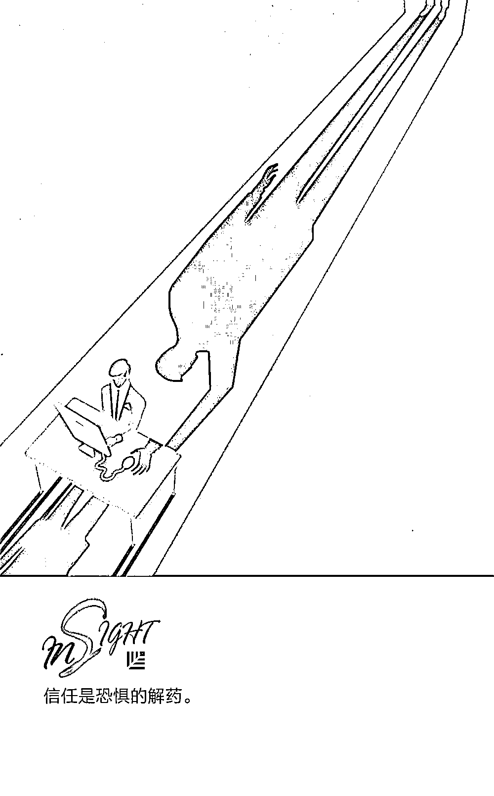

# 调查过全球 4300 多名领袖，我们找到了正确应对数字化的方法｜红杉汇内参

> 原文：[`mp.weixin.qq.com/s?__biz=MzAwODE5NDg3NQ==&mid=2651225109&idx=1&sn=3ad980aff3ede0d6488f64730bedb432&chksm=80804241b7f7cb57715d0126ce9c1702b90a77827e4eec3012f7c2d39512bbcd3dfbe617bebf&scene=21#wechat_redirect`](http://mp.weixin.qq.com/s?__biz=MzAwODE5NDg3NQ==&mid=2651225109&idx=1&sn=3ad980aff3ede0d6488f64730bedb432&chksm=80804241b7f7cb57715d0126ce9c1702b90a77827e4eec3012f7c2d39512bbcd3dfbe617bebf&scene=21#wechat_redirect)

[ 编者按 ] 适应日益数字化的市场环境，利用数字科技优化企业运营，带动新的顾客价值……几乎每个当代企业都将以上这些内容视为重要目标。令人欣喜的一面在于，许多公司正开始做出必要的改变，以适应数字环境。

《MIT 斯隆管理评论》和德勤在全球范围内调查了 4300 多名经理、CEO 和分析人士等，对 CEO 和思想领袖进行了 17 场采访，它们合作撰写的《2018 年数字化商业报告》发现，成熟的数字化企业总是支持适当分权，对大胆尝试抱有开放的心态，并积极寻找适合的人才。

然而，合适的数字化领袖并非评价企业数字化是否成熟的最重要因素，因为 50%以上成熟的数字化企业都需要新的领袖。那么，数字化商业和传统商业的区别到底是什么？如何正确应对数字化？

每期监测和精编中文视野之外的全球高价值情报，为你提供先人一步洞察机会的新鲜资讯，为你提供升级思维方式的深度内容，是为 **[ 红杉汇内参 ]**。

** 内参**

**数字化商业的本质**

编译 / 洪杉

《MIT 斯隆管理评论》和德勤在全球范围内做了一项广泛的研究，两者合作撰写的“数字化商业第四次年度报告”表明，当今的数字化商业环境与传统的商业环境之间有着根本区别：

▨ 成熟的数字化企业能够脱颖而出，不仅仅是因为数字化领袖的存在，更重要的是数字化领袖的培养。 

▨ 成熟的数字化企业实现了决策的深度落实。

▨ 数字化商业与传统商业的文化和思维模式不同，它的速度更快、灵活度更高、分散程度更高。

▨ 成熟的数字化企业更愿意尝试和重复。

**提高数字化成熟度**

**对企业来说意味着什么**

数字化成熟度表示企业对数字化商业环境的适应程度。今年我们第一次看到数字化成熟度有明显的提高。相较去年，受访者中认为自己所在的企业仍处于数字冲击早期阶段的比例约下降了 9 个点，认为企业处于发展或成熟阶段的比例分别上升了约 3 个点和 5 个点。

应对数字化变革时，老牌企业尤其面临巨大挑战，它们过去的辉煌历史将成为最大的拦路虎之一。许多与管理有关的文献通常将之称为能力陷阱，指的是错误地认为帮助自己在过去取得成功的因素也会帮助自己在未来取得成功。

然而，数字科技正在改变竞争版图，它提供了客户价值创造的新方式和新的服务机会，那些缔造辉煌历史的因素或许与未来的成功毫无关联。我们的数据表明，通常，老牌企业的数字化成熟度更低，它们更有可能还处在数字化的初期阶段，进入成熟阶段的可能性较小。

**数字化商业的不同之处**

受访者提及次数最多的差异是商业运作的速度。简单来说，数字化经营要求企业以前所未有的速度采取行动并做出回应。问题在于，目前企业里许多沟通架构和决策架构的运行速度低于所需。

排名第二的差异是文化和思维模式。受访者的回答都关注到改变企业文化的必要性，但是并非所有的回答都是完全积极的。许多受访者指出，这种文化转变会引发与思维较传统员工的冲突。

排名第三的差异是企业的组织结构。梅丽莎・瓦伦泰是斯坦福大学管理科学与工程系的助理教授，她说道，“公司的边界正发生着巨大的变化。在硅谷这里，我经常能听到人们讨论‘核心外围’这一概念”。在这个模型中，公司拥有一批计划进行投资和培养的核心员工，与此同时，又会巧妙地根据具体需求聘请外部人才。

排名第四的差异是生产力。德勤领先创新中心的联席主席约翰・哈格尔（John Hagel）称，“成本越低，速度越快，将效率提升至另一个水平的难度就会越高。但是，如果你将精力放在效用、影响力，放在提供给市场的价值上，进步的空间是没有止境的。”

**最大挑战是……**

我们询问了受访者，如果企业想在数字环境中立于不败之地，最需要克服什么挑战。

受访者指出，在数字环境下，企业参与竞争时面临的最大挑战是缺乏试验。位于澳洲墨尔本的澳新银行数字银行部门主管梅洛伊・卡内基称，每一天，一些年轻的数字企业都会在努力“实现自己目标”的过程中遭遇失败，“但它们却并不因此受挫”。相较而言，“对于失败的恐惧”已经根植于许多企业巨头的企业文化当中了。

卡内基解释说，“像谷歌这样的企业，它的目标就是要改变世界。也就是说，它给自己确定了一个遥不可攀、无法实现的使命。而老牌企业则为自己设立了可以实现、递增式的使命。导致的结果是显而易见的，如果你为某个递增的目标所奋斗，你也许能实现自己的目标，但与此同时，你也只能收获递增的小额回报。”

排名第二的挑战是企业该如何应对愈发模糊的边界和持续不断的变化。

排名第三的挑战是怎样购买和应用合适的技术。

**在反复试验中**

**促进企业的自主学习**

数字化变革所带来的其中一个重要挑战是，快速变化的数字环境呼唤更多探索和试验，甚至超出了多数企业能够承受的范围。试验是数字化成熟度的核心所在。

怎么样才算是有效的试验呢？我们问了三个关于试验的问题，发现数字化成熟企业更有可能创造出一个促进通过试验进行学习和创新的环境。它们激励公司上下分享和试验新灵感；鼓励通过反馈和反复的途径发现工作新方法；分享失败试验的经验，推动组织学习的发展。

与数字平台相比，在企业内部的试验进展速度也许会慢一些，但是，数字化程度不断加深的沟通方式和其他业务流程使快速试验成为可能，又或者说，创造了进行“自然实验”的机会。在这样的实验中，研究人员可以对日常业务程序产生的数据进行比较。

多数员工对使用新数据分析工具，来改善企业表现这种方法持开放的态度。人员分析可以帮助员工通过通讯和其他数字数据来比较自己和绩效最优秀者之间的行为，分析出与成功与否息息相关的行为差异。

然而，数字化成熟的企业做的可不仅仅是进行试验。

首先，它们明白试验本身是不足够的，除此之外还得扩大这些试验的规模。

第二，随着企业试验的增多，平衡试验（即习得新方式）和有效应用（即利用现有能力和既有做法）之间的压力也随之增大。数字化成熟的企业不一定比起步企业进行更多的试验，但它们却更加关注在探索新能力和应用既有能力之间获取平衡的必要性。

**培养领导者**

**而不仅仅是拥有领导者**

领导以持续学习和不断试验为特色的企业，需要领导者不断学习新技能、新方法、新能力。数字化转型中，更重要的在于转型而不在于数字化。如果你认为像移动网络或者物联网这样的东西，而不是个性化用户体验或者灵活的供应链，才是机会，你将会大大限制公司的发挥，错失通过重塑公司业务带来的大好机会。

有趣的是，数字转型成熟的企业更可能去培养它们未来需要的那类领导者。有 64%来自成熟期企业的受访者称他们已经采取有效的方式培养领导者，而创立初期的企业只有 14%。

这些数字转型领导者能为企业描绘愿景、指出目标；能够创造条件给人们试验的机会；允许不同想法的存在；愿意让人们进行跨领域合作。

**创造分权式领导文化**

我们发现，为了更好地在数字化的环境下运营，数字化成熟度高的企业更有可能将决策权下放到企业的较低层。超过半数的数字转型成熟度高的企业正在这样做，而只有不到四分之一的创立初期公司是这样做的。

在分权式决策环境中，应允许员工自主决策并有效领导。这意味着领导者需要改变他们的领导方式，包括如何制定和有施加有等级区分的命令，及如何施加控制和影响等方面。

我们还观察到，公司认为他们下放领导权的程度与他们实际执行的程度之间存在差异。虽然 59％的首席执行官认为他们正在推动决策权下放，但只有 33％的副总裁和部门主管级别的受访者表示实际情况也是如此。

这种脱节的部分原因可能在于，比起实际行动，领导者更愿意谈论下放决策权。企业领导不能放弃领导责任，但也不能拥有像以前那种程度的控制权，否则无法在数字环境中拥有敏锐的嗅觉和反应能力。

但是，也可能是员工不愿意站出来承担责任，老牌企业的员工尤其如此。当我们询问领导者、经理或员工谁更有可能促进或是阻碍企业转型时，受访者表示员工更有可能阻碍变革，尤其是成立时间较久的企业的员工。内部组织障碍往往是提高数字化成熟度的最大障碍。

** 预测**

**15～30 分钟**

智慧城市将有多智慧？麦肯锡全球研究院最新报告分析并预测：智能应用将能使上班族的通勤时间每天节省 15～30 分钟。除交通以外，在公共安全、健康、环境质量等方面亦有多多改善。

** 情报**

#一个困扰领导者的老问题#

**为什么你的团建没有用？**

常识告诉我们，快乐的协作型团队是富有成效的团队。不过，当领导者说出“团队建设”时，大多数人都想找个借口溜走。其实，满足以下五点，团队效率自然提升：

▨ 营养。你的团队渴望能一展他们在创意和战略方面的能力，用艰难的挑战来促进他们的发展吧。

▨ 独立。给予员工充分的独立性，他们也会报之以始终如一的用心工作。

▨ 时间。团队也需要完整的时间。他们的日程不能排满了会议。

▨ 空间。为你的团队提供空间（物理 or 心理）当礼物，无论是以什么形式。

▨ 温暖。虚伪的团队活动和建立信任的游戏只会引起大家反感。

#我们都是情绪化生物#

**高情商人士的 10 种品质**

▨ 同理心。牢牢记住你对他人情感做出回应以及换位思考时的感觉，想想怎样才能用自己希望被对待的方式对待别人。

▨ 自我认知。时常反省自己，同时向真实关心他人的人寻求反馈。

▨ 好奇心。好奇心商较高的人往往更能容忍模棱两可的事情，这种微妙、复杂、微妙的思维方式是复杂的本质。

▨ 分析性思维。不厌其烦地更新自己的心态，从而不断地完善自己，同时也要与时俱进，拥抱新想法。

▨ 信念。当你把信念和勤奋，毅力和积极的态度等可贵的价值结合起来，你就为成功打下了坚实的基础。

▨ 需求和欲望。情商高的人知道两者之间的区别,总是在满足欲望之前先满足自己的需求。

▨ 激情。真正的激情从不需要言说，它可以自然流露。

▨ 乐观。快乐是中心，成功则围绕着快乐。

▨ 适应能力。你必须确定什么时候该停下，什么时候该继续前行。

▨ 帮助他人成功同时自己也渴望成功。这不仅能将嫉妒和贪婪拒之门外，同时也能使人保有热情，实现下一个目标。

** 推荐阅读**

壹

[新消费浪潮下，想抢红利必须知道这五大趋势](http://mp.weixin.qq.com/s?__biz=MzAwODE5NDg3NQ==&mid=2651225061&idx=1&sn=059a769941a88cc292560de46624b9cc&chksm=808045b1b7f7cca7069ef8e8c2ebd7f3a245b5e02f54530d69cfb1e6ceed39d0097cdb44068d&scene=21#wechat_redirect)

贰

[20 多年了，为什么求职网站的用户体验毫无改变？](http://mp.weixin.qq.com/s?__biz=MzAwODE5NDg3NQ==&mid=2651225105&idx=1&sn=6b3364b3a6535d4dc27b200987bc01c9&chksm=80804245b7f7cb533343dc88692918de591ef62f5ab5e23a02ea0d9364ca18976b7b5431ec5d&scene=21#wechat_redirect)

叁

[优秀产品都要经历的 S 型生命周期](http://mp.weixin.qq.com/s?__biz=MzAwODE5NDg3NQ==&mid=2651225074&idx=1&sn=10210e43e096388a7fd630bd4bed460e&chksm=808045a6b7f7ccb0f8a5eceada6fcecc47557fde9e964842b2696e0bd515f5bc5b467ca4e1a9&scene=21#wechat_redirect)

肆

[香港变形记：请让我更爱你一些｜《创科发展，人才先行》白皮书线上发布](http://mp.weixin.qq.com/s?__biz=MzAwODE5NDg3NQ==&mid=2651225084&idx=1&sn=bee83b7f49edafa4a2f0f563323b4bc3&chksm=808045a8b7f7ccbedd9564baabcc74065759c582838e827a97565942b86b62dc6b8c70749242&scene=21#wechat_redirect)

伍

[把一本书读好，比读一本好书更重要](http://mp.weixin.qq.com/s?__biz=MzAwODE5NDg3NQ==&mid=2651225093&idx=1&sn=4e426598f89c0280c3f63a0cfb79b1fc&chksm=80804251b7f7cb47e928a7130c69017dac331ba1ac219cce2337eb8b1076e56232bf5e9e6c0c&scene=21#wechat_redirect)

