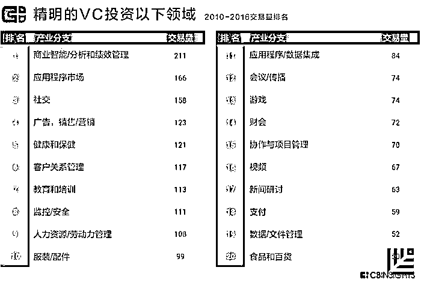
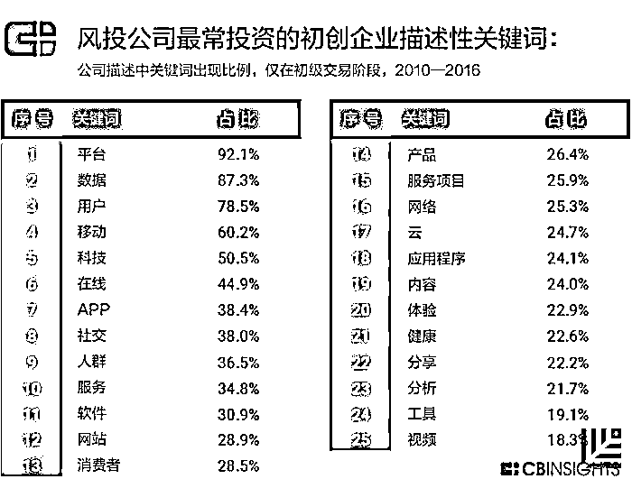
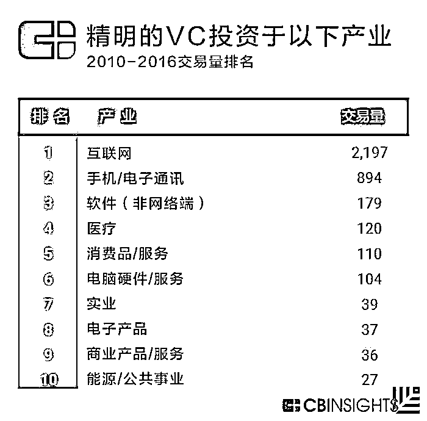
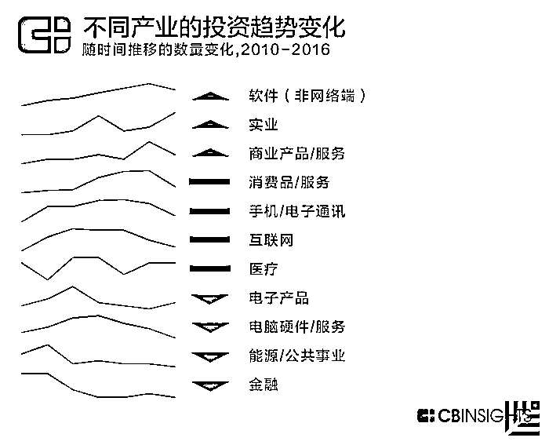
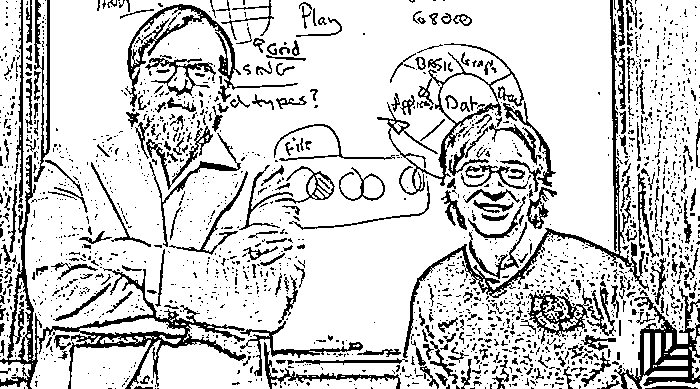

# 聪明的钱在流向哪里？24 家顶尖 VC 看好的未来产业｜红杉汇内参

> 原文：[`mp.weixin.qq.com/s?__biz=MzAwODE5NDg3NQ==&mid=2651222648&idx=1&sn=87dd6f15f5a6daa74caaf87b22e567f1&chksm=80804c2cb7f7c53a9c4e3e67ef3f86920c73af47c947ddd60791c6494eee9b85cad750ba748a&scene=21#wechat_redirect`](http://mp.weixin.qq.com/s?__biz=MzAwODE5NDg3NQ==&mid=2651222648&idx=1&sn=87dd6f15f5a6daa74caaf87b22e567f1&chksm=80804c2cb7f7c53a9c4e3e67ef3f86920c73af47c947ddd60791c6494eee9b85cad750ba748a&scene=21#wechat_redirect)

[ 编者按 ] 关于水门事件的电影《总统班底》里有一个著名的情节：当两位《华盛顿邮报》记者千辛万苦与爆料“深喉”取得联系后，后者只给了一个重要的建议：“Follow the money”。

Follow the money, find the truth——这句话同样适合于我们通过观察投资趋势，来发掘未来行业前景的真相。美国风投数据研究机构 CB Insights 做了这件事：它梳理了 24 家顶尖 VC 那些“聪明的钱”在过去 6 年中到底流向了何处，从而推演出，哪些行业和技术将是接下来的发展趋势。

结论是，健康、金融和人工智能是显而易见的趋势；商务智能、应用程序市场和社交领域在 2010-2016 年间获得早期投资最多；平台、数据、移动，成为大多数被投企业描述自己业务时频繁提及的关键词。

你在哪个赛道中？

每期监测和精编中文视野之外的全球高价值情报，为你提供先人一步洞察机会的新鲜资讯，为你提供升级思维方式的深度内容，是为 **[ 红杉汇内参 ]**。

***

**【本期悬念】**

1.有多少被美国顶尖 VC 投资的公司在用**人工智能**描述自己？答案是多了 10 倍——看看还有哪些领域被这些“聪明的钱”青睐吧！

2.机器智慧在增长：今年 AI 领域会迎来这 7 个变化。

3.创业者们，怎样在头脑中植入**企业家思维**？5 个建议。

***

**【每日金句】**

企业家这个岗位没有职责说明书，

每天都在面对未知领域。

要让自己成为“万事通”，

灵活应对各种疑难杂症，

并时时创造新的想法。

***

**【内参】**

**24 家顶尖 VC**

所看好的未来产业

综合编译/洪杉

**精**明的 VC 都有着让人羡慕的投资成绩，其投资组合往往包含着重要的信息，预示了科技和创新的发展方向。

美国风投数据研究机构 CB Insights 在研究了 24 家投资组合估值与投资回报两者俱佳的 VC 基金后（包括红杉资本在内），不仅梳理了近年来它们对初创企业的投资焦点变化，而且发现了哪些领域和行业在未来将更容易拿到早期投资。以下是 CB Insights 的研究结论。

**最重要的发现**

*   健康、保险和人工智能是显而易见的趋势——在被顶尖投资者们押注的公司里，其企业简介里，“保险”一词的出现频率增长了 20 倍，“人工智能”则增长了 10 倍，说明越来越多这类企业获得了青睐。

*   最有潜力的领域——2010 年至 2016 年间获得上述 VC 早期投资最多的有商务智能、应用程序市场和社交类公司。健康和保健领域、食品与运输业、协作与项目管理以及网络安全初创公司所获得的早期投资也有小幅上升。

*   表现最不尽人意的领域——电子商务与可再生能源两大领域衰退严重。

接下来，我们将深入探讨这些 VC 在领域、行业及产业层面的投资点是什么，以及它们的关注焦点是如何转移的。

**关键词：平台、数据、移动**

为了了解这些投资公司的整体投资趋势以及它们将赌注下在了哪里，我们研究了它们的被投企业的企业简介里最常出现的关键词。

超过 90%的初创公司都在自我描述里用了“平台”一词，87%的公司都提到了“数据”一词。不出所料，这些顶尖 VC 目前的投资焦点都在科技领域，像“平台”、“用户”、“移动”、“在线”、“app”、“软件”和“网络”等关键词出现频率都很高。

同时，我们研究了自 2010 年来在企业简介里使用率增幅最大和降幅最大的关键词，结果发现，“保险”一词的使用率增长了接近 25 倍，这与保险技术行业总交易量的增长是一致的。同样，“医疗”、“医生”及“健康”的使用率也出现增长，反映了这段时期内数字健康领域的投资平稳增长的事实。

“人工智能”的使用率增长量也超过了 10 倍。“人工智能”企业在 2016 年的交易量和交易金额都创历史新高。

在这段时间内，几乎没有公司使用“广告”一词了，而“Twitter”、“Facebook”和“Instagram”使用率的下降则反映了试图掘金社交领域的公司获得的早期投资越来越少。“亚马逊”一词使用率的下降与电商的衰退同步出现，而“能源”一词的淡出则说明了能源和公用事业所获得的投资也出现了下降。

**顶尖 VC 在投资什么：按行业划分**

在行业层面，我们发现这些精明的 VC 在网络软件与服务行业的投资项目最多。第二大类是移动端的软件和服务公司。其他值得关注的领域还有生物技术和消费类电子产品等。

这些投资模式是如何随着时间流逝而改变的呢？我们研究了自 2010 年来每个行业的投资项目数量的变化。

互联网和移动端的软件及服务，是投资项目数量最多及金额最大的两大行业。自 2010 年来，其各自的发展趋势有起有伏。2012 年网络软件的投资项目数量达到顶峰，之后缓慢下降；2013 年移动端软件则达到鼎盛期，随后也同样开始下滑。投资项目数量排名第三的电子商务行业则从 2012 年起呈现出明显的衰退迹象。

生物技术、医疗保健软件、消费类电子产品以及科研、工程软件都有发展向好的趋势，而药物研发领域则是有起有伏。

**顶尖 VC 在投资什么：按产业划分**

在产业层面，顶尖 VC 在互联网公司的早期投资项目最多，超过 2000 笔。

获得早期投资最多的第二大产业是移动产业公司，包括以智能手机为中心的公司，如 Snapchat、WhatsApp、Uber、HotelTonight 和 Flipboard 等。

这些投资趋势从 2010 年来都保持着不变吗？为了找出答案，我们逐年比对了每一个产业的早期投资数量，根据 2010 年至 2016 年间的数量变化，我们将这些产业分成了增长、下滑和有起有伏三类。

非网络端软件产业，包括像 Magic Leap 和 MongoDB 这样的公司，在 2010 年至 2016 年间的早期投资有所增长，对实业公司以及商业产品和服务类（绝大部分是咨询和外包公司）的投资也有所增加。

电脑硬件和服务、电子产品、能源和公用事业项目以及主要的可再生能源都出现了大幅度的下滑。消费类产品和服务、手机及电子通讯、互联网以及医疗保健则有起有伏。

***

**【情报】** 

#未来已来，只不过分布不均#

**今年值得关注的 7 大人工智能趋势**

*   工具民主化将使更多公司尝试人工智能技术。

*   针对某一特定领域的 AI 系统将会爆发式出现，而不是大型通用的 AI 系统。比如应用于工业制造和零售领域的机器人技术、自动驾驶交通工具、机器人语音助理等。

*   自动化程度提高所带来的经济影响将得到更多讨在注意力经济中，那些帮助克服信息过载的系统将变得更加复杂。

*   在建模、记忆优化等方面的 AI 系统的根本问题将取得研究进展。

*   人机互动将更加丰富。

*   与 AI 有关的道德和隐私风险进入人们的视野。

#不只是商人思维#

**创业者如何拥有企业家思维？**

企业的长久发展建立在不断调整自己的思维模式基础上。以下 5 条建议帮你拥有企业家的思维模式——

*   每天做一件让你害怕的事，培养自己的冒险能力。当你走出了舒适区，便已经跨出了创业最艰难的一步。

*   快思慢想。学会如何在眨眼之间做出评估与判断，还要相信自己的选择一定会成功。

*   用好奇代替对未知的恐惧。企业家这个岗位没有职责说明，每天都在面对未知的领域，要让自己成为一个“万事通”，能够灵活应对各种疑难杂症，并时时创造新的想法。

*   勇于承认商业上的错误并从中吸取教训。

*   不要问，去做。

*******

**【往期回顾】**

红杉汇内参第 021 期

[克服管理「巴别塔」](http://mp.weixin.qq.com/s?__biz=MzAwODE5NDg3NQ==&mid=2651222617&idx=1&sn=2efba23b6ccaf20c5d81821493654ca0&chksm=80804c0db7f7c51b9db057fb5057b7b3b6f08faeeeb31b5c974c95838dae7365632d20bcecd9&scene=21#wechat_redirect)

[让战略与执行“知行合一”的 10 个法则](http://mp.weixin.qq.com/s?__biz=MzAwODE5NDg3NQ==&mid=2651222617&idx=1&sn=2efba23b6ccaf20c5d81821493654ca0&chksm=80804c0db7f7c51b9db057fb5057b7b3b6f08faeeeb31b5c974c95838dae7365632d20bcecd9&scene=21#wechat_redirect)

红杉汇内参第 020 期

[怎样处理联合创始人冲突？最佳 CP 是这样炼成的](http://mp.weixin.qq.com/s?__biz=MzAwODE5NDg3NQ==&mid=2651222545&idx=1&sn=07f72561a688138c402ba8b12616da16&chksm=80804c45b7f7c553ca02c6049c5eff6341808e922aea77e233693d5b42c3b4fe874799b20461&scene=21#wechat_redirect) 

红杉汇内参第 019 期

[为什么你需要一个 COO？](http://mp.weixin.qq.com/s?__biz=MzAwODE5NDg3NQ==&mid=2651222505&idx=1&sn=d72cfd0858c1815f419ad1e93961c0b9&chksm=80804fbdb7f7c6ab55aa1a01ba01a25d9c2e2f46381f95c0cfb7d51b09746443939c8a0c5f15&scene=21#wechat_redirect)[敢打赌你没有认真思考过](http://mp.weixin.qq.com/s?__biz=MzAwODE5NDg3NQ==&mid=2651222505&idx=1&sn=d72cfd0858c1815f419ad1e93961c0b9&chksm=80804fbdb7f7c6ab55aa1a01ba01a25d9c2e2f46381f95c0cfb7d51b09746443939c8a0c5f15&scene=21#wechat_redirect)

