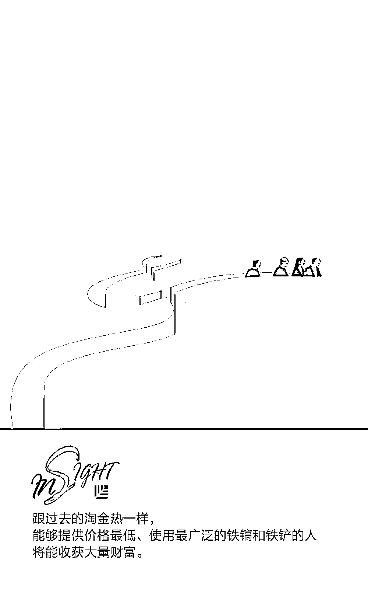
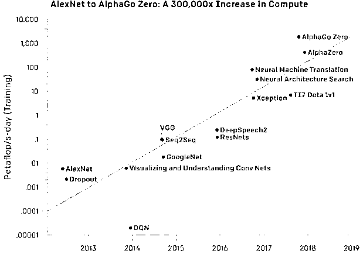

# 决定你能否淘到 AI 这桶金的 7 个问题｜红杉汇内参

> 原文：[`mp.weixin.qq.com/s?__biz=MzAwODE5NDg3NQ==&mid=2651224976&idx=1&sn=1dd0653a86fe833d15d437ce52520eab&chksm=808045c4b7f7ccd2719472384eb383e21078512d2233e88b8a5ee66a854535f72384c5ee733b&scene=21#wechat_redirect`](http://mp.weixin.qq.com/s?__biz=MzAwODE5NDg3NQ==&mid=2651224976&idx=1&sn=1dd0653a86fe833d15d437ce52520eab&chksm=808045c4b7f7ccd2719472384eb383e21078512d2233e88b8a5ee66a854535f72384c5ee733b&scene=21#wechat_redirect)

[ 编者按 ] 又一场淘金热拉开了帷幕，而这次角逐的战场是人工智能。从日搜索量达 35 亿次的谷歌、支持面部识别的新一代苹果 iPhone X，到能够贴心回答我们问题的亚马逊 Alexa 智能助理，AI 无处不在。它可以帮助医生确诊病症、协助银行评估客户贷款风险、助力市场营销者定位并留住客户……制造商可以用 AI 来改善质量控制，智库也正致力于研究 AI 所带来的物理、网络和政治风险。

然而，正如所有淘金热一样，我们关心的是，谁能够找到金子？是无数专注于淘洗砂金的初创企业？是能够进行大型挖矿作业的公司？还是提供铁镐和铁铲的科技巨头？而哪些国家又拥有储量最丰富的金矿？

每期监测和精编中文视野之外的全球高价值情报，为你提供先人一步洞察机会的新鲜资讯，为你提供升级思维方式的深度内容，是为 **[ 红杉汇内参 ]**。

** 内参**

**谁将成为**

**AI 淘金热中的大赢家？**

作者 / Simon Greenman

编译 / 洪杉

AI 正在我们中间掀起一场淘金热。谷歌、亚马逊、微软和 IBM 投身于重量级混战之中，2016 年，它们对 AI 的投资超过了 200 亿美元。另一方面，中国高度支持 AI 的发展；不愿落后于中国和美国的欧盟，则计划对 AI 投资 220 亿美元。

AI 和机器学习将会越来越普遍，渗透到社会方方面面。但正如所有淘金热一样，我们关心的是，谁能够找到金子？

找出答案之前，先问七个问题。

尽管计算能力的成本已呈指数级下降，但对它的需求却在以前所未有的速度增加着。AI 和机器学习拥有着庞大的数据集和达万亿次的向量矩阵计算能力，它们对计算资源的需求是惊人且不知餍足的。而此时芯片便粉墨登场了。

英伟达的股票在过去两年里上涨了 1500%，这得益于它们的图形处理器（GPU）芯片。谷歌最近发布了它的第二代 TPU，而微软正在研发自己的 Brainwave AI 机器学习芯片。与此同时，初创企业，例如已经募资超过 1.1 亿美元的 Graphcore，也正步入市场。

有一点是不言而喻的，那就是，设计制造芯片并巩固作为全球芯片领导者地位的成本是相当高昂的，它需要雄厚的资金，以及世界顶尖硬件和软件工程师组成的团队。这意味着初创企业中最终只有极少数能够笑到最后，成为赢家。跟过去的淘金热一样，能够提供价格最低、使用最广泛的铁镐和铁铲的人将能收获大量财富。

关于 AI 的竞争同样在云端开辟了战场。亚马逊很早就意识到，初创企业更倾向于租用而非直接购买计算机和软件。为此，它在 2006 年推出了亚马逊 AWS 的云服务平台。如今，AI 对计算能力的需求之高，促使越来越多的公司选择使用基础设施即服务供应商（IaaS）和平台即服务供应商（PaaS）提供的服务。

亚马逊、微软、谷歌和 IBM 之间的厮杀将会延续到这个领域里，同时来自中国的云端大型企业也值得关注。铁镐和铁铲的供应巨头将会再次获得胜利。

目前，谷歌是世界最大的 AI 企业，汇聚了全球最顶尖的 AI 人才，研发预算堪比小国 GDP，而得益于数十亿旗下各类服务用户的贡献，谷歌更是坐拥着最好的数据集。

而支持着谷歌所有 AI 活动的一流 AI 机器学习软件和算法——TensorFlow，现在可以免费使用了。没错，完全免费！谷歌为什么要这样做呢？谷歌大脑团队负责人杰夫・迪恩说，现在世界上有 2000 万家企业能够从机器学习中获益。假设上百万家企业都使用该款顶尖且免费的 AI 软件，它们便很有可能需要更加强大的计算能力。那么哪一家能够提供最好的服务呢？毫无疑问，针对 TensorFlow 和相关的 AI 服务，谷歌云端平台当然是最优的选择。

除了机器学习算法，认知算法也是群雄逐鹿的领域。认知算法为对话代理和机器人、语音、自然语言处理（NLP）和语义、视觉和增强核心算法提供服务。

在这个领域里，胜利女神很可能再次眷顾科技巨头，因为他们能够聘请最杰出的研究和工程人才，投入最多的资金，访问最大的数据集。 

企业软件领域与前面介绍的领域相比要开放得多，存在着真正称得上数量众多的初创企业为这些使用案例提供单点解决方案。如今，单是在招聘这个方向就有 200 余家 AI 驱动的企业，当中大多是 AI 初创企业。

如果能够迅速展示出自己有能力根据企业的现实需求，研发出解决方案并不断扩大解决范围，许多企业软件初创企业都能拥有积极的发展前景。然而在软件淘金热中，每个类别能够笑到最后的往往不过寥寥数人。而对于 AI 企业软件类别里的赢家，它们跟最优秀的工具提供商一样，如果被认为构成了过大威胁，就会迅速被科技巨头所收购。

人工智能正在促使各方竞相寻求最佳的行业垂直解决方案。大量以人工智能为动力的新兴公司都致力于为医疗保健、金融服务、农业、汽车、法律和工业领域中的企业提供应用场景的解决方案。

显然，许多创业公司的解决方案都颇具价值，如果这些公司能够获得以下资源，就会取得成功：

▨ 大量专有数据培训集；

▨ 能够使其洞悉行业机会的专业知识；

▨ 大量人工智能应用领域的人才；

▨ 大量资金以维持快速增长；

▨ 完善的市场打入计划，用以传达自己在客户、商业效率及投资回报率上的商业理念。

尽管企业可能会从新的业内供应商处寻求人工智能解决方案，以增加营收和利润，但它们不会袖手旁观，任由这些自命不凡的后来者插足抢占自己的客户。大公司有自己的风投团队，可以投资创业公司，确保自己在人工智能驱动创新上处于领先地位。

数据是人工智能和机器学习的燃料。相较创业公司和规模较小的公司，大公司依靠自己的数据资产从而具有明显优势。例如，某间拥有更多有关保险索赔历史数据的保险公司，某间对消费者的金融产品购买行为无所不知的金融服务公司，某间拥有更多用户信息搜索记录的搜索引擎公司……

中国在人工智能竞争上大展拳脚。它在增加技术人才，发展创业企业上投资巨大。中国的移动市场的规模是美国的三倍，移动支付的规模超美国 50 倍，也就是说，中国有着巨大的数据优势。

近日，英德法日均宣布了国家人工智能战略。英法两国会对谷歌聘用的博士进行补贴吗？人工智能所创造的多数经济效益可能都流向了谷歌、谷歌的股东和整个产业。

人工智能将提高公司和国家的生产力，带来更多财富。然而，多数效益流向了少数控制人工智能技术和数据的公司和国家。一些国家的技术能力低，经济又有赖于那些易被人工智能自动化取代的工作，它们很可能会受到冲击。人工智能更有利于大国和科技强国。

那么，这意味着什么？

人工智能淘金热似乎更有利于那些拥有大量顶级人工智能工具和技术、数据、顶尖技术人员、客户最多、财力最为雄厚的企业和国家。规模较大的个体将从人工智能的经济效益中分得最大一杯羹。

也有一些创业公司勇往无畏，淘得一些大金块。但和所有的淘金热一样，多数创业公司得到的只是烂泥，无功而返。许多个人和团体也会觉得自己并未从淘金热中得到好处。

** 读数**

**3.43 个月**

OpenAI 报告称，从 2012 年开始，AI 训练所用的计算量呈现指数增长，平均每 **3.43 **个月便会翻倍。而 PC 时代的摩尔定律的翻倍时间则是 18 个月。

** 情报**

#这里是天堂，也是地狱#

**硅谷初创企业的生存法则**

▨ 实现客户互动个性化，并应用大数据分析和人工智能来调整个性化举措的结果。

▨ 提高效能，对现代化模式或创新方法可以发挥重要作用的领域进行改进。

▨ 尽可能让你的创意和创意的实践过程变得简单易懂，确保你的产品便于用户使用。

▨ 要灵活变通，不要执着于某一个愿景。

▨ 跟上科技发展的进度，确保自己不会被那些已经步入第四次工业革命的人远远地甩在身后。

▨ 利用以前积累的行业经验，经过检验的创意和商业模式可以带来美好的机遇。

▨ 培养强大的企业文化，关注团队成员与客户交流的方式，以及他们对待工作的态度。

#懂得员工心理，才能更好管理#

**伟大的领导者都是心理学家**

▨ 融入自己的团队。除非人们感觉他们和你是平等的，否则他们会认为你是骗子。

▨ 战胜“光环”效应。所有决定都要建立在确凿的证据之上，而不是你的个人意见。

▨ 创造归属感。让员工认可公司，先认可他们的努力。

▨ 好好利用集体智慧。小组意见的重要来源往往是团队中最具号召力的人，确保这个人是你。

▨ 鼓励员工有主体意识。让人们走出舒适地带可以增强他们的个人主体意识。

▨ 确保平等分配权力。不要让某些成员感到自己没有其他成员重要或有价值。

▨ 缓解压力。把压力发泄在团队成员身上会使他们害怕你，同时压力倍增。

▨ 给予员工积极的压力。让每个人都知道最后期限，并且知道完成个人目标会更有成就感。

** 推荐阅读**

壹

[红杉×休利特，与商业前沿的眼睛来场对话 | Great Causes](http://mp.weixin.qq.com/s?__biz=MzAwODE5NDg3NQ==&mid=2651224962&idx=1&sn=917716d3a333e2f506ccffb630a00ba1&chksm=808045d6b7f7ccc0ba1028f7a429b087a91d7da01f400e8f60affd9f5f5c52fd4652c14694b4&scene=21#wechat_redirect)

贰

[一个人潜力高不高，就看这 3 点](http://mp.weixin.qq.com/s?__biz=MzAwODE5NDg3NQ==&mid=2651224970&idx=1&sn=5d6a110d764748bc28b6dff8d5ec53a6&chksm=808045deb7f7ccc8ca1d1d58e2bc97a9338a03046d5efa6d8ceb0c2e3b9b42d2dd956a0c9eb5&scene=21#wechat_redirect)

叁

[“十项全能”型人才怎么找？我谈谈我的看法](http://mp.weixin.qq.com/s?__biz=MzAwODE5NDg3NQ==&mid=2651224946&idx=1&sn=bafbbdb94867f1d5c718143df7fc59d2&chksm=80804526b7f7cc30a8303a94f5bc6c0d4d376650cd70c2be63be9ffaded34c3f7ae2d561b69c&scene=21#wechat_redirect)

肆

[设计到底有多重要？特赞创始人范凌用一份设计×人工智能报告回答你](http://mp.weixin.qq.com/s?__biz=MzAwODE5NDg3NQ==&mid=2651224949&idx=1&sn=4ca259ac9e8595dd5ef497a37af26614&chksm=80804521b7f7cc37bdb1828e181dfd78283afc969b289ce696ad2811fa4f5d594531aa09cdd0&scene=21#wechat_redirect)

伍

[说自己内向的人都是戏精，其实他们很会聊天！](http://mp.weixin.qq.com/s?__biz=MzAwODE5NDg3NQ==&mid=2651224958&idx=1&sn=c5982b352566a0abb1911d143011b747&chksm=8080452ab7f7cc3cb6e1a76238129414ec1b50fdea838bf3de8e962edf94cf0bf4ec7a93c499&scene=21#wechat_redirect)

