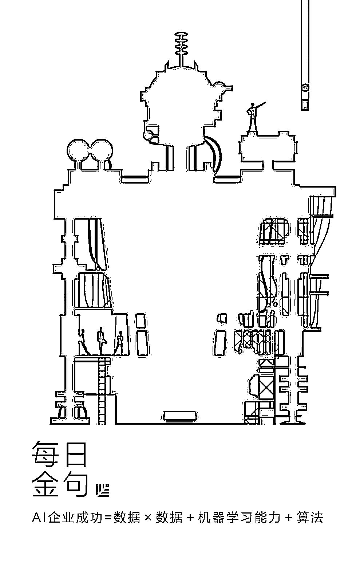
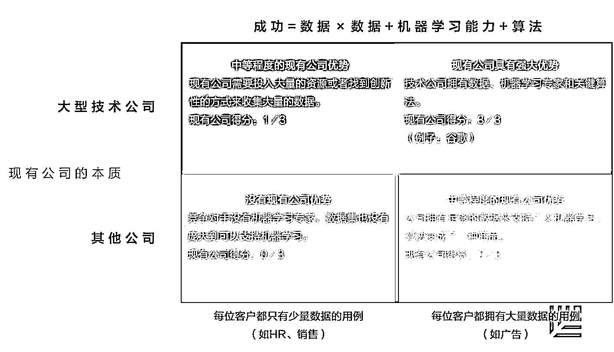
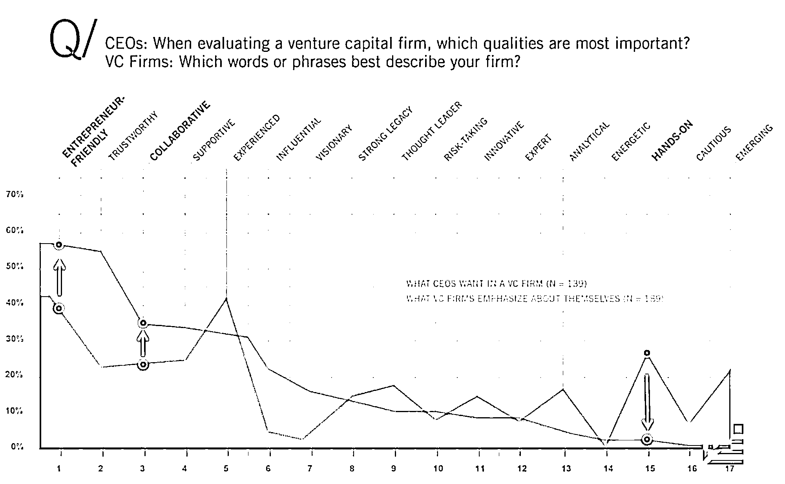

# AI 创业企业如何建立护城河｜红杉汇内参

> 原文：[`mp.weixin.qq.com/s?__biz=MzAwODE5NDg3NQ==&mid=2651223861&idx=1&sn=c859f6344f169b6484a686363f3a667b&chksm=80804961b7f7c0777dc84e8ac36fa24ec90a0b62c9f547aebbe881c7f25c88a9dcb05029e1a5&scene=21#wechat_redirect`](http://mp.weixin.qq.com/s?__biz=MzAwODE5NDg3NQ==&mid=2651223861&idx=1&sn=c859f6344f169b6484a686363f3a667b&chksm=80804961b7f7c0777dc84e8ac36fa24ec90a0b62c9f547aebbe881c7f25c88a9dcb05029e1a5&scene=21#wechat_redirect)

[ 编者按 ] 投资者最关注的事情之一就是创业者是否找到了自己的护城河。以及，在未来岁月里，你的护城河是否越挖越深。

在 AI 时代，一家希望在 AI 领域创业成功的公司的护城河是什么？不是算法，不是数据，而是数据的平方。

这对初创企业来说颇有难度，因为现有的数据都掌握在已成巍峨之势的大公司手里。本文正是为解答这一难题而来：小公司如何获得数据优势，上演大卫战胜歌利亚的逆袭故事？或者至少能够与强者共存？（在 [**“AI 双城记”超值学习报告**](http://mp.weixin.qq.com/s?__biz=MzAwODE5NDg3NQ==&mid=2651223788&idx=1&sn=31b8100111a76d4e7420e2d8e9810c65&chksm=808048b8b7f7c1ae1a3ba0a2213d592626d63166d7cb90eac2a95ce4e578345e56f47acbb229&scene=21#wechat_redirect)一文里，诸多全球 AI 大师其实也谈到了这一观点）

不再剧透，请阅主文。

每期监测和精编中文视野之外的全球高价值情报，为你提供先人一步洞察机会的新鲜资讯，为你提供升级思维方式的深度内容，是为 **[ 红杉汇内参 ]**。

** 内参**

AI 创业企业

**如何建立护城河**

作者 / Louis Coppey

综合编译 / 洪杉

投资无非就是要找到“护城河”，也就是某行业领域内一家公司独有的优势和强项。因为：

▨ 未来的预期现金流预示了公司的估值；

▨ 盈利的能力预示了未来的预期现金流；

▨ 而护城河则预示了盈利的能力。

为什么护城河预示了盈利的能力？很简单，因为护城河增强了一家公司与其供应商和顾客的议价能力，帮助公司提高产品价格、降低成本，以此获得更多利润。各个市场里现有的网络效应就是护城河的一个绝佳例子。以 Airbnb 来说，如果有越多的房出租，就越有可能吸引更多的房东自己找上门来，在 Airbnb 上发布房源。这样就形成了闭环，其他平台就很难进入这个市场了。

这种机制产生了一种“赢家通吃”的态势，最大最强的那家公司常常会比它的竞争对手们大出几个数量级。这也是为什么投资者喜欢这类独角兽的原因。

**AI 为何如此特别？**

现在，AI 浪潮引起人们关注的是，它带来了一种新型网络效应，有人将其称为“**数据网络效应**”。机器学习的算法需要数据来支撑。虽然算法和数据之间并不存在线性关系，但机器学习的算法在接受了大量的数据后，处理预测/分类性任务的准确性变得更高了。

还有以下这种机制也值得注意：一家公司，随着其用户增多，会收集到越来越多的数据来训练和优化自己的算法，预测顾客喜好的精准度就越高，产品的总体质量也随之提升，这就会吸引更多的新顾客来购买产品，为公司提供更多数据。这样又形成一个闭环。

这就出现另一种自我增强型反馈环路，我们称之为“**人才吸引环路**”。一家公司拥有越多数据，它就越能吸引到数据研究者来该公司工作，就有更大的机会吸引到业内大神，打造出完美的机器学习产品。

但问题是，一家初创公司起初一点数据都没有（或只有一点数据），只能依靠一小群有才华的人（通常就是创始人）来维持运作。正如市场需要时间和资源来形成网络效应，AI 公司也需要初始数据来开始形成自己的增强环路。

而谁拥有这样的数据？

现有的大公司。

这就是为什么现有公司会凭着既有优势，有失公平地站在了人工智能这场浪潮的浪尖上。

不过，好消息是，现有的大公司也不是那么容易地就可以驾驭这股潮流。

**歌利亚可以战胜：**

**分析现有公司优势的框架**

以下这个公式可能可以用来解释 AI 公司成功的部分原因：

**AI 企业成功＝数据＋机器学习能力＋算法**

也就是，成功的、有市场竞争防御能力的 AI 公司有着足够多的数据让其机器学习可以用来创造出最佳的算法。

要想看清 AI 领域现有公司的优势，一个很有用的方法便是观察这个 2x2 矩阵，其中一条轴是每个用例里可用的数据总量，另一条轴则是这个用例里的公司的本质。

在大型科技公司的用例里，每个潜在的客户都拥有大量的数据，如果我们看这些用例，就会发现现有公司的优势十分明显。除了那些典型的优势外（如客源更广、更有能力去投资和承受损失），大型科技公司就像坐吃山不空，依靠的是多年积累的数据。

它们也从自己的品牌和强大的财力资源中获益，有能力去聘请最优秀的机器学习人才，让他们研发出最强大的算法。现有公司的得分：3／3。

**初创公司在这种情况下不应该跟现有科技公司硬碰硬。**

但现有公司在矩阵的这一块并没有很大优势，这就是右下方这一领域。这一块是非技术公司的主场，而且它们的每一位潜在客户都已经拥有了大量数据。想一想管理高速公路的运营商，它们就拥有着多年以来的收费站数据。

**历史已经证明，数据可能比算法更有价值，尤其是在深度学习登场后。**

此外，大型技术公司正不断地将最新的机器学习包开源出来，让算法变成了商品，尤其是在物体识别、自然语言处理领域——我们称为广义机器学习。有了广义机器学习，那些拥有大量数据集的非技术公司在使用开源数据包后得以获得相关的有用结果，而这些数据包先前都是用科技公司的数据集来训练的。

总的来说，一家大公司，无论它是不是科技公司，也不管内部有没有顶尖的机器学习专家，都可以比一家拥有顶尖机器学习专家的小公司创造出更优质的人工智能产品，因为它比小型初创公司拥有更多数据，就这么简单。

这样一来，我们就应该在方程式里更注重数据而不是机器学习的能力，所以，之前的公式应该修正为：

**AI 企业成功＝数据×数据＋机器学习能力＋算法**

对初创公司来说，这可能意味着大量机遇。尤其是如果初创公司能：

▨ **整合大型技术公司缺乏的多种信息源，或者：**

▨ **产生额外的专有数据。**

这个矩阵里剩下的左下角这一块，可能就存在着最大的机遇：技术公司没有参与进来，而客户也没有途径接触到足够庞大的数据集来让广义机器学习发挥作用。农业和医护的某些领域就是很好的例子，这些领域里还没有大型技术公司占据市场，而每个客户也只有少量数据。

**初创公司如何深挖护城河？**

上述新公式意味着，当数据一开始只有很少量的时候，它的影响就没有公式修正之前时那么大，机器学习能力和算法的权重就显得更大。在这种情况下，现有公司的优势就没有之前那么明显了。

这样计算的直接结果就是，当市场里数据稀少时，初创公司有机会凭借关键的机器学习能力和创新性的算法成为市场赢家。

以下三种相互关联的方法，可以解决数据稀少情况下如何启动创业的问题。

▨ **方法 1：从众多顾客身上收集数据**

虽然凭一家公司之力可能无法获得足够多的数据集来打造出一款高级 AI 产品，但如果一家 AI 初创公司从其主要客户中不断收集数据，形成自己的数据池，那它就有可能成为唯一一家产品能让顾客满意的公司。在这个过程中，所有相关方都需要贡献出自己获得的数据，让算法能够在更庞大的数据基础上得以训练，进而从中受益。

▨ **方法 2: （多个）智能系统**

如果我们再深入一点探究大数据集难以获得的其他原因，就会发现这些数据集不仅存在于不同客户之间，还存在于不同的 SaaS 工具里。

坐拥这两类数据集的 AI 初创公司就有非常大的可能做出最精准的预测，成为一种智能系统。

你可以把数据集看作是价值链上的互补性资产。刚成立的、看上去人畜无害的 AI 初创公司，可以与现有公司不屑于合作的客户合作，从而建立起互补性资产，在与现有公司的竞争中存活下来。

这种观点的逆反命题就是，任何一家依赖于单一、非专有数据的公司，其市场竞争抵御能力比那些结合多种数据来源的公司要低。

最后，我们回到了这个问题上：“谁在用我的数据赚钱？”——是那家产生数据的公司吗？是储存数据的公司吗？还是那家打造出了最佳机器学习产品的公司？

▨ **方法 3：获得特有用户生成的数据集**

如果一家公司无法从多方客户或多种 SaaS 工具里收集到数据，或者这些数据不足以让公司做出精准模型，那么它可以尝试从其对外提供的 SaaS 服务里产生额外的数据。这种独特的方式可以让公司获得专有的数据集，而其他现有公司无法获得。

**只需少量的时间、投入和金钱就可以获得足够多的数据来满足客户的期待，因此公司的防御能力相对有限。**这种情况尤其适用于所使用的数据可以公开获得的案例。

客户很有可能不会贡献他们的数据，而数据网络效应也需要经过漫长时期才能显现，所以公司的防御能力会越来越强。

数据稀少的第二种情况可能会让公司的防御能力大大增强，但也有可能会让公司过得很艰难。

最后一点就是，机器学习的防御能力和 SaaS 服务的防御能力并非相互排斥。非常详尽的产品发展蓝图、超赞的用户体验或用户/数据锁定，对 AI 公司构建自己的护城河都有重要的作用，这比依靠数据网络效应发展起来的防御能力要强。

** 情报**

#首先不要造成伤害#

**创业者真正想从投资人那里获得的**

▨ **我的投资人支持我吗？**尊重创业过程，富有同情心，知道如何倾听；知道何时该帮忙或插手。

▨ **有独特的变革型见解吗？**旁观者的好处是思维更清晰。

▨ **能帮我招募人才吗？**增强自身吸引力是充满激情的投资者真正吸引到优秀人才的一个方面。

▨ **能否帮助我获得资金？**对于创业公司来说，能否生存下来往往取决于是否能持续进入资本市场。投资人知道如何与其他投资者交谈，帮助设定阶段性目标，生成评估并降低风险。若是押上他们的名字和声誉，还能产生巨大影响，为后期投资者增强信心。企业家最终想知道的是投资人是否可以帮助度过重重难关。

这是一张来自 DeSantis Breindel 公司的图表，反映了创始人关心什么和投资者认为创始人关心什么之间的有趣差别：

#走夜路请放声歌唱#

**10 个方法打造令人惊喜的创业旅程**

没有一个 List 可以确保你的事业成功，但以下 10 个建议至少能让你的创业之路充满惊喜与可能。

▨ **设定有挑战的目标。**正如彼得・德鲁克所言，激励、培养并留住人才的最好办法是让他们面对挑战。

▨ **让自己和他人承担责任。**

▨ **参加 360 度评价。**没有什么比正确认识他人对自己的看法更难的了。

▨ **让用户成为你的“朋友圈”。**您的客户比您更了解您的产品。

▨ **学习型组织。**我们天生要做两件事情：学习和分享。但是，如果您的公司不是一个教学型公司，那就不可能成为一个学习型组织。

▨ **对员工家属施以关怀是最好的人才投资**。没什么比公司在上班时间禁止社交、隔离员工的配偶或恋人更荒唐的事了。

▨ **允许失败。**因为失败是创新的一部分。

▨ **讲故事****。**有关你公司的轶事、故事、战事需要一再提起，不要只依赖口口相传，把这些故事写下来或者拍成视频，让这些故事帮助你的公司实现定位。

▨ **传帮带的导师制。**同事指导是缩短成长时间、加强文化建设和实施战略的最强大工具之一。

▨ **及时为自己喝彩。**每年年会就像是一块路标，提醒我们走了多远，我们的旅程有多么精彩。************

** 推荐阅读**

壹

[让 5 亿用户为你做销售，解密科技行业最高效的商业模式](http://mp.weixin.qq.com/s?__biz=MzAwODE5NDg3NQ==&mid=2651223849&idx=1&sn=2d0b0ae73f47f26d1e39a401cca65c91&chksm=8080497db7f7c06b59fbaf49575f0d2d68f215b8e50f58304559d9ba5ca5223abf0e7ceced7f&scene=21#wechat_redirect)

贰

[核心员工拿了别家的 offer，可能是薪酬体系出了问题](http://mp.weixin.qq.com/s?__biz=MzAwODE5NDg3NQ==&mid=2651223856&idx=1&sn=a5ba89f3a37f727045d9ecb921e03733&chksm=80804964b7f7c0726017024ebdcf17ecc37018318c1d49ce0afd79bc8302c7b3e1edcd2bb555&scene=21#wechat_redirect)

叁

[【重磅】引领 IBM Watson Health 进入中国市场 中电数据红杉宽带共创医疗健康生态体系](http://mp.weixin.qq.com/s?__biz=MzAwODE5NDg3NQ==&mid=2651223836&idx=1&sn=20c09e2fbced73bd616009c59ee3e67f&chksm=80804948b7f7c05e900ebb96311efd8a5de505c90a007797b6e87cbe2021567018e18e311670&scene=21#wechat_redirect)

肆

[创始人不懂技术心慌慌？克服恐惧，学着讲个好故事吧](http://mp.weixin.qq.com/s?__biz=MzAwODE5NDg3NQ==&mid=2651223840&idx=1&sn=8aa598844baf6c0ef2d2711273227d52&chksm=80804974b7f7c062536f82d0499f839b81ee74d5726bd5be9c9d4ab58f84e8167789ce5dad88&scene=21#wechat_redirect)

伍

[树的精神。创业的精神。向死而生的精神。｜红杉林徒步记](http://mp.weixin.qq.com/s?__biz=MzAwODE5NDg3NQ==&mid=2651223844&idx=1&sn=329ab06ac7833e2a67467319be49270d&chksm=80804970b7f7c06614b117e2fd9ae8e48770e011efaf1a7090d0a9bacb51bf792574e463f2cc&scene=21#wechat_redirect)

