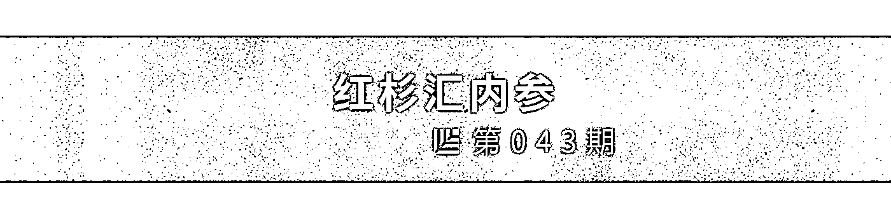

# Airbnb、Dropbox 们就这样解决了你创业最难的事：如何获取种子用户｜红杉汇内参

> 原文：[`mp.weixin.qq.com/s?__biz=MzAwODE5NDg3NQ==&mid=2651223480&idx=1&sn=7122cba38687c7cc66bd37f181fbf2f3&chksm=80804becb7f7c2fad962183801d3e775aab6dbe616b8966de929ec520216031ac3e51b9d9956&scene=21#wechat_redirect`](http://mp.weixin.qq.com/s?__biz=MzAwODE5NDg3NQ==&mid=2651223480&idx=1&sn=7122cba38687c7cc66bd37f181fbf2f3&chksm=80804becb7f7c2fad962183801d3e775aab6dbe616b8966de929ec520216031ac3e51b9d9956&scene=21#wechat_redirect)

[ 编者按 ] 许多互联网公司在创业初期，最难的事不是产品研发，而是如何发展、获取有价值的种子用户（Seed Users）。这一批人最接近产品定位，并直接影响产品日后的口碑传播及辐射范围。更重要的是，他们可能是社区平台类产品优质内容的主要提供者。

获取种子用户，除了下大功夫去挖掘相关领域的骨灰级用户，有时还要耍一些“小手段”。

以 Dropbox 为例，创始人早期曾在有狂热粉丝聚集的 Digg 上发布一个充满 Geek 才懂的暗语“彩蛋”视频，该视频迅速在 Digg 上窜到第一。结果，Dropbox 的 Beta 版还没发布，就已经有 75000 个用户在 Waiting List 上排着。Dropbox 甚至因为瞬间大流量进入，造成服务器宕机。

除此之外，你还可以借力媒体、竞争对手、网络社区、大学生联谊会等。每一家成功的创业公司，都有属于自己的“拉新大法”。

每期监测和精编中文视野之外的全球高价值情报，为你提供先人一步洞察机会的新鲜资讯，为你提供升级思维方式的深度内容，是为 **[ 红杉汇内参 ]**。

** 内参**

**Airbnb、Dropbox 们**

**就这样解决了你创业最难的事：**

**如何获取种子用户**

综合编译 / 洪杉

**Airbnb：暗黑成长**

Airbnb 最著名的“暗黑成长”级营销手段，就是从竞争对手——分类信息网站 Craigslist 上分到一杯羹。当时，Craigslist 拥有 Airbnb 艳羡的海量用户，于是他们推出一项功能：只要点击链接，用户在 Airbnb 发布信息的同时，就能将信息同步到 Craigslist 上，尽管 Craigslist 并没有提供现成接口。

用户还会收到一封邮件：告知用户如果点击链接，可以帮助你每月增加高达约 500 美元的收入。

于是，用户不假思索地点击链接。这次成功的技术营销为 Airbnb 带来几大回报：首先，来自 Craigslist 的回流撑起 Airbnb 的人气，更多人注册，发布更多出租信息；其次，原本习惯去 Craigslist 发布信息的用户，开始变成 Airbnb 的用户，因为现在只要点一下链接，发布的信息就能同时出现在两处；最后，原本的 Airbnb 用户黏性更强了，因为他们确确实实在这里获得更多收入。

**Uber：极致体验，口口相传**

为了找到 Uber 的首批司机，特拉维斯・卡拉尼克给 10 位高级轿车司机打了推销电话，按小时给他们付费，让他们试用 Uber 打车平台，其中 3 位司机最终同意试用。

之后，为了激励乘客，Uber 在科技人群密集的旧金山社区为当地活动提供免费乘车服务，并努力使每次乘车体验尽可能做到极致。按照卡拉尼克的说法，口口相传是 Uber 销售的最大驱动因素，Uber 几乎没有在传统营销上花钱。

**“我说的是传统的口口相传，人们在办公室的饮水机旁，在餐厅结账时，在和朋友参加聚会时，都在说‘谁打 Uber 回家？’。我们 95% 的乘客都从别的 Uber 乘客那里听说过 Uber 。”**

**Etsy：因地制宜，量体裁衣**

Etsy 是一个手工制品在线销售的网站。十分幸运的是，在创业想法形成之前，创始人就遇到了一个呼吁建立手工艺品交易市场的大型社区。

起初，Etsy 团队的成员都是从事自由工作的网页设计师，他们有个名为 getcrafty.com 的工艺品论坛客户。在网站改版过程中，Etsy 团队与网站的 10000 位用户进行互动，了解他们的需求。这让他们注意到有大量用户正在寻找销售其手工艺品的平台。

构建 Etsy 时，他们发现了拥有 100000 名用户的论坛 Craftster.org，由此他们成功从设计界打入另一个极具潜力的市场。

**“我们延伸了予人方便的桥梁，连接早已存在的网络社区，于是他们高兴地跳了上来。”联合创始人克里斯・马圭尔（Chris Maguire）说。**

两个月后，网站上线运营并迅速吸纳首批用户。Etsy 团队随后尽其所能去帮助这些来自全国手工艺博览会的商家，无论在线上还是线下都一样给予大力支持。通过吸引买家登陆 Etsy 网站，给予卖家支持，他们能够持续地连接买卖双边市场。

**交友软件 Tinder：**

**想目标用户之所想**

Tinder 创始人当初将大学视作最难说服使用这款应用的市场，因为当时在线约会的污名化程度比如今要高得多。

怎样吸引大学生的关注？开趴是一个方法。**办各种午餐派对，只允许在手机上下载过 Tinder 的人参加。然后，Tinder 团队挪到下一所大学再做一遍。**

Tinder 同样意识到他们当时服务的是一个双边市场。Tinder 的联合创始人、营销负责人惠特尼・沃尔夫（Whitney Wolfe）当初想到向女大学生联谊会进行推广，这个点子对 Tinder 的早期发展贡献颇多。她最终离开了 Tinder 并创立了约会应用 Bumble。

沃尔夫前往美国各地的女大学生联谊会进行推介前，Tinder 只有不到 5000 名用户。推介完成后，这个数字增长到 15000。**Tinder 后来的成功很大程度上归功于它首先将约会体验游戏化及其非常直观的用户界面。**

当然，别以为获得首批种子用户后就赢了。有意思的是，这些公司一开始的用户数似乎对于他们最终的成功没有影响。Uber 严格说来是以 3 位司机起家，Airbnb 则以 3 张床垫起家。

获得首批少数用户之后做什么显然更重要。初创公司孵化器 Y Combinator 的保罗・格雷汉姆（Paul Graham）曾说道：“你要从产品发布中得到的，只是参加这次发布会的一小群初始用户。产品在几个月后的成绩就取决于你能把这些初始用户伺候得多开心，而不是一开始有多少用户。” 

** 情报**

#别笑，在职场制造快乐是件严肃的事#

**80% 的主管说：融入企业文化幽默感很重要**

根据哈佛和斯坦福大学的研究，工作场所往往是笑声的干涸之地。婴儿每天笑大约 400 次，当我们步入 35 岁，每天只笑 15 次。工作无趣甚至让“笑声干涸”从周一持续到周五。因此，让员工充满活力，并创造一个积极向上的企业文化，欢笑和幽默必不可少。

▨ **欢笑使我们专注于手中的工作。**新南威尔士大学心理学专家说：“人们越来越能认识到幽默可能对工作场所的重要行为产生质的影响，幽默感会提高员工的工作效率。”

▨ **搞笑者天生是优秀的团队建设者。**猎头公司 Accountemps 执行董事 Mike Steinitz 说：员工的幽默感能鼓舞士气并改善同事间的合作。此外，幽默还能减轻犯错引发的负面情绪，让员工从小挫折中恢复信心。

▨ **精心设计的笑话能传达智慧和信心。**你开玩笑的方式会改变人们对你的看法。通常情况下，讲笑话的人比不讲笑话的人更有自信。如果你讲的笑话不能被别人理解，或者这个笑话很无理，会被他人认为你能力不足。

▨ **笑声能改善员工的健康状况。**笑能给职场带来许多明显的益处：帮助人们控制抑郁和焦虑；让我们的血管开放，从而提高身体抵抗力；让你感到更加放松从而提升创造力，缓解压力，让你不会不知所措等。

＃省钱、省力、省时间＃

**创业公司别死撑，该外包时就外包**

对于初创公司来说，要想不断创新和发展，时间、金钱和资源是必备因素，而大多数初创公司都缺失这三个因素。雇佣外包公司可以很好地解决这一问题。

▨ **节约成本。**外包人员可按工作节奏自由雇佣。

▨ **获得专业技能。**创业公司预算有限，很难吸引优秀员工加入，通过外包就能以低廉成本轻松招揽到全世界才华横溢的专业人员。

▨ **减少人力资源管理。**如果内部员工突然生病，意味着他负责的业务需要暂停，这将影响整体生产率。大多数外包公司能够提供一周左右的支持，这样就不必再为员工生病或休假担心。

▨ **更强大的团队。**永远不要低估与一群熟练且热情的人合作所迸发出的力量。有了外包公司的辅助，你可以轻松换掉不满意的员工，专注打造地表最强团队。

＃20 亿 Z 世代将成为世界主宰＃

**未来，推动企业“进化”的 6 种力量**

从 2015 年开始，95 后陆续进入劳动力市场，他们被称为 Z 世代，其全球规模达 20 亿人。 Z 世代的行为以技术为基础，包括社交媒体，可穿戴、植入设备及增强现实。这些行为带动六种力量，重塑企业未来。

▨** 超高速连接。**到了 2100 年，个人拥有设备数量将是现在的 100 倍，每个人、设备都将被连接到一起。你需要利用大数据和探测设备密切了解顾客行为，并赋予个性化互动。

▨ **打破世代局限。**2100 年，全球幼儿和 65 岁老人的比例将达到 1:1，现在是 3:1。这种人口分布变化会破坏地区乃至全球的商业和社会机构。如果不能打破世代标签的局限，企业终将被世代间断层所吞噬。

▨ **影响力极度提升。**广告预算不再是影响 Z 世代决策的最关键因素。Z 世代人具有强大的影响力，你要学会倾听 Z 世代的需求并做出回应，否则就要沦为社交媒体上的牺牲品。

▨** 弹弓效应。**无需十年，任何人都会获得连接到互联网的机会。忽略这股力量就是忽略与 Z 世代建立联系并携手共进的最大机会。

▨ **世界是我的课堂。**在线课堂有望颠覆高等教育，创造一支接受过全球化教育的劳动力队伍。如果你连一个介绍产品和服务的 YouTube 视频都没有，就别指望所有人把你当回事。

▨ **打破束缚。**Z 世代相信自由市场可以带来极致的高效率，且不受任何束缚。这意味着如果无法把企业与你所在市场的深层目的联系起来，你就只会阻碍进步——最终 Z 世代会绕过你继续前进。****

** 推荐阅读**

壹

[穿越 55km 大漠无人区，我们染上了一种叫“吃苦受虐”的瘾，但找到了创业的冷酷真相](http://mp.weixin.qq.com/s?__biz=MzAwODE5NDg3NQ==&mid=2651223473&idx=1&sn=afc2958b1cd70b196e40ff842092c3ac&chksm=80804be5b7f7c2f389390461a305bd1a8da6d8308e6cd3c809eb82d84f3bb49114e6ab19b210&scene=21#wechat_redirect)

贰

[GE 伊梅尔特谢幕，他留下一份领导力法则](http://mp.weixin.qq.com/s?__biz=MzAwODE5NDg3NQ==&mid=2651223476&idx=1&sn=c721dc89a59dffd24cd390bcabd1a482&chksm=80804be0b7f7c2f6a0b6fc6446266d77ac2dc67d9a5725be5b0fe5f4e0c06784a12b65318f87&scene=21#wechat_redirect)

叁

[爆款遇冷、合伙人分手、现金流断裂……这是一份真诚的创业避雷指南](http://mp.weixin.qq.com/s?__biz=MzAwODE5NDg3NQ==&mid=2651223463&idx=1&sn=3cbae8d1ac1f26c707f7d2b11f659bee&chksm=80804bf3b7f7c2e50ae96f37a06c4752faf48e44f5ac5bf912a0ea39fa3540a44676c0170021&scene=21#wechat_redirect)

肆

[毛大庆：创业公司基因比商业逻辑更重要](http://mp.weixin.qq.com/s?__biz=MzAwODE5NDg3NQ==&mid=2651223464&idx=1&sn=f796cf602285aa3d490242ea70316580&chksm=80804bfcb7f7c2ea169c164c4cbafc10a4eac0b450ee3f3f7b25aece59089853f9ced49f46a7&scene=21#wechat_redirect)

伍

[暑期书单推荐｜历经苦难依旧触不到巅峰？这 12 本书道出改变世界的正确方式](http://mp.weixin.qq.com/s?__biz=MzAwODE5NDg3NQ==&mid=2651223470&idx=1&sn=00e617671980a8c1a3b34f0c7c72be6e&chksm=80804bfab7f7c2ecafffc08458c49b10a660afc3458084e81b69f165c78394baead9ca988c18&scene=21#wechat_redirect)

