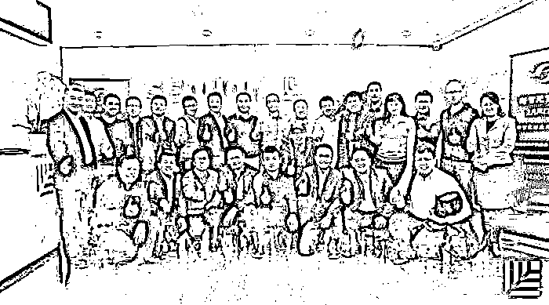

# 计越聊 AI：中国科技创新的时间折叠与创业机遇

> 原文：[`mp.weixin.qq.com/s?__biz=MzAwODE5NDg3NQ==&mid=2651222627&idx=1&sn=8fe77654782b556d14f510b786c9f753&chksm=80804c37b7f7c5212bab84d46a309faa0ab7bf7a1321be5f320805d113f25ff6df8228a3c184&scene=21#wechat_redirect`](http://mp.weixin.qq.com/s?__biz=MzAwODE5NDg3NQ==&mid=2651222627&idx=1&sn=8fe77654782b556d14f510b786c9f753&chksm=80804c37b7f7c5212bab84d46a309faa0ab7bf7a1321be5f320805d113f25ff6df8228a3c184&scene=21#wechat_redirect)

2 月 22 日，“新智元”百人会 2 月闭门论坛暨”新智元“创业大赛评审会在位于北京华贸中心的红杉资本中国基金会议室召开。来自投资界、企业界和学术界 25 名评审坐阵，对现场的 20 家人工智能领域的创业公司进行了点评。

红杉资本中国基金专注人工智能投资的合伙人计越作为东道主代表参加了活动，并接受了“新智元”的专访，他在专访中谈到了对人工智能创业的许多看法，部分要点如下：

*   中美的投资没有本质差别，都是看项目本身的价值。但是中美过去历史发展阶段不一样，这可能给中国创业者带来更多的机会。中国的发展阶段浓缩了，呈现跳跃性和并行发展的状态。

*   脱离了使用场景的人工智能没有意义。to C 的公司要和实际的生活场景结合， 给消费者带来更好的使用价值和体验；to B 的公司要和垂直行业的商业逻辑相结合， 给商业用户带来实实在在的价值。

*   投资人不是股票交易员，风险投资是长跑，而不是一朝一夕的事，投资人需要保持好奇心、同理心、平常心。

以下为经过编辑的专访内容及当日活动的精彩回顾。

***

**【每日金句】**

AI 需要跟使用场景紧密结合，

否则即使再高超的科技，

消费者也不会买账。

***

**云计算、SaaS、大数据、人工智能**

**四个创新周期在中国压缩成一体**

**在**一个全球化、国界逐渐模糊的时代，国家之间的差距变得越来越小。中国的投资人开始投资很多跨境项目，那么怎么对比国内和国外的创业机会呢？计越清晰地表达了他的观点：全球化趋势无法避免，全球化某种程度是过去技术发展积累而来的商业结果。

> 他说：“在这种趋势之下，创业者会更有利于做跨国市场，投资人自然而然有了更多跨境投资机会，红杉中国一定也会顺应这个趋势。红杉于 1972 年起源于美国，这方面有更大的全球资源优势。”

而对于中美项目的投资没有本质差别，都是看项目本身的价值。但是中美过去历史发展阶段不一样，这可能给中国创业者带来更多的机会。美国的发展经过了四五十年，早期从基础设施到软件，再到云计算和大数据，以及到现在的人工智能，它每一个阶段的发展时间都很长。**中国的发展阶段浓缩了，呈现跳跃性和并行发展的状态**。

计越接受采访时表示：“中国没有传统的 Oracle、SAP 这类大型软件产品型公司，而中国各行业现已告别了过去粗放式增长的模式， 都转向靠技术提升效率的方式，这对于 IT 服务产生了巨大需求，中国云计算和 SaaS 行业因此发展很快。于是在美国历史上经历过云计算、SaaS、大数据、人工智能的四个创新周期在中国一起迸发。”

“这导致四位一体的创新周期被快速压缩，所以在中国市场，利用云计算的基础设施结合了 SaaS、大数据和人工智能几个方面为一体的创新公司比美国要多。由于美国原来的 IT 巨头积累足够多，新兴的创新公司需要找市场缝隙来切入。 而在中国， 传统软件公司的优势并不明显， 创业公司可以通过 SaaS 的形式来解决传统软件的需求，同时也可以帮助用户整理数据，还能用人工智能技术做进一步的数据分析和挖掘。从这个角度看，中国的创业机会比美国大。”

至于中国人工智能基础建设和人才方面，计越认为中国目前发展得很快。不论是阿里云、腾讯云这样的基础平台，还是国外的英伟达芯片等硬件设施都已经发展的很好了，在全球化的态势下，中国创业者也在享受这些红利。

人才方面，有很多华人在硅谷从事技术方面的研究， 国内 BAT 这些互联网巨头们也培养了很多这方面的技术和产品人才。可以说人才和基础设施的必备条件达到了，中国已经具备了一个很好的起点。

**AI 创业的护城河：**

**在行业纵深领域做到极致**

中国已经经历了门户网站、社交网站、移动互联网、O2O 等等，在这些浪潮中红杉中国投了很多优秀的项目。在新浪潮下的每一个趋势演变之中，红杉中国都会在行业的发展初期积极参与，包括眼下火热的人工智能。在各界纷纷认定人工智能浪潮即将到来的时候，计越并没有过多把人工智能标签化。

他表示，首先人工智能本身也是处于产业发展早期阶段。对于他而言，**人工智能应该与商业相结合，而不能为了“人工智能”的标签而去做人工智能**。最首要的是技术跟趋势结合之后能给用户带来实在的好处。

他认为不管什么浪潮、什么技术，公司必须要解决实际问题和痛点，脱离这些都没有意义。所以回归到真正有意义的层面，需有两个切入点：

> *   to C 要和实际的使用场景结合， 给消费者带来更好的使用价值和体验；
>     
>     
> *   to B 要和垂直行业的商业逻辑相结合， 给商业用户带来实实在在的价值，比如效率提升，或者让商业用户能更好地服务他们的客户 。

“针对 C 端产品， AI 技术的价值就是应该帮助实现更好或者更便利的用户体验。通过这种更好的用户体验来吸引巨大的用户量，这样人工智能才能获得大量数据， 从而发挥出更大作用，反之又使消费者体验得到进一步提升，从而获取更多用户量，产生良性循环。”计越对新智元说。

他以亚马逊 Echo 为例，消费者最开始可能就是把它当成一个音箱使用，可能最重要的场景就是能更方便地听自己喜欢的音乐，但是它有一个云端 AI 技术、语音技术，使得这个音箱更好地理解消费者，提升体验，之后获取更多用户和数据，再延伸出来其它功能，例如语音的交互。

计越再三强调：**AI 需要跟使用场景紧密结合，否则即使再高超的科技，消费者也不会买账**。当被问及 To C 的应用主要在哪些领域会出现独角兽时，计越表示这是无法断定的，需要根据所投的具体项目具体分析。

在 B 端创业，需要在行业纵深里面做垂直行业的应用。每个行业特征不一样，比如说金融、医疗数据结构不一样，使用方法也不一样。一定要在一个领域扎的很深，才会获得足够多的数据，达到一个比较好的应用效果。比如红杉中国所投资的推想科技，其侧重点在医疗，通过医学影像进行识别。

他们团队很了解医生的需求，本身又能得到新的医疗数据，不断迭代提高准确率。在这些数据量比较多的金融、医疗、公共安全领域、教育等领域，数据有待挖掘，它们可能产生很大价值。甚至在游戏领域，例如《西部世界》中所描述的人类在虚拟的“西部世界”娱乐，就是人工智能技术和游戏的结合，只不过电影中的人工智能更为发达。

计越说：“我们不需要一个一开始就是泛泛的、什么事都能做的大平台的创业思维，这对于小公司很危险，这是巨头想干的事情。”创业公司不论 to B 还是 to C，把一个点做到极致，这是非常不容易的，也是 AI 创业的护城河。

**很难在早期预判一家百亿美元公司**

创投人一旦在早期押中了一个百亿美元巨型公司，可能就换来成百上千倍甚至更高的回报。计越认为很难在创业初期阶段就能预测到这家企业是否能成长为一家百亿美元公司。

通常行业早期都不被大家看好的创业公司有时候反而能成为大平台公司，太早期就搞平台化、被大家一致看好的公司反而机会比较小。真正能把握用户需求的公司，在创业初期不被看好、被大巨头忽视的情况下，赢得了时间窗口，不会面临那么多竞争，反而机会更大。

**「好奇心、同理心、平常心」**

采访最后，计越也简单分享了他在创投领域的一些心得：

首先要有强烈的好奇心。他认为创投是站在前沿的，工作的本质是要不停地到新领域去开拓，就好比人类的发展。人类最早来源于非洲，扩散到欧洲、亚洲，发现新的大陆，迁移到美洲乃至全球各地。

但每一次迁移过程中有很多风险，在这个过程中，很多人都为此失去了生命。 但总有人会想到熟悉的边界之外去看看，这是人类与生俱来的好奇心。这跟创业和创投都是一样，需要探索新的边界，要不断学习新的知识， 并能承担风险去尝试。 

其次要有同理心。对于投资来讲，同理心对于理解产品模式很重要，你需要站在用户的角度去体验产品。另外一方面，投资和创业是一个共赢的游戏，投资人需要知道创业者每个阶段最关心什么，有哪些困惑，从而看看是否能提供一些自己力所能及的帮助。 

最后要保持平常心。**投资人不是一个股票交易员，交易员也许需要每天很紧张、时刻保持高度亢奋，需要不断地买进卖出。但是风险投资是一个长跑，不是一朝一夕的事情，可能需要好几年才看到成果，而且创业永远是失败的几率远大于成功的几率**。 因此需要保持一颗平常心， 能够在自己喜欢的一些领域内保持专注，有所取舍。

***

**【活动回顾】**

“我们做 AI 创业大赛的一个初衷，就是希望把资本界的力量和技术领袖在 AI 领域的专业度结合起来。”“新智元”创始人杨静在活动开始前说到。

从当天的评审团队构成来看，共 15 名顶级 VC 参与，除东道主红杉资本中国基金外，蓝驰创投、IDG 资本等也参与了活动；而产业界的代表则包括联想 CTO 芮勇、英特尔中国研究院院长宋继强、三星电子中国研究院院长张代君、腾讯 AI Lab 负责人张潼、奇虎 360 首席科学家颜水成等；学术界代表有北京大学教授黄铁军和北京航空航天大学教授王田苗。

在当日的活动中，25 位评委针对每一个入选项目进行了严格而多维度的 “拷问”，提问与评语都非常犀利，直指要害。 我们在此摘录了现场出现频次较高的问题，从中我们或许可以看到，对于 AI 创业，投资人与技术大咖们共同关心的问题有哪些。

**第一问: 创始人团队如何？**

奇虎 360 首席科学家颜水成在对某计算机视觉公司进行打分时，非常简洁地指出：人工智能，天使轮“投人”是核心。

但评审们似乎对这种人工智能背景只持参考态度，其中微软加速器罗斌说道：“有一些公司或许没有真正的人工智能技术，但其实大数据、云计算本身就是人工智能。”

**第二问：你的技术能够带来什么？**

本次大赛中的创始团队中不乏院士、博导、海归博士，其技术能力毋庸置疑，但创业毕竟是用商业模式说话的，技术出身的技术人员很可能对这些方面思考不足。因此无论技术占比有多少，想成为独角兽，商业应用场景永远都是出发点。

归纳起来，评审们的观点是：“不要只强调深度学习，‘技术+’垂直场景是关键”。

**第三问：技术壁垒在哪？**

技术壁垒是大家一致关心的问题。在对某家以情感计算为核心技术的创业公司进行评分时，评委问到：有具体介绍类脑计算对话的资料吗？情感计算有什么样的模态？在对某一助理类应用提供商进行评分时，评审会问：分配机制怎么决定，是人决定吗？而在材料和软硬件结合的企业中，评审格外关注中美技术目前的发展情况。

**第四问：赛道天花板在哪？应用场景在哪里？**

人工智能来临，商业或重新洗牌、尸鸿遍野，创业公司最难的是在产业中把握方向。传统巨头待改革，互联网公司有数据优势，而赛道和应用场景是每一个项目都会被问到的问题。

北京大学教授黄铁军作为来自学术界的评审代表，对人脸识别的应用场景进行了评价：大家知道监控市场很大，真正人脸识别技术在里面发挥的作用有限，其中还存在很多问题。虽然那里面的钱很多，但是大家现在都没赚到。

**第五问：收入情况怎样？**

在评审过程中，有评委认为人脸识别公司最大的问题是变现渠道。所以，对于一家创业公司来说，目前的收入情况也是评审们评价的一个重要指标。在本次评审会中，我们已经看到一些千万级收入的企业。

