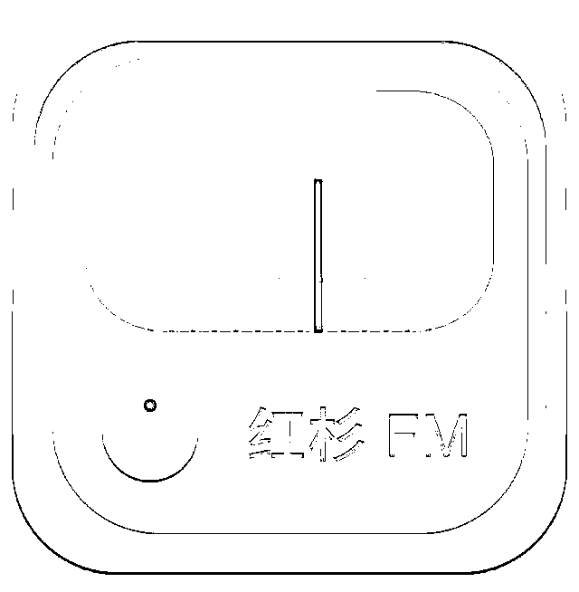

# 红杉 FM 首播｜孙谦：我们来谈谈智能硬件的过去、现在与未来

> 原文：[`mp.weixin.qq.com/s?__biz=MzAwODE5NDg3NQ==&mid=2651224065&idx=1&sn=4a33a2b3f6aacb763b8ab3e2121ad0c1&chksm=80804655b7f7cf4322bb4f4170d97716dc4d8ff7c8634b102b94df941bfa1dee43d7af43927d&scene=21#wechat_redirect`](http://mp.weixin.qq.com/s?__biz=MzAwODE5NDg3NQ==&mid=2651224065&idx=1&sn=4a33a2b3f6aacb763b8ab3e2121ad0c1&chksm=80804655b7f7cf4322bb4f4170d97716dc4d8ff7c8634b102b94df941bfa1dee43d7af43927d&scene=21#wechat_redirect)

**孙谦**  红杉资本中国基金合伙人，重点关注科技/传媒领域的投资。他拥有哈佛大学学士、工商管理硕士和法学博士学位。

**红杉 FM **

「红杉汇」努力在做一份创业者的商业内参，亦希望成为创投连接的开放平台。今天，在这里诞生的红杉 FM 栏目，将由红杉中国的合伙人与投资团队持续提供有价值的输出，内容来自我们的思考与实践。我们希望能够藉此与您更加自在地连接并相互汲取信息与知识。

各位红杉汇的读者，大家好，我是红杉资本中国基金的合伙人孙谦，今天来跟大家聊一聊我对智能硬件的一些思考。很多人问我，前几年市场一度认为智能硬件是个即将爆发的风口，现在看，是不是预期落空了？

**首先，这个领域还是出了一些大公司**，比如小米，它的生态链是非常有代表性的，公司的销售规模从零攀升到千亿级别，也是行业当中的一个奇迹；还有大疆创新，是在中国诞生的世界领先的一家无人机、智能硬件公司，它的软硬件、品牌、技术都是全球领先。当然，其它的明星企业还有一些，比如红杉投资的蔚来汽车等等。

我们必须承认，做智能硬件确实有它的困难之处，首先是要有一个成熟的供应链，同时要求发展起智能技术，在软硬件双方面同时做到最好，难度本身就非常大。所以相比较起来，似乎没有互联网创业在同时期看上去那么多、那么繁荣。

但是你要注意到，小米和大疆的成功已经证明了这个领域的潜力，你是有做出大公司的机会的。尤其是作为中国公司，我们在深圳有强大的硬件供应链体系，给中国企业带来了天然的创业优势。

**如果把智能硬件的概念放宽泛一点时，你会发现新能源汽车这一巨大品类当中，还是有很大的创业潜力。**汽车目前有几个大的发展趋势：一方面是电动取代油；另外一方面，是汽车本身的智能化；第三是无人驾驶，这个领域已经有大量资本介入，也是非常值得大家期待的。

说完成绩，再来谈一谈我对智能硬件领域投资的遗憾。

当我回头去复盘的时候，会发现过去的 5-10 年的时间里，在风险投资领域有一次系统性的错失——就是以智能硬件的硬件核心零部件产业。

我们现在可以看到，在香港上市瑞声科技市值早就超过了 1600-1700 亿港币，做光学镜头的舜宇光学市值是 1400-1500 亿港币，在台湾上市的大立光，市值大概 100-200 亿美金，这些公司都是智能硬件产业链里的重要企业，原本有很多投资机会，但是并没有被大多数风险投资基金抓住。

尤其是要考虑到，这条产业链基本上都在中国，很多手机核心零部件的产业在中国发展起来来，但是美资风投将其系统性地错过了，非常可惜。

当我们回过头来反思的时候，发现这场错失里面也有一些客观因素：

▨ **第一，有些公司在 2004-2005 年就已经上市，在挂牌时候，市值并不太高。**iPhone 直到 2007 年才出现，所以有些企业是上市以后，才慢慢切入智能手机的供应链里面，再次获得快速成长。而对风险投资来说，二级市场不是大家特别关注的一个方向，这是一方面的原因。

▨ **第二，对很多零部件生产商来说，一旦切入客户的产业链，它的现金流马上就会变正，所以从外界融资的需求也不是特别大，因此风险投资也很获得到机会。**

所以在这个产业中，美资背景的风投几乎是系统性错过，可能有些人民币基金参与过一部分，但真正实现高额回报的，少之又少。

作为投资行业的从业者，我当然希望这种错失越少越好。在我看来，资本市场发展到现在，资本供给非常充足，信息更加透明，又有大公司的明星效应，所以这种大规模的错过，应该会越来越少。

最后，我们来谈谈未来。

我们之前投了一个做 AR 镜片的企业，在中国，我觉得有比较大的机会大概有几条线：**首先，手机的核心零部件是仍然会有机会的；第二，一个相对系统的机会围绕着新能源汽车，无人驾驶。其中，不管是整车还是汽车的产业链，都有非常大的系统性的投资机会；第三，是更前沿的领域，比如 VR、AR。**

智能硬件这一行，对创业者的要求确实不简单，要找到一个确实足够痛的痛点，又能做出好的产品，确实是非常难的事情。我们也投资了一些早期的项目，同时有足够的耐性陪着创业者一起成长。**从我的角度看，投资人应该保持积极、开放、敏锐的心态，智能硬件行业仍然大有可为。**************

**赠**

**礼**

只要在文末给我们留言

且留言获点 👍 最多的

前 **10** 位粉丝

每人将直接获得

红杉中国定制 T-shirt 一件

- 活动有效期至 2017 年 12 月 1 日 0 点 -

** 推荐阅读**

壹

[红杉资本刘星三谈新零售：下一站在哪里？](http://mp.weixin.qq.com/s?__biz=MzAwODE5NDg3NQ==&mid=2651224010&idx=1&sn=383baf867e1ea808cb83ab28c0d2f28d&chksm=8080499eb7f7c0882e116de5d8edc527e326d3f6453d6d6e91fad07c0640c553bbfff343c60e&scene=21#wechat_redirect)

贰

[如何向候选人发出有竞争力的 Offer，提高招聘成功率](http://mp.weixin.qq.com/s?__biz=MzAwODE5NDg3NQ==&mid=2651224018&idx=1&sn=444ce7b4d3ae7bb5bef325293d5bdace&chksm=80804986b7f7c090d41b4525e6a575b6ffd4c0d64654b9f445d5c3a0b766b01e6f5000659fb4&scene=21#wechat_redirect)

叁

[［依图科技创始人］AI 新时代：因为看见，所以相信](http://mp.weixin.qq.com/s?__biz=MzAwODE5NDg3NQ==&mid=2651224029&idx=1&sn=d964749d4d8b3c81e2eca5b30661596d&chksm=80804989b7f7c09fa828e4f78fbe37a0d76e69bbcc452509168f9ae1ed4179d25740416158be&scene=21#wechat_redirect)

肆

[进击的斗鱼：3 年 70776%的营收增速如何炼成？](http://mp.weixin.qq.com/s?__biz=MzAwODE5NDg3NQ==&mid=2651224043&idx=1&sn=bda83242f0b1b927048d179d231588e9&chksm=808049bfb7f7c0a9d9874606f596237759a7acbc6d64696565276af2a8da828529bca7ac1dd1&scene=21#wechat_redirect)

伍

[郝景芳新书：与人工智能相比，人类的可贵之处](http://mp.weixin.qq.com/s?__biz=MzAwODE5NDg3NQ==&mid=2651224050&idx=1&sn=e22165b4ffc8d73706e5e789c53ecaba&chksm=808049a6b7f7c0b0f054442b4eb10a2d15fad3978c3e73a9cf4eb9d1c9f5e3cf4d60b3b59ac1&scene=21#wechat_redirect)

