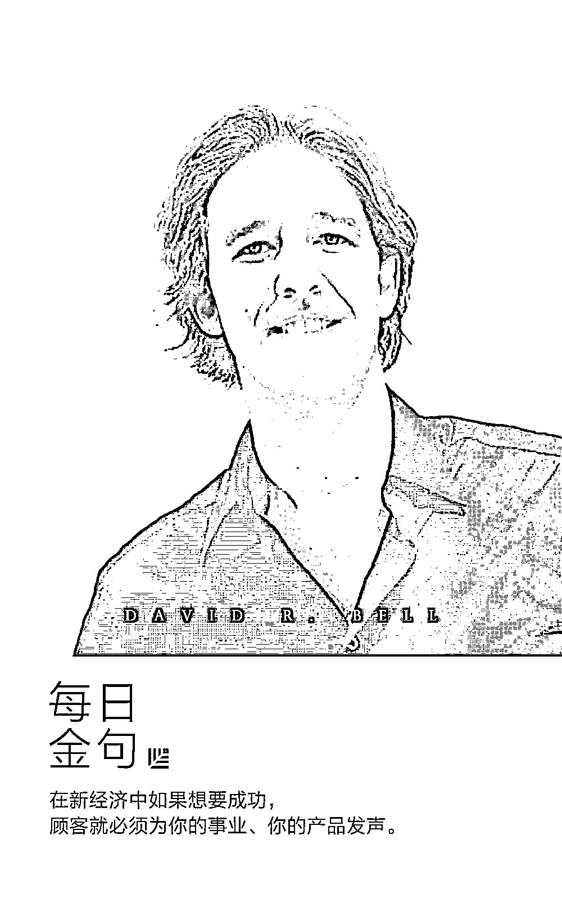

# 沃顿商学院教授：玩转新零售的简单 4 要素

> 原文：[`mp.weixin.qq.com/s?__biz=MzAwODE5NDg3NQ==&mid=2651224445&idx=1&sn=2de1f88e94c67fafeabc04bd5bed5a74&chksm=80804729b7f7ce3f3d7bb6ad8c66a8fd57726cbd94f2564a03ef459aa187774525a3b02a5768&scene=21#wechat_redirect`](http://mp.weixin.qq.com/s?__biz=MzAwODE5NDg3NQ==&mid=2651224445&idx=1&sn=2de1f88e94c67fafeabc04bd5bed5a74&chksm=80804729b7f7ce3f3d7bb6ad8c66a8fd57726cbd94f2564a03ef459aa187774525a3b02a5768&scene=21#wechat_redirect)

沃顿商学院教授大卫・贝尔（David R. Bell）在零售领域的教学和研究造诣颇深，曾出版过畅销书《不可消失的门店》（Location is still everything），这是第一部全面深度阐释新零售时代电商与实体门店如何可持续发展的著作。他在书中率先提出了新零售引力法则“G-R-A-V-I-T-Y”，该法则强调的是商店的“位置”。

经过进一步观察研究，并受到亚马逊的创始人杰夫・贝佐斯践行“为顾客把事情简单化”的启发，贝尔教授探索出了关于新零售的新模式——“B-O-S-S”模式。“B-O-S-S”模式涵盖了四要素：绑定、达人、实体展厅和科学。与 Gravity 法则相比，“B-O-S-S”模式更关注消费者的位置。近日，《中欧商业评论》专访贝尔教授，探讨了对未来零售业新模式的思考。以下是部分要点摘录：

▨ 在新经济中如果想要成功，顾客就必须为你的事业、你的产品发声。

▨ 科学背后的潜台词是“我了解你，不用问就能通过大数据推测你喜欢什么”。

▨ 有两件事是电商们可以做的：第一件是仔细思考如何设计包装。第二件是思考如何促进消费者和其他消费者分享他们购买的产品。 

▨ 回到“B-O-S-S”模式，电商需要多思考“O”，也就是达人。 

▨ 线下商店不会消失，只需要转变模式。对线上和线下商店来说，最重要的是要合作，要携手共进。

**“B-O-S-S”是什么，不是什么**

****Q：**可否谈谈“B-O-S-S”模式的具体含义？**

**大卫・贝尔**：“B-O-S-S”中的第一个 B，表示的是“绑定”（Bonding），而不是品牌（Branding）。品牌像一个标志，比如路易威登的皮带或者葆蝶家的鞋。绑定表示的是一种关系，在我生活的社区中，如果我觉得你很真实坦率，就会和朋友谈到你，因为我觉得这是一种情感联系。商家也是一样。所以，在新零售中我们强调紧密的关系。

“O”是一个很棒的英语单词 Orators，达人，原意指那些口才很好的人，而不是传统意义上的顾客（Customers）。在新经济中如果想要成功，顾客就必须为你的事业、你的产品发声。这些发声的“达人”可以是非常著名的人，比如说名演员；也可以是关键意见领袖，比如 YouTube 上的红人；或者只是普通人，仅仅因为喜欢这个产品，单纯想和别人分享。我研究过美国最成功的商业范例，都常常用达人思维来推广自己。

第一个“S”表示实体展厅（Showrooms），而不是商店（Stores）。在数字经济中，实体展厅是个好主意。因为有商店就意味着会有产品存货，需要具有销售经验的人员。但这对数字经济来说其实是非常糟糕的。

20 年前，美国大汽车经销商可能有 1000 辆汽车的库存，所需场地很大，买一辆就取走一辆。但现在，特斯拉的汽车经销商场地很小，不能直接提车，只能体验品牌。实体展厅就是用来体验的。

最后一个 S 表示科学（Science），而不是服务（Service）。服务是问“我能帮你吗？你想买什么？”，但科学背后的潜台词是“我了解你，不用问就能通过大数据推测你喜欢什么”。

美国有家著名公司叫 Stitch Fix，位于旧金山，CEO 是位哈佛商学院毕业的女士，只有 34 岁。公司的理念非常简单，就是利用大数据。她会给你邮寄一箱东西，里面可能有三件衬衫，两件夹克，一些鞋。你喜欢就留下，不喜欢就退回去。随着数据记录你收下的每一件东西，寄来的东西会越来越符合你的口味。这也是为什么这家公司才成立六年就能价值 20 亿美元的奥秘。

总的来说，“B-O-S-S”模式涵盖了四要素：绑定、达人、实体展厅和科学。

**Q：是什么促使你开始思考“B-O-S-S”模式的？**

**大卫・贝尔**：一开始，我对一些新公司进行观察研究。它们成立时间比较短，也许只有五年十年，但正在改变商业模式。比如世界第一剃须刀公司吉列，它现在是宝洁旗下的公司，2005 年它的买入价格是 570 亿美元。但后来有一家新创于洛杉矶的订阅服务网站“一美元剃须刀俱乐部”横空出世，它在 YouTube 上发布有趣的广告，向邮购替换刀片的用户每月最低只收 1 美元。低廉的价格、富有传播力的宣传策略使得它拿走了吉列公司 10%的市场份额。从那时起，我就开始思考“B-O-S-S”模式。

此外，我还受到亚马逊的创始人杰夫・贝佐斯的启发。我认为亚马逊会击败苹果，成为世界上最有价值的公司。贝佐斯总是思考如何为顾客把事情简单化，这也是为什么我要思考“B-O-S-S”模式。顾客不需要思考，不需要带信用卡，不需要做任何事，我会一直为你提供更好的体验，更好的产品，更低的价格，让一切变得最简单。那也是我的理念。

**Q：要是直接念的话，可以叫“老板”理论。那在你心里，谁是真正的老板呢？**

**大卫・贝尔**：真正的老板还是顾客。思考概念时，我常常喜欢用英文缩略词。我的中国同事总是把我的行程安排得很满，于是我开玩笑叫她“老板”，后来大家发现这个模式提出来，它的缩略语正好可以叫做“B-O-S-S”。这也蛮有趣的。

**口碑背后的社交习得和社交资本**

**Q：消费者的口碑是推动销售的有效手段。你的研究对此有什么发现？**

**大卫・贝尔**：我可以先谈谈社交习得和社交资本这两个概念。前者表示的是人际之间信息传递，可以通过交谈，也可以通过观察获得。对于电商来说，社交习得尤为重要，因为消费者可以直接或间接地向其他人展示产品。正因为如此，产品的包装不可忽视。设想一下，我在网上买了产品邮寄到我在纽约的公寓，如果包装盒上有非常漂亮的颜色和设计，运送过程中就能吸引所有人去关注它，这就像是在为自己打广告。这就是社交习得的一个例子。

社交资本则更多地关注人们之间的交流，比如这个社区的人们喜欢彼此吗？信任彼此吗？我发现，如果熟悉且信任你的邻居，当信息在邻居间彼此分享的时候，真实度就更高，社区的社交习得就更有效。用经济学术语来说，传递的信号就越强。

社交资本这一理念来自哈佛大学教授罗伯特・帕特南，他曾帮助奥巴马总统赢得选举，他擅长的就是研究社区。比如移民家庭的社交资本相对就很强。当然，我说的“邻里”是一个整体概念，可以是微信上的好友，住在同一社区的邻居，也可以是生活中的朋友、同事。

**Q：社交习得与社交资本的研究对推动在线零售有作用吗？**

**大卫・贝尔**：非常重要。因为电商都希望消费者能宣传它们的产品信息。如果产品和包装有一些标志性符号那就更好了，就会有更多方式去鼓励大家讨论或者展示这些产品，这也是社交习得的一种方式。就像中国或者美国的共享单车一样，大家在大街小巷看到它们，就会了解到一些新信息。

有两件事是电商们可以做的：第一件是仔细思考如何设计包装。第二件是思考如何促进消费者和其他消费者分享他们购买的产品。

电商最大的优点就是可以面向全国乃至全世界销售产品，市场非常大。但难在一开始没有人知道，头号问题是如何和消费者分享产品的故事，吸引新的顾客。星巴克就做得非常好，当你走在街上拿着一杯星巴克咖啡，路人看到美人鱼标志就知道“哦，是星巴克”，这是宣传产品信息的一种途径。

回到“B-O-S-S”模式，电商需要多思考“O”，也就是达人。一定要驱动名人、网络红人和普通人为自家产品进行宣传推广。马克・洛尔是这个理念的真正专家，他最早在介绍宣传自己公司时使用了一种新方式。怎么做呢？每个人都收集一些自己朋友的电子邮箱地址给他，而收集到电子邮箱地址最多的人，可以赢得他公司的股份。这是一个真实的故事。目前，有一个人收集了 8000 多个电子邮箱地址，因此获得了股份，拥有这家公司两千万美元的股票。这个例子比较极端，但原理就是这样。

**线下门店的“涡轮增压”**

**Q：和上一次的“G-R-A-V-I-T-Y”(零售引力法则)相比，“B-O-S-S”模式更关注什么？**

**大卫・贝尔**：对线上和线下商店来说，最重要的是要合作，要携手共进。互联网刚引入的时候，大家有一个错误观念，认为线上商店会消灭线下商店。但我的观点是，线下商店不会消失，只需要转变模式。以后可能不会有大的实体店，线下商店可能仅仅是一个小展示厅，可以创造独特的环境，带给消费者很好的服务和体验。只要看看沃尔玛、亚马逊、特斯拉、阿里巴巴，它们都开始了线上和线下的并行。相比上一次强调商店的“位置”，“B-O-S-S”模式则更关注消费者（真“老板”）的位置。

**Q：“位置效应”与长尾效应有什么联系吗？**

**大卫・贝尔**：画个坐标系，横轴是产品，纵轴是销售，最畅销的书籍一定集中在头部，那些不畅销的书则形成了长长的尾巴。所有畅销书线上线下同步销售，但不太畅销的书线下不会卖，这就是长尾理论的原理。如果线下开一家书店，就要只卖最畅销的书籍。怎么知道畅销呢？比如看亚马逊上销量前 100 名。这就是应用长尾效应。

而我的零售引力法则，集中在“位置效应”。同样可以画个坐标系，横轴把“产品”替代成“位置”，研究的是位置对商店销量的影响。比如位于纽约和洛杉矶的商店属于头部，而美国亚利桑那州的一个小镇可能就属于长尾的一部分。看起来，位置效应和长尾效应的示意图几乎一样，但不是关于产品的排名而是聚焦于位置。

**Q：怎样更好地把顾客从线下导流到线上？**

**大卫・贝尔**：举个例子，读者线下扫图书上的二维码，就可以线上看到更多相关信息。目前看来二维码导流在中国发展得更好，在美国还没发展起来。其实这样的服务对于消费者来说非常有用，相对来说，谷歌搜索就不是很有效。

**Q：目前有什么新动向吗？**

**大卫・贝尔**：有一个全新的概念是这样的：我走在街上，手机会发出响声，我一看信息，这附近有一家我想去的鞋店。因为线下销售最主要的问题是我们不知道社区里面有哪些商店。也许街角有家非常棒的咖啡店，但我并不知道。将来，手机告诉我们喜欢的东西在哪里，同时也能够得到产品的具体信息比如折扣或者库存。目前使用的人还不多，但这是一个好主意。

**Q：说到线下门店对在线销售的影响，你曾提到线下店铺发挥着“涡轮增压”作用，可以详细谈谈吗？**

**大卫・贝尔**：我先举个例子。假设现在有两名顾客，一个叫鲍勃，一个叫汤姆，都在 Bonobos.com 的网上购买衣服，这是一个专门做男装的网站。假设两人的购买行为一样，都在网上购买裤子和衬衫，分别花了 100 元。但汤姆去了 Bonobos 的线下商店，更了解这个品牌，对这个品牌有了好感，可能他就会买 200 元的东西，而且会买得更频繁，网购退货的几率也会大大下降。

这就是“涡轮增压”效应，就像汽车的涡轮一样，会让你动力加倍。去了“实体展厅”，他会买得更多、更频繁。“涡轮增压”这种说法是我课上的一位特邀嘉宾提出来的，当时给我很大的启发，于是我就展开了相关测试研究，发现对电商而言这个效应很显著。门店有很大的运营优势，因为用门店服务来满足消费者的需求，要比让他尝试一家新零售店的成本要低得多。****************

**“新零售引力法则”（GRAVITY）详解：**

G 代表地理（Geography），线下位置关系到消费者的购物选择；

R 代表阻力（Resistance），铲除影响消费者体验产品的阻力；

A 代表相邻（Adjacency），社区效应创造社区商业，找到零售突破口；

V 代表近区（Vicinity），建立空间长尾，搭建良好店群关系；

I 代表隔离（Isolation），按需定制，满足偏好少数派；

T 代表地形（Topography），不是 O2O 而是 O+O；

Y 代表你（You），当打通线上线下，企业也就能从容迎接未来新零售时代。

原标题 / 专访沃顿教授大卫·贝尔：新零售玩家不可不知的“B-O-S-S”模式

来源 / 中欧商业评论（ceibs-cbr）  采访 / 毛文琦

点击 阅读原文 查看原文出处

** 推荐阅读**

壹

[最重要的事情只有一件｜精力管理](http://mp.weixin.qq.com/s?__biz=MzAwODE5NDg3NQ==&mid=2651224416&idx=1&sn=5c11803894c0a2bba8bdbe4dea1dd5a0&chksm=80804734b7f7ce225fb155f17736633a3fa49cbcdc4f535366467c63d5767a6270ec84d18ea2&scene=21#wechat_redirect)

贰

[9 件小事，厘清伟大团队的本质](http://mp.weixin.qq.com/s?__biz=MzAwODE5NDg3NQ==&mid=2651224419&idx=1&sn=ae11c6ec8240699bf37eb05db01ef008&chksm=80804737b7f7ce21579a6f0d1259e578e820c46c9c466a043e6e1fd3eeaeadd02bc74ec42d6b&scene=21#wechat_redirect)

叁

[京东金融 CEO 陈生强：最正确的路总是最难走的路](http://mp.weixin.qq.com/s?__biz=MzAwODE5NDg3NQ==&mid=2651224426&idx=1&sn=384dbe556f86bd8d27b6f531c9cadd79&chksm=8080473eb7f7ce287f23bb333e84c7ee0a83ac64af3e02605d0ca54f5187cce85385c3739a96&scene=21#wechat_redirect)

肆

[红杉中国投资企业华米科技登陆纽交所 智能可穿戴市场的创新与发展提速](http://mp.weixin.qq.com/s?__biz=MzAwODE5NDg3NQ==&mid=2651224440&idx=1&sn=20b275a28a777feb6769bf5c4bc4a8c4&chksm=8080472cb7f7ce3a0cfae86b79fb6b694457213506b7fbbd5990803ddff290808a74e5225214&scene=21#wechat_redirect)

伍

[领英创始人说：不颠覆，就会被淘汰](http://mp.weixin.qq.com/s?__biz=MzAwODE5NDg3NQ==&mid=2651224441&idx=1&sn=70f85835c05d898889ebb344561d0e47&chksm=8080472db7f7ce3b58f793f7eb0e44d36ea9f36e507bd55319e05407eecd65761490dc21efc6&scene=21#wechat_redirect)

