# 红杉中国合伙人刘星：新零售新在哪里？

> 原文：[`mp.weixin.qq.com/s?__biz=MzAwODE5NDg3NQ==&mid=2651223014&idx=1&sn=f806b6befe1a3caf534cfdaf7ec209a4&chksm=80804db2b7f7c4a4ba58dbb621163f21c28858c0a8a69964971353c031cf49803df08c9fdd8b&scene=21#wechat_redirect`](http://mp.weixin.qq.com/s?__biz=MzAwODE5NDg3NQ==&mid=2651223014&idx=1&sn=f806b6befe1a3caf534cfdaf7ec209a4&chksm=80804db2b7f7c4a4ba58dbb621163f21c28858c0a8a69964971353c031cf49803df08c9fdd8b&scene=21#wechat_redirect)

电商是否已成往事？O2O 真是昙花一现？线下零售的未来又在何方？近日，红杉资本中国基金合伙人刘星将过去 5 年中国消费零售业的发展比作“西天取经”——不断探索、不断突破也不断地掉进“坑”里。他认为，“2017 年是线下零售焕发生机的一年”，而那些有“线下载体的新零售”便是“正在开往春天的列车”。

*   O2O 的说法并不准确，应该是 O+O 或 O×O，因为线上和线下是融合的，没有固定的导向。

*   整个电商产业格局最终不应该是现在这样——三大巨头占据约 90%的市场份额，新一代电商还会出现。

*   有“线下载体的新零售”是“正在开往春天的列车”， 2017 年会是线下零售焕发生机的一年。

*   新零售的驱动力里有新人群，不光是消费人群，还有零售从业者。

*   中国零售行业对 IT 技术的应用情况，和美国的差距不只是五年、十年，但也正因如此，其发展潜力巨大。

*   零售的本质就是三个核心要素“人、货、场”及其之间的互动。

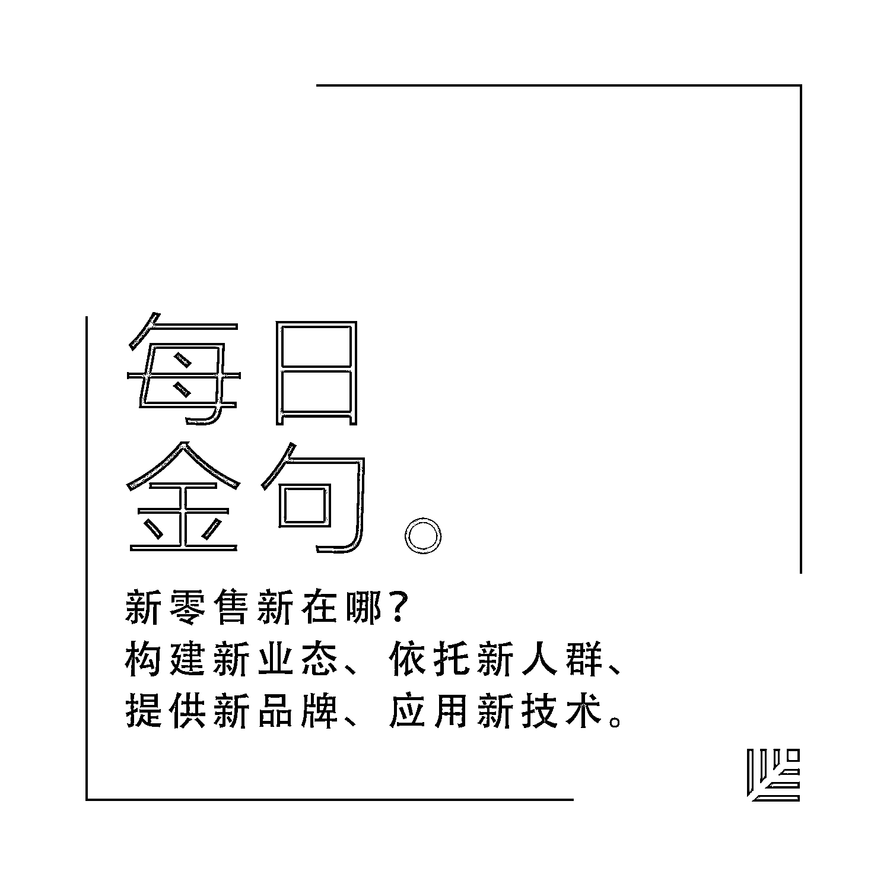

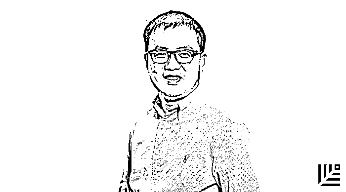

**定义新零售：O+O 或 OxO**

我自己对零售一直很感兴趣，在红杉资本中国基金做了十年的投资，从 2008、2009 年起便投资了一系列电商企业——京东、唯品会、阿里巴巴等。而对线下零售，我也一直非常感兴趣并有投资。

2014 年，我曾在连锁零售协会的大会上发表过一个看法，认为 “O2O” 这个词用得不太好，是非常导向性的思维——要么从线下到线上，要么从线上到线下。**我认为，应该是 “O+O”，做得更好可以是 “O×O”，什么意思？线上和线下是融合的，是叠加的，甚至是乘数放大的效应。**这很难用一个词来形容，所以，马云用了“新零售”这个词，我觉得非常好。

**电商并非已成往事**

红杉中国投资过一些电商，有人会问：电商还能成长吗，电商还有空间吗？几大电商已占据了市场的主要份额，电商还有驱动力吗？现在几乎没有人谈 O2O，投资机构也不太看 O2O 项目了。那么，O2O 是不是昙花一现？投资人在砸了那么多钱之后学到了什么，行业沉淀下了什么？

电商是否已成往事？我认为，不是往事，新一代电商还是有许多机会。能不能再出现一个阿里巴巴？我不敢说。**但我认为整个电商产业格局不应该是现在这样——三大巨头占据约 90%的市场份额，我认为电商产业应该会有具备鲜明特色的，小而美的电商出现。**

那么，在对 O2O 的探索中我们到底学会了什么？我认为，最重要的是让很多互联网从业者理解到一点：线下零售有自己的规律和特点，不是只依靠互联网那套玩法就能玩转。线下零售是否苟延残喘？这个问题不用回答，我们已经感受到很多创新业态的出现。

**「正在开往春天的列车」**

中国的消费零售到底何去何从——敢问路在何方？我觉得这就像《西游记》一样。在过去五年中，大家都在不断探索，像是走在去西天取经的路上一样，大家探索了不同模式，抓住了不同机会，当然，也跌入了很多坑。

我想分享的最重要的观点是，我认为，有“线下载体的新零售”是“正在开往春天的列车”。2017 年会是线下零售焕发生机的一年。

现在到了 4 月份，我更加相信这一点。**新零售新在哪？我觉得是新业态、新人群、新品牌、新技术。那么，也就是构建新业态、依托新人群、提供新品牌、应用新技术。**

**▍新业态**

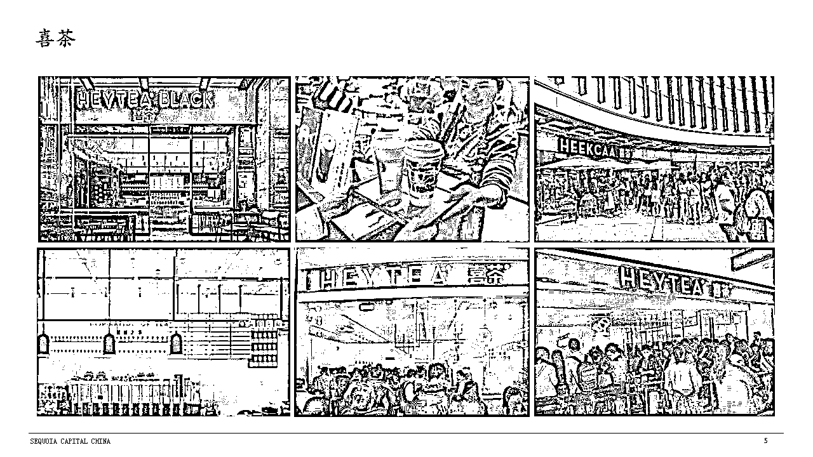

**喜茶** 

这家店前两周刷屏了，很多人排了一小时队，只为喝一杯茶。是一个在广东中山起家的小伙子创立的新的茶饮品牌，我不知道应该称它为茶品牌还是服务品牌，这是个新型的业态，他的确做到了。

喜茶就像一个自带流量的网红，把人流带到了线下。这是个新的业态，这个人是新一代的创业者。**这一批创业者代表了新零售的中坚力量，他们是一些更年轻的、可以站在更高的高度思考创新问题的创业者。**

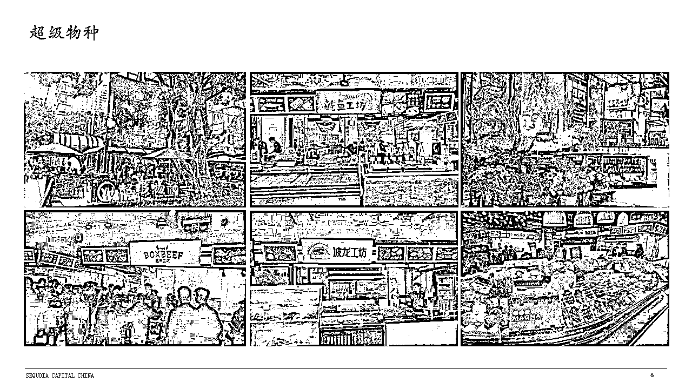

**超级物种**

没去过的朋友可以在网上搜一下，这家店是中国零售行业的领导者——永辉——的大胆尝试。这家店我去过，体验非常棒，他们的名字也很酷：超级物种，物种这个词最近在零售行业里非常流行。里面确实有许多不同的物种，在这样的零售业态里面，他们把不同品类、风格和特色的”物种“组合到一起去了，集合在这样一家店里面。

走进这家店，你似乎感觉它是非常有特色的餐饮+精品超市的感觉，或许餐饮的感觉更多一点。它的店面不太大，我觉得他们应该也会在上海和深圳开店，大家到时候可以体验一下。

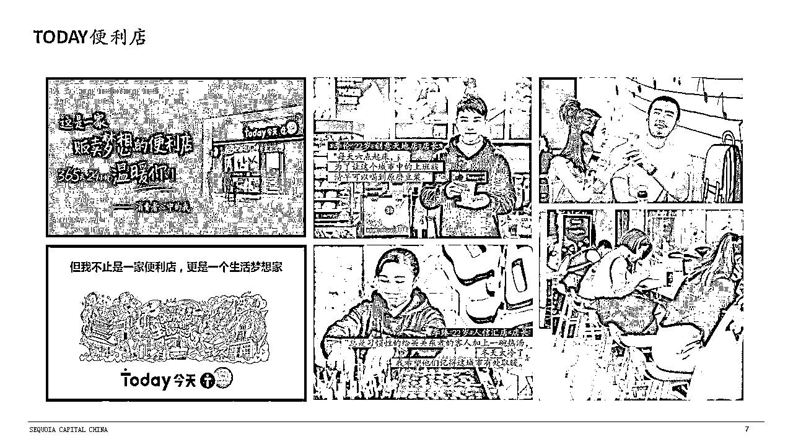

**Today 便利店**

这是我们 2014 年投资的一家便利店，而在最近，便利店似乎又成了一个风口。这是一家贩卖梦想的便利店，1985 年的小伙子，在我们红杉资本中国基金的支持下，2015 年，从南宁进军武汉开了第一家店，现在有 150 家左右。从这些图片可以看出 Today 传播的文化和价值观：Today 是一个生活梦想家，他们最著名的两句口头禅是“不要在最能吃苦的时候去享受安逸”和“每天叫醒你的是梦想还是闹钟？”

▍**新人群**

说起新人群，大家可能首先想到的是消费人群，但我想讲，**新零售里的新人群不光是消费人群，还有从业者，这非常重要。**

投资机构投的是什么？投的是创业者，因为创业者永远是市场上最稀缺的。那么谁来创业呢？仅仅是 Today 这样的创始人还不够。他最厉害的地方，是在武汉召集了非常多优秀的加盟合伙人。

随便举几个例子：他们有家加盟店是两个女生开的，其中一个女生是在东风汽车做财务的，另外一个女生是本地国企里的中层。还有一家是澳洲留学回来的小伙子开的，还有一家是武汉当地的网红、武汉大学研究生开的......这批经营者有相当高的素质，对于客户服务和创业本身的理解，完全站在了更高的高度，他们完胜传统小杂货铺的大爷大妈或者大叔大婶们。 **像 Today 这样的线下零售企业，他们不需要做的比京东阿里更好，只需要比周边的线下店更好就成功了。**

为什么人才非常重要？2014 年，我在百度搜索“零售管理专业”，我搜不出什么内容，我没有看到有什么学校能够给我们的行业培训专业的零售管理人才。而我在谷歌搜索，打开其中一个链接，就可以看到有 115 所大学有这一专业。

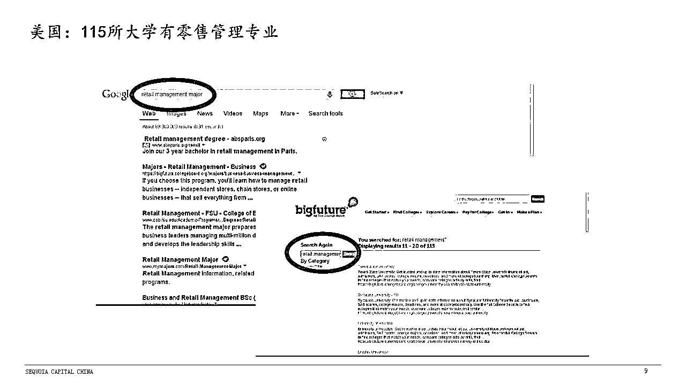

零售可以说是艺术，也可以说是科学，零售其实是个非常传统和古老的行业，有非常多的经验在国外已经被上升到理论的高度了，可以编成教材，并通过四年的学习教会一个人怎么做好零售。但我们中国的零售行业，从业人员的知识结构和视野还是在非常非常初级的阶段。所以为什么我说摆在我们面前的机会真的是太大了。

▍**新品牌**

零售做什么？卖产品给消费者并满足他们的需求，而新品牌也在推动新零售的发展。

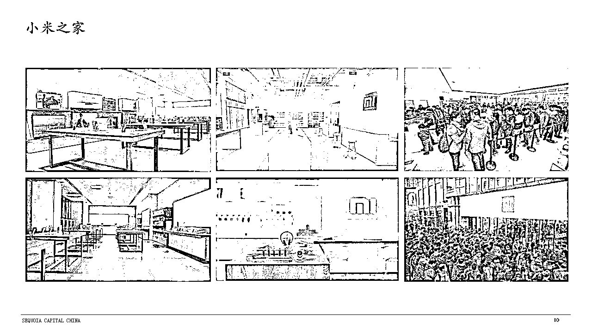

据说小米之家全球评效仅次于苹果店，人潮汹涌。除了卖小米手机之外，还有小米生态链里的一系列各种智能硬件产品，我们投资的云米净水器也在这里售卖。小米之家为消费者提供了新产品、新品牌，这也支撑了其线下零售的活力。

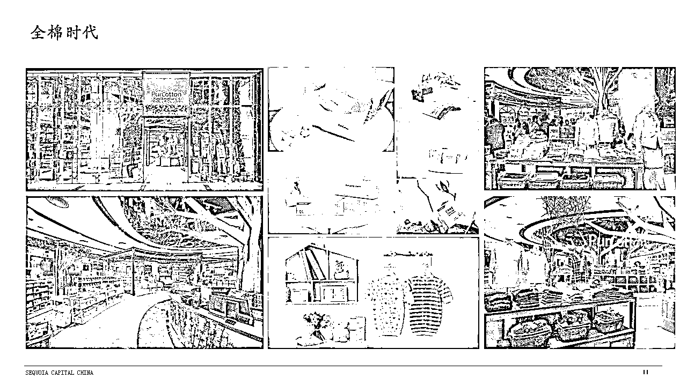

全棉时代是红杉中国投资的一个品牌，我们非常幸运能投资到这样一个非常好地诠释了消费升级的品牌。去年“双十一”时，它在天猫全网所有品牌综合排名中排到了第 15 名，是唯一一家排名如此靠前的本土品牌，有非常独到的产品。

我不知道大家有没有听说过，全棉时代有一款叫棉柔巾的产品，它不是纸巾，胜过纸巾，是用棉花制成的无纺布做的，依靠的是这家公司独有的专利技术。这是它的爆款产品，所有我接触过的这款产品的使用者，到目前为止没有人给这款产品一句不好的评价。唯一的抱怨是它“有点小贵”，舍不得用，这么好的东西，用完就扔掉真可惜。全棉时代在线上和线下的增长都非常好，成长非常迅速。

▍**新技术**

说了新业态、新人群和新品牌，我们现在说说新技术。

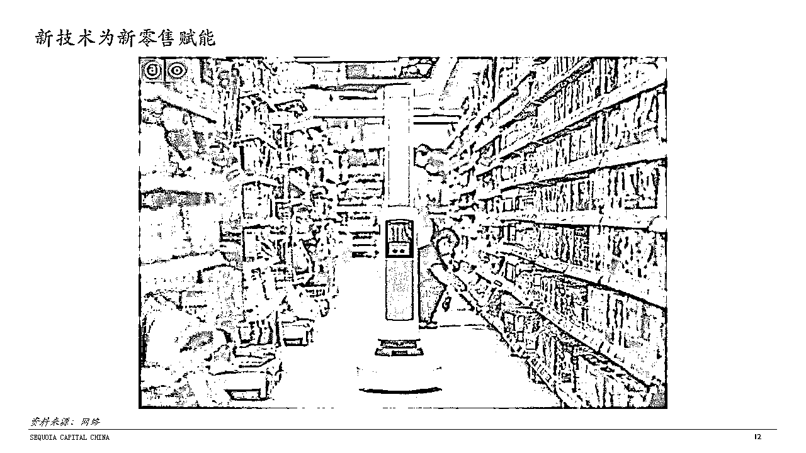

这家美国公司针对零售行业开发了一款机器人，它能够自动帮人巡视货架。首先，巡视货架可以发现什么地方货物摆放的不整齐；第二，在巡视过程中可以检测人的移动情况。于是，我就可以看到货品在哪里取的多，在哪里取的少，可以及时反馈给后台管理人员，告诉他们哪个货架该补货了。通过使用这个机器人，大量减少了这个店里的人工，而且它可以做得比人工更好，不可能看错。

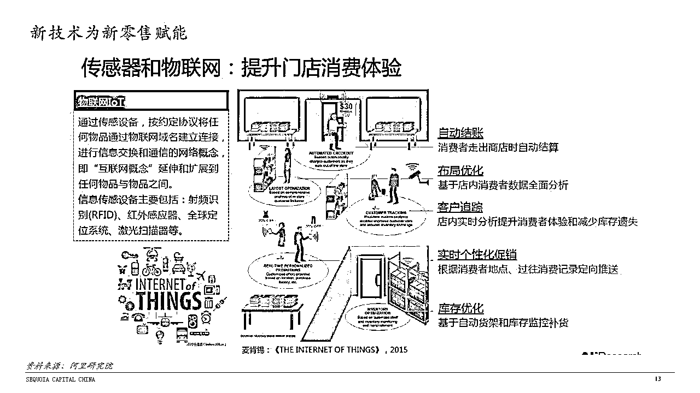

这是传感器物联网。在一个店里，你可以更加精准地知道人群到了店里后的行动轨迹，帮你更好地调整你的陈列、运营等。

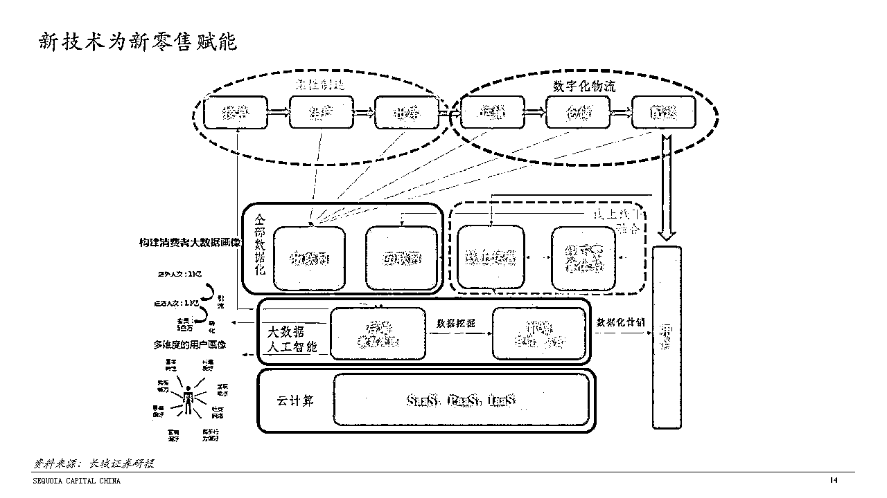

人工智能和大数据，我想大家已经看到了很多相关文章。零售背后其实有非常多的科学，刚才说的两个例子是跟硬件相关的，但它的背后其实有很多软性的数据分析。大家往往认为，市场营销是软性的东西，但市场营销其实也是门数据学科。

举个例子：价格策略。大多数中国品牌商和零售商在这方面做的还很初级，你问一个企业怎么定价，它通常说不出什么门道来，往往就是看别人的价格，然后定的比它高一点或低一点，没有太多科学分析和依据。其实定价在商学院里是一门专业课，可以讲一个学期，有非常多的体系和算法可以用。

大家看下这张图，2010 年，美国的零售行业对于信息技术的应用，分门别类已经非常细了，光采购管理的 IT 系统的覆盖程度，就分的很仔细。**中国零售行业 IT 技术、信息技术的应用情况，我们扪心自问一下，我觉得和美国的差距不只是五年、十年的问题了。**

我最近问一家我们投资的大数据分析公司，这家公司的创始人是百度的科学家，他和线下零售企业交流之后和我说：没想到线下零售可优化的空间太大了，数据整理搜集的精准程度、分析的颗粒度太粗了，稍微做一做就能提升很多，空间巨大。

**中国零售业的发展路径**

回顾中国零售业的发展，在电商出现之前我们其实都还在初级阶段。那时候，我们更强调的是零售的“场”，一切围绕经营场所，重心不在经营商品，更不用说经营消费者，其实经营的只是一块空间，租金收入是最重要的。稍微好一点的，可能知道自己应该在什么地方开店，地理位置如何选择，但往往还是停留在找场的阶段。

直到电商出现。人们好奇，为什么电商发展的这么好？我不认为是电商做的多么好，而是因为线下零售做得太差了。电商天生有非常好数据基础，把人、货、场的关系梳理好，同时可以通过数据进行精细化的管理。当这个业态出现的时候，立刻就把最传统的线下零售“按”下去了。

**零售的核心：人+货+场**

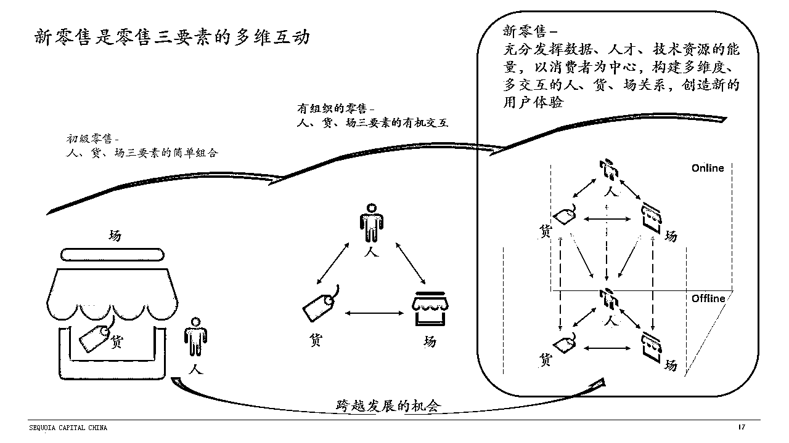

**我认为，无论用多漂亮的名词去形容零售，其真正的核心就是这三个要素：人、货、场。**

我们今天要思考的是怎么把维度拓宽，每一个要素都要有线上线下的维度，或者说，是线下状态和线上状态。掏出手机支付的那一刻是线上，把手机放下来到试衣间的时候就是线下。到底是线上还是线下？分不清的。 在今天（我们开会的这个空间），做好蛋糕拿手机拍照发到朋友圈里，那就是线上；可做蛋糕的时候都是在线下，分不清线上、线下，但是体验都很棒。

我们可以对三要素都用线上、线下两个维度进行展开的思考，它们所处的状态、场景是不一样的。“场”有线上、线下不同维度：我们今天所在的是实体的场，但是也有虚拟的场；“货”也是一样的：你在店里看到的东西，和在虚拟空间里的货物，这个 SKU（库存量单位）的量级完全不一样。

**这三个核心要素分别叠加了线上和线下的维度，互相之间的互动关系可以被放得很大。这就是为什么新零售有更多的空间让创业者去突破。**你只要在其中几个互动对应关系上寻找出新的方案，就可能给用户带来新的体验，而你如果能给用户创造新的、愉悦的用户体验，那么，你就成功了。

