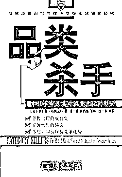
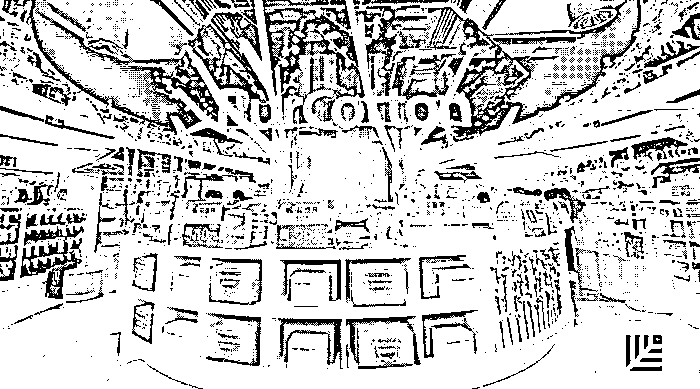
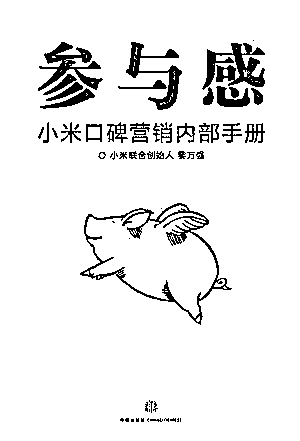

# 红杉资本刘星再谈新零售：新品牌从哪里来？

> 原文：[`mp.weixin.qq.com/s?__biz=MzAwODE5NDg3NQ==&mid=2651223586&idx=1&sn=af4ef561e1df041bc2246592050924fa&chksm=80804876b7f7c160a5bd3294c1cee94d9a70a9083e543f32f7c01bb0a8cd601d700471de5bdf&scene=21#wechat_redirect`](http://mp.weixin.qq.com/s?__biz=MzAwODE5NDg3NQ==&mid=2651223586&idx=1&sn=af4ef561e1df041bc2246592050924fa&chksm=80804876b7f7c160a5bd3294c1cee94d9a70a9083e543f32f7c01bb0a8cd601d700471de5bdf&scene=21#wechat_redirect)

在消费升级、技术革新的大环境下，创建一个品牌、建设一个品牌变得更难了。怎样创立一个可持续发展的品牌，让一家三代人都使用你的产品？早前，红杉资本中国基金合伙人刘星曾经深入阐释过[**《新零售新在哪里》**](http://mp.weixin.qq.com/s?__biz=MzAwODE5NDg3NQ==&mid=2651223014&idx=1&sn=f806b6befe1a3caf534cfdaf7ec209a4&chksm=80804db2b7f7c4a4ba58dbb621163f21c28858c0a8a69964971353c031cf49803df08c9fdd8b&scene=21#wechat_redirect)，认为需要“**构建新业态、依托新人群、提供新品牌、应用新技术**”。近日，在京东金融千树资本的成立发布会上，他进一步对其中的“新品牌”概念进行解读，提出构建新品牌的三个来源——有品类、有品质、有品味。要点如下：

▨ 品类升级体现在从简单的功能性满足，纵深到更加细分的功能性提供。所以品类扩展还是有一定空间，仍可以从品类入手开创新品牌。

▨ 未来十年中国最主流的新品牌将来自于品质的提升——你的产品是不是真的更好。

▨ 面对消费者"去品牌化"和对品牌"去中心化"的挑战，品牌创始人需要更注重新场景、新渠道、新营销和新服务。

“新零售”的四大要素里，其中一个就是新品牌。做零售企业，你要卖新东西给消费者，不能总卖老东西。但新品牌从哪里来？ 我尝试从这三个维度剖析一下，就是有品类、有品质、有品味。

**“品类杀手”定律仍在起作用**

中国新兴的这一拨品牌创立历史可以追溯到过去 30 年，很多消费品牌是从开创品类而来的。当物质生活还没有那么丰富时，创业者只要在一个品类上面找到一个点，占据这个品类的主导位置，就可以造就一个品牌——正如《品类杀手》一书所描述的那样。这里有很多例子，比如饮料中的王老吉，开创了凉茶品类；比如定制家居的索非亚衣柜，让定制衣柜越来越成为主流；再比如甜心摇滚沙拉，将主食沙拉变成健康人群的正餐。

** **

**品类杀手**

零售革命及其对消费文化的影响

罗伯特・斯佩克特  **/ 著**

吕一林、高鸿雁 **/ 译**

商务印书馆 2006

所以从一个品类入手，成为这个品类的领导者，或者首先开创这个品类，就有机会创造出一个新品牌来。

过去 30 年里，有太多这样的案例。走到今天，大家会想，现在商品这么丰富了，还有什么品类能够让我们去开拓呢？从品类入手还有没有机会去创立一个新品牌呢？

我觉得还是有的。因为过去 30 年，消费者的需求可能是要吃饱穿暖，从原来的三大件到五大件。而现在，一般的生活消费品类都有了，这个时候品类升级体现在从普通的功能性满足，纵深到更加细分的功能性提供。比如，过去运动品类刚出来时，我们穿着一双鞋可以踢足球、打篮球，可以跑步，也可以上班。现在不一样了，踢足球是踢足球的鞋，登山是登山的鞋，跑马拉松、跳健身操又是不一样的。所以现在同一品牌下的产品组合变得更加复杂，每类产品都主打更独到、特别的功能。在功能性背后，有不同的技术支撑。所以我觉得品类扩展还是有一定空间，仍可以从品类入手开创新品牌。

**渠道不再为“王”，品质才是“王”者**

不过，从过去五年到未来十年，在这 15 年里，我觉得中国最主流的新品牌将来自于品质——你的产品是不是真的更好。

在商业品牌不是很丰富时，其实你不知道什么是好产品。过去几年里，国内市场有一个非常大的变化，就是在全球化的推动下，具体而言，中国每年有一亿多人次的出境游，再加上海淘业务的蓬勃兴起，中国大量的消费者有机会接触到世界上很多高品质的商品，开始对商品的品质建立了更全面、更深入的认知，而且这些认知不仅仅是停留在抽象层面，而是有了亲身接触和消费后获得的清晰感受。

所以，在这个时候，一个新品牌的创立不能再像过去一样，靠打电视广告、靠做大代理渠道，在“渠道为王”的思路下，好像只要渠道铺得好就行了。现在，这些老套路不行了，而是需要你的商品真心不错。

比如红杉中国投资的全棉时代，成为非常亮眼的本土新兴生活消费类品牌的代表。全棉时代的商品，你用了之后，可能唯一的抱怨就是这个品牌有点小贵，但是你不得不说，它的产品品质真好。当一个新品牌有了这样的消费者认知后，就可以进入高速成长通道，而不是靠低价拉流量、拉销售业绩。同样是红杉投资的大疆科技，面对全球无数的模仿追随者，持续出品全球领先的最创新、高品质的无人机，真正做到了“总是被模仿、从未被超越”。

好品质来自于哪里？可能是真材实料，可能是科技创新，但背后都一定有对产品品质极度重视和追求精益求精的匠心精神。好品质就一定死贵吗？并不如此，小米生态链中的不少产品，就做到了用很高的性价比提供给消费者同样价格下的高品质产品，包括我们投资的云米净水器。

**品味亦是品牌根基**

说到品味，它反映了一种生活方式、一种个人爱好，既蕴含更深的文化内涵，又突出了消费的个性主张，而今天的消费者的确比过去更加追求个性化，他们想有更懂自己、和自己更亲近、更适合自己、又更能表达自我的品牌。而一旦通过品味这个维度和消费者建立了强关联，一个品牌甚至可以突破品类界限，实现跨品类发展。

无印良品就是一个很好的例子，你很难说无印良品属于什么品类，它的产品线非常丰富。它的设计风格让人觉得非常简洁甚至过于简洁，但是背后包含一个理念：因为单纯和空白，所以能容纳所有人的自由。还有诚品书店，我们显然不能简单地用图书来定义它所属的品类，诚品不是为了卖书，而是要推广阅读；诚品不是商店，而是文化分享的空间。野兽派也是一个例子，他们从一个花店成长为一个艺术生活品牌，每家店都有不同的风格，但都美而有趣，让喜爱它的消费者感受到美好。

“品味“还有品尝、玩味这样的意思。站在品牌角度，我们说要”有品味“，站在消费者角度，需要品牌”可品味“，有趣、好玩。这意味着一个品牌背后往往需要有一些人格化的元素，能够和消费者有更多平等的互动沟通，才能勾起消费者消费的欲望。这方面小米做出过很好的表率。《参与感》这本书详细介绍了小米是怎样让用户参与到品牌创建的各个环节的，从产品研发到产品测试，从日常运营到营销推广，让消费者和品牌建立了心灵连接，不仅成了剁手党，还成了品牌的好朋友，到处传播。

** **

**参与感**

小米口碑营销内部手册

黎万强  **/ 著**

中信出版社 2014

 **但在品牌断层时代，难题在于……**

新零售也好、智能零售也好，都呼唤新品牌的出现，而新品牌还是有很多根基可以让我们去构建。新机会仍有，但我也看到一些消费零售领域的危机。

我观察到，在过去的一两年里，呈现出的一个趋势是，越来越多的消费者在“去品牌化”，他们对品牌的认识或者重视程度，没有那么高了。Logo 不再重要了，他们更关注的是这个商品本身是不是有那个特别的功能，材质、出品是否精良，或者它是不是有某个独到设计，也就是我们常说的“调调”，让人喜欢它，能够打动消费者内心某个柔软的一面。

如果我们处在一个去品牌化的历史阶段过程当中，这一定让建立品牌变得更具挑战。或者说，即便不是去品牌化，起码也是品牌去中心化，也就是消费者不再长期钟情于某几个品牌，而是过段时间可能就移情别恋了。同时，在供给侧，也有网易严选、米家有品等新玩家向传统品牌发起攻势，M2C、S2B2C 等模式也逐渐得到更多认同。

在这样的大背景下，如果想打造一个能够基业常青的品牌，你该怎么面对消费者和产业链的这样的变化？怎样创立一个可持续发展的品牌，能够让一家三代人都使用你的产品？这是一个巨大的挑战。随着消费生活的升级迭代速度不断加快，创建一个品牌、建设一个品牌变得更难了。每一个品牌创始人都需要付出更多的努力去获得和持续更新对消费者的洞察，更深入、更积极地去思考和学习新场景、新渠道、新营销、新服务，才能更好地应对挑战。

这可能是一个品牌断层的时代，但同时，也是一个孕育新品牌的时代。

如果你热爱消费，钟情品牌，对品牌建设的挑战和应对有独到的见解，欢迎在文末给我们留言！************

（本文根据刘星的口头发言整理补充而成，转发之前请获得红杉汇授权）

📖

本期留言点 👍数最多的前 **10 **位粉丝

将随机获赠《品类杀手》或《参与感》一本

（统计截止至 2017 年 9 月 8 日 24:00）

** 推荐阅读**

壹

[红杉中国合伙人刘星：新零售新在哪里？](http://mp.weixin.qq.com/s?__biz=MzAwODE5NDg3NQ==&mid=2651223014&idx=1&sn=f806b6befe1a3caf534cfdaf7ec209a4&chksm=80804db2b7f7c4a4ba58dbb621163f21c28858c0a8a69964971353c031cf49803df08c9fdd8b&scene=21#wechat_redirect)

贰

[新零售时代，HR 需要的“轻”思维](http://mp.weixin.qq.com/s?__biz=MzAwODE5NDg3NQ==&mid=2651223551&idx=1&sn=b625d53c64497d0e37a40a4626c53fb7&chksm=80804babb7f7c2bd1f328ab9e01d89edbfdf0eddf54e04edabece9d68bf6bd8ec67a200ce840&scene=21#wechat_redirect)

叁

[计越详解红杉中国 AI 布局：已投资近 30 家，核心标准只有两个](http://mp.weixin.qq.com/s?__biz=MzAwODE5NDg3NQ==&mid=2651223559&idx=1&sn=d95c7ceb99e75a7903b20ded39a7b4c4&chksm=80804853b7f7c1454a7e4ecf9365d1831890fffa6096c30d093e827baf28e2e06723a30cbb59&scene=21#wechat_redirect)

肆

[“Today”叫醒你的是梦想还是闹钟？](http://mp.weixin.qq.com/s?__biz=MzAwODE5NDg3NQ==&mid=2651223568&idx=1&sn=dcfa370075a0acd2c64323825331021c&chksm=80804844b7f7c152528259ddedbf37a03d6e58122f666a6a60b950a01db42a231121e5afc760&scene=21#wechat_redirect)

伍

[复杂性商业环境里，你应当学会“管理”，而不是“解决”](http://mp.weixin.qq.com/s?__biz=MzAwODE5NDg3NQ==&mid=2651223572&idx=1&sn=a7f919df1f6f26681435076288631415&chksm=80804840b7f7c15630e239c84cfc16329f4f6223296b6296d80a403934a502a9836723153046&scene=21#wechat_redirect)

