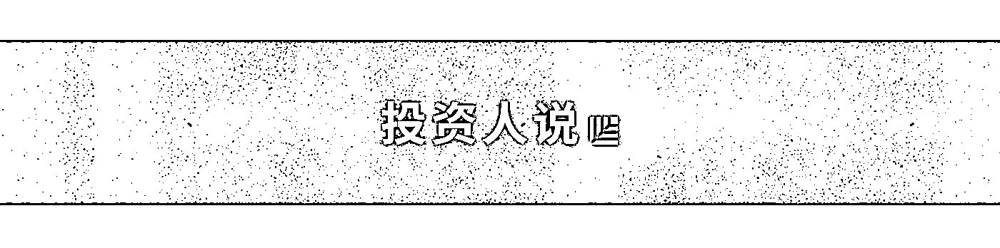
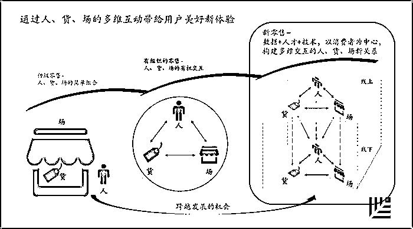
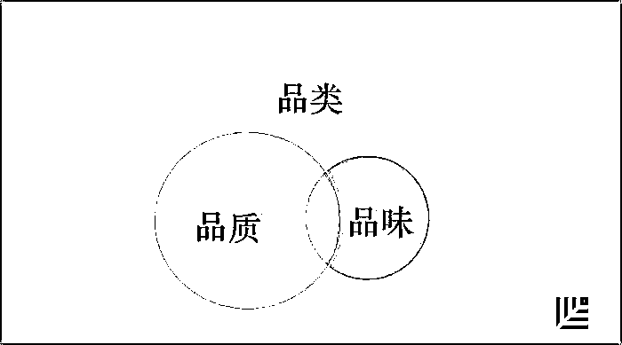
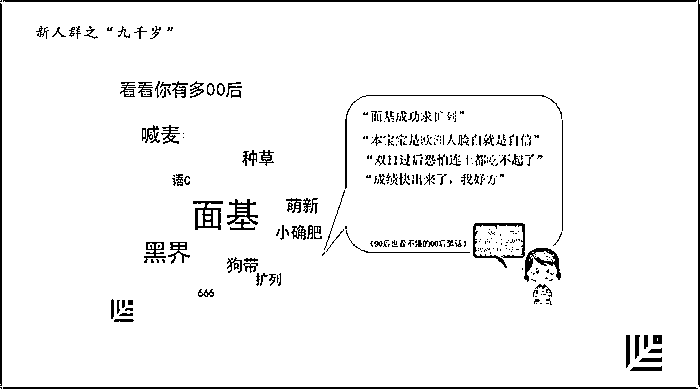
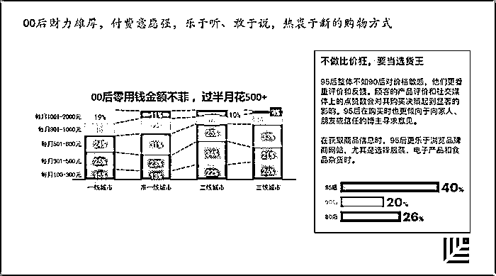
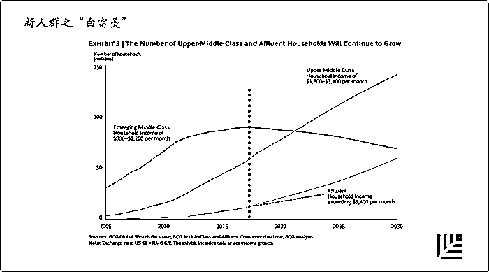
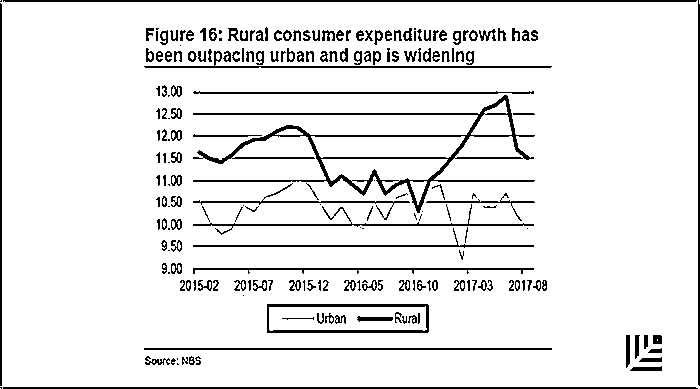
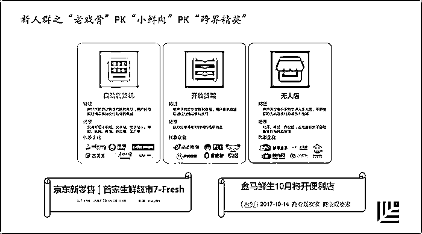
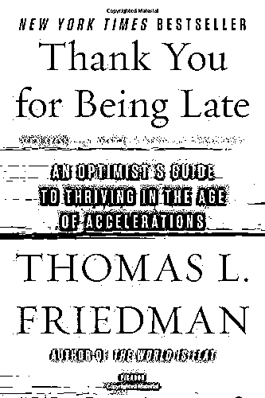

# 红杉资本刘星三谈新零售：下一站在哪里？

> 原文：[`mp.weixin.qq.com/s?__biz=MzAwODE5NDg3NQ==&mid=2651224010&idx=1&sn=383baf867e1ea808cb83ab28c0d2f28d&chksm=8080499eb7f7c0882e116de5d8edc527e326d3f6453d6d6e91fad07c0640c553bbfff343c60e&scene=21#wechat_redirect`](http://mp.weixin.qq.com/s?__biz=MzAwODE5NDg3NQ==&mid=2651224010&idx=1&sn=383baf867e1ea808cb83ab28c0d2f28d&chksm=8080499eb7f7c0882e116de5d8edc527e326d3f6453d6d6e91fad07c0640c553bbfff343c60e&scene=21#wechat_redirect)

[ 编者按 ] 今年 4 月，红杉资本中国基金合伙人刘星首次对**[“新零售”到底新在哪里](http://mp.weixin.qq.com/s?__biz=MzAwODE5NDg3NQ==&mid=2651223014&idx=1&sn=f806b6befe1a3caf534cfdaf7ec209a4&chksm=80804db2b7f7c4a4ba58dbb621163f21c28858c0a8a69964971353c031cf49803df08c9fdd8b&scene=21#wechat_redirect)**做出了解答，这就是：**依托新人群、孕育新品牌、应用新技术、构建新业态**。并认为，那些有“线下载体的新零售”就像是正在开往春天的列车。

8 月底，刘星进一步阐述了他对其中[**“新品牌从哪里来”**](http://mp.weixin.qq.com/s?__biz=MzAwODE5NDg3NQ==&mid=2651223586&idx=1&sn=af4ef561e1df041bc2246592050924fa&chksm=80804876b7f7c160a5bd3294c1cee94d9a70a9083e543f32f7c01bb0a8cd601d700471de5bdf&scene=21#wechat_redirect)**这一问题的思考，提出构建新品牌的三个来源：有品类、有品质、有品味。**

**本文是他第三次深谈新零售。近日，在黑马学院的一次活动上，他对“依托新人群”这一分论点做了更精彩的阐述，经「红杉汇」编辑补充整理发布。**

****

**▲ 红杉资本中国基金合伙人刘星** 

****新零售要带给用户美好新体验****

**如果让我给新零售下一个定义的话，我觉得应该是：通过人、货、场零售三要素之间的多维互动，带给用户美好的新体验，这才是新零售。**

**要想讨论清楚新零售的下一站在哪里，就得搞清楚我们今天所在的“这一站”处于什么位置。中国现代零售行业经过几十年的发展，现在摆在大家面前的是一个迎来跨越发展的机会，我们有机会能够从初级的零售阶段——人、货、场的简单组合，实现惊人一跃，升级到一个以消费者为中心，利用数据、人才、技术等资源组合，构建多维交互的人、货、场新关系的高级零售业发展阶段。**

****

**针对人、货、场的每一个核心元素，都可以把它分解为线上线下的不同维度。通过叠加新的维度，探索新的交互应用场景，创业者就可以思考：在哪个点上或者说哪几个场景当中，如果做出一些创新改变，就能够给用户带来新的体验？** 

****新品牌从哪里来？****

**今天，我们正处于新零售的起步阶段，一切都还刚刚开始。新零售四要素的其中一个就是新品牌。那么，新品牌从哪里来？**

****

**在有品类、有品质、有品味这三个新品牌的来源中，我认为现阶段有品质最重要。在过去 5 年到未来 10 年的 15 年时间里，中国会涌现一大批新品牌，它们的根基就在于品质的提高。提高品质其实并没有听上去那么玄乎，简单直白地说，就是“用心出品，用足好料”——生产经营者能够遵纪守法并合乎道德，在原材料方面用足一点、用好一点，如果能用上创新的材料就更棒了。只要这几个关键能够真正贯彻执行，我认为会产生一大批崭新的和优秀的中国品牌。而新品牌的涌现，将进一步推动新零售的发展。大家熟知的红杉资本投资的“全棉时代”就是一个很好的例子，护肤品牌“纽西之谜”、“小蜜坊”也都如此。除了扎根品质外，通过品类创新而建立品牌也依然有机会，比如竹纤维本色纸的开创者“斑布”，比如主食色拉的领导品牌“甜心摇滚色拉”。而“野兽派”、“内外”等更多把品牌建立在品味的基础上。** 

****新人群是哪些人？****

**今天，我想借这个机会着重讲讲新零售四要素里的另外一个重要方面：新人群。人群是零售的核心，我认为最终零售业竞争的制高点还是在人身上。我想强调的一点是，新人群不仅仅是指消费人群，还包括零售行业里的创业者和从业者。我们看到有一大批新一代的零售领域的创业者，他们比上一代更优秀，是他们让新零售在今天变得丰富多彩，创新无限。**

**▨** 新人群之“九千岁”****

****

**大家看看这张图，你感觉符合这个特点是什么样的人群？是 70 后、80 后、90 后还是 00 后？** 

**答案可能让你非常惊讶：是 95 后。新一代消费者的一半消费仍然发生在线下！这也是为什么我之前说“有线下载体的零售正在开往春天的列车上”。**

**我们从几个维度来剖析一下“新人群”都是哪些人。**

****

**如果你不知道什么是“九千岁”，说明你 Out 了。新零售之九千岁，泛指 90 后、00 后的新消费人群。每个时代都有年轻一代，“九千岁”不只是年龄和代际属性不同，更重要的是他们是第一批数字化时代原住民，具有独特的消费文化特征，他们有如下特点：** 

****

**00 后零用钱不菲，每个月开支在 500 元以上的基本上过半，在一线城市、准一线、二线和三线城市基本上都是这样。这批人群也有存款，收了红包存在微信和支付宝里，很多人存款余额高达近 3000 元。所以他们今天就已经很有消费能力了。更重要的是，这些人现在是消费市场的生力军，再过 5 年就会成为主力军。**

**他们不做比价狂，要做选货王。这一变化意味着什么？说明价格已经不是他们最最关注的点，他们更懂得买东西、更重视服务和体验，知道什么是好的，而且他们乐于听取别人的意见。可能微信都不是他最主要的信息来源，微博或其它新兴小众社交媒体是他们更重要的信息来源。**

**他们还敢说。如果不喜欢，就会评论，不光到零售商那里去留言，还会跑到制造商那里去留言：“哎，你们家做的东西实在是太差了。”他们热衷于新的购物方式，非常愿意尝试新的买东西的方法。所以我说，怎么卖，其实也有很多创新点。**

**▨ **新人群之“白富美”****

**2017 年是新零售一个非常重要的拐点。为什么？看看这个图，来自 BCG 的研究，三条曲线代表的都是人数，月收入在 800-1200 美元的中等收入人群数量在 2017 年出现了一个拐点，开始平缓下降；而月收入在 1800-3400 美元的人群则开始迅速增加。**

****

**人群数量的变化说明什么？当中间这条线上的人数增加得如此之快，肯定意味着新机会。而月收入在 3400 美元以上的人群增速也开始加快，他们有更大的消费能力，也非常值得关注。**

**▨ **新人群之“乡下人”****

****

**在一般人的认识中，消费升级好像只发生在北上广这样的一线城市，但事实上，你看这张图，非城镇人群的消费增长率一直高于城镇人群的增长率，这意味着生活在县、乡、镇人群的相对消费能力其实是在增加的，因为他们不用面对那么高的房价和孩子们的课外培训支出，也有更多的消费时间。而且，他们消费的意愿很强，虽然在消费观念上可能还处在学习阶段，但他们的消费升级也很突出：更多的空调，更大的冰箱，更节能的洗衣机，更智能的手机，海尔、美的、格力都是很大的受益者，小米、OPPO、VIVO 也都是。**

**▨**新人群之老戏骨、小鲜肉和跨界精英****

****

**以上对新人群的分析，是从消费人群角度来讲。那么，谁在为这些人服务呢？**

**既有行业里的“老戏骨”，比如永辉，做得非常成功，现在已经接近 1000 亿市值，“超级物种”是他们在新零售上很靓丽的创新；再比如红杉最近投资的“生鲜传奇”，厚积薄发，深受百姓追捧。同时也有不少意气风发的“小鲜肉”，“Today 便利店”的春哥，“超级猩猩”的跳跳，都代表了零售领域创业的新生力量，他们善于学习，成长迅速。还有跨界杀入的互联网精英，“去哪儿”的 CC，“猩便利”的 LV，他们带着对传统行业的敬畏，用互联网系统架构师的思维以及撬动资本的能力来探索业态重构。到底谁能胜出？**

****新零售的下一站在哪里？****

**新零售的下一站到底在哪里？主持人给我的这个命题作文我实在交不了卷。如果非要回答，我觉得，这个问题的答案，应该是在这群人身上——需求侧的“九千岁”、“白富美”、“乡下人”，和供给方的“老戏骨”、“小鲜肉”和“跨界精英”。所有在这个行业里努力的人，最终会找到这个答案。**

****

**** ****

****谢谢你迟到了****

**Thank You for Being Late**

**Thomas L. Friedman **/ 著****

**Farrar, Straus and Giroux 2016**

**我这个回答一定让大家失望了。但是，在新零售刚刚启程的时候，我们就那么迫切地需要知道“下一站”是什么吗？或许，我们更应该立足当下，想一想怎么在新零售的“这一站”把事做好？前不久我在“得到”上听何帆老师讲《谢谢你迟到了》这本书，他提到了两句歌词“你可以在飓风中起舞，只要站在风眼里”。当新零售的飓风来临的时候，作为创业者要思考，你到底该站在哪儿？你是随风飘荡，去追风？还是要找到风眼，能够稳稳站在那儿，去把握时代给予你的机会？ ******************

**** 推荐阅读****

**壹**

**[红杉中国合伙人刘星：新零售新在哪里？](http://mp.weixin.qq.com/s?__biz=MzAwODE5NDg3NQ==&mid=2651223014&idx=1&sn=f806b6befe1a3caf534cfdaf7ec209a4&chksm=80804db2b7f7c4a4ba58dbb621163f21c28858c0a8a69964971353c031cf49803df08c9fdd8b&scene=21#wechat_redirect)**

**贰**

**[红杉资本刘星再谈新零售：新品牌从哪里来？](http://mp.weixin.qq.com/s?__biz=MzAwODE5NDg3NQ==&mid=2651223586&idx=1&sn=af4ef561e1df041bc2246592050924fa&chksm=80804876b7f7c160a5bd3294c1cee94d9a70a9083e543f32f7c01bb0a8cd601d700471de5bdf&scene=21#wechat_redirect)**

**叁**

**[汇纳科技张宏俊：新零售如何做到高维打击？靠这个](http://mp.weixin.qq.com/s?__biz=MzAwODE5NDg3NQ==&mid=2651223456&idx=1&sn=fb64de2e41656b75fb81844472dd96a1&chksm=80804bf4b7f7c2e2329bdd23ed01551cb6dc6e2e47b7f123006dc02b6fe654ed90ad948208f8&scene=21#wechat_redirect)**

**肆**

**[猩便利获 3.8 亿 A1 轮投资，红杉中国领投，共同推动中国即时便利消费体验升级](http://mp.weixin.qq.com/s?__biz=MzAwODE5NDg3NQ==&mid=2651223918&idx=1&sn=8bc8ac01759026fe6878ce92aa91fe80&chksm=8080493ab7f7c02c4629235e92ef3ed57f38ce9ccb33a05bf68ce3501e3e6a31f2fc26a469ed&scene=21#wechat_redirect)**

**伍**

**[“全球金融 AI 第一股”简普科技在美成功上市 红杉中国一周内两家重磅金融科技企业赴美挂牌](http://mp.weixin.qq.com/s?__biz=MzAwODE5NDg3NQ==&mid=2651223992&idx=1&sn=d0163252eac8c278d3e3f441f894e953&chksm=808049ecb7f7c0fad5b21afe2f263390e13c1763765216909038c467530f23cbe0747cd47367&scene=21#wechat_redirect)**

****