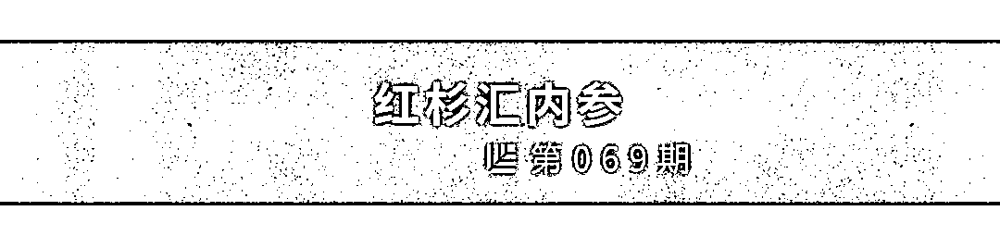
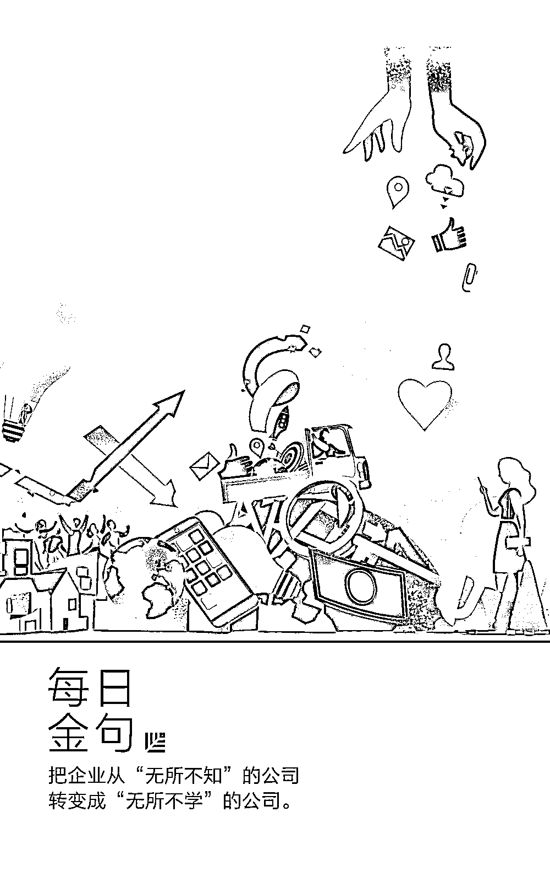
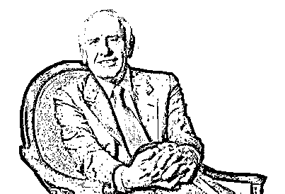
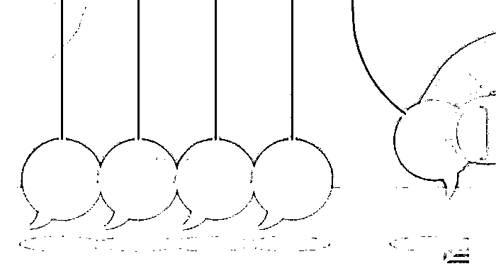

# 想获得他人资金和情感上的投资？尝试这 13 种方法｜红杉汇内参

> 原文：[`mp.weixin.qq.com/s?__biz=MzAwODE5NDg3NQ==&mid=2651224668&idx=1&sn=8091a7c6d4c037f268431547041a1d8a&chksm=80804408b7f7cd1ee825c20c93ca817abb582ba9ee3e8803dfb58b190d974cbc4dc80eccfc48&scene=21#wechat_redirect`](http://mp.weixin.qq.com/s?__biz=MzAwODE5NDg3NQ==&mid=2651224668&idx=1&sn=8091a7c6d4c037f268431547041a1d8a&chksm=80804408b7f7cd1ee825c20c93ca817abb582ba9ee3e8803dfb58b190d974cbc4dc80eccfc48&scene=21#wechat_redirect)

[ 编者按 ] 创业如何成功？有许多文章都在说创业者自身的因素，今天这篇内参主文则主要是在谈外部性因素。而这种外部条件是可以通过方法去获得的。

Willpower doesn’t work（毅力没有用），这是作者刚刚出版的新书的名字。如果你目标宏大，但抱着的却是“独行侠”心态，那是非常糟糕的。

融资，更更重要的是融人脉、融势能、融他人的情感投资，不断让你和你的事业的“信任卡”提升信用额度。为此，你需要：

▨ 极度擅长你的工作

▨ 在情感上投资于你所关注的“事业”

▨ 比其他任何人都能更好地理解“背景”（形成自己独特的世界观）

▨ 投资正确关系（对象是你可以明确创建协同关系的人）

▨ 在获得最佳经验和教育时，可以暂且将注意力从自己目标转移到培养别人的目标上

▨ 将自己的目标与其他人的目标合并

▨ 寻求帮助

▨ 在成功路上不忘初心

▨ 把精力放在一些重要的人脉上

每期监测和精编中文视野之外的全球高价值情报，为你提供先人一步洞察机会的新鲜资讯，为你提供升级思维方式的深度内容，是为 **[ 红杉汇内参 ]**。

** 内参**

想获得**资金**和**情感**上的投资？

**尝试这 13 种方法**

作者 / Benjamin P. Hardy

编译 / 洪杉

“如果你帮助别人得到他们想要的东西，你就可以拥有你想要的一切。”营销大师齐格・金克拉（Zig Ziglar）说。

这就是如何赢得朋友和影响他人的必要前提。

你目标宏大，但抱着的却是“独行侠”心态，那这是非常糟糕的。

你可以自己习得大量知识和技能，但是如果你想让自己宏大的概念广为接受，你要让人们投资于你的目标。

但不仅仅是金钱上的投资。

情感投资也是需要的。

投资方不仅是任何人，还要是很有影响力的人，那些远比你成功和经验丰富的人。一旦你的目标成了他们的目标，他们将会向你的目标投资情感。在他们投资你之前，你要投资于他们的目标。彼此推动，你们是一条船上的人。

具体建议如下： 

01

**开发独特和有价值的技能**

你将要进入的领域方向事关重要。

你进入一个行业，是因为这个行业能让你产生共鸣，激发你的好奇心和成长。

解决问题的最佳方法有两种：

▨ 能够解决自己或他人的痛点；

▨ 或者跟着你的好奇心走。

痛苦和好奇——这两件事都会驱使你前进。

02

**了解自己**

**了解那些你真正在乎的东西**

在自己真正在乎的事情上积累专业知识要容易得多。但是，你在做一些值得你投资时间、精力和金钱的事情时，思考什么是有用的东西也很重要。

你要判断什么才是有用的东西，它可以是什么样子，它应该是什么样子？

不要死磕“一”件事。通常来说，几个事件交汇能形成一个新的想法，这些事件的“联系”就是故事的背景，别人看不到而你可以看到的东西。因此，你需要发展你的好奇心，勤奋好学，让自己成为专家。

03

**熟悉所在领域的“环境”**

**了解规则后才懂得如何在战略上打破规则**

“你掌握着哪些

只有少数人掌握的真理？”

——彼得・蒂尔，《从 0 到 1》

▨ 你想要革新的领域中有哪些实力企业？

▨ 谁采用的方式是正确的？

▨ 谁用了错误的方式？

▨ 他们怎么错了？

▨ 错在哪里？

▨ 事情是怎么发展到现在这样的局面的？

▨ 哪种角度可以对该领域产生最大的影响？

▨ 还有哪些领域有待创造性地整合进当前的思维和体系？

▨ 该领域的从业者目前受到什么样的局限？

▨ 有哪些固定的范式需要打破？

斯蒂芬・唐（Steve Down）是 Even Steven’s 餐厅的创始人，本来从事于金融业。他十分欣赏美国休闲鞋品牌 Tom’s 的销售方式——每卖出一双鞋就给非洲捐一双鞋。于是，他产生了创办一家提供类似捐助的高质量餐厅的想法——每卖出一个三明治，就给当地的穷人捐一个三明治。

他把这一想法告诉餐饮业的朋友和专家时，遭到嘲笑。但对斯蒂芬来说，这是值得了解的背景信息，而他的金融专业背景让他得以从不同的角度来看待这一情况。

计算一番之后，他觉得自己的想法可行。只有餐厅本身很酷，而且服务上乘，其“社会责任意识”的概念才会也让人觉得很酷。开业后几个月内，第一家店就盈利了。其想法及其所获得的成功，为他吸引了更多投资者的支持。

04

**与提醒你朝前看的人共事，**

**而不是相反**

“不要加入轻松的团队，这样你不会成长；

要去就去那些对成员表现

有着高期待、高要求的团队。”

——吉米・罗恩

人会受到环境的影响。如果你想变成你想成为的人，那就让自己和已经是那样的人共事，而不是和不是那样的人或者不想变成那样的人一起。

让自己浸泡在你希望成为的那种人所营造出来的文化、所采用的思维和行为方式中。他们才是会在不久的将来为你投资、接受你的想法并帮助你实现它的人。不仅如此，在他们的帮助之下你所能取得的，将是远超乎你自个儿能想象的或是能够取得的成果。

你得让拥有你所没有的经验的人为你投资——那些懂得如何发布产品、如何营销、如何经营人脉，历经无数失败并从中吸取了数不清的教训的人。 

05

**花钱给自己找导师**

如果你还没开始为发展人脉而花钱，你的进步会很慢。

人们通常认为，供给创造需求。这在经济上或许是正确的，但是从心理学的角度看来，情况却恰恰相反。需求创造供给，无论是内在的还是外在的需求。好奇心足够强烈的时候，你就能想出满足好奇心的方法。

你可以通过投资人脉来找到这种条件，得到你所希望成为的人的帮助。提醒你要展望未来而不是沉湎于过去的人一起共事。

同时，通过给自己投资，你开始更完全地相信自己。因为你花了钱、投入了时间，做着自己想做的工作，会清楚每个阶段要做什么。

如果你觉得自己花不起这个钱，那是因为你还没有找到真的想学习的东西。

需求是发明创造之母。如果你的好奇心足够强，你就会想法设法的去找到答案。

06

**投入全部精力、金钱和技能**

**来实现导师的目标**

“你可以给予而不必热爱，

但你无法热爱却拒绝给予。”

——约翰・伍登

成功是信心的来源，而意志力没法给你信心。你要用完全不一样的眼光来看待事情。你需要“说服自己去相信你希望从中看见的真相”。

这就是解决办法。

在人际交往中，切忌一心只想利用他人，或是冲着交易的目的。你需要投入时间和金钱与他人交往，并真正地投身于所建立的关系。

只有通过合作才可能获得指数般的增长。对于你的导师希望取得的结果，你要全情投入。

首先你要学会理解他人，再学会让自己被他人理解。这就需要你成为善于倾听和观察的人。

花同样的时间，靠自己，你只能向前迈进两小步；但一段这样的关系可以帮助你向前迈进五十步。

但是，你对多巴胺的依赖和对自身目标的全神贯注，可能会让你只看到面前这两小步。

哪怕你只花上 6 到 12 个月的时间全心全意地为导师的目标努力，你也会在这过程中收获堪比你自己数十年的经验。如果你有一个出色的导师，那么他所努力的是远比你现在所能达成的更伟大、更吸引人的目标。

你帮助导师获得的地位越高，你自己的地位就会越高。

07

**记录和发表你一路上的思考**

当你从你身边的成功人士身上学到不少深刻的洞见，把它记录下来。无论好坏美丑。

你所得到的是绝无仅有的学习机会，是很少人能窥视到的“幕后”。 

08

**学以致用**

 “学而不行非真学，

知而不行非真知。”

——史蒂芬・理查兹・柯维

你该学会运用 ——而不仅仅是往大脑里填充信息。

智慧指的是善用知识。极少人拥有智慧，大多数人不过是在收集空而无用的信息罢了。他们无法快速地提升自我，因为他们根本没有真正地学习——他们根本没学到什么，因为他们不懂得去运用。

真正的学习关乎模式的转变。你对世界的看法、你在世界中采取的行动都得发生永久性的改变。如果你的行为和世界观没有变化，证明你并没有在学。

你需要利用所学的一切来实现自我的脱胎换骨。重新塑造自我之际，你会消化和掌握所学的知识，并加以完善与精进。

同样，这并不代表丢弃你的身份认同和个性。相反，这是在以你最棒的经历塑造和重塑自我，在于提升灵活性和适应能力，在于拥有一个成长型的思维模式，在于通过打破习惯来形成习惯——以及持续采取行动。

09

**将你的成功归功于他人**

总有一天，你会创下辉煌成就——你能给予的最高回报，莫过于感谢他们让你成为今天的你。

如果你一直是个谦卑的接受者，那么在所有人眼中，你并没有变得高高在上，而是始终那么平易可亲。而这正是变革型领导的核心所在。成为大家喜爱的人，成为大家愿意看到其成功的人，因为你正是他们最大梦想和最高价值的具象化存在。

如果你自掘坟墓，跟大多数成功追逐者一样犯下相同的错误——即认为自己的力量足矣——你会摔得粉身碎骨。你的成功将成为失败的催化剂。你会失去所得到的一切。因为你在上坡路遇见的人，恰恰是在下坡路上会遇见的人。

10

**建立关系和信任后，**

**将目标告知你的关系网**

当你把自己清晰地定义为付出者，并不断地付出后，你会被纷涌而来帮助你的人群所震撼。

你会讶异、会震惊，也会被折服，变得谦卑。

你没意识到的是——长久以来你不断付出、服务、出手帮助的过程中——人们在情感上也深深牵挂着你。

当你与他人建立温暖而深刻的关联时，你们之间凝练出了深深的情感羁绊。看着你成功比起他们自己获得成功还要重要。而这正是导师关系和领导力的真正核心。希望帮助你的人取得成功，这种愿望比起希望自己取得成功还要迫切。

11

**将你的目标和他们的目标融为一体**

将你的目标和共事者的目标整合为一体，由此，你获得成功所需的时间将减少 10 到 20 年。

原因很简单——你的理念和你学习对象的理念高度呼应、协同一致。你的到来，引进了许多有价值的经验和技能等。他们不是在帮你的忙，你已经成为他们的一份子了。你成为了更宏大事业的一部分，你和你的导师结合成使命共同体。

你已经成为理想中的那个人了，因为环绕在你身边的都是提醒你未来而非过去的人。

12

**建立协同合作**

**100 倍思考是新的 10 倍思考**

当一个人开始意识到，凭借他们的技能和能力可以发展壮大时，便产生 10 倍思考。他们会组建一个团队，会把生活中与想做的事无关的一切或授权他人处理、或全部删掉、或进行外包。

当符合上述描述的两个或两个以上的人为了改变世界而走到一起时，便产生 100 倍思考。

此时，强大的使命共同体就会发生。此时，整体会大于部分之和，变革性的关系就此诞生。

要做到这点，你必须是位孜孜不倦的学习者，并且愿意粉碎你生命中并非最优的一切——包括你狭隘的观点。

13

**勿忘立身之本或核心价值**

当你一步一步往前进时，谨记你的“为什么”和“怎么做”。不要忘记何为本，保持头脑清醒。即便已经做大做强，也请不要忽视立身之本。包括：

▨ 你的健康（营养、健身、睡眠）

▨ 你的思维（不断学习、思考、记录、授业）

▨ 你重要的人际关系（家人、朋友、投资人）

给予自己所需的“自我关爱”。多数人会在某个时刻停止向自己投资，不再把自己和自己的健康放在第一位，沉迷于事业，沉迷于目标，在这过程中失去了生命中最重要的部分，以及作为一切开始的初心——即“为什么”。

** 读数**

**9.8 倍**

美国增长最快的工作岗位是什么？LinkedIn 对比了 2012 年和 2017 年的数据发现，排在前两位的是**机器学习岗位**（增加 9.8 倍）和**数据科学家**（增加 6.5 倍）。**在排名前十的岗位中，有四个都与数据科学有关。**

大约 90%的数据都是在过去两年里产生的，全球每天产生的数据量达到 2.5Quintillion（10 的 18 次方）字节。

▨ 每分钟，美国人使用 2,657,700GB 数据

▨ 每分钟，Instagram 用户发布 46,750 张照片

▨ 每分钟，15,220,700 条短信发出

▨ 每分钟，谷歌进行 3,607,080 次网络搜索

** 情报**

#仅仅相信 A/B 测试是不够的#

**每位创始人都需要看的 3 种数据流**

▨ 第一手知识。即“走出办公室”，去和潜在或真实客户交谈。技术型公司创始人经常将诸如 A/B 测试之类的统计数据错认为第一手知识的全部——并非如此。它可以告诉你 A 优于 B，但不会告诉你为何这样。你很可能只是在优化一个错误的业务模式。

▨ 对客户、市场及竞争环境的综合性“鸟瞰”视野。不要依赖市场研究公司，它们只擅长于判断过去的情况，如果可以预测未来，它们早就成为创业公司了。

▨ 从客户和竞争对手的视角出发。问自己：“如果我是竞争对手且拥有他的资源，我下一步要做什么？”

▨ 即使掌握了来自这 3 种观点的信息，创始人仍需要记住：作出一个万无一失的决策所需的信息是多多益善的。

▨ 建立数据文化。数据收集最重要的一点在于你之后将如何处理它们。所有消息都需要得到分享，剖析，理解及运用，尤其是坏消息。

#每一家公司都要有灵魂#

**微软 CEO 谈共情如何激发创新**

萨蒂亚・纳德拉小时候的考试成绩常常差到令父亲难以置信。但父亲却告诉他，这意味着他“一定会在别的领域找到兴趣所在”。这激励了他一路向前，到今天成为微软的 CEO。以下是他的感悟：

▨ 人们总认为年轻时立下雄心壮志是一个人前进的动力。但对我而言，是好奇心支持着我走到现在。

▨ 避免狂妄自大，它会导致古希腊、硅谷等帝国、公司或个人走向衰败。

▨ 只要能够分清“相信自己的能力到和真正具备学习能力”之间的界限，那么自信就是一件好事。

▨ CEO 除了要自信以外，还需具备共情的能力。共情是商业创新的关键源头之一，因为创新来自于理解客户尚未被满足的模糊需求。

▨ 要想发现公司的核心身份，就必须考虑“存在式问题”，如“我的公司消失对社会会产生什么损失吗？”

▨ 从“无所不知”的公司转变成“无所不学”的公司。当一家公司经历过成功后，很容易会认为自己已经无所不能。必须警惕这样的想法。

** 推荐阅读**

壹

[带着好奇心重新发现以色列之行思札记：学、思、辨、问](http://mp.weixin.qq.com/s?__biz=MzAwODE5NDg3NQ==&mid=2651224663&idx=1&sn=094f16416680c6708cedf71eb6dcd50a&chksm=80804403b7f7cd1510fb6583585b58603c23cde7f255dbfb90ff73e5dee0d24dc0bb2d49f12d&scene=21#wechat_redirect)

贰

[20 万毕业生点赞的招聘会了解一下？| 红杉校招早鸟报名处](http://mp.weixin.qq.com/s?__biz=MzAwODE5NDg3NQ==&mid=2651224664&idx=1&sn=b7f12064a463140e89e32898dc49e431&chksm=8080440cb7f7cd1a41575695022b631fb910bb5b2d445f532111ccfa0241dd5a85b2b5639472&scene=21#wechat_redirect)

叁

[观察那些客户源源不断的公司，我发现它们都走对了这 4 步](http://mp.weixin.qq.com/s?__biz=MzAwODE5NDg3NQ==&mid=2651224631&idx=1&sn=317e3b0ad7f14f4911a0ad6c47a79e2a&chksm=80804463b7f7cd7507e0cc1fdcdbfa0cd1ffed8eded4977a7c561e65f3c943d9e2903a9539dd&scene=21#wechat_redirect)

肆

[不到两年征服全球 2 亿+用户，拿下设计界的“奥斯卡”，一辆单车究竟还能玩出多少花样？](http://mp.weixin.qq.com/s?__biz=MzAwODE5NDg3NQ==&mid=2651224635&idx=1&sn=21cbd4441abbba677c9acc7195b9e37a&chksm=8080446fb7f7cd79eb4fe0de667ae50166470513bb581b5269e4d61bfffc7f0cd8a0345810bb&scene=21#wechat_redirect)

伍

[那么，该怎么解决极其复杂、充满不确定性的灰度问题？](http://mp.weixin.qq.com/s?__biz=MzAwODE5NDg3NQ==&mid=2651224649&idx=1&sn=785ed70a35a6efad4f070cfb40bb73d0&chksm=8080441db7f7cd0b7efda90250d44d6fe213071645fa9aed19b9377589375c2c2d90fab2c5d0&scene=21#wechat_redirect)

