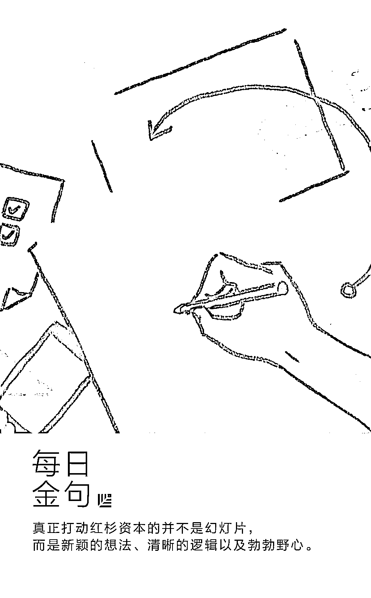

# 红杉资本：最简明好用的 BP 撰写指南

> 原文：[`mp.weixin.qq.com/s?__biz=MzAwODE5NDg3NQ==&mid=2651223388&idx=1&sn=b7cb3fdc09ca497195ec7eec75acc693&chksm=80804b08b7f7c21eeef1b74561167de5b957b8713c670bbc0634d4b1b179e1cf865ea1e44085&scene=21#wechat_redirect`](http://mp.weixin.qq.com/s?__biz=MzAwODE5NDg3NQ==&mid=2651223388&idx=1&sn=b7cb3fdc09ca497195ec7eec75acc693&chksm=80804b08b7f7c21eeef1b74561167de5b957b8713c670bbc0634d4b1b179e1cf865ea1e44085&scene=21#wechat_redirect)

Airbnb 的灵感来自于创始人布莱恩、乔和奈特当年的捉襟见肘。他们希望通过出租气垫床床位来补贴无力支付的房租，于是诞生了 Airbnb 的雏形。虽然满怀创业者的热情和重新定义旅行、住宿的愿景，但他们起初并不知道如何吸引风险投资，也不懂得如何起草一份融资演讲稿。

幸运的是，他们当时偶然看到了红杉资本的商业计划撰写指南，其后的事情大家就都知道了。他们成功获得了融资。

老实说，真正打动红杉资本的并不是他们的幻灯片 —— 而是他们新颖的想法、清晰的逻辑以及勃勃野心。一直以来，我们都乐于与那些独特的创业者合作，他们会全身心投入创新，想出常人认为无法实现的创意。我们也乐于成为他们的早期合作伙伴 —— 最好是从一个想法刚刚萌芽、拥有广阔发展空间的时候开始。

下面就是红杉资本所倡导的，如何撰写商业计划的指南。多年来，其版本也在实际应用中不断得到更新和完善，希望能给创业者带来一些启发与借鉴。

** 公司宗旨**

用一句宣言定义你的公司。这看起来简单，实则不易，因为你很容易陷入盲目列举公司特点的泥沼，而不是了传达了公司的使命。

**Company purpose Start here **: define your company in a single declarative sentence. This is harder than it looks. It’s easy to get caught up listing features instead of communicating your mission.

** 痛点问题**

描述客户的痛点。目前市场是如何解决的？现有解决方案的不足在哪里？

**Problem** : Describe the pain of your customer. How is this addressed today and what are the shortcomings to current solutions.

** 解决方案**

阐释你灵光一闪的时刻。为什么你的价值定位独一无二且令人信服？你的方案是否能持续适用？未来又将何去何从？

**Solution **: Explain your eureka moment. Why is your value prop unique and compelling? Why will it endure? And where does it go from here?

** 时机选择**

最好的公司几乎总是很清楚为什么当下其最好的时机。大自然的发展容不下真空期——为什么你的解决方案之前没有出现过呢？

**Why now?**  : The best companies almost always have a clear why now? Nature hates a vacuum—so why hasn’t your solution been built before now?

** 市场潜力**

找到目标客户和市场。顶尖的公司会开辟自己的市场。

**Market potential** : Identify your customer and your market. Some of the best companies invent their own markets.

** 竞争及选择**

谁是你的直接和间接竞争对手？展示你有获胜的计划。

**Competition / alternatives** : Who are your direct and indirect competitors. Show that you have a plan to win.

** 商业模式**

你打算如何茁壮成长？

**Business model** : How do you intend to thrive?

** 团队成员**

说说创始人和团队核心成员的故事。

**Team** : Tell the story of your founders and key team members.

** 财务状况**

如果有任何财务方面的信息，请一并介绍。

**Financials** : If you have any, please include.

** 企业愿景**

如果一切进展顺利，五年后你们会创造出什么？

**Vision** : If all goes well, what will you have built in five years?

** 推荐阅读**

壹

[红杉资本：成为参天大树企业的 11 种特质](http://mp.weixin.qq.com/s?__biz=MzAwODE5NDg3NQ==&mid=2651223320&idx=1&sn=03bff755281c421ceea8afa8febd02ce&chksm=80804b4cb7f7c25ac57329918c29222672060dfc7eabdede13c7898829f211e6ea32bd0b1a99&scene=21#wechat_redirect)

贰

[领英《全球 AI 领域人才报告》：华人力量正在崛起](http://mp.weixin.qq.com/s?__biz=MzAwODE5NDg3NQ==&mid=2651223375&idx=1&sn=430e52a2842e6c96cb7333539521cee3&chksm=80804b1bb7f7c20d19f9ae14aa3d2c8691a8613a347e4fe19c792607833f15a94889596e1f17&scene=21#wechat_redirect)

叁

[他们经历过创业路上的“丧”，但成功活过来了！警记这 12 段话](http://mp.weixin.qq.com/s?__biz=MzAwODE5NDg3NQ==&mid=2651223379&idx=1&sn=81825e41ba10e6fda2707248f5ad0562&chksm=80804b07b7f7c211812c88010edfed7acea8c2c24227abdd66e25b4a2c343e6532752df75cbe&scene=21#wechat_redirect)

肆

[汪静波：坚持自己认为正确的事，而不是一味喂养市场的贪婪](http://mp.weixin.qq.com/s?__biz=MzAwODE5NDg3NQ==&mid=2651223382&idx=1&sn=e1ccb374e4587d8a5d14fb4d806192c3&chksm=80804b02b7f7c214b538f5c130e74f3dacc468d881993e66784ab71e82d95d45bee09011a93f&scene=21#wechat_redirect)

伍

[苹果、Facebook、Google，从科技巨头崛起之路窥探未来趋势](http://mp.weixin.qq.com/s?__biz=MzAwODE5NDg3NQ==&mid=2651223386&idx=1&sn=f2cbee5b8a5631a5e7483b2ef76de5d3&chksm=80804b0eb7f7c218d23f64a9a4dd52d152051f85414e041cadd1145628cc2d448e93285cdd4f&scene=21#wechat_redirect)

