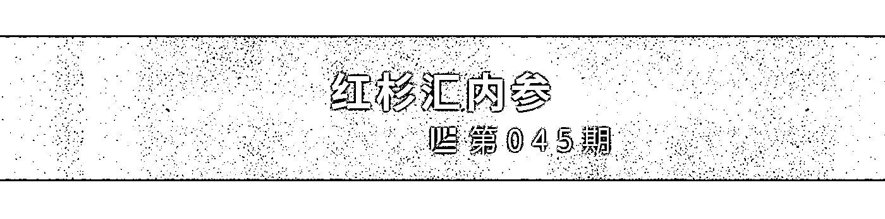
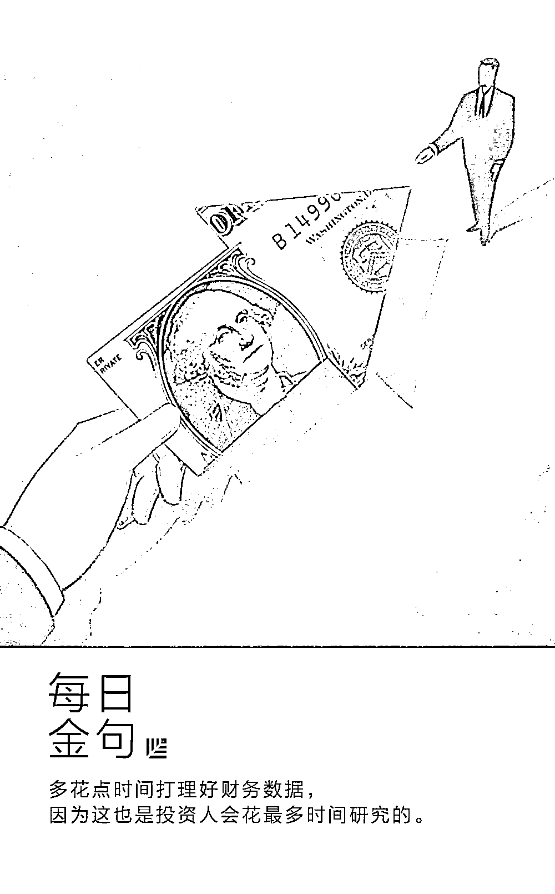
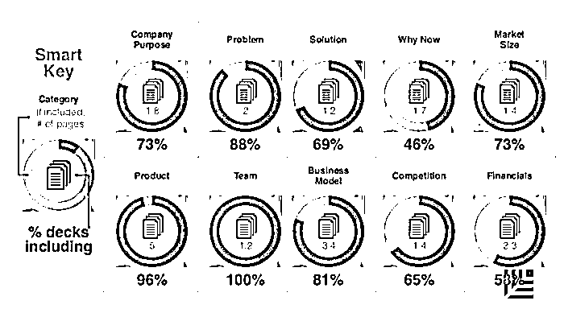
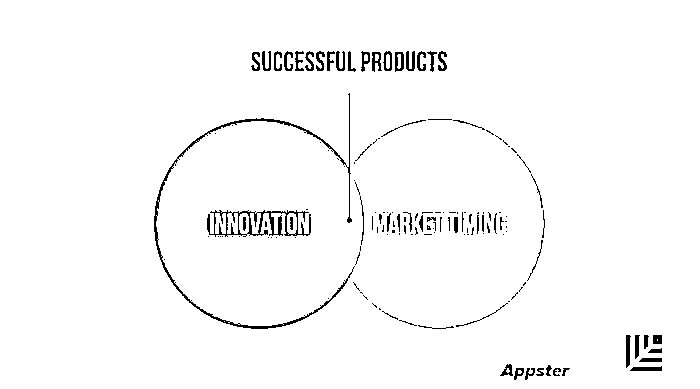
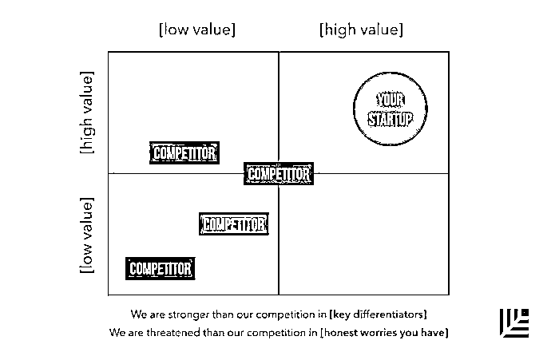
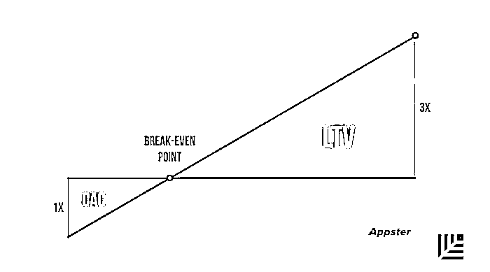
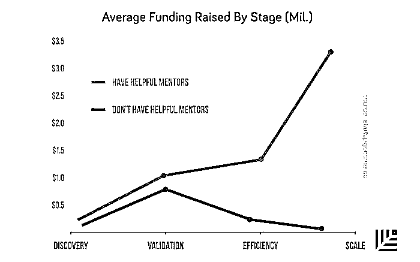
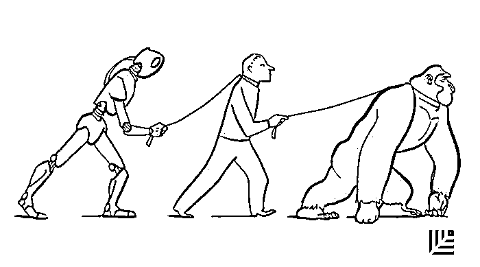
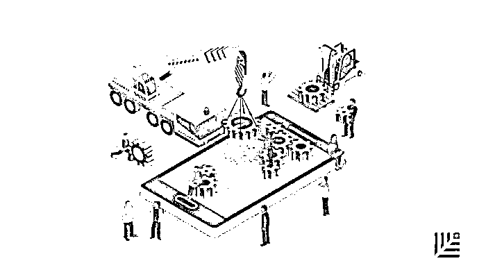

# 一份理想 BP 的 10 页核心内容｜红杉汇内参

> 原文：[`mp.weixin.qq.com/s?__biz=MzAwODE5NDg3NQ==&mid=2651223525&idx=1&sn=5e83b99821836c1657ba1a4efac27eb4&chksm=80804bb1b7f7c2a7e2ac65d8edda3f46419d6024aae1daedbcd7f04aa52a53af2782ac1f54af&scene=21#wechat_redirect`](http://mp.weixin.qq.com/s?__biz=MzAwODE5NDg3NQ==&mid=2651223525&idx=1&sn=5e83b99821836c1657ba1a4efac27eb4&chksm=80804bb1b7f7c2a7e2ac65d8edda3f46419d6024aae1daedbcd7f04aa52a53af2782ac1f54af&scene=21#wechat_redirect)

[ 编者按 ] 如果你听说有人见面 10 分钟就搞定了投资人、24 小时就收到投资款，千万别信。因为你已经过了沉浸于童话故事的年纪了。

如果想融资，还是老老实实地做好你的融资计划书吧。

在早前推送的[**《红杉资本：最简明好用的 BP 撰写指南》**](http://mp.weixin.qq.com/s?__biz=MzAwODE5NDg3NQ==&mid=2651223388&idx=1&sn=b7cb3fdc09ca497195ec7eec75acc693&chksm=80804b08b7f7c21eeef1b74561167de5b957b8713c670bbc0634d4b1b179e1cf865ea1e44085&scene=21#wechat_redirect)一文里，已经非常简明扼要地给出过一份写作清单。今天推送的这篇则有些手把手教学的意味：一份理想的 BP 至少应该包含这 10 页核心内容，缺一不可。

它也是我们理解某些初创企业成功抑或失败的一种认知框架。

甚至于，即使你不打算融资，也不妨试着去回答清楚这 10 个问题。它有利于让你认识到你的企业到底**因何存在**、为何**对客户来说**有价值、为何在**当下**有价值、为何它真的有**实际应用**的价值。

每期监测和精编中文视野之外的全球高价值情报，为你提供先人一步洞察机会的新鲜资讯，为你提供升级思维方式的深度内容，是为 **[ 红杉汇内参 ]**。

** 内参**

一份理想 BP 的

**10 页核心内容**

作者 / Josiah Humphrey

编译 / 洪杉

DocSend 最近做了这样一项测试，让投资人浏览 200 家初创企业的融资计划书，看看用时多长。结果发现，投资人阅读一份 BP 的平均时间，只有 3 分 44 秒。

时间可谓非常之短。

也因此，每一秒都很重要。

优秀的 BP 必须简明扼要，在 10 到 15 页里讲明白自己是谁、为什么投资人应该投资于你。

以下是一份理想的 BP 应该包含的十页核心内容——至少得是这样。

**1\. 企业目标**

应该用一句话解释你的企业创立之本及重要性。

**但凡成功的企业都会有强有力的理由来解释它因何存在。**

比如，Airbnb 不只是将自己定位为提供短期房屋租赁的应用程序，它的使命宣言是，通过社交软件，在现实生活中将全球数百万人联系起来，让人们在任何地方都能有归属感。

**2\. 问题**

最佳产品就像是止痛药（当然你也可以说是维他命）。

在这张 PPT 里，你需要展示你正在解决客户巨大的痛点，让客户心甘情愿地向一家不知名的初创企业付款。

**问题越大，机会越大。没有人会付款给你去解决一个不是问题的问题。**

换句话说，你需要展示出你正在解决的痛点是巨大的，同时是能带来利润的，并且记得要点出，目前解决这些痛点的方法及其失败的原因。

**3\. 解决方案**

列出问题之后，你需要展示你的解决方案。

你的产品有什么样的独特价值主张，为什么你的解决方案能改善客户的状况。

你需要强调为什么你的方案切实可行，以及为什么客户应该选择你的产品而不是目前市场上的其他类似产品。

**光用文字讲解是不够的，还要图文并茂地展示人们受益于你的产品的具体案例。**

**4\. 为什么要趁现在？**

时机对于建立一个伟大的初创企业来说是至关重要的。

例如，如果你观察过去十年中很多太阳能领域的初创企业，大部分都过早进入市场，并以失败告终。当时油价下行，太阳能电池板的造价仍比较昂贵。

**你也许挖掘出了一个好商机，但如果你要花过长时间去等待市场成熟，那么最终你将会耗光资金。**

同样逻辑也能解释为什么有的企业最后成功了。Facebook 在交友网站 Friendster 和在线社交网站 MySpace 失败之后仍能点燃市场，原因是当时对社交网络的需求与市场皆已俱备，只欠“东风”——一个解决方案。

确保你能列出所有关键理由，由此阐释“为什么要趁现在”。

**5\. 市场**

除了找到企业的痛点并且瞄准产品将要解决的具体问题，还有一点重要的是，**要确保你所创造的解决方案会有实际应用的市场。**

这页将在你的 BP 中起到关键作用，也是很多创业者眼中最重要的一页。投资人、企业家马克・安德森坚持认为：“市场决定着初创企业的成功与否。为什么？在一个拥有大量潜在顾客的巨大市场中，人们的需求就像一只无形的手，给初创企业捏造出产品的原型。需求需要被满足，而只要第一个可行的产品横空出世，就将会被满足。”

当然，**所谓理想市场，既是一个有着许多愿意支付溢价的富有客户的大市场，也是一个成长中的、非常碎片化的市场。**

如果市场是分散的，那就意味着还没有占据主导优势的明确赢家。谷歌、苹果、Facebook、Spotify、Airbnb，所有这些公司都曾经是高度分散市场中的主导者。

然而，你不需要在融资路演时，表示自己要赢得整个价值数十亿美元的市场。你要做的是，展示一个最有可能买你的产品的特定次级细分市场，并且说明你打算如何赢得这一局部战役。

Airbnb 起步时专注于旧金山湾区，Facebook 首先风靡于哈佛，PayPal 最早应用于 eBay 的生态系统，而特斯拉最初专注于服务科技产业的有钱客户。

它们都成功了。

**6\. 竞争**

列出你的竞争对手和你的竞争优势。

最好用一张图表来显示你在市场中地位。另一种方法是做一个简单的对比表。

**7\. 产品**

在这页 PPT 中，你要说明产品的细节。有哪些功能、层次、设计、知识产权？目前处在哪个研发阶段？距离发布测试版或发行版还要多久？

要强调你采用某些特定技术或设计的好处。

**8\. 商业模式**

**大多数初创企业最终失败都是因为没能找到正确的商业模式。**

你需要在这页展示以下几点：

▨ 营业收入哪里来？如何定价？

▨ 定价的依据是什么？

▨ 目前的数字指标状况是怎样的？

最重要的两项指标分别是用户获取成本（CAC）和用户终身价值（LTV）。

你会希望客户终身价值远超用户获取成本。如果你还不清楚什么是价值，找些你所处行业的数据来看看，或者研究一下你的竞争对手。

**9\. 团队**

投资是投人，不是创意。

一个出色的团队就算创意不佳，也比一个有着绝佳创意的糟糕团队更容易成功（并筹得资金）。

这页 PPT 不是用来秀你的常规简历的。

**投资人想看到的是能做好事情的人——善始善终，这才是企业家的真正 DNA。**

这里你要专注于展示你过去的成功事例，你是如何把事情做好的，以及在面对挑战时你是如何坚持下去的。

没人会关心你的爱好，或者与你的创业想法毫无关联的职业经历。

如果你有市场经验，那就秀出来。如果你有一些经验丰富的导师和顾问，那当然也要把他们的身份亮出来。这个时候就是要大胆推销自己，而不是畏首畏尾。

**10\. 财务数据**

这里指的是财务数据真相。大多数人都清楚你的现金流预测很可能是瞎扯。但是，这页 PPT 里的内容还是可以说明些东西的。

首先，可以说明你有多大的抱负以及有多讲究实际。

**VC 要做的就是找到独角兽公司，而不是运营不错的好公司。**同样地，如果你的财务数据完全不切实际，那你就没法使人完全相信你有潜力做 CEO。

其次，财务数据可以显示项目的可行性，这一点最重要。

你的开支和利润率可以说明很多事情。数据可能看起来很漂亮，但是投资人一旦发现你完全依赖的是烧钱式营销，或是高得不切实际的客单价，那么你将无法说服任何人。

所以，多花点时间打理好财务数据，因为这也是投资人会花最多时间研究的。

** 情报**

#这是一则来自“未来事务管理局”的消息#

**在人工智能驱动的世界里，会出现哪些未来的就业机会？**

以往难以想象到的工作将随之出现：

▨ **训练，监督并协助机器人。**如果机器人学了很多错误的信息和知识，那它们会变得有多么危险？所以这确保了专家级人类监督员的重要地位。

▨ **人格设计师。**虽然 Siri 可以讲一两个笑话，但人类渴望的远不止如此，还要训练机器人来满足我们的情感需求。

▨ **人文关怀类。**德勤会计师事务所发现，“关怀类”工作岗位的数量近来有大幅增长：护士助理的人数增加了 909%，护理人员人数则增加了 168%。

▨ **专业中介服务。**由于无法完全信任在线服务，人们可能不会依赖于更先进的匹配算法，反而希望与真实的人打交道。

# APP 繁华不再？#

**但医疗健康类 APP 为何蒸蒸日上**

**数据说明一切：**

▨ 66% 的美国人使用移动平台管理健康问题，79% 的人会使用可穿戴设备。

▨ 2015 年以来，已有 13000 家发行商推出了近 10 万个这类 APP。目前，在主要应用商店中已有 25.9 万个。

**以下是患者使用它们管理健康的方式：**

▨ 充当参考书和教程；

▨ 充当与医生快速分享健康数据并获得反馈的工具；

▨ 用于比较价格、地点和专家；

▨ 用于追踪各种生理数据，如月经周期、血糖水平等；

▨ 作为健康知识学习来源；

▨ 帮助训练；

▨ 用于寻找捐助者、临床医生和护士。

**医疗健康类 APP 未来发展的七大趋势：**

▨ 企业级应用；

▨ 加密与隐私保护；

▨ 发展人工智能：个性化客户关怀和症状预警；

▨ 与医生远程对话；

▨ 地理位置：寻找就近医疗资源；

▨ 可穿戴技术：2021 年，智能健康追踪器、脉搏血氧计、血糖、血压和心率监测器的市场预计将增长 35%；

▨ 游戏化交互设计。********

** 推荐阅读**

壹

[张一鸣用人心得：管理不能做“老好人”](http://mp.weixin.qq.com/s?__biz=MzAwODE5NDg3NQ==&mid=2651223517&idx=1&sn=3102d3cfdd876f5cd4de79df6efd24fe&chksm=80804b89b7f7c29f12ee316b29834f0526c0792f4cfed62ec8a5215a7fc2ad597205ace11922&scene=21#wechat_redirect)

贰

[AI 如何帮你找到 Mr. Right](http://mp.weixin.qq.com/s?__biz=MzAwODE5NDg3NQ==&mid=2651223520&idx=1&sn=c8c116d5973b8dd2200927d0dfce6cd4&chksm=80804bb4b7f7c2a29d164fac10e11b858c26ba5e7a514cfb69371c9cbd852f380346c0958493&scene=21#wechat_redirect)

叁

[五大技术，既能改变人类又能终结文明，怎么破？](http://mp.weixin.qq.com/s?__biz=MzAwODE5NDg3NQ==&mid=2651223497&idx=1&sn=eae097f23b134e054ab961b024bb2ee0&chksm=80804b9db7f7c28bb1eeec7e658e9a055c142946c4463f5473a1ab01d123e214dfd1b6f8f994&scene=21#wechat_redirect)

肆

[Airbnb CEO：房子不是生活中最大的财富，你的时间和潜力才是](http://mp.weixin.qq.com/s?__biz=MzAwODE5NDg3NQ==&mid=2651223500&idx=1&sn=9dcd949cc1d36c65a9186f4375e61ae0&chksm=80804b98b7f7c28ef28a9afe76e79919157bbede28344b4ef3ef76470c0bade439b05c9db25e&scene=21#wechat_redirect)

伍

[巴菲特 19 岁拿起这本书，此生从未放下](http://mp.weixin.qq.com/s?__biz=MzAwODE5NDg3NQ==&mid=2651223503&idx=1&sn=f8a5accf682a4e7a532090179fe76ebf&chksm=80804b9bb7f7c28db14bf2b686480a605ef2cdaec2bab7a5418647474f74878bd7f5c8e8fc4f&scene=21#wechat_redirect)

