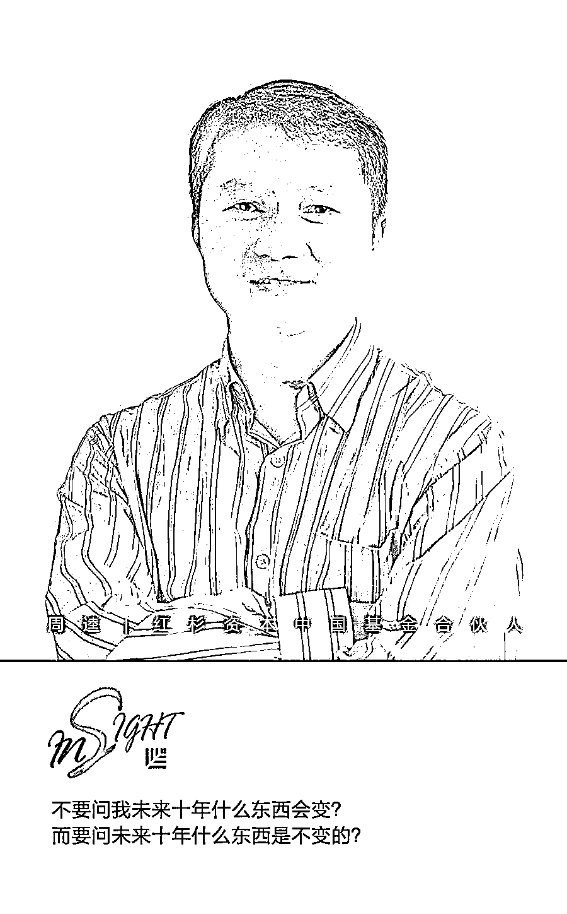

# 红杉中国周逵：什么才是企业穿越周期的生存之道？ | 投资人说

> 原文：[`mp.weixin.qq.com/s?__biz=MzAwODE5NDg3NQ==&mid=2651225572&idx=1&sn=155f2aa228a813456d46ad1e386ad881&chksm=808043b0b7f7caa6ba872b302817c359880b048ef9293f230e22f6d3ef95aebc7bf8e6c01023&scene=21#wechat_redirect`](http://mp.weixin.qq.com/s?__biz=MzAwODE5NDg3NQ==&mid=2651225572&idx=1&sn=155f2aa228a813456d46ad1e386ad881&chksm=808043b0b7f7caa6ba872b302817c359880b048ef9293f230e22f6d3ef95aebc7bf8e6c01023&scene=21#wechat_redirect)

伴随着经济周期性下行压力增大，募资下滑成为了一级市场上最重要的话题之一。红杉资本中国基金合伙人周逵作为开场嘉宾，亮相 36 氪“中国投资人未来峰会”，讲述了红杉中国作为一线投资机构是如何以客户为中心，紧跟客户需求，抓住不变之本，找到穿越周期之道的。

周逵拿亚马逊和华为举例。凭借 20 年来惊人的发展规模和增长速度，亚马逊有望成为全球价值最高的公司。原因不是杰夫·贝佐斯知道未来十年什么会变化，而是他知道未来十年什么是不变的，就应该 all-in，这个不变的东西就叫“客户至上”。为此亚马逊信奉“Day 1”理念，把每天当成是创业第一天，从用户这里，去寻找产品创新和运营改进的动力来源。

国内最优秀的企业——华为的企业文化里最重要的也是“以客户为中心”，其他的关键内容都是以客户为中心的延展。为此华为把权力和资源交给离炮火最近的人，把利益交给服务客户最努力的人。

周逵认为红杉也是一个创业企业，和这些世界最优秀的企业一样的地方是服务客户。红杉的客户是 LP 和创业者，当要排序时，创业者在前面。

周逵把过去创业企业的表现大致分成四种：2C（盯用户）、2VC（盯投资机构）、2G（盯政府）、2CO（盯竞争对手）。后三者都有过太多惨痛经历：比如投资人催促企业融资上市，动作变形；政府大力扶持光伏产业，最终泡沫破灭；与竞争对手撕得狼狈至极，错过合并良机。只有盯住用户的企业，才最能知道自己在干什么，为什么。

一方面，从普通用户角度思考和观察，投资者不论秋冬春夏，都可以看到机遇。另一方面，用户要求内容产品和交付效率，巨大平台型渠道公司的出现，会推动泛内容品牌等公司的繁荣，内容为王今天才真正被体会到了。经过十年面向 C 端的创新，今天的消费者不断提升的要求，推动供应端的效率提升，2B 的数字化机遇也开始到来。

以下为周逵演讲全文：

在这样的环境里谈穿越周期的 VC 之道，还是挺难的。我想了一下，什么是穿越周期的 VC 之道？或者什么是穿越周期的生存之道？用最简单的一句话总结，就是始终以客户为中心，这看来简单，却是颠扑不破的道理。

投资机构也是一个企业，红杉资本 2005 年进入中国，到现在 12 年过去了，但谈穿越周期还有点早。我们虽经历了一些行业变革的起伏，但还不敢说自己就穿越了周期，红杉在美国 46 年的成绩当然更令人尊敬。

亚马逊应该可以说是穿越周期了，我记忆中它就一直在涨，好像周期消失了似的。亚马逊的创始人兼 CEO 杰夫·贝索斯有一个很执着的观点：把所有资源 all-in 在不变的事情上。不要问我未来十年什么东西会变？而要问未来十年什么东西是不变的？如果你看到了一个东西是十年都不变的，那就应该 all-in，这个不变的东西就叫“客户至上”。

亚马逊虽是一个上市公司，但是它不仅盯着会计利润，而且还看到了现金流，这是更真实的东西。它们的飞轮形态业务组合是按照客户核心价值创造的，很多业务创新都是为了满足客户需求。他另外一个观点也有意思：存在两种企业，一种是设计极牛的产品，说服用户以带来最高的利润，另一种是拼命做到最低价格。第一种代表公司是苹果，第二种就是亚马逊，all-in 的做法使苹果和亚马逊变成了世界有史以来的两个万亿美元市值的公司，而且我个人认为亚马逊也有可能变成世界第一大价值的公司。

上周，我们邀请红杉被投企业的 30 个 CEO 去我最尊敬的一家中国公司——华为的总部做交流。让我印象深刻的是华为的三条核心价值观：第一条，以客户为中心；第二条，以奋斗者为本；第三条，长期坚持艰苦奋斗。

任总（任正非）认为，必须以客户为中心，否则华为没有存在的必要。如果不以客户为中心，有什么聚焦点可以让 18 万年轻人做一件事，做几十年？以奋斗者为本，就是华为让离用户最近的人来指挥，把权力和利益交给那些离炮火最近的人，那些一线事业的奋斗者。而艰苦奋斗，我的理解就是一张白纸清零，跟亚马逊的“Day 1”同理。（“Day 1”是亚马逊创始人兼 CEO 杰夫·贝索斯的理念，即不管公司发展到什么程度，取得了多少成就，仍然要把每天当成是创业起步的第一天。）

刚加入红杉时，红杉英文主页的第一句话让我记忆犹新： 我们有两个客户：第一是 LP，第二是创业者，当我们非要在这两个里做选择的时候，我们首选创业者。创业者是我们的客户，我们的座右铭是“创业者背后的创业者”。

为了做好这件事，红杉中国十几年一直坚持在专注的领域，争取做到最专业化。为了敦促自己不断进步，我们内部 PPT 模板的最后一页写着：The best one is the next one。

对于创业企业来说，以客户为中心，无疑也是最值得坚持的。但我在这个行业十几年，看到除“2C”之外，还有很多其它追求。比如“2VC”，这里发生了很多惨痛的例子，看似巨大的公司最后出现巨大问题，因为融资和上市的需要，需要做到这样那样的增长曲线。很多投资人要求创业者：你做到这一点，我才能给你投资。董事会讨论也是这样，不这么做，可能融不到钱。这都是很真实的故事，看起来也合理。但我想说的是，以客户为中心比这些理由都重要。曲线的代价巨大，在座每人都会记得几个知名公司，快到山峰的时候垮下来，变成一地鸡毛，发现过去做的事情是“2VC”导向的。

有个词叫金主，就是给你钱的人。金主最好是客户，你需要给客户提供越来越多的价值，客户再给你回报，这就是好的商业模式。有了客户价值和客户回报之后，投资机构才会追上来。如果次序反过来，就乱了。

很多企业追求“2CO”（to Competitor），它的企业核心策略是面向竞争对手，也许战术层面是对的，但战略层面就不一定。跟竞争对手 PK，获取市场份额和局部优势，这是手段，企业的最终目的是为了更高效率地服务客户，创造价值，而不应该是干掉竞争对手。当你脑子里只想着如何消灭对方的时候，你就没有创新，甚至会因与竞争对手杀红眼而失信于用户。而如果心里想的是怎么为客户提供更高价值，你会有更开阔的视野和胸怀。过去三四年，我们看到智慧的企业会选择适时地走向合并，成为一家能为客户提供更好服务的公司。这也是创业者眼界和胸怀的进步，未必只有消灭对手才能取得最后的成功。

还有一种是天天想着以政府为中心的 2G 企业。以政府为中心，也有很多创业者死在路上，比如光伏产业。在我经历的这 12 年里，一些曾经辉煌过的企业好像今天都不在了。看来围绕政府的政策和补贴做文章，出不来令人尊敬的公司。

当你真正站在用户的角度，抓住机遇和进行创新就不是难事。以客户为中心，才是穿越周期之道。

—— **周逵 **红杉资本中国基金合伙人

那么对于一个投资公司来讲，在今天的竞争激烈、压力重重的市场情况下，从用户需求角度出发，还能看到机会吗？我们从三个视角去看：

▨ 第一个视角，以用户为中心，机会永远存在。

一种压力来自面对强大的 BAT，和规模已经不小的 TMD，企业觉得好像没机会了。但只要以用户为中心，把握客户的真正需求，机会就永远存在。在过去四五年，今日头条从一个看似没有机会的地方，把一件事做得让广大用户喜欢，它就发展起来了。从用户需求出发，就不会有“天下大局已定” 的绝望，而可以从中发现机会。

▨ 第二个视角，渠道成为基础设施，内容才能真正为王。

过去大公司好像只是连接用户和产品或者服务的渠道，内容没有那么被重视，产品和服务的质量就参差不齐，“酒香不怕巷子深”在营销课里是个反例。但现在渠道效率不断提高，已经成为基础设施的时候，“酒”才更重要，内容才被真正重视。《我不是药神》一部电影上映 4 天就获得 13 亿票房，要知道十几年前中国电影市场全年才 100 多亿票房。但院线的发达，让好东西更快被看到，电影票也更便宜，电影的内容和质量真正被重视。

▨ 第三个视角，2B 的公司值得关注。

过去十几年里出现的大牛企业，比如 BAT、TMD，加上拼多多等等，它们的共性是都是 2C 的公司，竞争主要集中在激烈的流量争夺上。但今天越来越多的成熟用户要求更高质量的产品和更高效率的服务。这就对渠道背后的那些供应商提出更高要求，而为商家提供效率也变成了一个投资的新机遇。我们会更加关注 2B 的公司，比如通过信息连接、数字化、AI 推动来提高效率的中间服务企业、供应链企业、甚至工厂。

当你真正站在用户的角度，抓住机遇和进行创新就不是难事。以客户为中心，才是穿越周期之道。 ** **

** 推荐阅读**

壹

[爆款的诞生：看重数据质量，看懂指标变化，产品成功的必备 DNA | 投资人说](http://mp.weixin.qq.com/s?__biz=MzAwODE5NDg3NQ==&mid=2651225474&idx=1&sn=1f7f9a6a8001136c617b25bd11e55ff5&chksm=808043d6b7f7cac0f4279bcee54de46cc67d188327016b3e352eaa38ebdd0bc4fb0bc0b21cce&scene=21#wechat_redirect)

贰

[爆款的诞生：打造成功产品的必备 DNA——指标变化分析 | 投资人说](http://mp.weixin.qq.com/s?__biz=MzAwODE5NDg3NQ==&mid=2651225412&idx=1&sn=194cb57cc1babad917b7cbd8dbed14b1&chksm=80804310b7f7ca068c3f2a958017855a98ab3c3964ea8455147596cd9790c0f320a102b0e3d0&scene=21#wechat_redirect)

叁

[爆款的诞生：如何利用框架打造让用户不能拒绝的产品 | 投资人说](http://mp.weixin.qq.com/s?__biz=MzAwODE5NDg3NQ==&mid=2651225387&idx=1&sn=9e67075d54a59b0e5fd2ce5328153e30&chksm=8080437fb7f7ca693112cef86137101def417a0b947ad09ab6f53fb937cc82257ebd923571a0&scene=21#wechat_redirect)

肆

[爆款的诞生：健康的产品要满足哪些指标?｜投资人说](http://mp.weixin.qq.com/s?__biz=MzAwODE5NDg3NQ==&mid=2651225205&idx=1&sn=f1f4b328f5ff80db9953bbb86ab06837&chksm=80804221b7f7cb37a32599eae59767be28b65e6262e3b7fd6d6ec6b13d029eb075b2fbc4ddd0&scene=21#wechat_redirect)

伍

[爆款的诞生：手把手教你提升用户留存率 ｜投资人说](http://mp.weixin.qq.com/s?__biz=MzAwODE5NDg3NQ==&mid=2651225172&idx=1&sn=93955ba9920e04236aa0be0a6b6f8f68&chksm=80804200b7f7cb1627eb9901861e319ded707d760afcde8032ef01fa0a5fb4fb43c284df895e&scene=21#wechat_redirect)

