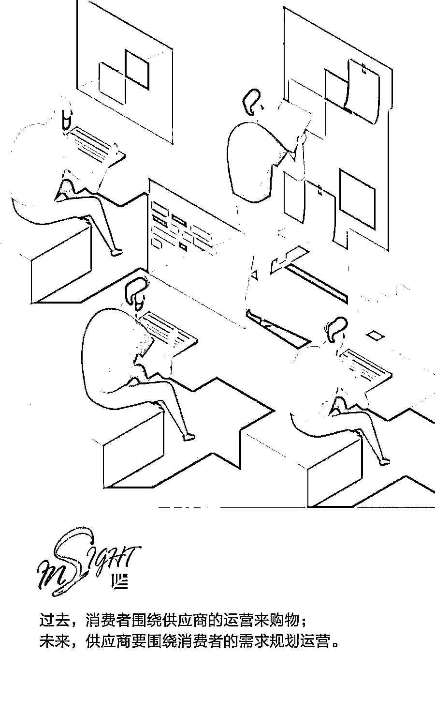
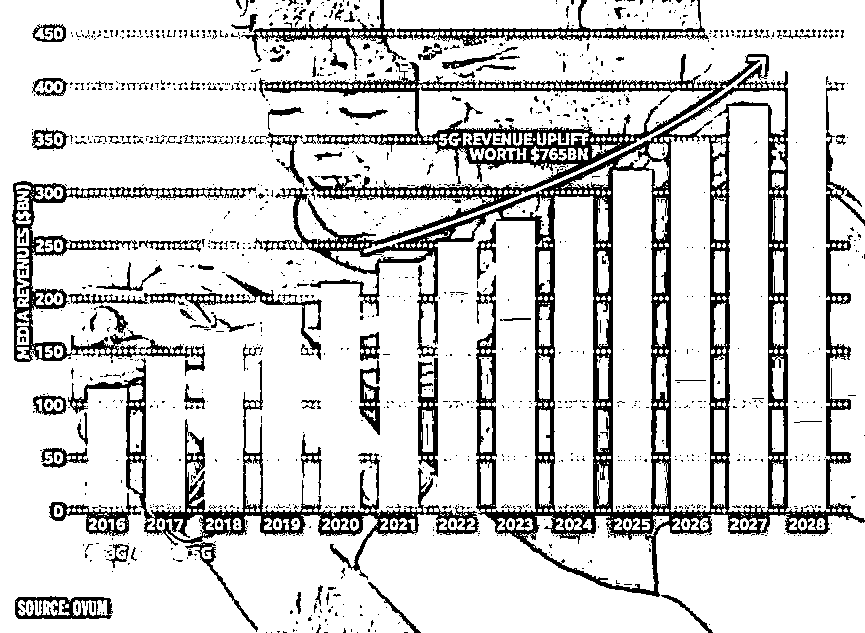
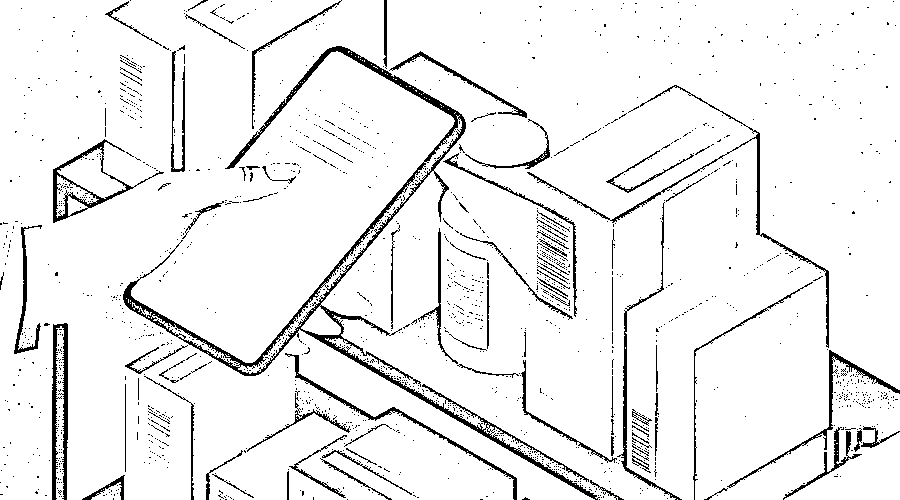
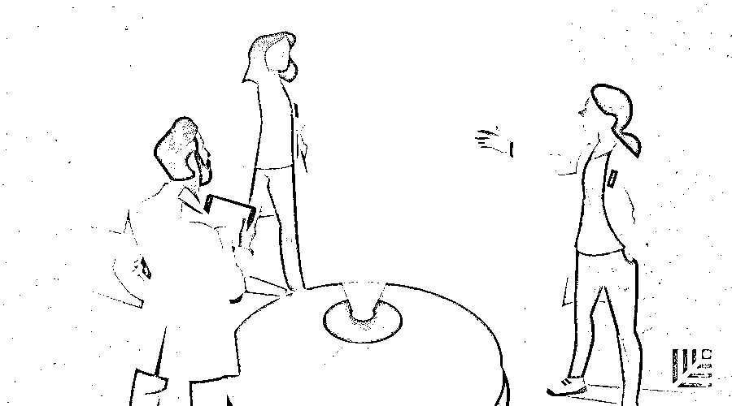
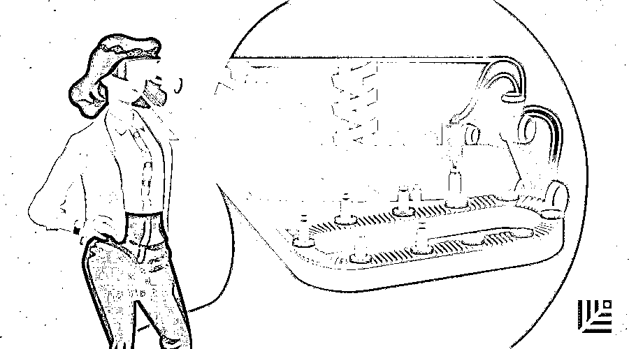

# 欢迎进入“仿生企业时代”，用三种新资本重塑超能力 | 红杉汇内参

> 原文：[`mp.weixin.qq.com/s?__biz=MzAwODE5NDg3NQ==&mid=2651226007&idx=1&sn=660c0d43d33a45aff1cdeb5b4d39844b&chksm=808041c3b7f7c8d5e61e8486b904506acc272c72553c403d2dc282c576c0ed8bf959d4858fd8&scene=21#wechat_redirect`](http://mp.weixin.qq.com/s?__biz=MzAwODE5NDg3NQ==&mid=2651226007&idx=1&sn=660c0d43d33a45aff1cdeb5b4d39844b&chksm=808041c3b7f7c8d5e61e8486b904506acc272c72553c403d2dc282c576c0ed8bf959d4858fd8&scene=21#wechat_redirect)

[ 编者按 ] 19 世纪，现代型公司成功运用了三种资本——自然资本、人力资本和金融资本彻底改变了整个世界，创造了大量新的财富。

今天，大多数的传统企业仍和过去一样在运用这三种资本；但一些独角兽公司和互联网巨头已然变得不同——因为技术力量的加持，有三种新型资本正在焕发新的活力。

为什么谷歌、亚马逊、阿里巴巴等公司无论将精力转向哪一个行业，都能所向披靡？为什么它们还在不断探索新的领域且看上去依然可以一击制胜？因为它们将技术与人类智慧进行了结合，从而获得了三种无形但力量强大的新型资本——行为资本、认知资本和网络资本。这是它们的致胜秘诀。

每期监测和精编中文视野之外的全球高价值情报，为你提供先人一步洞察机会的新鲜资讯和升级思维方式的深度内容，是为 **[ 红杉汇内参 ]**。

** 内参**

行为资本、认知资本和网络资本

**欢迎进入仿生企业时代**

作者 / Miles Everson、John Sviokla、Kelly Barnes

编译 / 洪杉

谷歌、亚马逊、阿里巴巴这些公司有哪些特点？答案是：无论它们将精力转向哪一个行业，都能所向披靡。

全球市值破 10 亿美元的企业约有 100 家，其中至少有 40 家为独角兽企业。这些企业身上有着一些共通点：呈现指数型增长，迅速大获成功，多位于中国和美国，但可能很快就会遍及到其他国家。我们将这些企业称为“仿生企业”：因为它们将技术与人类智慧进行了结合，并借此实现了快速增长。这些企业的竞争方式前所未有，它们像钢铁侠那样拥有超能力。

按照下列方法改变自己的公司，你就能带领自己的公司迈入仿生企业之列：

▨ **转变商业模式**

不再只是管理产品或供应服务，而是利用各种途径，满足消费者的各项需求。

▨ **转变经营方法**

不再只是利用自己手中的信息，而是紧随知识流动的脚步，利用那些可以与其他公司进行合作共享的信息。

▨ **转变竞争中取胜的方式**

不再把致胜关键寄托于竞争对手的可预测性，而是依靠那些可以让公司一旦取胜就能独占鳌头的平台。

**三种新资本**

要实现以上三种思想转变，企业需要对资本来源进行一场大变革，这也是自工业革命以来的首场重大变革。这些无形但力量强大的新型资产包括行为资本、认知资本和网络资本。

▨ **行为资本：指通过一定的数据收集、数据汇总和数据建模方式来获得有价值的见地。**

Waze 导航应用（2013 年被谷歌收购）在利用行为资本创造出的产品中是最为成功的一个。部分程度上，Waze 提供信息的基础是机器学习，它知晓以往的交通情况，并能预测交通情况的可能变化。它还可从用户的驾驶速度和行为表现中获得数据，交通堵塞时，用户的驾驶速度减慢，这时，这部分信息就会立即融入 Waze 的模型之中。Waze 用户也可以进行路况报告，用户参与后，Waze 的系统精确度也会随之提高。Waze 的行为也就与用户行为形成了互动。

▨ **认知资本：其价值来源基础是认知工作的可计算性与自动化。**

多数企业都贮藏了大量的实践知识；现在，它们可以将这些知识转为可进行大规模应用的自动化实体工具。

数字孪生是认知资本的一个应用实例，它基于计算机来对技术和商业系统进行虚拟模拟。例如，要想了解遭遇洪水时自己的精炼厂将会出现哪些状况，只需调整对应的数字孪生设置，通过模拟，你就可以提前了解哪些预防措施可以帮助工厂渡过难关。

▨ **网络资本：企业的本质是连接顾客、员工和那些公司项目信息提供者之间的枢纽。**

互联网的出现使得网络资本的价值激增。与广播网络的一对多交流不同，互联网能够实现多对多交流：参与者不仅可以与企业这一中央枢纽交流，还可与其他参与者一同交流。

例如，亚马逊的推荐引擎就通过产品评价将顾客连接了起来。许多人都习惯于在购买重要物品前查看网上评价。亚马逊的服装购买服务 Echo Look 对网络资本的利用甚至是更进一步。顾客在家试衣服时，可以用 Echo Look 与其他人进行在线互动，询问他人的意见。所有的这些意见还都会用到亚马逊的研发和营销上，进一步利用了行为资本。

**数据的共享和整合**

许多企业都在朝着仿生企业转变。亚马逊、谷歌、微软等科技公司都宣布进军医疗保健领域。一些医疗保健公司也正在进行自我重构，侧重于以平台为导向，因为没有公司可以凭一己之力收集足够的信息，进而创造出必需的行为资本，没有一家企业可以单独靠自己的认知资本接触到足够多的人。一个国家或地区的数据来源必须整合到一起。

2018 年，亚马逊开始携手通用公司和沃尔沃，给汽车安排包裹寄送服务。通用和沃尔沃这两家公司都掌握专有的电子通信系统（分别是 OnStar 和 On Call）。汽车的后备箱要根据两家公司共享的基于云的验证协议来解锁，这样商品就能放在后备箱里，而司机不必在场。

创新型银行将其他机构的金融服务提供给客户；没有围墙的大学能提供身在世界各地的导师的学分课程；技术领先的供应链也把 3D 打印技术和综合物流结合在一起，生成并交付专业产品，持续不断地积累过程数据，从而降低成本、提高一切工作质量。

仿生转型颠覆了每个公司的经营战略。它引导着公司重新定义自己要做什么以及想造福哪些人。你的公司怎样才能开始同样的转变呢？要专注于三种行为转变：市场由供给导向变为需求导向；研发机制由注重知识库变为重视知识流；另外，由正面交锋变为面向平台的竞争模式，有一两个公司会主导这种面向平台的竞争模式。

**打破市场界限创造新需求**

传统购物（如在百货超市或杂货店购物）旨在优化供给，这种方法让公司只关注消费者，市场规模有限。仿生公司提出了一个更有抱负的问题：我们想打造什么样的市场？他们通过改变现有市场界限，或是通过打造自己的新市场，来创造需求。

Stitch Fix 是于 2011 年创立的一家服装百货公司，也作为网上购物公司来营销（虽然它也能看作是一种新型零售店）。消费者先填写一份风格问卷，算法旨在模仿造型师，并选出一系列符合消费者个人偏好的衣服、鞋子和首饰寄送到家。人们的卧室变为了试衣间，他们留下自己想要的东西，并把不想要的东西放在卖家预付费的包裹里退回去。

实际上，仿生时代已经改变了供求关系。在过去，消费者要围绕供应商的运营来购物。但在未来，购物交易的支撑点是需求，供应商将要围绕消费者需求来规划运营。人们的机会越多，他们就会更轻易、更迅速地转变需求本质，从而打开新业务的大门。

**从知识库到知识流**

传统上，知识一直是各个公司密切关注的资产，但新的资本形式能让公司更加灵活地利用知识。

2018 年 8 月，亚马逊、谷歌、IBM、微软、甲骨文和 Salesforce 宣布，它们将在生产医疗产品时采用共同的标准，这样公司之间共享医疗数据时就容易多了。该举措将会提高医务人员运用数据诊断和治疗病人的能力，并创造出各种自由流动的数据流，以便发挥人工智能和机器学习在医疗保健工作中的作用。DoubleJump Health 等协作医疗环境将通过一种强调沟通的方式协调组织之间的信息流动，同时解决隐私问题和其他法律、道德问题。

**赢家通吃**

传统上，各个公司都努力在市场上占据有力的竞争地位，这样才有利可图。但是现在，新的资本形式已经改变了竞争的基础。平台就是转型的绿地，平台型公司会拥有超越早期竞争对手的独特价值主张，成为主导者，而其它公司则成为生态系统的一部分而生存。

普华永道最新的研究证实，当一个行业的可计算性增长到一定程度时，就会发生这样的情况。一个行业的基尼系数越高，该行业中的一些参与者就越占优势。而该行业的大赢家将拉大与其它对手之间的差距。

正如人们所预料的那样，与技术相关的行业在赢家通吃的整合中占得先机。基尼系数最高的 7 个行业中，有 5 个是在 TMT 领域，它们是技术硬件（包括存储和外设）、电信、消费电子产品、电商以及系统软件。

其他行业也在迅速赶超。2017 年，基尼系数较高的行业有烟草制造商、食品分销商、软饮料供应商、食品零售、家居用品公司和重型电气设备制造商等非数字类行业。而且，2006 年至 2017 年间的跨行业增长中，有一半以上的增长都发生在最后一年。在过去的十年里，越来越多的行业中仅一家公司就占据了该行业企业价值增长的大部分。

这三种新的资本形式，再加上围绕客户需求、利用知识流动以及赢家通吃的规则，可以帮助领先公司进一步确立战略定位。企业转型才刚刚开始，今天的独角兽还没能垄断仿生实践。只要正确发挥资本的作用，你就会有更大的发展机会。

** 读数**

**57％**

到 2025 年，全球无线媒体收入的 57％将通过使用 5G 网络的超高带宽功能和 5G 运行的设备来实现。世界电信产业权威咨询公司 Ovum 在近日发布的《How 5G will Transform the Business of Media & Entertainment》报告称，全球移动媒体市场规模将在未来十年内翻一番，达到 4200 亿美元。而最先接受相关商业模式的媒体公司将成为头部赢家。

**5G 将提供媒体交互新方式。**与 VR 功能相结合的高响应触觉装备——比如《头号玩家》中让人眼花缭乱的触觉反馈套装，将为媒体消费提供新的感官维度。

**赋能数字广告市场。**传统展示广告，将更好地向社交和媒体沉浸体验式广告转变。5G 还将帮助应对规模化、传达效率等当下移动广告竞争中存在的关键挑战。

**游戏将走在 5G 时代创新的最前沿。**到 2028 年，5G 手机游戏的总收入（包括 AR 和云游戏）将超过 1000 亿美元。

3G/4G 与 5G 网络环境下全球媒体收入走势

** 情报**

-医疗创新小专题-

#技术在加快“化学反应”的速度#

**关于生物药品研发的三大预测**

▨ 预测 1：技术的进步正在重新定义药物发现。人工智能和机器学习软件正在扩大可筛选化合物的范围，而且随着这些化合物进入制药公司的价值链，药物发现的命中率将会提高。

▨ 预测 2：制药公司将加强并购、投资和合资活动。因为它们要利用软件型 AI 创业公司获得新药发现能力。这一趋势会创造巨大的价值。

▨ 预测 3：创新型新药的出现已为时不远。未来 10 年内，在这种从计算机到试验台、最后进入诊所的药品研发过程中，有望看到新的化合物进入美国 FDA 药品数据库。

#这很“西部世界”#

**动脉也可以人工制造？**

科罗拉多大学波尔德分校的研究者们开发出了一种使用 3D 打印技术来模拟血管的复杂几何形状的方法。

▨ 生产。通过严格控制在打印过程中的氧气迁移及其随后的光照，研究人员能够生产出几何形状相同但刚性不同的物体。

▨ 应用。这项技术可以帮助医生通过生产柔软、有韧性的动脉和静脉人造组织，对抗高血压等血管疾病。

▨ 挑战。3D 打印机目前能够处理尺寸小至 10 微米的生物材料，或约为人类头发直径的十分之一，未来的研究将旨在进一步提高这种能力。

#怎样走出医疗研发闭门造车的“象牙塔”？#

**打破创新瓶颈的 14 条建议**

▨ 创建不受空间、文化和组织限制的校园孵化器或加速器。

▨ 引入创新元素，招募多位相互存在联系且在医疗保健领域之外拥有强大人脉的人才。

▨ 创建外部人脉网络和平台以支持新招募的人才。

▨ 加强学术行业的知识交流。

▨ 积极尝试与厂商、供应商和患者开展协作，同时加强管理，减少或消除利益冲突。

▨ 在保护数据和共享数据之间取得平衡。

▨ 与有兴趣测试和应用数字医疗产品及服务的研究人员建立合作关系。

▨ 设立一个礼宾部，负责与有意开展合作的对象建立一站式联系。

▨ 创建一个职工研究名录，注明他们的特殊兴趣领域和联系信息。

▨ 绘制组织资产地图，列出你拥有的特长、资产和核心能力。

▨ 制定一份可以整合组织资源并提高信息实用性的电子营销计划。

▨ 找出一位知道要如何建立利益共同体并能够融入其中的联系人。

▨ 寻找能够提供影响力和管理资源的高级赞助商。

▨ 时常举行思想狂欢会。** **

** 推荐阅读**

壹

[贝佐斯说，创业公司永远都要活在“Day 1” | 红杉汇内参](http://mp.weixin.qq.com/s?__biz=MzAwODE5NDg3NQ==&mid=2651225909&idx=1&sn=3faca0e7f8cb2aaf8632643cd6213756&chksm=80804161b7f7c8777652f365171e8272054f636b9982d2ff2d0ee341e5bc1f98244756578f0e&scene=21#wechat_redirect)

贰

[进击的平台：为什么传统大企业会被颠覆？ | 红杉汇内参](http://mp.weixin.qq.com/s?__biz=MzAwODE5NDg3NQ==&mid=2651225805&idx=1&sn=45d33ea6f3a5aae2a423171e8d5b4357&chksm=80804099b7f7c98fac7d5a6f35420c1a227df53efa505c1c937507868133a3cd4326a4358aa2&scene=21#wechat_redirect)

叁

[当创业快车驶向失败边缘，如何及时且正确地刹车？ | 红杉汇内参](http://mp.weixin.qq.com/s?__biz=MzAwODE5NDg3NQ==&mid=2651225762&idx=1&sn=33a82575a5cdf91639dd8b54bce97894&chksm=808040f6b7f7c9e0971b9b990607fee52fe65073b39c963fb117e213750eaed6b450d03066fd&scene=21#wechat_redirect)

肆

[世界经济论坛报告：关于未来工作的 12 个趋势判断｜红杉汇内参](http://mp.weixin.qq.com/s?__biz=MzAwODE5NDg3NQ==&mid=2651225721&idx=1&sn=1b7f0ad694fa1d6263860eb6df3cffad&chksm=8080402db7f7c93b0e79fe1cf2599500942dc9646e2b5d1fde4472546a905b686c4368c9bd0c&scene=21#wechat_redirect)

伍

[4 个 X 要素告诉你，伟大领导者和优秀领导者的差别 | 红杉汇内参](http://mp.weixin.qq.com/s?__biz=MzAwODE5NDg3NQ==&mid=2651225616&idx=1&sn=a16ffd468d319865b4dce414a65dd693&chksm=80804044b7f7c952fb4502afa2afbebbc08d0b9f52466415aee577ad7e3ea0a4f92bd722748b&scene=21#wechat_redirect)

