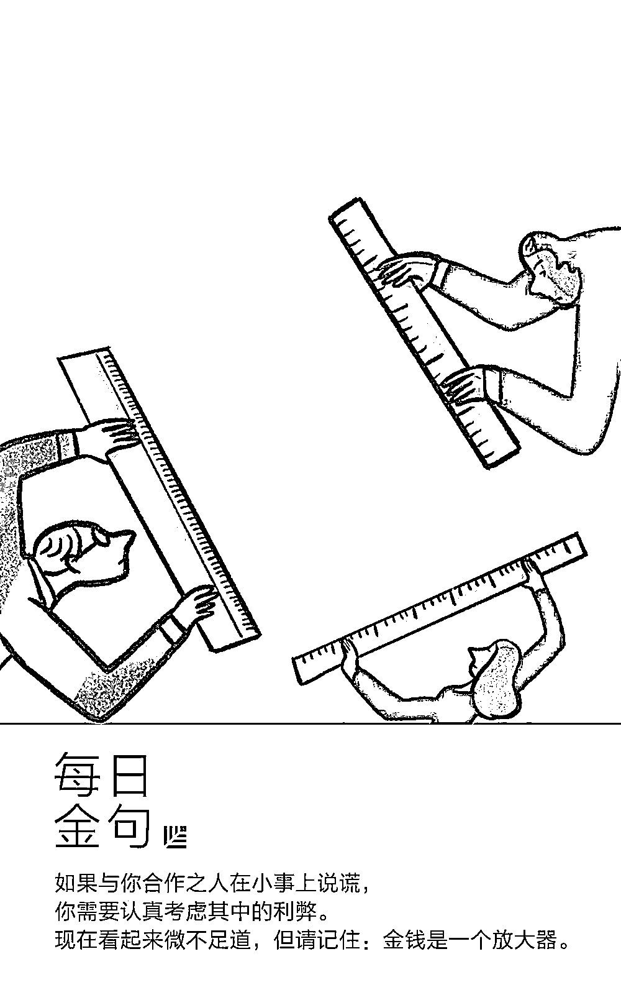
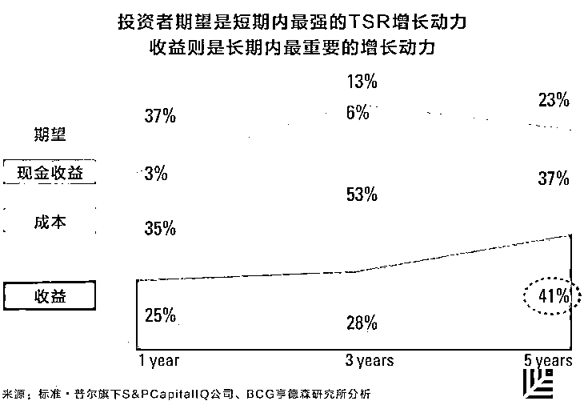
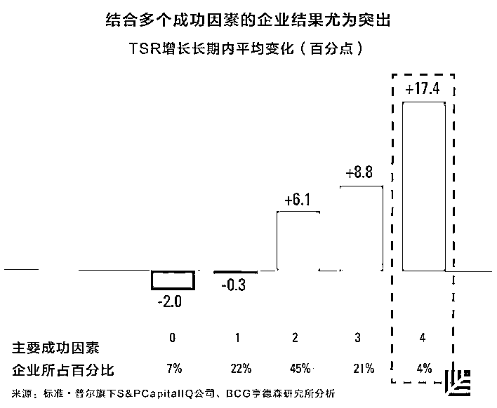
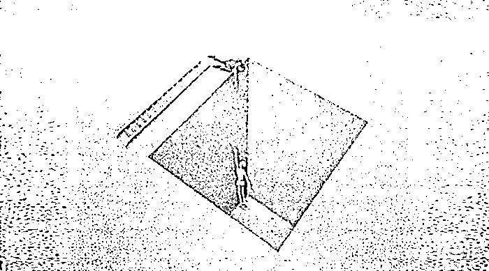

# 十二、年数据分析、300 家公司研究，告诉你企业转型成功的 5 个关键法则｜红杉汇内参

> 原文：[`mp.weixin.qq.com/s?__biz=MzAwODE5NDg3NQ==&mid=2651224513&idx=1&sn=a0e1b343ed7dfe3902f32568edc61a00&chksm=80804795b7f7ce83f62e216550a69b35eed91c618cb47f321181b139f7e9b4c0b28941d0465b&scene=21#wechat_redirect`](http://mp.weixin.qq.com/s?__biz=MzAwODE5NDg3NQ==&mid=2651224513&idx=1&sn=a0e1b343ed7dfe3902f32568edc61a00&chksm=80804795b7f7ce83f62e216550a69b35eed91c618cb47f321181b139f7e9b4c0b28941d0465b&scene=21#wechat_redirect)

[ 编者按 ] 互联网产品的迭代升级是常态，所谓企业转型，其实也就是从战略到商业模式的迭代升级，或者说改弦更张。

不仅是数字时代的恐龙级巨头需要把它作为应对之策，创业企业也需要把转型纳入战略思考和行动议程中。因为，商业在加速，产品生命周期在缩短，技术变革浪潮也在叠浪而来，这些外部性环境因素都决定了很难“一招鲜吃三年”。综合来看，企业转型失败的概率之高，着实惊人。

波士顿咨询亨德森研究所的几位研究者定量化地研究了 2004-2016 年 300 多家进行转型的公司的数据，由此发现了影响转型成功的 5 个关键法则：重新制定长期的战略、投资研发、改组领导团队、引入外部视角、提出正式的转型项目。而且，具备上述多种成功因素的企业，五年内的股东总回报增长了 17.4%。

全文都以数据说话。

每期监测和精编中文视野之外的全球高价值情报，为你提供先人一步洞察机会的新鲜资讯，为你提供升级思维方式的深度内容，是为 **[ 红杉汇内参 ]**。

** 内参**

**企业转型的真相**

作者 / MartinReeves、LarsFæste、

KevinWhitaker、FabienHassan

编译 / 洪杉

实证分析显示，传统观点对于风险系数高的大型革新举措的判断，往往是错的。

对于很多公司的 CEO 而言，企业转型是首要的企业战略。理想情况下，应该先发制人，但在实际操作中，往往是因为不断变化的充满挑战的环境，企业被迫转型。

为了研究企业转型及其成功因素，BCG（波士顿咨询）分析了 2004 年到 2016 年所有市值在 100 亿美元以上的美国上市公司的金融及非金融数据。从中，我们确认了一批需要转型的公司——股东总回报（以下简称 TSR）和所在行业平均值之比连续两年以上降低 10 个百分点以上。这一定义为我们提供了大量的实证分析数据，涵盖了 300 多家公司，时间跨度超过十年，涉及各行各业。

**三个重要发现**

首先，涉及数字化变革时，转型需求会更迫切，转型风险会更高。技术公司是企业转型后实现行业领先地位可能性最低的公司，与之类似的还有消费品企业，同样也遭到了数字革命的巨大冲击。

缩水最严重的企业尤其不可能获得转型成功，情况会继续恶化。所以，领导者必须尽早识别出恶化的征兆并迅速行动，因为一旦等到它发展为深层次的危机，企业可能就永无翻身之日了。

最后，处在动荡竞争环境的企业有更大的转型需求，但与处在稳定竞争环境中的企业更可能失败。

**五个转型成功关键因素**

1

单靠削减成本无法成功进行转型，领导者还必须重获投资者信心。

BCG 分析发现，成功从 TSR 降低中恢复过来的企业在转型努力的第一年主要依靠的是成本削减。而投资者期望为短期 TSR 恢复提供的动力，与成本相比还要更高一些，突出表现贡献率达 37%。

这意味着，领导者需要让投资者相信，他们会好好利用新获得的灵活性来赢得未来的成功。效率及投资者期望是转型获得短期成功的关键。

2

收益增长才是获得长期成功的首要驱动力。

转型期第一年过后，收益增长成为了越来越重要的 TSR 增长驱动力。到第五年，则超过前两种最初的增长动力。因此，转型努力不能只注重改善短期企业经营表现，还必须引进新增长策略，这就是转型期的“第二阶段”。这在一个不断变化的时代尤其重要，因为企业无法靠着周期性的复苏恢复之前的表现，而是得学习如何在新环境中继续发展。

3

长期战略及研发投资有助于转型成功，对于处在动荡环境的企业尤其如此。

多变量分析显示，拥有长期战略方向的转型中的企业，好于低于平均水平的企业，总共高 4.8 个百分点。

在转型期间，研发投入高于平均水平的企业比低于平均水平的企业表现要好得多（5.1 个百分点的 TSR 积极影响）。但是，仅凭研发投资一项，企业所能取得的效果是有上限的。经分析发现，研发投资超过业内平均水平之后，所获得的回报会迅速减少。

资本性支出同样也是转型过程中的增长动力之一，但其影响力仅为研发支出的三分之一。这进一步强调了长期战略投资的重要性，因为资本性支出投资往往只是为了改进现有的模式（如升级生产设备），而不是为了找到新增长来源。

4

引进外部人才为领导层注入新血液可以提高成功几率。

我们对转型中的企业的分析发现，其中只有 24%更换了 CEO。令人惊讶的是，面对当今时代日益增加的激进主义投资趋势和提高企业表现的压力，仍有超过 3/4 的困难企业继续留用原来的 CEO。

更换 CEO 的长期影响仍是积极的。五年期内，这使 TSR 增加了 9.2%，而没有更换 CEO 的企业为 4.6%。此外，更大范围的管理层更换，对转型成功也有积极影响（4.4 个百分点）。

新 CEO 从哪儿来，内部遴选还是外部招聘，是面临转型的企业要做的另一个关键选择。大多数企业选择墨守成规：转型期的企业中，超过 80%的新任 CEO 来自企业内部。但平均而言，长期来看从外部聘用的 CEO 表现更好（控制其它变量的情况下，会有 4.5 个百分点的 TSR 积极影响）。

5

正式的转型项目，只要覆盖的范围和规模够大，就有助于成功。

短期内，正式项目可以增强投资者信心，因为这样的努力所带来的改变，是常规经营流程的调整无法比拟的。

而关键在于，正式的转型项目覆盖范围要足够广，规模要足够大。长期努力对于处在动荡环境的转型中的企业尤其有效果，这类企业的 TSR 在五年时间内的增长，比短期项目企业高 10%。

**企业转型领导者手册**

转型的最优策略应该要包含几种成功因素，如重新制定长期的战略、对研发投资、改组领导团队、引入外部视角、提出正式的转型项目。我们分析了少数几家在转型期内具备至少四种成功因素的企业，结果发现，它们得到了最大的 TSR 增长幅度：五年内获得 17.4%。

当然，不是所有的成功因素都与每次的企业转型有关。但鉴于转型举措的高风险性，领导者需要得到有证据支持的建议。实证分析有时候支持传统智慧的判断，有时候则与之相反，但是无论怎样，企业承担不起忽视它的后果。

** 读数**

**26%**

26%语音交互用户说

他们对自己的语音助手会产生性幻想（传立）

▨ 六分之一的美国人即大约 3900 万人都有智能音箱，同比上涨 128%（TechCrunch）。

▨ 20%的安卓手机搜索使用的是声音搜索。

▨ 亚马逊占语音控制音箱市场的 70%（TechCrunch）。

** 情报**

#如果你从不犯错，说明你不够努力#

**关于宜家创始人，你不知道的 5 件事**

英格瓦・坎普拉德于 1 月 27 日逝世，享年 91 岁。他成功背后的五个商业信条：

▨ 坚信顾客至上。“大多数人的财富都是有限的。而我们要服务的正是这大多数人。所以最重要的就是维持极低的价格水平。但我们的商品必须是低价但不失品味的，不能因此而牺牲产品的功效或品质。”

▨ 坚持资源利用最大化。“时间是你最宝贵的资源。10 分钟你可以做很多事。十分钟过去了，就一去不复返了。”

▨ 不局限于一种产品。他 5 岁时就向邻居卖火柴，这是他的第一笔生意。毕业之后卖过圣诞饰品、鱼、铅笔和种子。宜家也不是只卖家具，家具业务直到 1948 年才开始。

▨ 坚信工作不只是工作。“工作绝不能仅仅是生计，如果你对自己的工作没有热情,你生命的三分之一就白白浪费了。”

▨ 从不惧怕犯错。“只有在睡觉的时候,才能不犯错误。犯错是行动者的特权，是那些能够改正错误的人的一项特权。”

#共赢才能长久#

**6 个方法帮您辨别糟糕的生意伙伴**

你有多了解即将与其一起做生意的人？他或她真正能带来什么好处？最重要的是，你五年后的感觉会和现在相同吗？

▨ 如果合作计划好得令人难以置信，那么很有可能中招了。

▨ 每个人都有自己的如意算盘。这不是件坏事，只是一个值得注意的事实。你应该关心，此种合作关系是否会在对方的优先事项列表里排到前面。

▨ “真正想参与的”人和那些狗屁不通的人是有区别的。人们在寻找能填补自身空白的其他人——这就是寻找“合作伙伴”的意义。

▨ 工作分工和权利义务不平衡。需要从一开始就确定谁负责什么事务，经常互相检查彼此的工作，以确保双方都为公司发展做出了贡献。

▨ 你永远不会想和一个对自己不诚实的人做生意。

▨ 和你喜欢的人一起做生意。否则，创业也仅仅是“工作”而已。

#一动一静皆为数据#

**大数据如何改变体育运动**

今天，正如其他行业运用数据构建与受众的关系一样，体育行业也在通过数据提升运动员、赛事组织和粉丝的参与体验。

▨ 棒球运动是最早运用大数据的体育活动之一。迈克尔・刘易斯的著作《魔球：逆境中致胜的智慧》让奥克兰运动家队的著名故事家喻户晓，展现了大数据在体育行业的影响力。

▨ 在某些情况下，大数据服务未来，而非关注现在，更像是一个放长线钓大鱼的策略。

▨ 由于社交平台的用户主要为年轻人，因此大学体育项目是运用社交媒体的最大赢家。

▨ 可穿戴设备有助于监测运动员在赛场上的表现，甚至可能与队服合二为一。教练可以检测运动员的疲劳程度和身体水分比例，其安全和表现将得以受到监测、分析和改善。

▨ 粉丝端的数据也将进一步影响体育赛事的营销方法和决策，例如如何制定比赛时间，如何迎合粉丝偏好等。****************

** 推荐阅读**

壹

[红杉 FM | 创业必备清单Ⅱ：创业者和投资人的沟通清单](http://mp.weixin.qq.com/s?__biz=MzAwODE5NDg3NQ==&mid=2651224508&idx=1&sn=21a1aa1115d1e60bde4db15ce693a274&chksm=808047e8b7f7cefe6bee679281ae5a0623023223569ca13c1901b7a7f04aa28ff6e4d3129ddb&scene=21#wechat_redirect)

贰

[薪人薪事常兴龙：为什么“铁军”无法成就 SaaS 销售](http://mp.weixin.qq.com/s?__biz=MzAwODE5NDg3NQ==&mid=2651224512&idx=1&sn=3d9e517f6026aaf782762f540f1c3fe4&chksm=80804794b7f7ce8207229537820b73096a18a5e2010a3ef567e792186ebbb2c2a8e406cf67a0&scene=21#wechat_redirect)

叁

[阅读，以学习沉静之道｜红杉中国新春特别推荐](http://mp.weixin.qq.com/s?__biz=MzAwODE5NDg3NQ==&mid=2651224478&idx=1&sn=d2f15557ee09c74a038f8e6405f3e87e&chksm=808047cab7f7cedc4a87f3daebf844bc03cff78cfb3756061775fb5bb74eca7a3aebf673d48b&scene=21#wechat_redirect)

肆

[红杉中国投资企业华米科技登陆纽交所 智能可穿戴市场的创新与发展提速](http://mp.weixin.qq.com/s?__biz=MzAwODE5NDg3NQ==&mid=2651224440&idx=1&sn=20b275a28a777feb6769bf5c4bc4a8c4&chksm=8080472cb7f7ce3a0cfae86b79fb6b694457213506b7fbbd5990803ddff290808a74e5225214&scene=21#wechat_redirect)

伍

[要爆发式增长？没有人比这八个企业玩得更 6](http://mp.weixin.qq.com/s?__biz=MzAwODE5NDg3NQ==&mid=2651224492&idx=1&sn=361170f14766ac7ae894866722693df6&chksm=808047f8b7f7ceee007cb87ee1930bdb51cdeaf1849597230b9bfa58e09b9eab13ff1b1596fb&scene=21#wechat_redirect)

