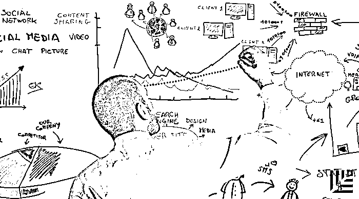

# 二千零一十七、将继续影响商业世界运转的 5 个基本定律，并未失效！

> 原文：[`mp.weixin.qq.com/s?__biz=MzAwODE5NDg3NQ==&mid=2651222222&idx=1&sn=10516f5870c5e72c99234ed7411a8c26&chksm=80804e9ab7f7c78c9c6446af020607be9005a86176b19d16b2ee2e327ca355d373482844757a&scene=21#wechat_redirect`](http://mp.weixin.qq.com/s?__biz=MzAwODE5NDg3NQ==&mid=2651222222&idx=1&sn=10516f5870c5e72c99234ed7411a8c26&chksm=80804e9ab7f7c78c9c6446af020607be9005a86176b19d16b2ee2e327ca355d373482844757a&scene=21#wechat_redirect)

日益被数字化“感染”的世界看起来好像是依循着一些新规则在运行，那些工业经济时代的旧逻辑是不是已被你急于弃如敝履？

但事实上，面对急剧变化的商业世界，识别哪些是不变因素，和识别变化本身，可能一样重要。以下是哈佛大学教授 John Sviokla 在岁末年初撰写的一篇重磅文章，揭示了将继续影响商业世界运转的 5 个根本性的不变之定律。许多在过去效果良好的增长策略已不再那么成效显著，这些原则不仅解释了你的公司下一步将会面临什么，而且还说明了为什么。

它们是：图灵的可计算性理论、与交易成本有关的科斯定理、计算机领域的贝尔定律、鲍德温和克拉克的模块化概念以及中本聪的分布式记账原理。

***

**【每日金句】**

随着数字化继续大行其道，

交易成本将继续下降，

这将影响到哪些活动需保留在组织内部，

哪些需要从外部获取。

***

**5 个继续影响商业世界**

**运转规则的基本定律**

文/John Sviokla

综合编译/洪杉

**最**重大的变化往往最不明显，这在商业中尤其如此。数字技术的诞生改变了许许多多行业的面貌，但仍旧有一些发端于工业经济时代的规律仍将起作用，它们可被视为原则。

如果你在 21 世纪第二个十年开始创业，那么理解以下这五个原则是至关重要的，因为数字化的颠覆作用正迅速成为新常态。许多在过去效果良好的增长策略已不再那么成效显著，这些原则不仅解释了你的公司下一步将会面临什么，而且还说明了为什么。

**图灵的可计算性理论：**

**机器可处理越来越频繁出现的任何可计算的问题**

在图灵发表原始论文的年代，只有少数活动是可计算的，但他预见到随着数字化计算的不断发展，可计算活动的数量将会增加，的确，到今天，它们的数量和影响力仍在增长。甚至于，作为一个不断发展的人类努力的结晶，机器与人一样能干，可能比人类还更能干。

图灵在可计算性和人工智能方面做出的努力推动了计算机时代的到来，且确立了这样一个事实——一切数字化的事物，从第一台计算机到今天人手一台的手机，都有超越人类目前成就的潜力。当受到高度重视的数字技术（如搜索引擎、无人驾驶应用、自动取款机、旅游预订网站等）出现时，它们不可避免地取代了人力，而且在这个过程中，它们从根本上改变了所在行业。

可计算性越来越大的影响，解释了为什么成熟的公司会受到数字化这么强烈的影响。在这个任何企业的活动都有可能很快会由计算机完成的世界，我们必须不断地沿着数字化路线重新定义自己——无论是沃尔玛收购互联网零售商 Jet、通用电气使其工业产品变得“智能”，还是约翰·迪尔(John Deere)发明的机器人割草机。

未来，预期可变成可计算的任务包括并购交易中的尽职调查、实时语言翻译、某些形式的编程以及世界上绝大多数的汽车驾驶操作。

同时，对于计算机将完全取代人类的担忧（或希望）可能还为时尚早，虽然人类活动的许多方面可以在可计算性提高的浪潮中实现，但人类所做的大部分工作都超出了机器复制的能力。**图灵自己也认为，有些任务是永远不可计算的，比如，只有人类才能决定去哪儿旅行，或者买哪家公司的产品**。

**科斯交易成本定律：**

**只有那些保持内部交易成本低于外部的公司才具有增长潜力**

从 20 世纪 30 年代后期开始，经济学家罗纳德·科斯便开始考虑公司出现的原因，以及它们为什么会衰落。他最终的结论即为科斯定理：当一家公司内部开展活动的成本比外包更便宜时，该公司便可生存。而如果不是这种情况，公司便不复存在。

科斯定理解释了许多公司所受到的规模增长限制，**只有当一家公司的内部成本（包括所有间接成本）低于外部成本时，公司才能发展**。一旦内部成本超过外部成本或与之持平时，公司就会面临收益递减的转折点，它将停止扩张。因为内部交易成本往往很难追踪，公司领导者可能并不会意识到为什么公司会举步维艰。

新的数字技术增加了科斯定理带来的压力。一些观察者认为，这些技术将为大公司敲响丧钟。例如，搜索引擎使得今天获取信息的方式比过去更容易且更便宜，因此过去大公司所独有的丰富资源的优势被削弱。

但数字化也降低了内部成本，至少对那些有效利用技术的公司来说是这样，这改变了内部组织的经济学做法。例如，亚马逊、微软和谷歌等已利用了这种趋势，而且这种服务有扩散出去的趋势。一些公司已经建立了技术平台，该平台连接了企业的所有部分以及与过去 IT 项目相比成本相对较低的价值链。他们因此变得比以前更具竞争力。

随着数字化继续大行其道，交易成本将继续下降，这将影响到哪些活动需保留在组织内部，哪些需要从外部获取的决策。一些过去在内部便宜的东西现在变得更为昂贵。例如，研发人员的维护。因此，开放创新的价值得到体现。

同时，过去从外包中受益的项目，如人力资源和培训，现在可能成本在内部变得更低廉。因为层次结构的分层可能会支持更加非正式（因此也更便宜）的人才管理和招聘。

唯一不会改变的是基本公式：**内部成本占外部成本的比重越低，公司发展的可能性就越大**。

**贝尔定律：**

**大约每隔十年，新的价格更低的计算机设备就会出现，这将会改变一切**

戈登·贝尔是计算机领域最著名的工程师之一，他在 1972 年的文章中指出，大约每过十年，半导体、存储、接口以及网络的发展就会推动一个新的、价格更为低廉的计算机“领域”的发展，同时也会推动新的行业和市场的发展。这往往会取代（至少部分取代）旧的产品。

智能手机取代了许多个人计算机，之前则是个人计算机取代了小型计算机，小型计算机取代了大型计算机。贝尔定律表明，**技术通过不间断地从平衡、不平衡到再平衡的演化，反复将世界推向一个新常态**。

最新的领域的一个典型例子就是物联网(IoT)，它已经推动了行业的巨大发展。银行、汽车、国防、医疗保健以及安全行业是一个缩影。随着物联网的发展，可由嵌入式计算机提供的机会将变得更为明确，但毫无疑问的是，这个新事物将会同之前的技术一样具有变革性。

**模块化概念：**

**将技术或过程分解为与功能相关的组件，**

**这样有利于创新**

1990 年代末，哈佛商学院教授阿里斯·鲍德温和金·克拉克指出，模块化是创新速度提升的关键驱动力。

模块化是用于软件开发、汽车设计以及工程其他方面的一种技术，它将一个复杂的技术项目分解为许多功能相关的组件——根据标准化的要求使其标准化，并根据区分的要求单独设计。

在高模块化的系统中，标准化的部件或模块可以轻松地以不同方式更换、升级并适配不同的系统。模块化使得对设计复杂性的管理变得更容易也更廉价。**真正的模块化系统可针对个人用户量身打造，无需将整个设计推倒重来**。

模块化的概念同样也适用于公司，相对模块化的公司可比其他公司更快地创新，因为这些公司的研究和开发的速度不会因为进度最慢的部分或产品而减慢。想想亚马逊，它开发了一种服务体系结构，这种结构能够使亚马逊以比竞争对手更低的成本提供复杂的系列产品。这是互联网零售商尤其擅长进入新行业并开发新产品的一个关键原因。

公司里的模块化，并不是说要设置彼此完全独立的研发实验室，而是需要注意研发过程的设计，共享一些常见的流程和实践，同时，保持其他活动的完全独立。今天，随着公司从模拟向数字化的转变，模块化至关重要，因为速度和敏捷性占有举足轻重的重要地位。

**中本聪定律：**

**当受托基金机构由系统而非调解员管理时，**

**交易会得到改进**

虽然没有人将其称为“中本聪定律”，但区块链技术的原则已是未来验证和实践认证的基础。区块链和比特币可能会彻底改变贸易、银行、投票、监督和其他验证交易的经济性。

在没有机构批准的情况下，可自动清算的交易的数量和规模可能会大幅上升。这些交易将成为“智能合约”的基础：自动化、具有法律约束力且可以自动执行的交易协议。由于信托风险已成为过去时，企业将变得更加活跃，它们可以没有约束地冒一些新的风险。世界各地的计算机连在一起，为所有参与的各方提供诚信的环境。

中本聪定律是之前描述的其他四原则的自然延伸。正如图灵所预测的那样，它使验证数字化，而验证一直以来都被认为是人类主导的领域；它还能降低科斯定律所谈到的交易成本的减少；它还表现了模块化的有效性。

以上这 5 个基本定律将有助于我们更好地了解那些胜出的公司在当前迅速数字化的市场中的竞争方式。最终，伟大的战略取决于对创新、经济和营销等基础的理解。成功将青睐于那些热衷于自动化、降低内部成本、更好地利用先进设备、将模块化设计应用到其产品和服务中、以及参与区块链式验证系统的企业。

