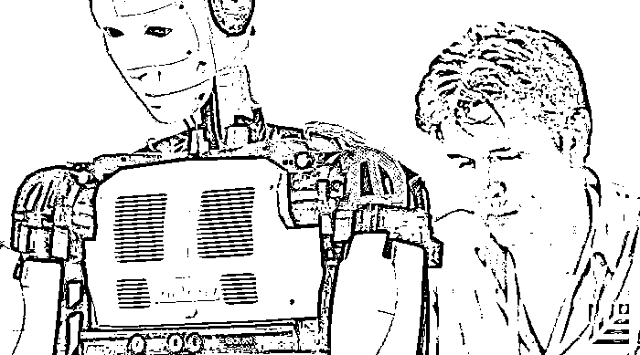
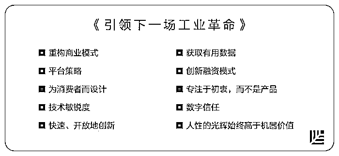
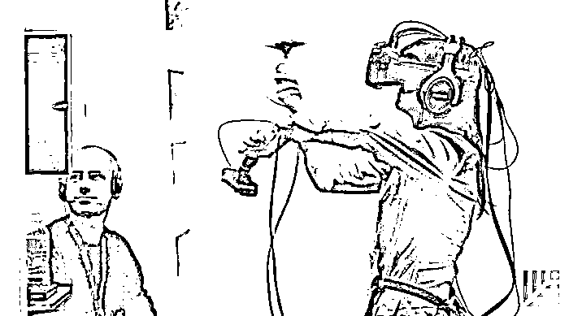
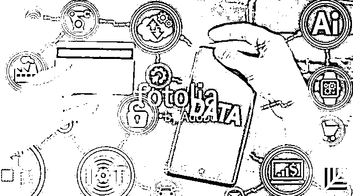

# 普华永道：在下一场工业革命中争胜的 10 个原则 | 红杉汇内参

> 原文：[`mp.weixin.qq.com/s?__biz=MzAwODE5NDg3NQ==&mid=2651222791&idx=1&sn=fb4ea0d4bdb265b691b57dfb8edae829&chksm=80804d53b7f7c4453089d1ef9c1461060f4a2eb7a274852cae17c555373d2e8a7824c125ab03&scene=21#wechat_redirect`](http://mp.weixin.qq.com/s?__biz=MzAwODE5NDg3NQ==&mid=2651222791&idx=1&sn=fb4ea0d4bdb265b691b57dfb8edae829&chksm=80804d53b7f7c4453089d1ef9c1461060f4a2eb7a274852cae17c555373d2e8a7824c125ab03&scene=21#wechat_redirect)

[编者按]我们是从什么时候开始习惯于谈论机器人、人工智能、物联网或是区块链等概念？我们又是从什么时候才突然意识到，数字技术已将行业的边界彻底打破，并在不知不觉中重塑了供应商、生产商和消费者之间的关系？

当传统商业世界分崩离析，工业文明的大框架又一次陷入历史性剧变，是时候为下一场工业革命制定全新的战略了。

在本期主文中，普华永道就为企业提出了 10 条新原则，对于企业来说，这些新策略或将意味着变革、创新与迭代升级。当然，现在正是重新审视商业模式、融资策略以及对待平台、用户和产品态度的最佳时机。

每期监测和精编中文视野之外的全球高价值情报，为你提供先人一步洞察机会的新鲜资讯，为你提供升级思维方式的深度内容，是为** [ 红杉汇内参 ]**。

***

**【每日金句】**

客户感兴趣的并非产品或服务，

他们在乎的就是成果。

你应该将自己视为某种成果的生产者。

***

**【内参】**

普华永道：在下一场工业革命中

**争胜的 10 大原则**

作者：Norbert Schwieters/Bob Moritz

综合编译/洪杉

**作**为工业文明基础的大框架通常不会发生剧变，但现在，这样一场剧变似乎就要上演了。随着工厂和仓库都装满传感器，系统已经能预测故障并报警，定制的零件也在按需生产，“下一场工业革命”逐渐进入我们的视野。这场革命的领导者是那些不断取得突破的公司，它们正在开拓的领域涉及机器人技术、机器学习、数字制造、物联网以及区块链。

行业之间的传统界线已经逐渐消失。现在，若想说出一家电信公司和一家娱乐制作公司或者一家零售银行和一间零售店之间的区别，已经越来越难了。供应商、生产商和消费者之间的关系也在快速模糊，快到让许多商界的决策者都没有做好准备应对。

长久以来，商业战略的基础都是经典的价值链，其框架的特点就在于一系列稳定的交易。但现在，数字技术的崛起使得个人能够越过价值链而相互连接，并提供更有效率的产品和服务，这将会降低规模经济以及传统分工模式的重要性。公司与公司之间的关系将变得更加流动而不固定，货物和服务的价格和成本也会较今日更加波动。

我们在普华永道的研究显示，对那些处于领先地位的公司来说，工业互联网所带来的潜在收益是前所未有的。怎样带领你的公司在这场即将到来的工业革命里扮演起关键角色？这是我们提出的 10 条原则——

**重构商业模式**

商业世界已经习惯了分崩离析。一个接一个的行业证明，固执于传统商业模式的旧公司逐渐被提供新产品、新服务的创业公司取代。下一场工业革命将通过大规模地降低成本以及提高效率来加速这种取代的出现，尤其是在制造业。

你需要抛弃那些已经不再适用的过时做法，这要求企业要有耐心和律己能力。虽然转型会有阵痛，但是，出售或停止次要业务，以更有效的方式关注产品或服务组合，能让你在新世界里获得发展机会。

**平台策略**

**平台在新工业体系里的地位，就正如价值链在旧工业体系里的地位**。

平台结合了相互操作的标准和系统，它创造了一个即插即用的技术基础，在此基础之上，大批供应商与消费者能够通过同一套硬件、软件和服务等进行无缝互动。一个平台的用户实际上就构成了一个生态系统：一批公司在此其中交换着货物和服务，它们的命运相互捆绑了起来。

上述只是工业互联网平台建设的初级阶段。像通用电气和西门子这样的公司已经在此有了一席之地，通用公开宣称要成为“世界上第一家数字化工业企业”的目标；西门子则在与微软合作，研发同样野心勃勃的 MindSphere 平台。

对于特定类型的供应链，以及像医院、银行和其他类型的企业，未来都会出现相应的平台。汽车正朝着自动驾驶的方向发展，将来它们也会被设计成各种平台，嵌入“智慧城市”，而后者将持续改善自动驾驶汽车的导航和行驶方式。

要想在这个工业互联网里占据一席之地，第一步就是确定在这个基于平台的世界里你能实际扮演的角色是什么。

*   平台“使能者”——像通用和西门子那样，负责建造及拥有构成行业基础的大型中心；

*   平台“参与者”——利用平台来提供产品和服务，以吸引顾客；

*   平台“增强者”——在平台上开发新技术，把使能者和参与者作为主要客户对象；或者是建立一家结合上述两种或三种角色的公司。

**为消费者而设计**

大规模的数字技术成为下一场工业革命的驱动力，所以我们很容易会忽略它是如何影响人际关系的。这场革命的新基础框架是一张将人和人连接起来的网络：尤其是生产商和消费者，他们的关系比以前更紧密。

对许多大型企业来说，这代表着一场剧变。比如，服装企业正在零售店和工厂之间打造新型的连接渠道，顾客的偏好可以迅速转化成新的设计款式，就像 Zara 和 H&M。银行、电力和电信运营商也在进行着类似的转型，简化用户界面、提供新型服务，以更快速、更友好、更积极、更有效的方式解决顾客反映的问题。

**真正的全渠道顾客体验是把每个接触点都连接起来的**：所有面对面的接触、每个零售环境、每一次的线上行为、任何通过智能手机而连接起来的事物。在公司的新基础框架里，你有更多的接触点需要应对。消费者生活在一个互动的世界里，他们的行为聚合成你可以参考的数据，并以此来做出商业决策。反过来，对消费者来说，你的行为也会比以前更加透明。

**技术敏锐度**

**无论你处于什么行业，你都生活在一个可编程的世界中，而软件将成为竞争力的关键**。

每个公司都需要在未来提高自身对技术的敏锐度，不仅是使用数字工具，还应包括对技术模式的深入见解。例如，如何创建可以利用工业互联网的业务足迹，或是如何积累有助于促进机器学习的数据类型。

随着全体人员能够越发自如地应对工业互联网，他们将会发展一种创新的合作文化，还将对新世界的风险形成更好的理解，比如与事故、侵犯隐私和网络攻击相关的风险。这种深刻见解对于公司乃至所处的平台而言都将是非常宝贵的。

**快速、开放地创新**

创新与领导力在下一次的工业革命中携手并进。**许多公司会寻求颠覆性创新，但是一系列渐进型创新却更加有利可图**，它们更容易在市场上接受测试，可能会以滚雪球般的速度引发颠覆。这正是智能手机所经历的过程。

快速创新更能发挥效用。广泛招募参与者，包括那些与你的平台有关联的组织。

**获取有用数据**

**实时数据呈指数增长，这仅仅是个开始，关键在于能运用分析结果来发现重要模式**。

比如在过去，施工进程的具体信息或建筑的具体造价总是很难获知。现在，建筑公司可以利用无人机搜集摄影图像，将图像与原始工程图重叠，核对承包商报告，就连工地上一厘米的差距都能发现。

生产系统、客户个人需求及需求计划系统三者间的直接反馈和交互，减少了订货到交货的时间，也改进了产能利用率规划。

**创新融资模式**

云计算已经开启了一场安静却有力的革命，即“软件即服务”模式，这种做法影响了技术公司所需的融资方式以及管理投资回报的方式。

同样的，规模较大的工业企业也会从出资购买工厂和机器，变成为按需付费的模式，实现更加灵活的设备安装。企业会减少对旧设备换新的关注，更多地关注设备的持续升级。工业企业将借鉴硅谷，更多地通过股权资本和风险投资来融资，而不是负债。可调价格也会更为普遍。技术会允许企业与企业之间的价格随销售时间、用量以及应用类型而改变。

说到底，要充分发展工业互联网，从而保持工业文明的活力，必须要以全新的能力和体系来取代或升级全球工业基础设施的方方面面。这些事业的融资同技术创新一样，需要大量的专业知识和创造力，制定度量标准，用以追踪短、长期收益，平衡短期回报与长期目标。

**专注于初衷，而不是产品**

当你真正明确自己的公司是什么样的，以及为什么要销售这些产品时，人们才愿意相信你给出的承诺。

当公司履行承诺时，客户会有所察觉。**客户感兴趣的并非产品或是服务，他们在乎的就是成果。不要认为你的公司就是在提供特定类型的产品或服务，你应该将其视为成果的生产者**。

问问自己，你的公司是否仍然停留在制造物理产品的阶段？你是否根据客户在满意度、生活质量和生产力等方面的明显差异来判断成功与否？如果你能够以不同的方式来提供产品或服务，能够为客户带来更加满意的成果吗？

**数字信任**

共享数据将会触发下一场工业革命的到来。正因为获取数字化信任即将成为成功的关键所在，因此，失去别人的信任也必定让你一败涂地。

你不仅需要管理客户的行为，还要防止外部人员掌握公司的机密信息。完善的风险管理系统、网络安全系统以及数据完整性系统，对于帮助公司避免违规行为或是更好地管理中断业务有着至关重要的作用。同时，你必须将透明化管理作为你的一项重要策略。

**人性光辉始终高于机器价值**

**人类的重要性远远高于机器的价值**。

你的根本立场就是要懂得尊重他人。随着技术发展得越来越精湛，人类区别于其他生物最重要的一点，不是解决问题或是完成任务的能力，而是我们拥有与生俱来的感官意识，我们懂得同情别人，有直觉判断能力，与他人沟通，会做出选择，会以不能提前预测的方式做出以上行为。了解这一点，你的公司将会迎来更美好的未来。

如果下一场工业革命即将到来，你的公司将会处于什么样的位置？这意味着你必须以从未有过的方式，将你的员工、你的能力以及敏锐的技术眼光整合起来，发挥整体优势。从某种意义上来讲，这样的场景正是代表了从 1950 年代开始的数字技术革命的浪潮，在其稳定之前还会以这样的势头持续奔涌好多年。我们要做的就是重新开始，迎接下一场工业革命的到来，希望它有如我们期待的那样进展良好。

***

**【情报】**

#怎样增强商业世界的现实？#

**投资 AR 赛道的 6 个方向**

科技顾问公司 Digi-Capital 预测，到 2021 年，AR/VR 市场规模将达到 1080 亿美元。哪些是眼下可见的投资机会？

*   仿生视觉。AR 的圣杯是使图形信息与自然视觉没有区别。

*   自然输入/输出以及互动。眼睛跟踪、手势识别和语音移动技术，超越触摸和点击，提供了更自然的手段与增强世界互动。同时，触觉、增强音频和情感的技术解决方案将使虚拟世界真实得如身临其境。

*   3D、真实的世界。下一波计算背后真正的转变是从 2D 到 3D 计算的转变。这需要可以扫描、捕获、跟踪并认识 3D 世界的解决方案。

*   世界建筑。开发商和设计师将努力创造一个虚拟实境。

*   临场感。身临其境的沟通、大规模的社会经验、和相距遥远的人沟通，这些都是我们对 AR 的期待。

*   超级智能。AR 将把科技发挥到极致，整个网络中存储的知识都将是我们的。

#捕捉信号，过滤噪声#

**大数据思维已过时？我们需要的是智能数据**

预计到 2020 年，地球上每人每秒将产生 1.7 兆字节的新数据。随着所有这些数据的到来，企业要如何做才能不被这些数据淹没呢？

*   找到正确的数据将会获得非常丰厚的回报。几年前，Red Roof 酒店发现每天大约有 9 万名美国乘客因为航班取消而滞留。据此，该连锁酒店想出了如何跟踪航班延误信息，然后向滞留乘客投放广告的方式。这使其业绩同比增长了大约 10%。

*   专注于智能数据，而不是大数据。亚马逊就是这样做的，避免将时间和精力浪费在分析那些可能有趣但是最终却毫无价值的数据上。

*   打开“黑盒子”。表面上看，大数据似乎能给任何利用它的公司带来了意外之财，但事实并非如此。许多分析工具的“黑盒子”特性让营销人员难以理解这些数据，成为影响营销效果的主要制约因素。

#走到挽留谈话那一步已经晚了#

**留住明星员工的有效方式**

如果研究《财富》杂志评出的“100 家最适合工作的公司”，你会发现，这些上榜公司通常都侧重于发展高度信任的文化和人才培养，并展现了留住明星员工的有效方式——

*   让员工感觉自己像合作伙伴，像是以自己的贡献在给公司的未来投资。

*   保证透明。

*   让员工承担新的责任。

*   尊重。不只是把他们看作员工，而是作为平等的人来看待。

*   获得员工反馈。

*   让明星员工指导同伴或同事。

*   创建学习环境。

*   重视工作的意义和目的。

*   建设认可和赞美的公司文化。

*   在重大事项上有发言权。

*******

**【往期回顾】**

红杉汇内参第 024 期 

[我们熟悉的那种工作和管理模式已经腐朽](http://mp.weixin.qq.com/s?__biz=MzAwODE5NDg3NQ==&mid=2651222756&idx=1&sn=baabf8c2991f11d8851b1c68c796c12a&chksm=80804cb0b7f7c5a61629f347da32dcb15a2c85e3f57637bae2ebba80e215dd35375964bf42a9&scene=21#wechat_redirect)

红杉汇内参第 023 期

[你的创业团队里何时需要一名幕僚长？](http://mp.weixin.qq.com/s?__biz=MzAwODE5NDg3NQ==&mid=2651222717&idx=1&sn=b38bdef1d7670c8ba9082dfd9089ec1c&chksm=80804ce9b7f7c5ff65fc6c83eb199d1397bbbc5a4ad05ae8d774143dd617d2a96e46b93d87d9&scene=21#wechat_redirect)

红杉汇内参第 022 期

[聪明的钱在流向哪里？](http://mp.weixin.qq.com/s?__biz=MzAwODE5NDg3NQ==&mid=2651222648&idx=1&sn=87dd6f15f5a6daa74caaf87b22e567f1&chksm=80804c2cb7f7c53a9c4e3e67ef3f86920c73af47c947ddd60791c6494eee9b85cad750ba748a&scene=21#wechat_redirect)

[24 家顶尖 VC 看好的未来产业](http://mp.weixin.qq.com/s?__biz=MzAwODE5NDg3NQ==&mid=2651222648&idx=1&sn=87dd6f15f5a6daa74caaf87b22e567f1&chksm=80804c2cb7f7c53a9c4e3e67ef3f86920c73af47c947ddd60791c6494eee9b85cad750ba748a&scene=21#wechat_redirect)

