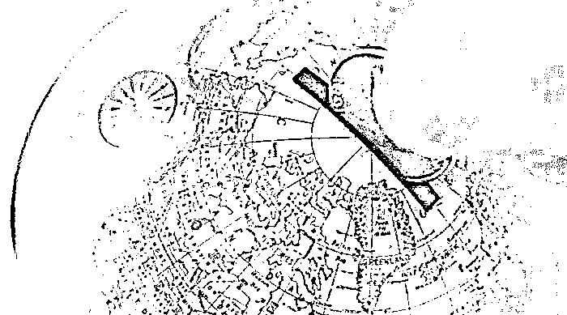
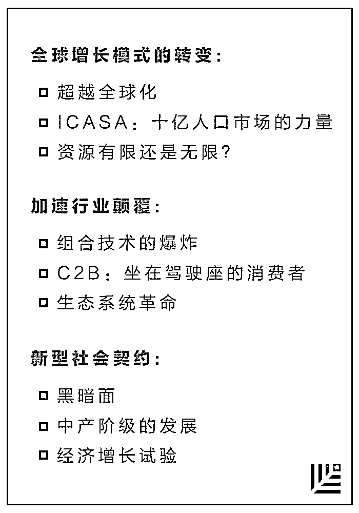
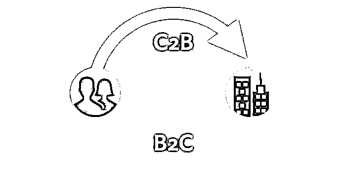
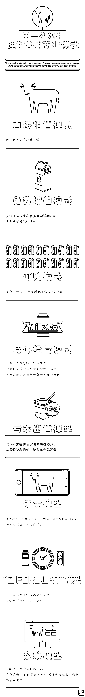

# 熔炉：麦肯锡长文解析，你必须知晓的全球性增长驱动力九大变革｜红杉汇内参

> 原文：[`mp.weixin.qq.com/s?__biz=MzAwODE5NDg3NQ==&mid=2651222898&idx=1&sn=6f787e89b2b1f5692b95a02dfb35d18b&chksm=80804d26b7f7c43089bc23801b42e40f24c74a0da732afa7dad3b7c8feada8cca18afc232290&scene=21#wechat_redirect`](http://mp.weixin.qq.com/s?__biz=MzAwODE5NDg3NQ==&mid=2651222898&idx=1&sn=6f787e89b2b1f5692b95a02dfb35d18b&chksm=80804d26b7f7c43089bc23801b42e40f24c74a0da732afa7dad3b7c8feada8cca18afc232290&scene=21#wechat_redirect)

[编者按]“颠覆”，不仅是管理理论中最为滥用的词汇之一，也是用得最不精确的词语之一。当我们说行业颠覆正在加速时，其实际意思是，行业结构的关键基础——经济基础、买卖双方的权力平衡、资产的作用、竞争对手的类型乃至行业的边界——在迅速发生变动。

虽然这种如高等级地震一样的变化是让人不适甚至是带有破坏性的，但它也包含着机遇的种子。

三位麦肯锡专家以万字长文解析了当今商业世界面临的全球性增长驱动力的转变，比如，超越传统的全球化认知、更具潜力的新兴市场国家 ICASA、资源是有限还是无限、以及组合技术所带来的创新爆炸等。这不仅是一种预测，更是在提醒：企业领导者们需要重新思考增长假设的前提正在发生怎样的变化。

每期监测和精编中文视野之外的全球高价值情报，为你提供先人一步洞察机会的新鲜资讯，为你提供升级思维方式的深度内容，是为** [ 红杉汇内参 ]**。

***

**【每日金句】**

最急剧的技术进步

并不是来源于单一领域内技术的线性改进，

而是来源于看似迥然不同的

发明和学科的组合。

***

**【内参】**

**熔炉**

麦肯锡长文解析

你必须知晓的全球性增长驱动力九大变革

作者/Ezra Greenberg、Martin Hirt、Sven Smit

综合编译/洪杉

“趋势是你的朋友。”

投资界这句古老谚语同样适用于企业考虑自己的未来。在与全球商界领导者的对话中，总是能听到各种挑战：传统竞争优势在技术变革的冲击下还能坚持多久？不断变化的客户和社会期望会如何影响商业模式？当跨境投资受到更严格审核，对一家全球性企业来说意味着什么？

我们期望在这篇文章中，通过阐明九种主要的全球性增长驱动力变化及其交互作用，能够帮助领导者们发现机遇。我们将这些力量定义为“熔炉”，也是企业应该观察的、创新活跃的区域。它们是——

**超越全球化**

按照传统标准，全球化的脚步正在放缓。但同时，跨境数据流正在大规模增长，增速接近十年前的 50 倍。拥有至少一个国外连接的社交网络用户数量几乎达到 10 亿，每天往来的电子邮件数量达到 2000 亿，超过 3.5 亿人是跨境电子商务购物者——这增大了中小企业成为“微型跨国企业”的机会。

与之一并起作用的是，在为本地消费者开发所需产品方面需要做出更多努力，这使得在全球范围内的竞争变得成本越发高昂和错综复杂。通用电气 CEO 杰夫•伊梅尔特说，跨国公司需要拥有“在全球范围内进行本地化的能力”。

纽约大学的潘卡耶•吉马瓦特早已说过，全球化从来都不是一股势不可挡、单一整体化的力量。随着全球化的复杂性变得越来越明显，精准满足当地需求从而与对手展开竞争的重要性将继续提高。

**ICASA：十亿人口市场的力量**

把目光投向金砖四国之外，其他新兴市场特别是在非洲和东南亚地区，日益表现出市场重要性。在印度、中国和非洲，城市化正赋予超过 10 亿的人口成为新的市场力量，而第四个是有超过 5 亿人口的东南亚。这些庞大的“ICASA”（印度、中国、非洲和东南亚）市场具有显著的持续扩张潜力。

比如中国的“一带一路”倡议，旨在通过海上和陆上交通，将一半以上的世界人口以及大约 1/4 的国际贸易和服务联结起来。

这个机会是庞大的，麦肯锡预计未来十年里，超过约一半的全球增长将源于这些地区。一家公司，无论是来自这些地区并已实现不错的增长，还是正试图进入这些市场，其重新分配资源、重新调整其业务结构以及是否具备快速反应能力，都将决定它是否能够在重整平衡的全球经济中取得竞争优胜。

**资源有限还是无限？**

现代的“马尔萨斯”可能会感喟我们的世界供养数十亿人口的能力。技术上的进步以各种方式改变了资源的均衡：

*   自动化、物联网和材料科学等领域的创新，展现出在减少资源消耗方面的巨大前景。

*   技术正在转变资源的生产方式。

*   技术在以新的方式结合，具备显著降低资源密集程度的潜力。比如在采用轻型机动车技术和减缓塑料消耗的合理情况下，有可能全球对石油的需求在大约不晚于 2025 年时维持平稳状态。

*   我们期待会出现一种加快的资源创新周期：增长使能源供应变得紧张，技术提供解决方案，外部因素浮现，而进一步的应对方案也将会出现。

*   数据流揭示了一些效率机会。与资源相关的商业机遇将会在意想不到的地方出现，大量新产品和新服务也存在发展空间。其中一个例子就是更轻、更便宜并且能以有限热量损耗进行导电的新型碳基材料。它们可以使整个行业发生转变。随着企业领导者对资源限制不断变化的性质重新认识，他们将拥有更多抓住主动权的机会。

**组合技术爆炸**

最急剧的技术进步并不是来源于单一领域内技术的线性改进，而是来源于看似迥然不同的发明和学科的组合。

不妨回想一下区块链是如何出现的——正是应用了互联网、密码学和高级分析等技术与学科的结合。这可能会改变游戏规则，因为交易成本在今天的商业世界中占据很大一部分。由于区块链可以处理没有中介的交易，它对成本和竞争有着深刻的潜在影响。

或者不妨考虑一下机器学习，我们还没有充分挖掘它的潜力，它已经开始以各种意想不到的方式与其他技术相结合。

组合效应正在给生物技术的许多方面带来革命性剧变。依靠庞大的计算能力而实现的低成本基因排序正在为开发“精准医学”奠定基础。

技术结合所产生的效果可以超越一家公司提供的产品或服务，从而改变公司使命的真正定义。例如，汽车行业不仅仅是关于制造汽车。随着人工智能、计算能力与先进的汽车和消费品相结合，相关企业正在思考如何提供“移动解决方案”，这显然就是颠覆。

而且，一切都在加速。

**C2B：坐在驾驶座的消费者**

数字化给消费者呈上的是一份不断在拉长的菜单，上面列有各种货品与服务，有些还是免费的。

消费者获取的不仅是“供过于求”的好处。据估计，单是在美国，每年网络就能为消费者提供 1000 亿美元的福利收益，消费者无需为此买单。预计从 2008 年到 2020 年，移动数据的增量将超过 900 倍，而其所产生的营收只较现在增加 3.25 倍。

同时，消费者正如同坐在驾驶座上的司机，“驾驭”着企业生产出所需的产品。他们现在可以直接与企业交流、要求个性化定制。消费者想要的是更多新品、更与众不同以及更丰富的自我表达。

消费者额外付费的意愿会怎么发展还有待观望，正如雷•库兹韦尔所说：“免费开源市场与专有收费市场共存。”在这样一个环境里，不仅是消费者会有更多选择，企业在制定商业模式与创造价值方式上也有了更多选择。

**生态系统革命**

业务模式可以粗略地分成以下三大类，在这样的分类里，生态系统既是创造价值的强大来源，也是一个竞争白热化的舞台——

*   **线性价值链**。在 20 世纪基本处于支配地位，由一系列增值的步骤组成，目标在于生产和销售产品。汽车组装就是一个例子。

*   **横向平台型**。在这种模式之下运作的企业往往是围绕着增值软件与技术栈而生，有着硬资产与精密的公司结构。

*   **“任意到任意(Any-to-any)”生态系统**。如 Uber 和 Airbnb，它们也是基于平台运作，但不同的是，它们拥有的是轻资产。

目前，经受着这种颠覆的传统行业大部分仍存在，但其结构已不再像前平台时代那样清晰，行业颠覆者将绝大部分价值都收之麾下。

而“任意到任意”模式已经走在了市场最前沿。这些企业将自身置于生态系统的核心位置，并且资产很“轻”。

不过，这几种分类之间的分界线开始模糊了。价值链、平台和生态系统各自开放、发展并相互结合。

**黑暗面**

开放是成就的养分，而开放的定义几乎就是暴露。就像网络虽然创造了经济和社会奇迹，也带来了致命的危险。

适应数字化发展需要合作。在一个相互连接的世界里，对于那些跨企业、跨行业的网络安全威胁，企业需要探索共享平台和数据共享。在这个过程中，商业领袖们将有助于重新定义共同安全地生活在这个相互依存的世界里意味着什么。

**中产阶级的发展**

全球化和自动化使劳工市场出现两极分化，无论是发达国家或是发展中国家，中等收入的工种将被取代，许多工人被迫“自降身价”，只能减少自己的收入，并将压力转移到收入更低的工人身上。

当新兴经济体的新一代消费阶层登上舞台时，他们会奋力争取机会摆脱入门级的角色，同时也会出现收入分化。像中国这种由投资驱动向创新驱动转变的发展模式，将会决定中产阶级在这样的新兴经济体中能否取得成功。

**经济增长试验**

今天，我们就站在新一波试验浪潮的浪尖上，因为我们根本没有现成的方法来解决这些挑战。

有一件比较明显的事情是，许多促进增长的政策工具都已经不再适用了。

跟增长、人口老龄化、基础设施、收入不均等问题相关的试验，它们的结果会为世界、整个商业环境以及企业发展带来深刻影响。

转变增长模式，加速颠覆以及建立一个新的社会契约，都是强大的发展力量，需要企业三思而后行，同时也要识别其中包含的巨大机遇。要在熔炉里存活下来，最根本还是要直面尖锐，问自己手上有什么可以让你脱颖而出的资源，目前所处的位置有什么优势，即使可能会颠覆或砍掉当下的业务，你也要把所有的选择都列出来。

***

**【情报】**

 #找到你的现金奶牛#

**用一头奶牛理解 8 种商业模型**

#为数据所役，还是尽数据所用？#

**数字化时代的 11 条领导力军规**

那些运营公司的妙招在数字化时代依旧生效——

*   需要对外部环境有客观的理解。

*   可能需要对公司的使命进行重塑。

*   必须清晰地了解数字化的意义和影响。

*   数字化的理解和能力的需要贯穿整个公司。

*   需要企业文化的支持。

*   需要更深层次的合作。

*   需要更好地与公众打交道。

*   商业策略在数字化时代成为一种持续性的过程。

*   决策更多地由数据驱动。

*   数字化要求公司进入未知领域。

*   数字化意味需要应对与掌控持续不断的改变。

***

**【往期回顾】**

红杉汇内参第 026 期

[当 APP 淘金热退去，下一个野花盛开的时代是什么](http://mp.weixin.qq.com/s?__biz=MzAwODE5NDg3NQ==&mid=2651222821&idx=1&sn=35b39cbb9d3638d3c3619a67e470e2a1&chksm=80804d71b7f7c467faa308c9913ad017ffc504ccfbec99fa19da7920183ce9480a9276bdbff1&scene=21#wechat_redirect)

红杉汇内参第 025 期

[普华永道：在下一场工业革命中争胜的 10 个原则](http://mp.weixin.qq.com/s?__biz=MzAwODE5NDg3NQ==&mid=2651222791&idx=1&sn=fb4ea0d4bdb265b691b57dfb8edae829&chksm=80804d53b7f7c4453089d1ef9c1461060f4a2eb7a274852cae17c555373d2e8a7824c125ab03&scene=21#wechat_redirect)

红杉汇内参第 024 期 

[我们熟悉的那种工作和管理模式已经腐朽](http://mp.weixin.qq.com/s?__biz=MzAwODE5NDg3NQ==&mid=2651222756&idx=1&sn=baabf8c2991f11d8851b1c68c796c12a&chksm=80804cb0b7f7c5a61629f347da32dcb15a2c85e3f57637bae2ebba80e215dd35375964bf42a9&scene=21#wechat_redirect)

