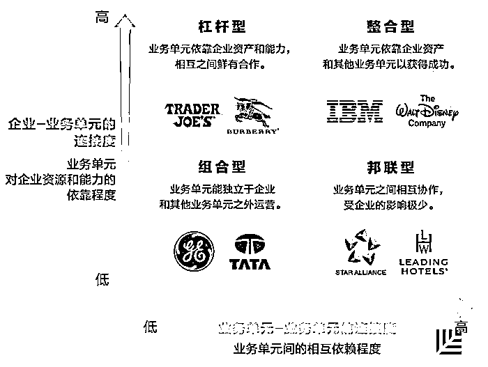
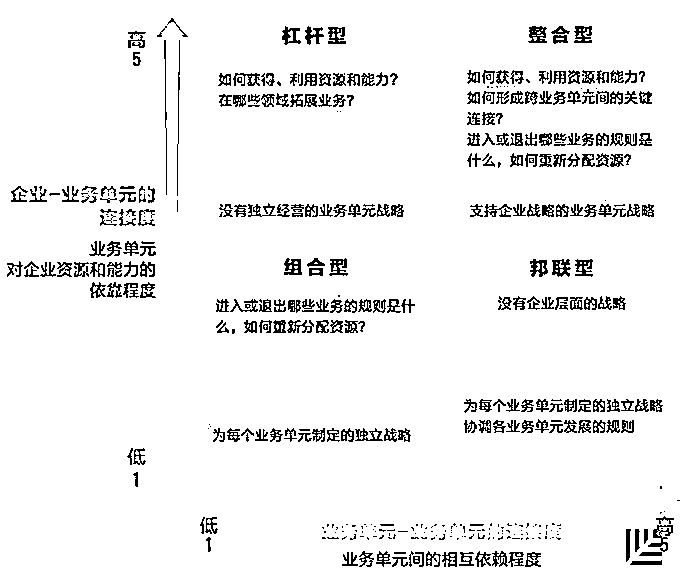
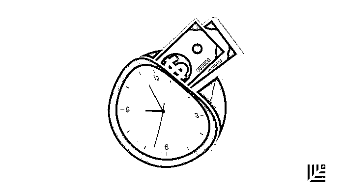

# 用最简明的框架，帮你画出制定企业战略的四大思维象限｜红杉汇内参

> 原文：[`mp.weixin.qq.com/s?__biz=MzAwODE5NDg3NQ==&mid=2651224157&idx=1&sn=c8cae653cbb49cdda7df1cf3abe19387&chksm=80804609b7f7cf1f901691073a1539bde657dc735984f9d71e15a4c5e2df8a478fa24a37b9ee&scene=21#wechat_redirect`](http://mp.weixin.qq.com/s?__biz=MzAwODE5NDg3NQ==&mid=2651224157&idx=1&sn=c8cae653cbb49cdda7df1cf3abe19387&chksm=80804609b7f7cf1f901691073a1539bde657dc735984f9d71e15a4c5e2df8a478fa24a37b9ee&scene=21#wechat_redirect)

[ 编者按 ] 听起来，制定企业战略是一件让人脑袋上冒星星的事。

对于已初具规模的创业企业来说，业务单元日渐多元化，战略已不只是单一产品或商业模式如何赢的问题。很多创业者却仍在以战术上的勤奋来掩盖战略上的懒惰。

因为缺乏清晰认知，因为没有达成共识，所以管理层在探讨战略时常常只会东拉西扯。今天这篇文章给出了一个简明的思维框架，能够清楚地展示出各种业务协调发展以实现业绩最大化的方式。事实上，企业所在领域不同、商业模式不同、发展阶段不同，应采用的战略也不一样。制定企业战略要集中回答的问题就是：企业与业务单元之间、不同业务单元之间，应建立怎样的连接度？

每期监测和精编中文视野之外的全球高价值情报，为你提供先人一步洞察机会的新鲜资讯，为你提供升级思维方式的深度内容，是为 **[ 红杉汇内参 ]**。

** 内参**

制定企业战略的

**四大思维象限**

作者 / Donald Sull、Stefano Turconi、

Charles Sull、James Yoder

编译 / 洪杉

企业战略，说白了就是一系列的选择。

对于一家拥有多种业务的企业来说，战略是影响财务表现的关键驱动力。最近的一项研究发现，企业内一个业务单元的财务表现更多地取决于这家企业的表现，而不是这个业务单元在哪个领域。麦肯锡的一项调查显示，有 83%的企业高层认为，业务单元间资源的有效再分配是营收增长的最大驱动力。

其实有一种简单的框架能够帮助管理者明白企业战略和业务单元战略之间的关系。

**四个象限，四种思维**

关于企业战略，现有的研究绝大多数都专注于企业应该如何选择适合自己的业务组合以及这将如何给每个业务单元增值。我们把这种关系当作纵轴，称之为“企业-业务单元的连接度”，表示的是业务单元追求利润时对企业资源和能力的依赖程度。这要求你要集中关注对创造和获得经济价值至关重要的企业能力和资源，如研发新产品或创造新品牌的能力。

如果某些功能（如人力资源、法务或者会计）可以通过外包解决，那它们就不具有战略意义。

**这其中的关键，不是业务单元能否独立在企业之外自主经营，而是它们能独立到什么程度。**

而横轴——“业务单元-业务单元的连接度”，则代表了每一个业务单元在创造和获得价值的过程中对别的业务单元的依靠程度。就像通用电气和塔塔集团，它们所投资的公司彼此独立，自我经营；而像 IBM，不同的业务单元共同协作，为客户提供一体化的解决方案。

上面这个矩阵描绘了制定战略的四种思维的定义。据此，我们可以得到四个象限，因此可以从四种独特的方向去考虑企业战略：

▨ **组合型**：常见于传统大公司和私人股权公司。

▨ **杠杆型**：业务单元对企业品牌、技术和专业才能非常依赖。

▨ **邦联型**：各种业务单元自发组成松散的联盟，它们会共同协作，有业务往来，进行联合游说或相互分享。所有活动背后都没有一个强大的母公司的影子。如星空联盟这样的组织。

▨ **整合型**：业务单元既依靠企业资产也依靠别的业务单元才能取得成功。如迪士尼主题公园、电影制片、消费者产品以及儿童节目都要用到品牌和人物来增加消费者的买单意愿。

管理者们怎样才能知道哪种思维适合自己的企业？

**你的企业战略制定思维是？**

在整合型象限里，不是所有的业务单元都同等地依靠企业资源或其他业务单元。有些企业会把性质相近的业务单元组成紧密协作的事业群，同一事业群的业务单元会紧密合作以服务相同的客户群体，而跨群之间的合作就相对不那么重要。

如果你的企业正在依靠外部合作伙伴的支持或者想要建立一个业务平台，那么在“业务单元-业务单元的连接度”的横轴上锚定企业所在的位置时，就一定要考虑到这些外部利益相关者。

不同业务单元之间的关系会随着时间的推移而进化。

在分析自己的企业时，先要弄清楚目前你的位置在哪里，然后集中关注你期望着达到的未来位置。功能性和共用的服务应随着企业战略的调整而调整。比如，**如果你想把企业从组合型转成杠杆型，那企业内的共用服务就应从只关注业务单元转变到为整体战略做支撑。**

以组合型思维为例，企业战略的中心在于，制定指导原则以帮助公司决定可以进入、投资或者退出哪些业务。同时，每一个业务单元也需要有自己的战略。而对整合型企业来说则刚好相反，它们需要制定规则来管理被投资的公司、管理各业务单元之间的相互依赖关系。在这个象限里，业务单元需要制定出两面兼顾的战略，既能以独立实体的身份在市场上获得成功，也要与企业整体战略步伐一致。

一旦你找到了企业所在的象限，就可以通过蓝色文本框里的指导原则来制定企业战略，而黄色文本框则指导你如何制定业务单元的战略。

  

** 情报**

#10000 次试验法则比 10000 小时训练更有效#

**如何验证商业猜想**

一个新的创业想法、新的商业模式都需要被验证，怎么做才是最节省时间和资金成本的？

▨ **确定假设是什么。**把复杂假设拆分成易于管理的零散假设。

▨ **确定验证顺序。**每一步都应该解决关键的未知因素，每次决断都应该激励创业者继续行动。在最坏情况下，这些结果能够促使创业者及时放弃当前业务。

▨ 可根据以下三个因素对假设验证的先后进行排序：

□ **严重程度。**指错误假设对企业产生的影响。严重程度最高的一条假设是客户对企业的主营产品究竟有没有需求。程度最高，就先验证。

□ **假设为真的概率。**与许多人下意识的推测相反，首先要验证的是正确概率较低的假设。如果创业者的目标是在找出关键模式之前尽量节省时间和金钱，那就该从最不可能正确的假设入手。

□ **所需成本。**解决方案是由什么组成的？哪些证据足以体现这个假设是有效的？如果其他条件差不多，成本低，先验证。

▨ 可利用以上公式对假设进行排序，优先把风险最高、能用最快或最便宜方案进行验证的假设排在第一位，进而找出一条以最低成本消除最多风险的途径。

▨ 最后提醒：如果可能，创业者最好同时验证多个假设。

#招到一流人才并不是最重要的#

**谷歌 HR 的研究发现：如何打造成功团队？**

谷歌 HR 部门对 180 多个内部团队进行了 200 多次采访，分析了 250 多个特征属性，交叉互比了一流团队以及非一流团队的人才组成，由此发现了“促使团队成功的五大关键特性”：

▨ **心理安全感(Psychological safety）。**有安全感的团队更有可能承担风险、承认错误、互相合作甚至承担新的责任。

▨ **可靠性（Dependability）。**所有成员均需按时完成任务，并达到预期的质量标准。

▨ **结构和清晰度（Structure and clarity）。**员工需要清楚了解自己的团队角色、当前计划、以及任何影响其工作的商业目标。

▨ **意义（Meaning）。**对公司使命充满激情的人会有更高的绩效。

▨ **影响（Impact）。**相信所做之事确实重要，相信其贡献影响了重要目标。

最重要的结论是：“比团队成员组成更重要的是团队成员如何互动、组织工作以及考察贡献。”

#好好创业，好好说话#

**接受采访时可能犯的 5 个错误**

▨ 错误 1：**不提公司名字，老说“我”或者“我们”。**创业者在接受采访时很容易陷入使用第一人称的误区，事实上应尽可能使用公司名称来增加被人们听到的几率。

▨ 错误 2：**Get 不到关键信息。**媒体只会剪辑或引用一两句你的直接引语，所以要鲜明亮出观点和关键信息，不要让记者猜测你的哪一部分独白是最重要的。

▨ 错误 3：**使用（或重复）否定陈述。**应该坚持给出正面信息，将重点放在公司的优点上，而非恶意中伤对手。回答你想要回答的问题，而非你被问到的问题。

▨ 错误 4：**表示“不予置评”。**面临难堪问题怎么办？应该重新引导对话方向，展现积极一面。

▨ 错误 5：**假设自己“处于非录播状态”。**即使摄像机或录音笔已经关掉，你也千万不要说出任何你不愿被传播的东西。****************

** 推荐阅读**

壹

[红杉资本以压倒性优势登上“硅谷十家最顶级风险投资机构”榜单首位](http://mp.weixin.qq.com/s?__biz=MzAwODE5NDg3NQ==&mid=2651224148&idx=1&sn=b0e5afc46a162793fb3fb901208bbc84&chksm=80804600b7f7cf16ce9807aa4c48cc59d4b328bc8e390681f51475dbac6125843177195a6c44&scene=21#wechat_redirect)

贰

[如何招到「对的人」？年仅 25 岁就登上福布斯的创始人有话说](http://mp.weixin.qq.com/s?__biz=MzAwODE5NDg3NQ==&mid=2651224152&idx=1&sn=f1ec6ee405d28f2958ada6651b0a7706&chksm=8080460cb7f7cf1addf1c913beb2129fb93ed0c38385b8d6b696c52b6e235e6b19045b1418d0&scene=21#wechat_redirect)

叁

[产品导向型创业者的七个致命错误](http://mp.weixin.qq.com/s?__biz=MzAwODE5NDg3NQ==&mid=2651224101&idx=1&sn=da478ae797f7d6f2a60b682a8f0262f0&chksm=80804671b7f7cf679253ed70debea13ac8fd77a2ffa597641d6bdf8af3cf315411591d2af433&scene=21#wechat_redirect)

肆

[红杉 NEWS｜红杉中国进入固定收益资产市场 成为弘收投资战略股东](http://mp.weixin.qq.com/s?__biz=MzAwODE5NDg3NQ==&mid=2651224085&idx=1&sn=cc6d688342cbdee8a07e71171f916c4e&chksm=80804641b7f7cf57b85ef96a79f1244ce7c20ee65d9ecf80f6fe23ecf64ac1919e416779ac4b&scene=21#wechat_redirect)

伍

[财富全球头脑风暴论坛上，沈南鹏谈 What is the next big thing in China](http://mp.weixin.qq.com/s?__biz=MzAwODE5NDg3NQ==&mid=2651224138&idx=1&sn=9e1479056b29f1e42267b1e8af3d3895&chksm=8080461eb7f7cf08f25ccb0489e7f52feceea6dc012da0e39d125a10795c9cf11aadab37fee7&scene=21#wechat_redirect)

