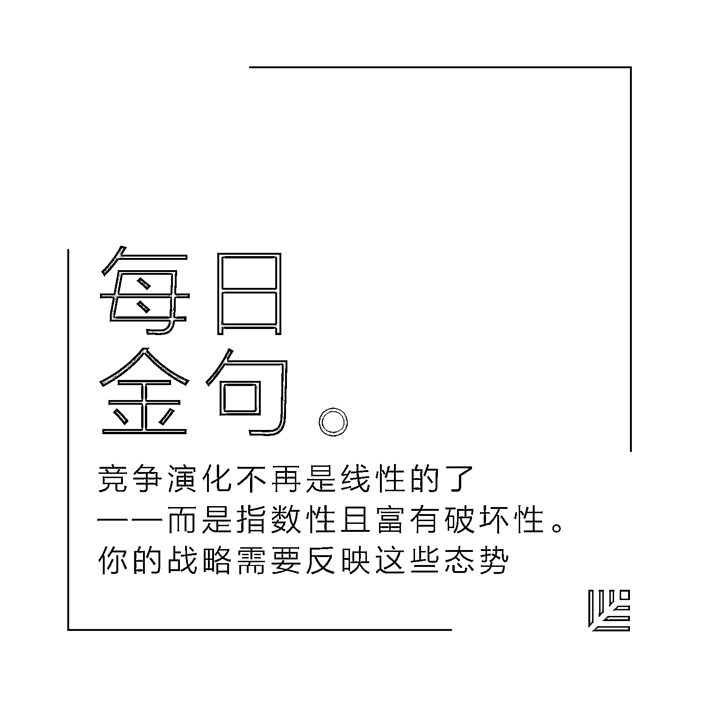

# 你的未来剧本怎么写？在数字时代重构增长战略的三个基本事实｜红杉汇内参

> 原文：[`mp.weixin.qq.com/s?__biz=MzAwODE5NDg3NQ==&mid=2651222925&idx=1&sn=2f0b11c1b31a449bceba94b9c2fd8988&chksm=80804dd9b7f7c4cfad56ea1cdcf597cd638a0172a72e0409d8bb53f8b1758d169dbeba3df824&scene=21#wechat_redirect`](http://mp.weixin.qq.com/s?__biz=MzAwODE5NDg3NQ==&mid=2651222925&idx=1&sn=2f0b11c1b31a449bceba94b9c2fd8988&chksm=80804dd9b7f7c4cfad56ea1cdcf597cd638a0172a72e0409d8bb53f8b1758d169dbeba3df824&scene=21#wechat_redirect)

[ 编者按 ] 改编一下郭士纳那句名言：在数字化时代，大象必须得学会跳舞了。

原因很简单，数字公司正成为市场的颠覆者。想象一下 5 到 10 年后的情景，你今天的竞争对手可能已不复存在、当下热销产品的市场需求竟然消失了，如果你没有做出及时变革，很可能你的公司也将烟消云散。

你的未来剧本怎么写？

这意味着你需要依据新的商业现实来重构增长战略，许多过去有效的假设前提将渐渐失灵。本期主文将提醒你如下三个基本事实：1.未来不是分析出来的，要创造它；2.竞争演化将呈现指数型并极富破坏性；3.需要有效率的一致行动力。

每期监测和精编中文视野之外的全球高价值情报，为你提供先人一步洞察机会的新鲜资讯，为你提供升级思维方式的深度内容，是为** [ 红杉汇内参 ]**。

**【内参】**

**你的未来剧本怎么写？**

在数字时代重构增长战略的三个基本事实

作者：Didier Bonnet、Pete Maulik

综合编译：洪杉

**数**字技术正彻底地改变着人、企业和整个社会的行为，而这种颠覆似乎已成为了新常态。企业的 CEO 们正面临着双重挑战，一方面要保卫自己后院，不被初创公司和其它对手抢占市场份额；同时还要为未来五年的发展制订战略。

对绝大多数企业来说，这是一项打击士气的任务。如果你是公司的高层，面对这些挑战时，怎么保证公司发展的延续性和可持续性？或者换句话说，你的剧本是怎么写的？

一些 500 强企业更为重视防御性战略，希望提高成本效率和生产力，以保护自身的核心业务。另一些企业则通过收购来保障自己的商业模式“永不过时”。这些战略都没错，背后的逻辑也很合理，但它们能让你在未来竞争中脱颖而出吗？我们不这样认为。

在现在，企业受到众多颠覆者的挑战，找到增长机遇变得十分困难。若想在这场检验实力的竞争中胜出，你需要找到方法来打一场你能赢的战役。对大公司领导人来说，这意味着你要利用颠覆者没有的能力来做事情——设立野心勃勃的目标，放眼全球来做计划，有战略地进行投资，并动员庞大的资源确保自己在数字化方面的主导地位。

换句话说，就是要把自己变成颠覆者，将你的规模从一种转型拖累转变成优势资产。

这听起来好像很简单，但并非如此。仍有数不胜数的公司根据传统的增长规划方式来制定增长战略，如年度周期、历史分析和渐进式思维等。而在数字经济这种说变就变的环境里，传统的增长规划方式已经到了其效用尽头，不会再帮助企业获得成功了。

企业需要围绕三大根本事实来重新确定战略制定的方式，通过接纳和承认这些事实来计划未来的行动：

****▍******事实一：**

**你分析不出哪条路才通向未来，**

**你要去创造它**

多年来，战略规划的基石都是传统的分析模型，但是，如果你正在寻求一种能够帮助公司实现超额增长和获得竞争优势的战略，你就不能单纯地依赖分析了。

成功的数字化战略需要企业将演绎分析与归纳推理结合起来，帮助企业制定出富有创造性的跃进计划，打开新市场的大门。想象一下五年或十年后世界会是什么样子——不仅是你的行业，其他众多行业都会有什么变化？在未来，你现在的顾客的需求会发生什么变化呢？在你现有的顾客群或者当下提供的产品之外，还有新的机遇吗？

然后，在等式上把现有业务以及经济限制都先删掉，你会怎样利用数字技术来打破这些障碍，抓住发展的机遇？这些思考，将形成战略制定过程的基础。

******▍****事实二：**

**竞争演化不再是线性的了**

**——而是指数性且富有破坏性。**

**你的战略需要反映这些态势**

确定企业三到五年后会发展到什么位置，对实现规模化所必须采取的资源聚集方式至关重要。然而，这套战略不能一成不变地用来当作行军令，战略也需要生命力和与时俱进。这就像软件研发，它已经从传统的瀑布模型进化到了敏捷开发，那么战略的制定也应适应市场的瞬息万变。缺乏活力和调整能力的企业会发现它们既失去了发展机会，也为颠覆者创造了攻击自己的好机会。

2008 年，时任百视达（Blockbuster）CEO 的吉姆•凯伊斯说，像 Netflix 这样的公司“以前根本不会在竞争雷达上出现”。然而不出两年，这家以实体店建立起来的视频租赁公司就宣布破产了。与此同时，Netflix 在全球的流媒体订阅用户数量即将超过 6500 万。Netflix 把赌注全压在了流媒体上，百视达传统的优势——如零售网络、库存和销售人员——在数字化时代都迅速成为不可保留的致命弱点。

我们已经走到了那种精心设计的战略规划周期的尽头。不要让数字化战略成为你预算方案的从属，要为公司创造一系列动态战略，并能清晰地看到结局，准备以灵活的投资去应对。

******▍****事实三：**

**拥有增长野心不是问题，**

**问题在于你可能无法促使组织高效行动**

大企业不缺乏雄心壮志，它们面临的最主要挑战常常是领导层没有给公司足够的压力去开始向数字化转变。为了与获得运营效率这一目标保持一致，许多公司招满了一心关注业绩表现、执行命令和降低风险的职员，而资金也流向了风险最低的投资项目。如果是上市公司，更需要对收益做季度报告，并根据每股股份来管理收益，这加剧了上述问题的严重性。

如果你把精力全部投入到对一个已经完善的工序的精益求精，那再将时间、精力和投资注入到新的数字技术应用就会变得很困难了。你要为团队进行实验和思维创新提供空间和认同，也要投入时间去探索提高关键绩效指标(KPIs)以及实现目标和主要成果(OKRs)的新方法。

同时要记得，任何一套增长规划想要获得成功，你一定要有一套激励全体员工共同行动的方案。怎么做呢？你要给团队设立一个共同的敌人，创造一个在未来会抢了你生意的竞争对手角色——这种情况会发生在什么场合？如何发生？在公司广泛传播这个对手的形象，确保每个部门都清楚，公司对抗的是一个怎么样的竞争对手，以及本部门的努力为什么会对赢得这场战役至关重要。

专注于创造可持续性增长的商业领袖应该关心潜在的市场颠覆力量。如果只关注今日之现实并以此为未来做规划的话，不免目光短浅，最终还可能导致原本领先全球的企业走向消亡。为了实现预期结果，你的数字化增长战略需要放眼未来、动态发展，并提供一个团结整个公司的战斗口号。

*******

**【情报】** 

#一个新兴的资本类别#

**私募二级市场：日益增长的投资机会**

一些科技公司希望长久保持私有化，推动了资本对私募二级市场的投资兴趣和流动性：

*   越来越多的非传统科技投资者——家族理财基金和超高净值人士过去更青睐房地产和公募股票市场，现在则有机会接触未上市科技公司，并且兴趣浓厚。

*   最成功的私人科技公司选择了比以前更长时间的保持私有化，比如 Uber 和 Airbnb。

*   从公募市场到私募市场，价值获取发生了巨大、根本性的转变。如今，大部分价值是在私募市场被获取，而非公募市场，比如最近 Snap 上市案例。

*   二级市场提供了接触最好的全球科技公司的多种机会，可以进行比一级市场更小的小额交易。

*   私募二级科技市场的流动性和深度都在增加。据估计，2015 年全球二级市场科技交易量（包括有限合伙人的转移）约 450 亿美元至 500 亿美元，约为年度一级市场科技发行量的 75%。这个新生的资本类别似乎将在未来五到十年内迅速增长。

#95 后来了#

**Z 一代会成为优秀创业者吗？**

出生于 1994-2010 年，无意于寻找一份舒适稳定的工作，做事主动，喜欢掌控自己的事业。咨询公司千禧品牌的研究表明，72%的高中生和 64%的大学生都渴望创业。是什么让他们拥有这样的创业心态？

*   互联网一代。大约 25.2 亿的 Z 一代是通过自学成为最精通技术的群体。他们无法想象一个没有技术的世界。

*   可以访问所有的资源。不同于童年时期在街道操场上玩沙子的 80 后，Z 一代在童年时期已经接触了大量的互联网应用。

*   75%以上的 Z 一代人的创业想法来源于自身兴趣。

*   他们独立而又极具雄心壮志。

*   他们比千禧一代更不能集中注意力，但他们擅长同时处理多重任务。 这些能干的人并没有什么特殊，他们只集中在一件事情上：成功。

***

**【往期回顾】**

红杉汇内参第 027 期

[熔炉：麦肯锡长文解析，](http://mp.weixin.qq.com/s?__biz=MzAwODE5NDg3NQ==&mid=2651222898&idx=1&sn=6f787e89b2b1f5692b95a02dfb35d18b&chksm=80804d26b7f7c43089bc23801b42e40f24c74a0da732afa7dad3b7c8feada8cca18afc232290&scene=21#wechat_redirect)

[你必须知晓的全球性增长驱动力九大变革](http://mp.weixin.qq.com/s?__biz=MzAwODE5NDg3NQ==&mid=2651222898&idx=1&sn=6f787e89b2b1f5692b95a02dfb35d18b&chksm=80804d26b7f7c43089bc23801b42e40f24c74a0da732afa7dad3b7c8feada8cca18afc232290&scene=21#wechat_redirect)

红杉汇内参第 026 期

[当 APP 淘金热退去，下一个野花盛开的时代是什么](http://mp.weixin.qq.com/s?__biz=MzAwODE5NDg3NQ==&mid=2651222821&idx=1&sn=35b39cbb9d3638d3c3619a67e470e2a1&chksm=80804d71b7f7c467faa308c9913ad017ffc504ccfbec99fa19da7920183ce9480a9276bdbff1&scene=21#wechat_redirect)

红杉汇内参第 025 期

[普华永道：在下一场工业革命中争胜的 10 个原则](http://mp.weixin.qq.com/s?__biz=MzAwODE5NDg3NQ==&mid=2651222791&idx=1&sn=fb4ea0d4bdb265b691b57dfb8edae829&chksm=80804d53b7f7c4453089d1ef9c1461060f4a2eb7a274852cae17c555373d2e8a7824c125ab03&scene=21#wechat_redirect)

