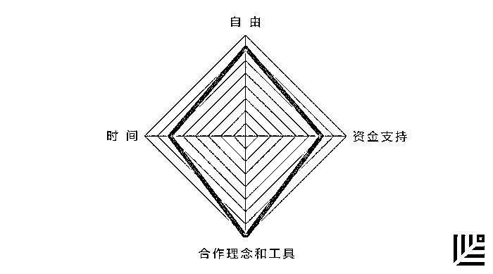

# 为什么你需要一个 COO？敢打赌你并没有认真思考过｜红杉汇内参

> 原文：[`mp.weixin.qq.com/s?__biz=MzAwODE5NDg3NQ==&mid=2651222505&idx=1&sn=d72cfd0858c1815f419ad1e93961c0b9&chksm=80804fbdb7f7c6ab55aa1a01ba01a25d9c2e2f46381f95c0cfb7d51b09746443939c8a0c5f15&scene=21#wechat_redirect`](http://mp.weixin.qq.com/s?__biz=MzAwODE5NDg3NQ==&mid=2651222505&idx=1&sn=d72cfd0858c1815f419ad1e93961c0b9&chksm=80804fbdb7f7c6ab55aa1a01ba01a25d9c2e2f46381f95c0cfb7d51b09746443939c8a0c5f15&scene=21#wechat_redirect)

[ 编者按 ]黑格尔说：“熟知而非真知。”

很多创业者可能想当然地认为“我需要帮助，所以我聘了一名 COO”——敢打赌你并没有认真思考过，为什么你需要一个 COO？应该在创业的哪个阶段选聘 COO？如何让他真正在团队中发挥最大作用？

常见的误区包括：COO 扮演保姆角色，成为公司日常运营的大管家；或者是二号 CEO，替代创业者决策；或者是 CEO 仍介入微观管理，导致 COO 无所事事。这些错误认知所导致的初创公司团队分手、互撕的案例并不鲜见。

本期主文相信对创业者来说深有裨益。核心建议就是，先从识别 CEO 自身的优点、劣势出发，然后寻找与之能力互补的 COO，并建立真正的创业伙伴关系。

每期监测和精编中文视野之外的全球高价值情报，为你提供先人一步洞察机会的新鲜资讯，为你提供升级思维方式的深度内容，是为** [ 红杉汇内参 ]**。

***

**【本期悬念】**

1.他不是保姆，也不是二号 CEO……你真的搞清楚为什么需要一位**COO**了吗？

2.基于过去的工作关系和互信还不够，若要和同事合伙创业，先在这 9 个问题上再次确认共识。

3.创业者要给投资人定期写电邮？这里不仅有为什么，还附赠一套**标准邮件模板**供参考。

4.希望员工自由创新？恐怕是个幻觉。试试这个**四力模型**。

***

**【每日金句】**

如果等到有需要时才去接触投资人，

你就已经搞砸了。

不与投资人沟通的创业公司

是在抛弃免费的看涨期权。

***

**【内参】**

为什么你需要一个**COO**？

综合编译/洪杉

因为对 COO 这个角色缺乏清晰准确的认识，许多创业公司往往很长一段时间后才配备一名公司运营方面的管理人，这种现象十分常见。CMO 负责市场营销，CTO 负责监督研发，而 COO 的角色看起来没有一个很清晰的定位。甚至于，在搜索引擎里输入“COO”后，出来的定义结果是“负责管理公司日常运营的高级执行官”——这样的解释还有诸多亟待改进的地方。

美国手工电商平台 Etsy 的 COO 琳达•柯兹罗斯基（Linda Kozlowski）曾在印象笔记和阿里巴巴工作过，在 First Round 举办的 CEO 峰会上，她解释了公司为什么以及怎样将运营放在核心位置，怎样找到适合公司发展的 COO。

**COO 是什么？**

**为什么需要一个 COO？**

**COO 的角色是由其与 CEO 的关系来决定的**。

如果将团队比作一个电影摄制组，那么，CEO 和 COO 就相当于导演和制作人。“初创公司 CEO，可能往往执着于提升自己以证实自己的领导天分，这样员工才能够信任你，将未来交付于你，或者投资于你。”柯兹罗斯基说道，“但这并不是你向他们展示自己无所不能的时候。”

将你的领导团队看作一幅拼图，你需要做的就是找到 COO 这块重要的组成部分。

怎样选择与你旗鼓相当的合作伙伴？

**首先是，CEO 清楚知道自己欠缺的是什么**。假设 COO 必须是 CEO 以及创始人的补充角色，那么，COO 所扮演的角色正是另外一半，同时也是执行者。CEO 与 COO 的职责呈现一种相辅相成的关系，两者能力的结合远远大于个体能力之和。

当然，CEO 同 COO 的配对也有很多其他的可能性。“你可能正在寻求一个法定继承人，并且，你希望将这个人训练成下一任 CEO。如果你自身是一个年轻的创业者，或许最好的选择就是寻求一个经验丰富的导师，能够传授给你各方面的知识，帮助你领导企业。”柯兹罗斯基说，“世上并不存在一个完美的准则，而许多 COO 只是其中两种或三种的结合体。要找到一个适合你公司的 COO，往往取决于 CEO 欠缺的是什么、需要改进的地方在哪里。这对那些年轻 CEO 来说是不二法门。”

其次，转换固定思维惯式，在其他意想不到的场合物色人选。别将重点仅仅放在 MBA 人士或是金融界的前辈身上。一个合格的 COO 并不在于知识背景是否契合，而在于是否适合、是否能够胜任。

**COO 人才的五大特质和三大警示**

*   信任。是否发自内心地相信能够在今后的日子里与你有福同享有难同当。

*   经过验证的执行力。昙花一现的奇才不是你要找的，不停攻克一个又一个困难的跨栏者才是。

*   自我意识的控制。人们总把 COO 想成是 CEO 的继承人，但其实还没到这一程度。候选人最好能控制其自我意识，明确理解自己对于公司的职责所在。

*   与 CEO 相互吸引。设想你与 COO 未来关系的相处情况，不要只想着在面试中测试候选者的合适度。

*   要有万事通的品质。与你有类似的领导者特质，让团队觉得可靠、值得信赖，同时还让生意正常运转。

小心以下这些危险信号：

*   他不是 CEO。COO 必须接受并且内在化这一事实：他的工作是运营，而非决策。

*   不是保姆。令人遗憾的是，“保姆运营官”已成为一个令人不安的趋势，会毁掉执行官与运营官之间的伙伴关系——继而毁掉公司。

*   不是非“首席”不可的人。如果非得在职位前加上“首席”二字才能聘请到他，那就别考虑他了。

**聘请 COO 的合适时机**

如果你的公司生产实体产品，要马上聘请 COO。对于快速消费品或者硬件公司的启动及扩展来说，成败与否就看后勤与运营管理。你需要在生产实体产品方面有经验的人，是准时运送货物还是错过产品投放市场时机，就看你是否从第一天起就有 COO 助阵。

如果你的公司经营数字产品，那么在实现产品-市场匹配之后聘请 COO，他会将产品带入下一阶段。如果你还没有做好扩张准备，产品还在测试阶段，这时候聘请运营官会让候选人和你都觉得挫败，因为能做的显著改变或进展还很少。

不过，当创始人或 CEO 潜心于技术开发之时，也要立即聘请 COO，这一原则比以上两条更加好用。

**怎样让 COO 融入团队**

COO 这一角色因为如此频繁地受到误解，也就总成为最快失败的那一个。CEO 和创始人们务必**要高度警惕自己向团队介绍运营官的方式**。CEO、创始人们犯的最大错误就是说：“我需要帮助，所以我聘了一名 COO。”相反，你可以问自己以下问题，来帮助自己为团队精心准备一个强有力的解释。

*   我需要哪种帮助？为何需要这种帮助？COO 会怎样为我清除障碍？

*   这一障碍对公司的影响有多强烈？

*   这位 COO 具体会做什么事情来减轻这种影响？这继而又会如何影响公司的下一个季度，下一年呢？

一名 COO，能帮你把管理范围扩大一倍，在管理强度上也实现双管齐下——就像一个“倍增放大器”。

**以奥运会选手的精确程度传递接力棒**。作为 CEO 或者创始人的你多半已与自己的直接下属建立了深刻的联系。要如何向他们解释今后他们的汇报对象变成了另一位执行长官？这是 COO 融入公司时最棘手、也最能说明问题的部分了。

尽管组织结构图已经写上了 COO 的名字，但团队成员还是想继续向 CEO 汇报大小事务。CEO 对这种过渡的处理方式，会强调或者削弱 COO 的重要性。**大多创始人选择坚持跟员工一对一谈话、教导，但这恰恰是最危险的陷阱之一。相反，你应该让 COO 加入你的工作，慢慢地开始两人共同主持会议**。还要帮助他与团队建立关系，让团队明确新的组织结构。

这种过渡无法在一夜之间完成，不接受新安排的团队成员也会继续汇报给 CEO。但作为 CEO，你必须向他们解释公司设立运营专门负责人的重要性，引导他们去找 COO。如果不这样，你选择敲定这位合适伙伴的所有努力都将化为泡影。**你必须以同理心积极地管理这一过程，克制自己进行微观管理的冲动**。

柯兹罗斯基最后提醒：“别忘了放手。作为创始人或者 CEO，公司就像你的亲生宝贝，你或许抱得有点太紧了。COO 只有在你真的交出控制权之后，才有机会做些真正的改变。专注于你需要做的事，不要对运营管得太细。放手让她走向成功，你不会对公司失去控制，只会对公司的未来有更多把握。”

***********

**【情报】**

#兄弟阋于墙，还能外御其侮？#

**与同事合伙创业前，先自问这 9 个问题**

基于过去的工作关系和互信还不够，你们需要在如下问题上再次确认共识：

*   有共同的企业目标吗？是实现短期财务自由，还是渴望做伟大公司？

*   是否存在同时适合你们双方的创业产品？确保双方都愿意全心全意投入，而不是迁就附和。

*   有相同的价值观吗？

*   技能是否互补？

*   你们的生活方式、习惯和工作计划协调吗？

*   你们有解决矛盾冲突的习惯性方式吗？联合创始人互撕的故事并不鲜见。

*   有明确的责任界定吗？确保分工让你们各自最强的技能都得到发挥。

*   办公室以外的生活有多稳定？各自的家人是否支持、财务状况是否良好等。

*   当问题需要专业知识解决时，是否愿意接受对方的建设性批评，并承认最好相信对方的判断？

#每位创业者都应该知道的事情#

**如何给投资人写电邮**

为什么需要定期进行标准化电邮更新？你肯定希望采用多种策略保持对投资者的吸引力。最重要也最省力的一件事，其实就是每月以统一格式发送一份标准的更新信息电邮。当他们想跟踪你的最新进展时，这些信息应该放在他们触手可及之处。

*   保持格式一致。采用相同的标题栏以便搜索。

*   内容并非越长越好。一封电邮的内容应该较短，足够投资者坐在车上从一场会议赶往另一场会议的途中阅读完毕。

*   坚持使用相同的类别和指标。确认对你的业务最重要的要素，然后将本月的统计数据与上月的进行比较。

*   最后以一到两个“提问”结尾。投资者总说想提供帮助——让他们证明这点。

*   在公司发展不顺时依然要发送电邮。如果停止沟通，投资者会知道出了问题，这可能会影响他们对你的信任度，也浪费了一个让他们帮助你解决问题的机会。

*   任何时候你都需要投资者的信任，不只是在融资之时。

*******特别彩蛋**：这里有一个写给投资人电邮的标准化模板供套用，回复关键字“**套路**”可得。

#希望员工自由创新？恐怕是个幻觉#

**激发公司草根创新的四力模型**

即使是谷歌的 20%员工自由度时间，也被嘲笑为“120%时间”——因为忙于日常工作而并不能实现。怎么办？这里有一个评估模型供参考，也能借此看出为何贵公司缺乏草根创新力：

*   自由：员工可以自主探索自己热衷的创意。

*   时间：除日常工作外，员工有自由支配时间去钻研自己的项目。

*   合作理念和工具：员工能了解其他员工各自所做的项目，提供反馈，跨组织、越区域形成新团队。

*   资金支持：公司给员工提供资源、工具、培训以及资深领导，帮助他们研发自主项目。正式流程就是让这些项目逐渐获得公司的资金支持。

***********

**【往期回顾】**

红杉汇内参第 018 期

[TED 迄今最好的 9 个关于领导力的演讲](http://mp.weixin.qq.com/s?__biz=MzAwODE5NDg3NQ==&mid=2651222472&idx=1&sn=03ec4541a46dcae5fa380a097f68c8f0&chksm=80804f9cb7f7c68a8b66857888445f30300db42a0e3bb5137f4c1345593de34f8d5a659b8cf5&scene=21#wechat_redirect)

红杉汇内参第 017 期

[亚马逊“作战室”之秘：学会构建你的快速反应部队](http://mp.weixin.qq.com/s?__biz=MzAwODE5NDg3NQ==&mid=2651222399&idx=1&sn=42f0dfd321bfc53f46603295156add47&chksm=80804f2bb7f7c63dc2dc168a0c2ff00091d317325bb6e745fa5b436c5fdc5d9d4e61c9fdafad&scene=21#wechat_redirect)

红杉汇内参第 016 期

[2017，人工智能大爆发之年？](http://mp.weixin.qq.com/s?__biz=MzAwODE5NDg3NQ==&mid=2651222335&idx=1&sn=19dec7dc8c67b522596a58735b366bf0&chksm=80804f6bb7f7c67d1556865a86d7e46608ba163fed46e97f08e0db6ae828e3b593a02088b48d&scene=21#wechat_redirect)

[Apple、Google、Facebook 都放大招了](http://mp.weixin.qq.com/s?__biz=MzAwODE5NDg3NQ==&mid=2651222335&idx=1&sn=19dec7dc8c67b522596a58735b366bf0&chksm=80804f6bb7f7c67d1556865a86d7e46608ba163fed46e97f08e0db6ae828e3b593a02088b48d&scene=21#wechat_redirect) 

