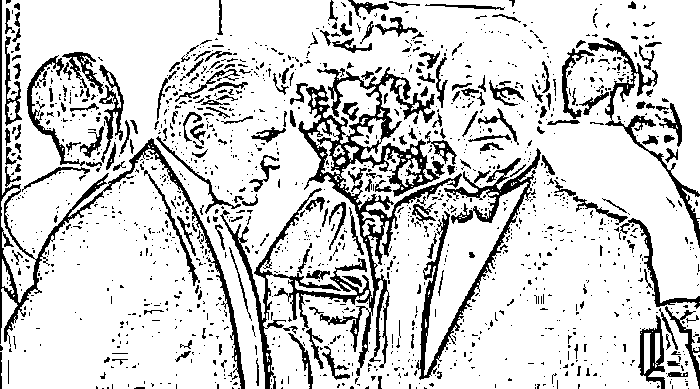
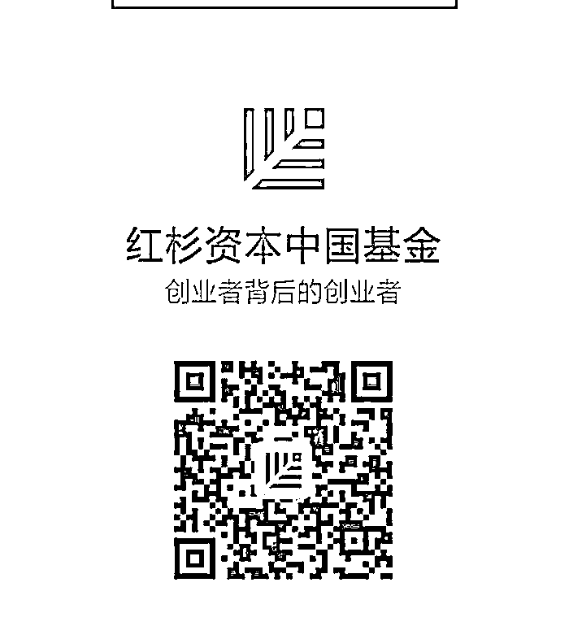

# 你的创业团队里何时需要一名幕僚长？｜红杉汇内参

> 原文：[`mp.weixin.qq.com/s?__biz=MzAwODE5NDg3NQ==&mid=2651222717&idx=1&sn=b38bdef1d7670c8ba9082dfd9089ec1c&chksm=80804ce9b7f7c5ff65fc6c83eb199d1397bbbc5a4ad05ae8d774143dd617d2a96e46b93d87d9&scene=21#wechat_redirect`](http://mp.weixin.qq.com/s?__biz=MzAwODE5NDg3NQ==&mid=2651222717&idx=1&sn=b38bdef1d7670c8ba9082dfd9089ec1c&chksm=80804ce9b7f7c5ff65fc6c83eb199d1397bbbc5a4ad05ae8d774143dd617d2a96e46b93d87d9&scene=21#wechat_redirect)

[ 编者按 ] 《纸牌屋》里的道格、《国务卿女士》里的拉塞尔、《白宫风云》里的约翰·史宾塞，这些美剧里的人物都有一个共同的身份，那就是白宫幕僚长（Chief of Staff）。

作为一种在军队、政界和世界 500 强企业中实行了几十年的普遍做法，幕僚长这个职位如今开始在美国的创业公司中兴起。它混合了行政办公室主任、第一秘书和 COO 的角色，目的是让 CEO 从琐碎事务中解放出来，成为一名超级英雄。

当然，并非所有创业企业都适用，关键取决于公司发展阶段，以及 CEO 如何定义自身的角色和职责。要么，你把它用小了：幕僚长成为“秘书”；要么，你让它过度膨胀，成为公司的影子 CEO。本文作者从其自身实践出发，给出了何时需要、何时不需要的忠告，以及如何管理幕僚长的建议。正如那句老话：“运用之妙，存乎一心。”

每期监测和精编中文视野之外的全球高价值情报，为你提供先人一步洞察机会的新鲜资讯，为你提供升级思维方式的深度内容，是为 **[ 红杉汇内参 ]**。

***

**【本期悬念】**

1.让 CEO 得解放——是时候考虑在你的创业团队中设立一个幕僚长的职位了。

2.今年 Fintech 领域的全球累计投资将超过 1500 亿美元，哪些公司将胜出？

3.面对不确定性危机，如何熨平团队的焦虑感？CEO 可以这样做。

4.当千禧一代成为主流消费人群，他们改变了商业世界哪些运行规则？

***

**【每日金句】**

设立幕僚长的目的

是让 CEO 成为一名超级英雄。

但必须明确，尽管他会做出许多重要决策

并具有强大的领导技能，

却仍是一个服务型配角。

***

**【内参】**

**你的创业团队里**

**何时需要一名幕僚长？**

综合编译/洪杉

Influitive 公司的首席执行官马克•奥根（Mark Organ）曾一度感到身心憔悴。他刚刚为其规模为 12 人的创业公司完成种子轮融资，迅速建立起销售部门，但他好像患上了健忘症一样——连续三次忘记参加会议，还错过了不少工作的截止期限。同事们委婉地表示，他应该请一位助手。然而这个建议感觉并非良策，奥根需要同时兼任好几个职位，需要具有的是超人般的能力。

突然间，他灵光一闪。他想起曾经见过的领英联合创始人雷德•霍夫曼的幕僚长（Chief of Staff，简称 CoS）萨拉•因巴赫。奥根不只是需要有人为他订机票，而是需要像因巴赫那样的人——可以在会议中代替他、从其他部门带来关键消息、接管他无暇顾及的项目的人。倍感兴奋的他开始寻求可用之才。此后四年里，奥根雇用过 3 名幕僚长，如今他们已经“高升”到公司的其它职位；Influitive 公司现在拥有 125 名员工，处于蓬勃发展的状态——奥根本人也是如此。

作为一种在军队、政界和世界 500 强企业中实行了几十年的普遍做法，幕僚长这个职位如今开始在创业公司的世界中兴起。在本文中，奥根以自己的亲身体会讲解了，什么情况下创业公司需要一名幕僚长（以及何时不需要），并给出了如何有效管理幕僚长的步骤方法。

**幕僚长究竟是什么？**

“这个角色具有强烈的服务于 CEO 个人的色彩，兼具行政助理和 COO 的要素。一般没有直接下属，若有，则可能是一名实习生或行政助理。和 COO 一样，幕僚长负责战略性的关键项目，与员工、客户及董事会成员打交道。需要非常明确的是，尽管幕僚长会做出许多重要决策并具有强大的领导技能，但他仍然还是一个服务型的角色。设立这个职位的目的是让 CEO 成为一名超级英雄。”奥根说，“在幕僚长的协助之下，我可以做出更优质更迅速的决定。”

以下是幕僚长将会承担的一些高级职责：

*   确保 CEO 在着手处理公司最重要的事项。

*   帮助 CEO 以适宜的质量水平完成优先事项。

*   使 CEO 负起应有的责任，同时协助促使下属对结果负责。

*   使 CEO 能够获取和接纳新的想法和提案。

以下是一名杰出的幕僚长所要承担的更广泛职责：

**确保 CEO 优先处理恰当的事项**。他会通过了解公司内部和外部市场的真正现状来实现这一职责。当 CEO 偏外向型时，比如喜欢接触客户、达成交易或参加活动，幕僚长则会花更多时间在了解内部动态上，包括代替 CEO 与员工一起午餐等来提高团队凝聚力。

**提升管理团队的水平**。“一位优秀的幕僚长能提高公司全体管理层的表现，他通过对团队成员的想法和提案提供有效反馈来实现这一点。当某位成员有优异表现时，他也会向我报告以便做出及时赞赏。你需要一个能帮助你在内部进行调谐的人，你需要一个在培养和雇用合适的人才方面充当你的眼睛、耳朵和手脚的人。”

**让 CEO 的交流既增多又高效**。“CEO 的多数时间用于交流，所以工作重点也在于高效交流。我会雇用擅于讲故事的人来做幕僚长。”

**充当特技替身**。“幕僚长让 CEO 的日程变得灵活。当 CEO 无法分身时，幕僚长成为有效替补。你应该把决策逻辑分享给幕僚长，训练他们以自己的方式思考，幕僚长应始终清楚对你来说重要的是什么。”

身为 CEO 就如身临舞台一般，你就是跳着踢踏舞的那个舞者。幕僚长若能尽责，台下就会有人为你喝彩。

**你在何时需要幕僚长？**

不要将其和对其他管理人员的需要混淆。你可能只是需要一名行政助理，或者完全是另一管理层次的人员。

以下几种迹象说明你需要他：

*   团队日益壮大，管理效率变差。

*   刚融完一大笔风投或者种子资金。

*   你希望自己可以分身有术，同时出现在好几个地方。

*   你工作负荷太大，饱受煎熬。

*   员工催你做决策、交付成果，你却没有头绪。

*   你想提高效率，但还未做好迎接 COO 的准备。

以下几种迹象说明你不需要他：

*   你对人力成本很敏感。

*   产品还未与市场契合。

*   尚未准备将公司规模化。

*   你的管理团队并不适合安插一名高效幕僚长。比如成员个性太强，让幕僚长难以发挥作用。

你希望幕僚长扮演何种角色，取决于你如何定义自己的工作角色：你想成为怎样的 CEO？哪些事情是你想分配给别人而非自己完成的？你已经准备好让他人接触到你的工作、生活的每一个角落了吗？

**管理你的幕僚长**

与幕僚长的联系越紧密越好。奥根说：“不仅在同一间办公室办公，听我打电话，陪我参加一对一会议，甚至还读我的电子邮件。我们每天大概得在 Slack 上交流 10 到 20 次，我对他毫不隐瞒。他必须知道我是怎么思考的，我的目的就是让他能够预测我的决策。”

关于 CEO 如何创建与幕僚长的最佳关系、工作流程，奥根给出了以下建议：

**为其 18 个月任期制定一份规划**。

“该岗位的任期通常最好是 18 个月。在前六个月，他基本只能在各种会议中暂时替代你，但要避免让他做冗余的重复性工作。另外，不要让他过早卷入具体的麻烦事中。第 6 至 12 个月，应该是他火力全开的时候，因为他可能已经与其他管理者建立起互信关系，也有了独立搞定一件事的经验。而从第 12 到 15 个月，是时候为其考虑下一步职业规划，了解其想法，在最后的几个月中有意提升其相关技能。最后阶段，则是做好工作交接安排。”

**赋予幕僚长能够让他斩获成功的角色**。

“让心不在焉的 CEO 主持会议，倒不如让幕僚长负责，说不定还会对后续工作更加有利。关键在于你怎样赋予幕僚长以合适的角色。让所有人都知道这个人是你的左膀右臂，这个人控制着你的行程安排和优先工作事项。”

**坦诚相对，幕僚长才能最大限度地协助你的工作**。

“因为在以后的合作中你需要无条件信任这个人，所以他必须得让你有安全感才行。接下来你要做的就是尽量坦诚相待，千万别隐瞒自己的弱点。一位优秀的幕僚长了解你对公司团队最深的担忧是什么，也懂得你的兴奋点在哪里。从某种程度上说，他是你的重要知己。如果你希望幕僚长发挥优势，那就别对他隐瞒任何事情。”

**别因他取得的成就而产生胁迫感**。

“如果你是一个缺乏安全感的 CEO，不清楚自己的目标和定位，一位能干而且又有号召力的幕僚长很可能会让你有卧榻之忧。如果是这样，好好检讨下自己吧。”

**替身但并非能完全替代**。

但有的时候，员工就只是需要你，一个真实的、有血有肉的你。特别是类似与员工沟通、聚餐这样的事情，CEO 亲自参加的效果当然更好。这就需要你和幕僚长共同思考：什么时候员工需要真实的我？什么时候幕僚长可以代替 CEO 出现？找到这些答案很重要。

最后，要勇于放手那些在你成功道路上扮演重要角色的人，让他能够在其它岗位上有更好的成长。事实上，大约在第 12 到 15 个月期间，你的幕僚长可能就会产生某种身份认同危机：“大家信赖我，只是因为我是 CEO 的替身，还是因为我自身的领导力？”如果没有产生这种危机，反而证明这个人并不是公司未来领导人的优秀人选。

“一位优秀的幕僚长会帮你核查细节，在耳边告诉你‘这是即刻需要处理的事情’。”奥根说，“这种感觉让我更加坚定、更有安全感，能够从纷繁事务的焦灼中冷静下来。这种感觉真好。”

***

**【情报】** 

#关键词：信任、安全、体验#

**2017 年，我们可以对金融科技抱哪些期待？**

据预测，今年 Fintech 领域的全球累计投资将超过 1500 亿美元。什么样的公司会成为优胜者？

*   谁能获得足够信任？确保客户敏感信息安全是至关重要的。

*   谁能让更多传统体验从线下转向线上。

*   谁能开发出更好体验的移动端产品。

*   区块链将持续升温。

*   谁更安全，用户就信任谁。

*   谁能更好地服务于个体金融交易者。 

#在不确定性年代里的领导力#

**熨平团队焦虑感的 7 个方法**

过多的不确定性会驱使人们执着于能提供安全感的东西，抵制变化——人们继续干着厌恶的工作仅仅是因为熟悉。怎样引导团队面对压力、勇于创新？

*   让人们专注于使命上。这样就不会有更多的时间闲坐着去担心所有的“如果”。

*   降低群体的焦虑程度。组织心理学家发现，每个职场里都有自己的群体情绪，人们总是期待着领导者来提示该如何思考、参与和表现。卓越的领导者们会善于建立“我们都能解决”的乐观心态。

*   承认未说出口的忧虑。让人们放下心来，知道自己并不是孤军奋战，还有领导者做坚强后盾。

*   缩小心理安全网的网眼，描绘可预期的未来。

*   奖励冒险的勇气。人们越是频繁地遭遇到令人不适的情况，就越能适应它们。

*   鼓励果断。迟疑不决只会让人们的焦虑感更深。

*   率先垂范，说到做到。人们将以你为榜样。

#当他们成为主流消费人群#

**为什么说千禧一代改变了商业世界的运行规则**

*   他们改变了我们的购物方式。千禧一代不想再为了购买食物、衣服或梳妆用品在拥挤的队伍中等候。

*   他们改变了我们的工作方式。他们已经形成了“用聪明代替刻苦”的工作理念，不喜欢朝九晚五的工作模式。

*   他们改变了客户服务行业。为了及时响应这一代消费者的沟通需求，企业要有一个 7*24 小时的社交媒体和客服团队。企业别无选择，只能变得更加透明开放。

*   他们更崇尚环保消费理念。有近 3/4 的千禧一代愿意为一个致力于可持续发展的品牌支付更多费用。

*   他们学会了如何在启动资金很少的情况下创业。平台化的便捷的网络基础设施为创业提供了充足的方便。

*   他们改变了我们的营销方式。影响者营销胜过传统的广告轰炸。

 /mp/newappmsgvote?action=show&__biz=MzAwODE5NDg3NQ==&supervoteid=450406003#wechat_redirect 

*******

**【往期回顾】**

红杉汇内参第 022 期

[聪明的钱在流向哪里？](http://mp.weixin.qq.com/s?__biz=MzAwODE5NDg3NQ==&mid=2651222648&idx=1&sn=87dd6f15f5a6daa74caaf87b22e567f1&chksm=80804c2cb7f7c53a9c4e3e67ef3f86920c73af47c947ddd60791c6494eee9b85cad750ba748a&scene=21#wechat_redirect)

[24 家顶尖 VC 看好的未来产业](http://mp.weixin.qq.com/s?__biz=MzAwODE5NDg3NQ==&mid=2651222648&idx=1&sn=87dd6f15f5a6daa74caaf87b22e567f1&chksm=80804c2cb7f7c53a9c4e3e67ef3f86920c73af47c947ddd60791c6494eee9b85cad750ba748a&scene=21#wechat_redirect)

红杉汇内参第 021 期

[克服管理「巴别塔」](http://mp.weixin.qq.com/s?__biz=MzAwODE5NDg3NQ==&mid=2651222617&idx=1&sn=2efba23b6ccaf20c5d81821493654ca0&chksm=80804c0db7f7c51b9db057fb5057b7b3b6f08faeeeb31b5c974c95838dae7365632d20bcecd9&scene=21#wechat_redirect)

[让战略与执行“知行合一”的 10 个法则](http://mp.weixin.qq.com/s?__biz=MzAwODE5NDg3NQ==&mid=2651222617&idx=1&sn=2efba23b6ccaf20c5d81821493654ca0&chksm=80804c0db7f7c51b9db057fb5057b7b3b6f08faeeeb31b5c974c95838dae7365632d20bcecd9&scene=21#wechat_redirect)

红杉汇内参第 020 期

[怎样处理联合创始人冲突？最佳 CP 是这样炼成的](http://mp.weixin.qq.com/s?__biz=MzAwODE5NDg3NQ==&mid=2651222545&idx=1&sn=07f72561a688138c402ba8b12616da16&chksm=80804c45b7f7c553ca02c6049c5eff6341808e922aea77e233693d5b42c3b4fe874799b20461&scene=21#wechat_redirect) 

