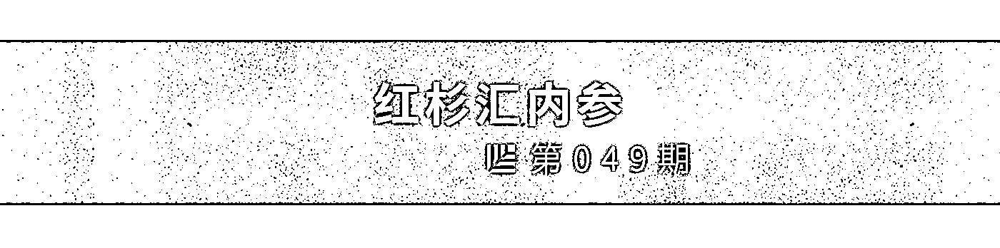
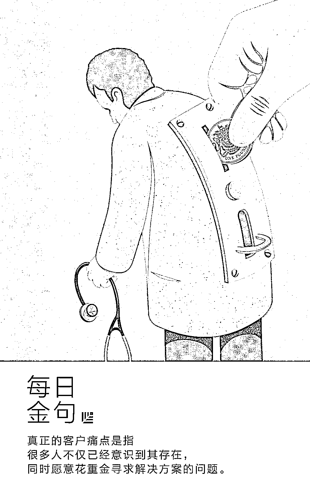
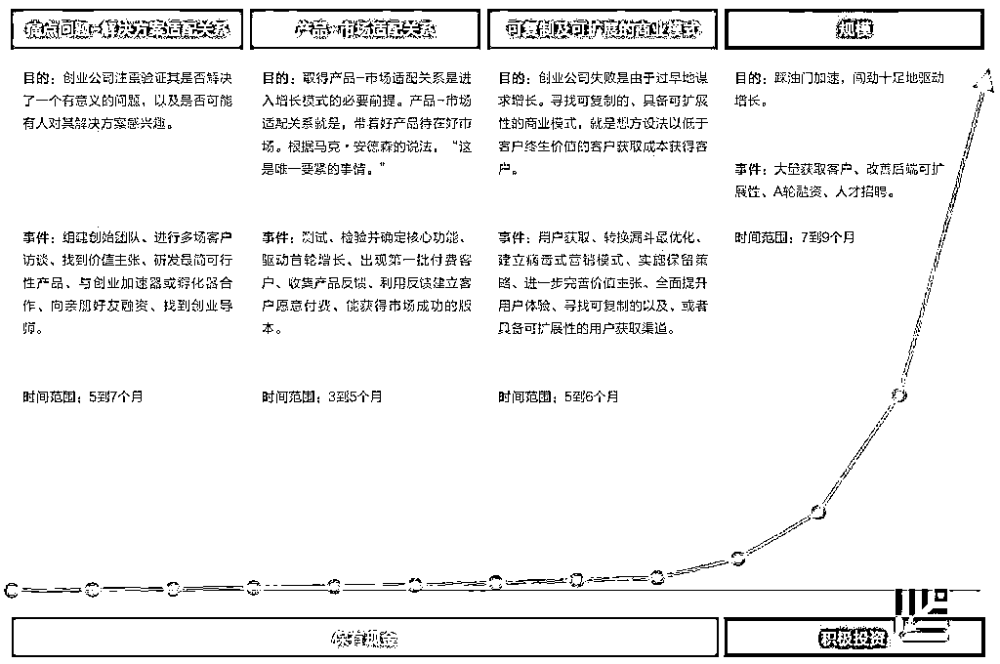
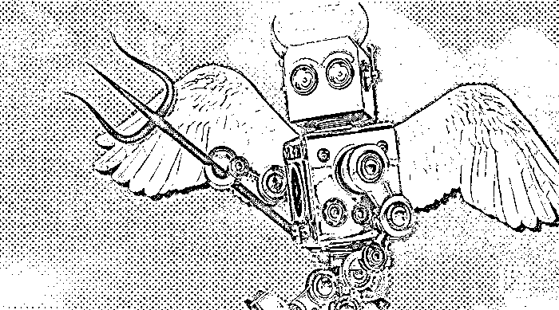
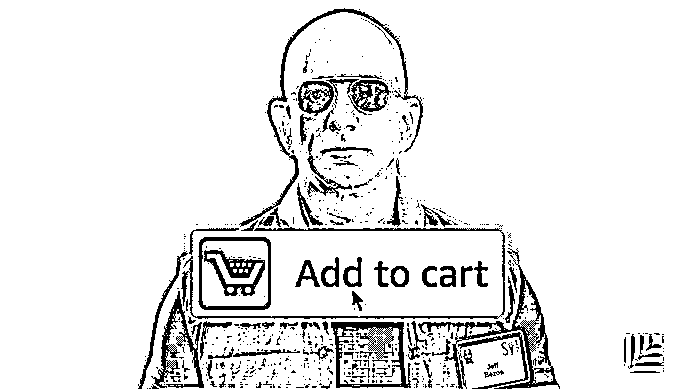

# 没站稳脚跟就输了？这里有一份稳扎稳打的创业指南｜红杉汇内参

> 原文：[`mp.weixin.qq.com/s?__biz=MzAwODE5NDg3NQ==&mid=2651223802&idx=1&sn=1d8698aac7d5b50687338c088c06c8f6&chksm=808048aeb7f7c1b839827064b2b4b3722ddf43c5e109a10e74e5a3afba4c741e1d88309f4d11&scene=21#wechat_redirect`](http://mp.weixin.qq.com/s?__biz=MzAwODE5NDg3NQ==&mid=2651223802&idx=1&sn=1d8698aac7d5b50687338c088c06c8f6&chksm=808048aeb7f7c1b839827064b2b4b3722ddf43c5e109a10e74e5a3afba4c741e1d88309f4d11&scene=21#wechat_redirect)

[ 编者按 ] “我败光了 3 个亿美元。”Fab 联合创始人 Jason Goldberg 说。红极一时的创意产品闪购电商 Fab 的崛起和坠落简直就像坐过山车。短短 2 年就成为独角兽，后来又因为步子迈得太快摔了个大跟头，最后仅以 1500 万美元的价格出售。

“我们触犯了一条基本原则，在产品市场匹配之后才可以进行巨额融资。我们已经找到了高速发展之路，但是还没有完全搞定运营模式。我们尚未成功地从创新跃进到执行。”Goldberg 说。

急于扩大规模就像是一剂初创企业毒药，这剂毒药的成分究竟是什么？如何避免饮鸩止渴？

此外，在寻找一套精致、可重复、可拓展的商业模式的过程中，你需要充分论证并测试“痛点问题-解决方案”的适配关系，核心要解决的问题是：“痛点”是真痛还是假痛？你是否确定产品是用户的“必须拥有之物”？

每期监测和精编中文视野之外的全球高价值情报，为你提供先人一步洞察机会的新鲜资讯，为你提供升级思维方式的深度内容，是为 **[ 红杉汇内参 ]**。

** 内参**

没站稳脚跟就输了？

**这里有一份稳扎稳打的创业指南**

综合编译 / 洪杉

到底什么是初创公司？企业家史蒂夫・布兰克将初创公司定义为“一个寻求可重复和可扩展商业模式的组织。”

在创业的世界里，只要你可以做到快速获得客户，且客户获得成本比客户所产生的营收要低，那你的公司就实现了从“构想”到“实业”的转变。

对每一家初创公司来说，其终极目标都是实现这样一种商业模式，初创公司的生命力很大程度上由能否创建这种商业模式而决定。

**前半段要管住“烧钱”速度**

Startup Genome 的调查发现，初创公司的发展历程里一般会有 6 个具有里程碑意义的阶段——“发现”、“验证”、“提效”、“扩展”、“维持”和“保护”。

前三个阶段包括了初创公司证实其商业方案和产品可行性的时间。

▨ **发现阶段**：这个阶段的关注点是确保公司所要解决的客户痛点足以助力一家新公司的诞生，并能使这家公司实现盈利和扩大规模。换言之，**找到一组“痛点-解决方案”的适配关系是该阶段的当务之急。**

▨ **验证阶段**：提出一组产品-市场适配关系，这意味着你要创造出一种迎合目前市场需求的产品，这个市场需要大到能让你的初创公司在未来得以发展成业界大咖。

▨ **提效阶段**：这个阶段的关注点在于优化你的商业模式，最终为公司带来利润。这个阶段的必经之路就是要发展出一套可重复和可扩展的商业模式。

总的来说，初创公司要是顺利度过了这 3 个阶段，就可以开始大手笔地去扩展公司和业务规模了。

然而，**大多数梦想成为大咖的初创公司，最后失败的原因，往往是没能在这三个阶段里管住烧钱的速度。成功，要舍得，也要“省得”。**

**想成功，要先集中精力发掘“痛点”**

急于扩大规模意味着，你想要在打造出一套精致的可重复和可扩展的商业模式之前就大规模地扩展和发展你的初创公司。

在没有足够的资源支持下就尝试去扩大公司规模将使得公司出现负向现金流，这就意味着你的公司将会把钱花光。

创业失败的公司往往具有以下一个或多个特征：

▨ **在尚未充分测试和验证其“痛点问题-解决方案”适配关系之前就推出产品，还想要扩大其市场。**Startup Genome 在分析了 3200 家快速发展的初创公司后发现，在创业的前三个阶段里，成功留在市场里的公司有 80%都会集中精力在发掘问题上而不是钻研获取客户的策略。

▨ **在建立起一套牢固的“产品/市场”体系之前就在获取客户上支出过多。**失败的初创公司往往因为缺乏“产品/市场”体系，而想要通过在公关和市场营销上花大价钱来弥补。这可谓创业家“眼界蒙蔽”的一个例子。

▨ **人事体系过早庞大。**包括聘请不少开价不菲的“顾问”，但实际他们并没有为公司带来什么价值；过早筹集太多资金以至于在财务管理上出现失序（Fab 就是这样死掉的）；尝试以牺牲公司的方方面面来换取高额收入等。

下面这张 Appster 所做的资讯图表描述了建立一家初创公司的 4 个阶段里的主要关注点、商业行为和策略以及大概的时间跨度：

**“痛点”是真痛还是假痛？**

要建立一家成功的创业公司，必须找到痛点问题及提出合适的解决方案。真正的客户痛点是指很多人不仅已经意识到其存在，同时愿意花重金寻求解决方案的问题。

如果痛点程度为 1 到 5 递增，那么可以让你实现收益的痛点则是那些达到 4 或 5 级的问题，它们需要被立刻解决。

**因为除非你所创之物能有效解决一个或多个客户当下的痛点，否则购买行为不会突然出现。**创业公司如何能够证实其所认为的可变现客户痛点确实存在呢？

为了验证某一痛点假设，你需要：

▨ 确定一个用户样本；

▨ 进行面对面或者线上调查；

▨ 评估调查结果；以及

▨ 进行更多测试。

一定要用尽一切可用线下和线上资源来锁定潜在用户，收集这些焦点小组的反馈。试试已有的电子邮件名单、网络论坛、线上留言板、社交网络和微型网络社区网站、Reddit、领英、Quora 和 Meetup.com 等。

去星巴克给行人提供免费咖啡换取他们的宝贵意见也是可行的方式之一。

你还可以考虑采取发送冷邮件（cold emailing）的形式进行推播式营销（outbound marketing），邮件内容须经过思考，不能千篇一律，要有针对性。

你还可以进行“100 美元测试”：“询问客户，‘如果您只有 100 美元用来购买此产品的一个或多个功能，您会怎么花这笔钱？您会购买哪个功能？’自然地，客户会选择他们最关心的功能，这能为你提供发现多余产品功能所需的数据。”

**确定产品是“必须拥有之物”**

著名风险投资人马克・安德森发现，**“有许多创业公司，他们虽然对运营的每一方面都了若指掌，但实际上由于没有找到与市场需求相匹配的产品，所以其实都步入了死胡同。”**

增长黑客（Growth hacker）肖恩・埃利斯认为，一旦创业公司发展出可行的样品，就可以对其进行 Beta 测试，通过让用户回答以下简单而重要的调查问题，开始测量其产品与市场的匹配度。

如果您不再使用甲产品，您会感到：

▨ 非常失望

▨ 有点失望

▨ 不会感到失望（产品不是那么有用）

▨ 无——我已经停止使用了

埃利斯的著名调查已经用于测试成百上千家创业公司，这一调查是基于他的这一观点：“**思考怎么样才叫做产品-市场适配关系的时候，最好就是看产品是不是‘必须拥有之物’。**它应该是本质上具有价值而又难以被替代的。这些不同的调查问题都是旨在于衡量产品是否是‘必须拥有之物’的首要指标。”

如果超过 40%的测试用户称他们如果不能继续使用你的产品，会感到“非常失望”，那么你的公司已经建立了稳固的产品-市场适配关系。

此时，你的公司已成功度过建立创业公司的前三、四个关键阶段，是时候迈入发展规模经济、创造更大收益并扩张经营的新阶段了。

** 情报**

#你是 AI 末世派，还是乐观派#

**AI 实际派说要克制，AI 存在 1%的问题**

有人说 AI 能创造奇迹，也有人说它对人类构成威胁。但 Databricks 公司联合创始人兼 CEO 阿里・高德西（Ali Ghodsi）要大家保持克制，他说 AI 实际上存在“1%”的问题。

▨ **AI 的 1%问题。**只有谷歌、亚马逊等少数公司利用人工智能达成他们的目标。但其余“99%”的公司没有这些资源，发现自己试图解决的问题异常复杂，不知如何下手。

▨ **AI 的早期应用。**工业 IT 和医疗行业是两个突出例子。

▨ **扩大 AI 使用，必须解决三个问题。**

□ 首先，需要领域专家。比如识别癌症就需要医生，还有懂得利用机器学习软件来建立预测模型的数据科学家。

□ 其次，需要整合工具。这些工具涵盖数据清洗、摄取、安全、预测和监控。

□ 最后，要建立安全的运营基础设施。在受到严格监管的行业里，黑客入侵或信息泄露会使公司面临严重的后果。

#比“客户至上”的理念还实用#

**跟杰夫・贝佐斯学习如何做出明智决策**

从表面上看，亚马逊的成功源于其“客户至上”的主张，但实际上，贝佐斯还有一些简单易用的“核心工具”，这是我们可以偷学的经验。

▨ **区别两类决策。**决策分为两类，影响重大策略的关键性选择和根据需要轻松改变的低风险选择。亚马逊将第二类决策全都交由底层团队，而更高层的员工主要做出第一类决策。

▨ **避免将代理作为默认项。**对大多数第二类决策来说，代理很有帮助，但是涉及到影响力高的第一类决策时，最好从头开始进行推论，并考虑到每种特殊情况。

▨ **释放 70％的想法后进行迭代。**错过决策时机，信息和时间带来的回报会减少。贝佐斯会划出一条线，划分出 70％的已感知理想信息，这一基准使他们能够迅速行动，也确保决策的质量不会受到过早发布的影响。这解释了他们如何能够进入这么多行业，并站稳脚跟。

#一步之遥？#

**普通老板和“卓越”老板之间差“九步” **

▨ **透过行动了解动机。**员工会犯错误，会越“权”，还偶尔会耍弄手段来试图上位。高效的领导者会直接采取行动，卓越领导者则会寻找这些问题的潜在原因。

▨ **要原谅，还要“遗忘”。**员工犯错，尤其是大错时，领导者很容易戴“有色”眼镜。优秀的老板先搁置错误；卓越领导者，还会忘记错误，他清楚有色眼镜给员工带来的影响。

▨ **把员工目标和组织目标放在同等位置。**优秀的领导者鼓励员工努力实现企业目标。卓越领导者则会让员工感觉他们所做的事对自己和企业有同样多的好处。

▨ **提供支持而不求赞扬。**大多数领导者会对员工说：“听我说，我虽然为你说话了，但是……”卓越领导者总会支持员工，且事后闭口不谈。

▨ **很少做出公共决策。**卓越领导者很果断，他们确定自己不是做决定的适当人选，随后选出合适的决策人——最接近问题的员工。

▨ **你不认为控制权是一种奖励。**许多人拼命上位，是想自己做主。作为一个非凡的领导者，你不会过分关注控制权的归属。

▨ **让员工吸取教训。**领导者很容易显得过于严厉，把教育变成“教训”。卓越领导者不会责备员工或发号施令，他们会帮助员工找出纠正错误的方法，和更好的工作方式。

▨ **让员工自己产生想法。**如果你是一卓越领导者，你就能看到员工的潜力——你会想方设法地让他们自己产生想法，即使这些想法所带来的结果是你一直期待的。

▨ **带着“遗憾”回家。**卓越领导者每天回家时都带着遗憾，总觉得自己可以做更多工作来满足回报员工的信任。每天走进办公室时会默默地下决心，要求自己把工作做得比昨天更好。************

** 推荐阅读**

壹

[对话 AI“最强大脑”，深入“魔法学校”，探访“绝密实验室”｜AI 双城记超值学习报告](http://mp.weixin.qq.com/s?__biz=MzAwODE5NDg3NQ==&mid=2651223788&idx=1&sn=31b8100111a76d4e7420e2d8e9810c65&chksm=808048b8b7f7c1ae1a3ba0a2213d592626d63166d7cb90eac2a95ce4e578345e56f47acbb229&scene=21#wechat_redirect)

贰

[创业公司为什么更应该招聘应届毕业生？](http://mp.weixin.qq.com/s?__biz=MzAwODE5NDg3NQ==&mid=2651223798&idx=1&sn=663e2676abd4dbab4aab6dd550b41e94&chksm=808048a2b7f7c1b4efa225a3ccb94eccff994951fe17ae8791e4e0208e988e7bd6644e22b6d3&scene=21#wechat_redirect)

叁

[深度｜中国顶级 AI Lab 探访：今日头条、讯飞、阿里、腾讯、姚班都在做什么](http://mp.weixin.qq.com/s?__biz=MzAwODE5NDg3NQ==&mid=2651223773&idx=1&sn=014a7b80cca453c2fa72b9225ad122e3&chksm=80804889b7f7c19f65f9cda862426c01dfaa09c3d9a2e8dd5346a0d80eb47bd35b050c293f2e&scene=21#wechat_redirect)

肆

[《福布斯》发布百位全球商业思想家榜单，巴菲特、施瓦茨曼、沈南鹏等顶级投资家上榜](http://mp.weixin.qq.com/s?__biz=MzAwODE5NDg3NQ==&mid=2651223759&idx=1&sn=a2b3aaad93481008f5fa58ce741bc404&chksm=8080489bb7f7c18d778f690e6090299c6a664044511a337d69cc92df2497b30fc35ef1ca49bc&scene=21#wechat_redirect)

伍

[择业无比重要，红杉认真地帮你选了这些优质公司](http://mp.weixin.qq.com/s?__biz=MzAwODE5NDg3NQ==&mid=2651223781&idx=1&sn=9c7f631b976b15cf01c04060421c94fe&chksm=808048b1b7f7c1a7052f5ff349e9f9f8d217575bb103d105187c5a2199181bd23ccd923b6b33&scene=21#wechat_redirect)

