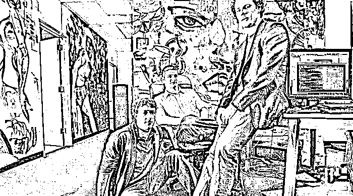
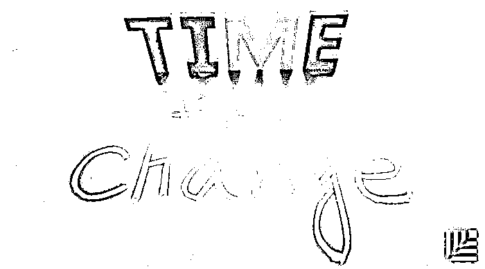

# 怎样处理联合创始人冲突？最佳 CP 是这样炼成的｜红杉汇内参

> 原文：[`mp.weixin.qq.com/s?__biz=MzAwODE5NDg3NQ==&mid=2651222545&idx=1&sn=07f72561a688138c402ba8b12616da16&chksm=80804c45b7f7c553ca02c6049c5eff6341808e922aea77e233693d5b42c3b4fe874799b20461&scene=21#wechat_redirect`](http://mp.weixin.qq.com/s?__biz=MzAwODE5NDg3NQ==&mid=2651222545&idx=1&sn=07f72561a688138c402ba8b12616da16&chksm=80804c45b7f7c553ca02c6049c5eff6341808e922aea77e233693d5b42c3b4fe874799b20461&scene=21#wechat_redirect)

[ 编者按 ]在创业圈里，联合创始人分道扬镳的案例不在少数，创业伙伴如何才能成为黄金拍档？若将这一问题划入管理学的范畴，或许就可找到合适的解答。

真格基金创始人徐小平说得好：“所谓合伙人，实际上就是利益共同体。无论多么共同，还是为了利益！所以，涉及利益的，一定要用白纸黑字、法律文件固定下来。”（[点此看全文](http://mp.weixin.qq.com/s?__biz=MzAwODE5NDg3NQ==&mid=2651222532&idx=1&sn=c149eed543487a69bdb59f3ce7e8ac41&chksm=80804c50b7f7c54647e1144aadaca5e28a8c1037935f7eba285ca3f68edf6de64f416f2927c6&scene=21#wechat_redirect)）在共同契约的框架下谈合伙、谈未来，才有意义。

本期主文作者也以自己的亲身经历说明，如何正确对待创业伙伴间的分歧和冲突：单靠多年的老朋友关系是不够的，重要的是你们现在的关系如何；只有解决冲突，才能真正拥有真实健康的工作关系；以及怎样以“费厄泼赖精神”拥抱冲突。

每期监测和精编中文视野之外的全球高价值情报，为你提供先人一步洞察机会的新鲜资讯，为你提供升级思维方式的深度内容，是为** [ 红杉汇内参 ]**。

***

**【本期悬念】**

1.怎样挽救你与**创业伙伴**之间已显裂痕的关系？一位“过来人”的血泪教训和肺腑之言。

2.这 9 条巴菲特的“致富”之道，不会出现在机场书店的电视屏里。

3.怎样在数字经济时代享受**指数型增长**？首先从你的增长战略制定方式开始。

4.为什么有的公司转型失败了，有的却取得成功？斯隆管理学院的教授们有了新研究。

***

**【每日金句】**

成长雄心不是问题，

最大的障碍可能源于

无法推动组织将雄心付诸行动。

怎么办？

为团队树立一个共同敌人。

***

**【内参】**

怎样处理联合创始人冲突

作者/Garry Tan

综合编译/洪杉

**成功会遮蔽问题**

长久以来，联合创始人之间的战争都是创业公司在早期阶段失败的主要原因之一。即使你不期望它出现，创始人闹剧也仍然会发生——公司在朝正确的方向蓬勃发展的时候，你可能注意不到在基本层面出现的一些问题，这是创业公司的大敌。它很危险，因为每一个创业公司都迟早会中招，你无法期望永远都是美好的时光。

**如果你没有做好应对联合创始人关系冲突的准备，就可能会在最需要紧密合作的时候，成为彼此的阻碍**。

我和我的联合创始人的错误之处在于，我们完全把与彼此的动态联系抛在了脑后。我们很少直率、坦诚地交谈，没有停下来反思各自的需求是什么，我们从未寻求专业支持以确保合作伙伴关系健康发展。当关系的“蜜月期”结束时，冲突暴露了。

大多数人仅仅从字面上理解良好的联合创始人关系：与技术人员配对的商业人士。实际上，联合创始的意义要更为深刻，因为当冲突真的出现时，你将不得不在最不合适的时间，再次寻找和确认双方的共同点。

就我而言，我和联合创始人已经认识八年多了，我们从上大学那会儿就一直是朋友。我们有感情基础，但单靠多年的老朋友这一点是不够的，重要的是你们现在的关系如何。

**冲突能避免吗？**

为了避免冲突，我们不再一起工作。但如果在工作之外没有花时间在一起，就要问问自己，这是为什么？当你看到你的联合创始人出现在大厅的时候，你有没有改变路线避免与他碰面？你有没有在尽量避免与他互动？如果情况如此，那么这就是一个明显的出了问题的迹象——**你只是通过不与他接触来避免冲突，而这起不到什么作用**。

有时候，创始人会将回避行为做到极致。最近有人告诉我，他决定每月只和联合创始人谈上一次，并表示这是唯一行之有效的方式。这是一种非常极端的回避行为！我告诉他，他必须花 10 倍以上的时间来处理问题、解决问题或者——准备决裂。

**最佳联合创始人组合其实无惧冲突**

一直以来，我们听到的信息都是：联合创始人之间产生冲突是糟糕的，所以可行的最佳办法就是尽量减少它发生的频率。这是不对的。

我的创业导师告诉我，这通常是“末日四骑士”出现的时刻：防御（Defensiveness）、批评（Criticism）、蔑视（Contempt）和设置障碍（Stonewalling）。提出这一概念的心理学家约翰·哥特曼指出，当婚姻关系中出现这些行为时，基本能够以不可思议的准确度预测婚姻关系的失败。这对联合创始人来说也同样如此。

**成功的联合创始人组合其实无惧冲突，而且会不断地解决冲突，如此往复循环**。如果你们不能争论，也就无法获得最佳解决方案，也就无法真正拥有一个真实、健康的工作关系。

不能达成一致意见？除非你们有了一个解决方案，否则不要离开房间。一个小时不够？不要过周末了，继续努力，找出一个方案。

在这些情况下，最重要的事就是你和联合创始人之间达成共识，并变得更为强大，其他任何事情都不重要。

**冲突太多？建立沟通规则和责任边界**

当然，总是战天斗地也不好。如果联合创始人之间总是处于有分歧的状态，但其实他们都希望公司发展得更好，这通常意味着各自的个人角色不够明晰。在战略方向把握上，拥有相似能力的联合创始人之间总会争执不下，这些例子不一而足。

以下是最佳的处理方式：

> *   列出你的业务所涉及的所有领域；
>     
>     
> *   找出每个领域最擅长的那个人是谁；
>     
>     
> *   指派这个人来负责；
>     
>     
> *   做决定时，每个人都要仔细倾听其它声音；
>     
>     
> *   但一旦领导者做出决定，就停止争论。

**拥抱冲突，公平“斗争”**

**拥抱冲突，但不是放弃自我**。有些创始人知道他们想要的是什么，也知道什么是正确的，但他们甚至在争论开始之前就已经放弃了。我曾经也是这样，希望与我共事的每一个人都保持融洽关系，但随着时间推移，有时会再一次陷入艰难境地。我已经学到了这一课：不能以牺牲你认为正确的东西来换取表面的和谐。你必须战斗，不要食言，如果你有想法的话，确保别人能够听到。

**避免用你的方式做决定**。房间里讲话最大声的那个人，并不意味着一定是最后的赢家。这实际上是避免冲突的一种方式，但却不一定是好的，因为它没有给其它想法留下竞争的空间。

你也许坚信自己是对的，但在公平且平衡的争论中，你首先要倾听他人，并让对方知道你在倾听，这肯定是聪明的做法。

**公平“斗争”是以合作和数据为基础的**。在冲突开始之前，一个需要做的事情就是要提醒自己：你们是在同一个团队中。房间里的每个人都想赢，所有人都希望这家公司能够成功。在此基础上，把问题作为一个过程来讨论，直接对不同观点进行演示和评估。如果你试图直接跳到议程最后，声称并维护自己的结论是正确的，不给其它人讨论的空间，你才会遭到失败。

**不怯于寻求帮助**

与你最为信赖的朋友、投资人和导师交流。毕竟，创业是一件疯狂的事情，你正尝试其他人没有做过的事情，你可能会感到非常孤独，就好像你是唯一一个出现这个问题的人。相信我，你可以放空你的头脑，与其他创始人和朋友谈谈你的苦恼。

不要怯于寻求专业人士的专业帮助，类似婚姻关系顾问那样教你如何挽救婚姻。运动员有教练和培训师来帮助他们取得最佳的表现，知识工作者也有这样的需求。我见过许多联合创始人，发现他们的合作伙伴关系借此得以很好地延续。

*******

**【情报】**

#请注意第四条#

**股神巴菲特值得借鉴的 9 个投资原则**

怎样成为全球富豪，而且还取之有道？这位“奥马哈先知”是这样做的：

*   要有经济头脑。少年时就开始拿着地图挨家挨户售卖苏打和口香糖，13 岁时就填报了人生第一份纳税申报单。

*   量入为出。当“感觉不富裕”时，巴菲特会选择一个 2.95 美元而非 3.17 美元的麦当劳作为早餐。

*   积少成多。他喜欢复合投资成倍增长的方式。

*   学无止境。大部分时间都在阅读——知道的越多，就越能做出更明智的选择。

*   寻找被市场低估的公司。这些被掩盖的“宝藏”需要学习研究才能被发现。

*   从长计议。他到现在还没有出售在 1960 年代购入的美国运通股份。

*   不做无把握之事。

*   切忌人云亦云。股市崩盘后的第二天便是买入的绝佳时间。

*   安全为上。巴菲特投资规则第 1 条是“永不赔钱”，第 2 条是“谨记第 1 条规则”。

#为什么传统的年度规划不灵了？#

**你需要会呼吸的增长战略**

太多公司仍基于传统的增长规划方法来制定增长战略——按照年度周期、历史分析和增量思维，这已过时。企业需要围绕以下三个新现实来重新构建战略制定方式——

*   事实 1：你不能分析未来的路，你需要去创造它。纯粹的数量化分析无法推动创新飞跃，也无法预测未来竞争对手。想一想 5 到 10 年后的世界会是什么样子——横跨一系列不同行业，而不仅仅局限于你所在的行业。在未来世界里，现有消费者的需求将如何变化？是否有新机遇？

*   事实 2：竞争演变不再是线性的，它按指数变化且具有破坏性。你的战略需要反映这些动态。战略不能只是一个固定的行动计划，不能只在可预见的未来发挥行军令的作用，战略需要用一种有生命力的、类似呼吸的形式表现出来。

*   事实 3：成长雄心不是问题，最大的障碍可能源于无法推动组织将雄心付诸行动。怎么做？为团队树立一个共同敌人，创造一个未来竞争对手的角色；广泛宣传这一角色；确保每个部门都知道将面对的是什么，以及为何每个人的投入都对赢得战役十分重要。

*   总之，你的数字化增长战略需要聚焦未来、不断变化。此外，还应该提供一句鼓舞人心的口号，让整个公司都团结起来。

#MIT 斯隆管理学院又有新研究#

**为什么公司转型频繁失败**

*   关键原因：公司组织通常不认为即将引入的管理实务和方法会带来相应价值观以及应该如何行事的范式，由此产生价值观与方法论的冲突。

*   文化和方法需要配合在一起才能发挥良好的效果。如果管理方法中嵌入的价值观不符合当前的组织文化，必须通过实践和奖励新行为的方式来改变旧文化。在后一种情况下，管理方法就是文化变革的载体。

*   组织内亚文化的存在，标志着管理变革的机会。在推行新管理方法时，先找到与其文化契合度最高的部门，并推行试点。对那些在新方法下取得良好成果的团队予以奖励，并宣扬其事迹。这样，其他部门将变得更加开放，更乐于试用新方法。

*   在公司没有突破性变革的情况下，其组织文化是通过不断重新整合现有习惯来维持的，从而将潜在价值观制度化。

***********

**【往期回顾】**

红杉汇内参第 019 期

[为什么你需要一个 COO？](http://mp.weixin.qq.com/s?__biz=MzAwODE5NDg3NQ==&mid=2651222505&idx=1&sn=d72cfd0858c1815f419ad1e93961c0b9&chksm=80804fbdb7f7c6ab55aa1a01ba01a25d9c2e2f46381f95c0cfb7d51b09746443939c8a0c5f15&scene=21#wechat_redirect)[敢打赌你没有认真思考过](http://mp.weixin.qq.com/s?__biz=MzAwODE5NDg3NQ==&mid=2651222505&idx=1&sn=d72cfd0858c1815f419ad1e93961c0b9&chksm=80804fbdb7f7c6ab55aa1a01ba01a25d9c2e2f46381f95c0cfb7d51b09746443939c8a0c5f15&scene=21#wechat_redirect)

红杉汇内参第 018 期

[TED 迄今最好的 9 个关于领导力的演讲](http://mp.weixin.qq.com/s?__biz=MzAwODE5NDg3NQ==&mid=2651222472&idx=1&sn=03ec4541a46dcae5fa380a097f68c8f0&chksm=80804f9cb7f7c68a8b66857888445f30300db42a0e3bb5137f4c1345593de34f8d5a659b8cf5&scene=21#wechat_redirect)

红杉汇内参第 017 期

[亚马逊“作战室”之秘：学会构建你的快速反应部队](http://mp.weixin.qq.com/s?__biz=MzAwODE5NDg3NQ==&mid=2651222399&idx=1&sn=42f0dfd321bfc53f46603295156add47&chksm=80804f2bb7f7c63dc2dc168a0c2ff00091d317325bb6e745fa5b436c5fdc5d9d4e61c9fdafad&scene=21#wechat_redirect)

