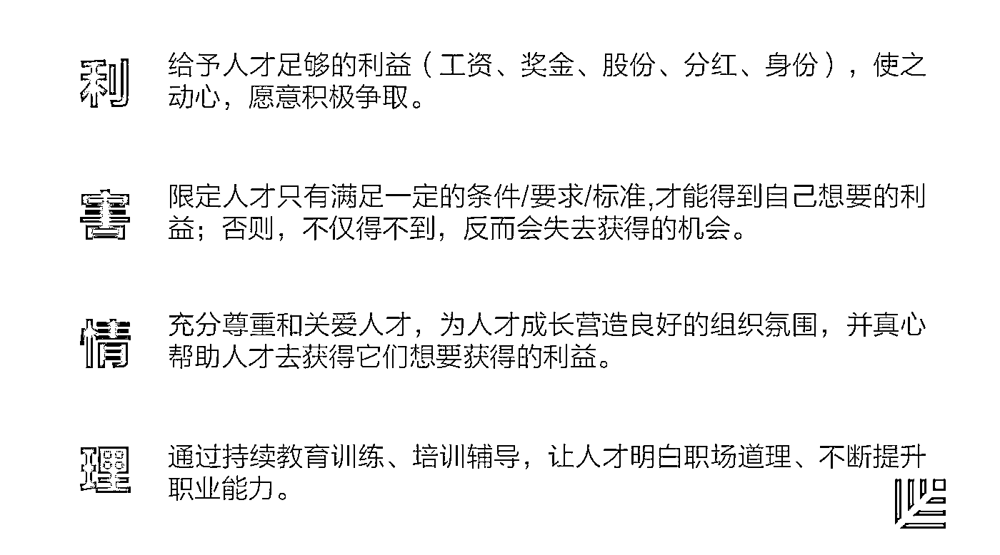
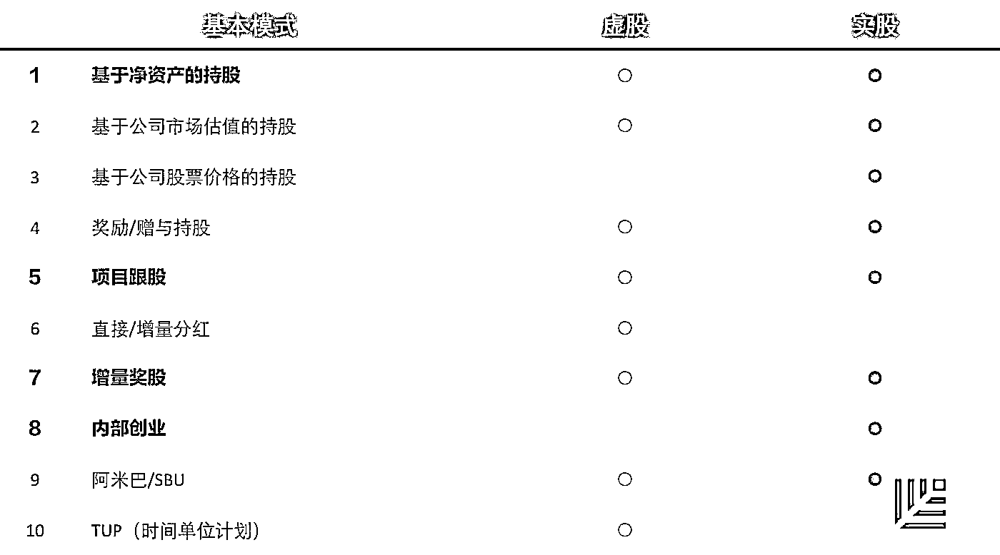
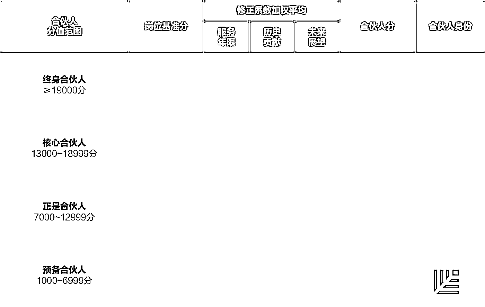
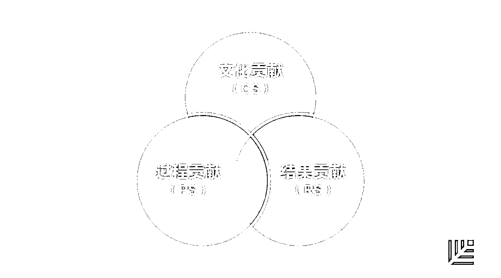

# 光有梦想和金钱还不够，合伙人股权分配怎么搞？｜首席人才官·留

> 原文：[`mp.weixin.qq.com/s?__biz=MzAwODE5NDg3NQ==&mid=2651223431&idx=1&sn=1b91067764fae7cd992a4858a1fcb1c9&chksm=80804bd3b7f7c2c5e12978158d53b22f052cb45eb1d43e7f7223896da4b9a4ec30abfdf95cca&scene=21#wechat_redirect`](http://mp.weixin.qq.com/s?__biz=MzAwODE5NDg3NQ==&mid=2651223431&idx=1&sn=1b91067764fae7cd992a4858a1fcb1c9&chksm=80804bd3b7f7c2c5e12978158d53b22f052cb45eb1d43e7f7223896da4b9a4ec30abfdf95cca&scene=21#wechat_redirect)

任你如何苦口婆心，员工就是不上心；优秀的人招不来、留不住；核心人才自立门户……这些人才管理问题，都是雇佣制发展到当前历史阶段的必然现象。

此时，你需要在共同创造、共享利益和共担责任的三共文化支撑下，以梦想为核心，通过激励方案、管理方案、促进方案打造合伙人文化。利用合伙人制度从根本上解决企业的可持续发展问题。

本文就如何搭建合伙人体系进行了详细说明。以下是部分要点摘录：

▨ 合伙人 136 模式是以股权激励为核心内容的人才管理体系。股权激励是合伙人制的必要条件，但不是充分条件。

▨ 采取有效的股权激励方案，应该体现“利、害、情、理”四个字。

▨ 在推行合伙人制时，企业需要的三套递进方案分别是激励方案、管理方案和促进方案。

▨ 在做顶层设计时，为了促进内部的良性竞争，需要对合伙人进行等级差别化的划分。

▨ 能够精准评估贡献，一切有标准可行，企业人才管理的难度才会大幅度的降低。

**职业经理人制 VS 合伙人制** 

在创业期向成长期过渡的时候，为解决创始人的精力和能力不足问题，很多企业会尝试职业经理人制，但在企业成长过程中，职业经理人逐渐面临种种问题。

职业经理人在与企业博弈的过程中，比较多的情况是追求先取后予，只赢不亏，可以去奋斗，但不能与企业共担风险，分担责任。

不少职业经理人信奉良禽择木而栖的职场哲学，对企业忠诚度不高。而且良莠不齐的职业经理人队伍往往鱼目混珠，为企业的经营管理带来很大的风险。

在标杆企业的实践示范和新的管理观点两种主要力量的作用下，合伙人制应运而生。

在利他时代，职业经理人制和合伙人制并存。但随着时间的推移，职业经理人的弊端将越来越明显，**企业有必要了解并尝试合伙人制，这是企业从根本上解决人才管理问题尤其是关键人才管理问题的有效之道。**

**股权激励 ≠ 合伙人制**

目前，对于合伙人制的理解主要有三种：

▨ 多位自然人作为股东合伙办企业，这是法律意义上的合伙人制，遵循的是合伙制企业法；

▨ 对企业的特定人才实行股权激励；

▨ 以股权激励为核心内容的人才管理体系。

合伙人 136 模式是以股权激励为核心内容的人才管理体系。

合伙人制有两种基本的范畴：一个是法律范畴的合伙人制；另一个是管理范畴的合伙人制。

前者指的是两个或两个以上自然人，以共同出资的形式成立公司，共享经营所得，共同承担亏损，承担责任，所有合伙人共同参与经营，也可以由部分合伙人经营，遵循的是合伙制企业法的相关规定。

管理范畴的合伙人制有三个要点：

▨ 公司出于激励人才的目的让特定的人才持有一定比例的公司股份；

▨ 合伙人所持股份既可以是实股又可以是虚股；

▨ 公司与合伙人之间的责任权利和义务，由公司内部制度或政策约定。

▲ 有效的股权激励方案

股权激励是合伙人制的必要条件，而非充分条件。

当单纯的股权激励无法回避这些问题时，**采取有效的股权激励方案，应该体现“利、害、情、理”四个字。**

“利”是给予人才，“害”是约束人才，“情”是尊重和关爱人才，“理”则是通过持续的教育训练培训辅导让他们明白道理、提升能力。

在合伙人 136 模式中，“1” 是指内圈的梦想，即事业走得长远要基于共同的事业理想或者说富有激情的梦想牵引。

“3” 是 3 块基石，指的是共享利益、背靠背的信任和能力互补，这是三块基石。

外围的 6 大模块和“利、害、情、理” 4 个字有一个对应的关系，激励机制和升降进退机制侧重的是示之以利，评估与考核体系侧重的是明之以害，动之以情体现在文化准则和培养计划里，业务与应力逻辑和评估与考核体现是晓之以理。

**合伙人制的核心促进方案**

**激励、管理、促进**

在推行合伙人制时，企业需要的三套递进方案分别是激励方案、管理方案和促进方案。

激励方案就是我们要给合伙人什么？怎么给？

管理方案是为了给予、约束合伙人，确保他能够为合伙事业创造价值。

促进方案主要为了促进激励方案和管理方案的落地，需要重点关注文化和合伙人的培养。

**▨ 激励方案**

合伙人的股权激励分为实股和虚股两种基本模式，适用范围包括集团、公司事业部、部门，分、子公司甚至某一个具体的项目。

实股和虚股的区别主要有三点：

▨ 实股是特定人才以一定的方式来持有公司一定比例或者数量的股份，其特点是股权经工商登记，相应的虚股不经工商登记；

▨ 持股人无论是否在职都拥有与所持股相应的资产所有权和分红权，所持股份可继承可转让；虚股只是在职的时候有权利，一旦离职，有一些权利分红权将不复存在；

▨ 实股持股人享有的其他股东权利，受法律和内部政策规定和保护，虚股在职期间所享有的其他股东权利主要是由公司的内部政策规定。

▲ 股权激励 10 种基本模式

在实股和虚股这两种基本股权形式下，股权激励有 10 种基本模式。

在这 10 种基本模式中，除了公司股票价格和内部创业的持股是实股，而直接增量分红和 TUP（华为时间单位计划）是虚股外，其他的既可以是实股又可是虚股。

加粗的 1、5、7、8 对很多的企业，尤其是非上市公司而言相对容易落地。企业可以根据自身的情况和需要进行组合式选择，并在实践中可以有若干的变化。

在股权激励下，当人才获得更多的股票和股份收益后，丰厚的回报可能会使其奋斗精神下降。

要解决这一矛盾，需要企业从文化的角度强调即便已经获得很多，也应该做有成效的奋斗者，同时要从顶层设计开始把合伙人制设计得更到位。

▲ 合伙人身份层级定义标准

**在做顶层设计时，为了促进内部的良性竞争，需要对合伙人进行等级差别化的划分。**自下而上分为普通员工、预备合伙人、正式合伙人、核心合伙人、终生合伙人。

为合伙人身份层级定义标准，其中涉及到的要素有岗位基准分，以及因企业的岗位设计不尽合理而设置的修正系数，岗位基准分和修正系数相乘得出合伙人分值，对照第一列里面的合伙人分值范围，最终确定特定合伙人身份层级。

其中，修正系数由服务年限、历史贡献、未来期望 3 个典型要素形成，可以自行选择确定。

**▨ 管理方案**

德鲁克曾经说过，对企业而言，不能评估就不能管理。从正反两方向来思考，不能有效评估贡献就不能检验成果，不能奖罚分明，不能吸引人才，不能培养人才，不能保留人才。

**能够精准评估贡献，一切有标准可行，企业人才管理的难度才会大幅度的降低。**无需在工作报偿问题上绞尽脑汁，无需在人才升降进退方面用尽心思，在人才培养方面无需制定复杂而又低效的人才培养计划，也可以避免复杂的人际沟通。

这里的贡献/业绩/绩效评估，涉及两个核心的问题：

▨ **企业的人岗匹配和机会分配。**如果人岗匹配没有做好，对于人才的机会分配就不公平，可能会导致贡献/业绩绩效/评估一系列的问题。

▨ **具体的评估方法以及评估以后的结果是否能得到有效应用。**A 存在问题，必然影响 B，而 B 是否有效必然会影响企业在 A 点的作为。

▲ 有必要评估的三个方面贡献

对合伙人而言，贡献评估的作用与意义是为了保证报偿的公平合理，推动管理的精细化发展，促进员工的学习与成长。

在方法论方面，主张企业对于人才或者说对于合伙人的贡献评估要搞定上图的三个框。S 是分数，对文化贡献、过程贡献和结果贡献的过程评估，需要各自给出三方面指标，包括一项核心指标，两项修正指标，修正指标根据核心指标表达的管理意志程度进行确定。

**▨ 促进方案**

为了确保激励方案和管理方案长期有效，必须有相应的促进方案。促进方案有两个关键词——文化、合伙人能力培养。

首先，**打造合伙人文化。**

尊重人性，强调长远来应对短视，强调共同利益应对自私，达成共同创造、共享利益和共担责任的三共文化。

在此文化的支撑下，以梦想为核心，通过激励方案、管理方案、促进方案打造合伙人文化。

具体设计时，首先要编制合伙人章程，把思想、制度、规范整合进合伙人章程里面，进一步通过宣贯合伙人章程，让这些内容能够广而告之，继而通过维护合伙人章程，使之深入人心。

其次，**做好合伙人能力的培养。**

职业价值观、岗位胜任能力和适应变化能力是 E9 人才管理标准里面的三项职业能力（E 是评估，9 是 9 项标准）。

其中，职业价值观是个体人才秉持在职场上跟组织进行利益交换的原则与组织要求相匹配的程度；岗位胜任能力是个人能力所具备的工作能力与岗位的能力要求相匹配的程度；适应变化能力是个人所具备的适应内外部环境变化的能力与组织不断提升的要求相匹配的程度。****

原标题 / 一文读懂：怎样搭建合伙人体系！ 

作者 / 王学敏

来源 / 环球人力资源智库（ID：ghrlib）

点击文末 阅读原文 可直接访问原始出处

** 推荐阅读**

壹

[曾鸣：未来五年，S2b 是最有可能领先的商业模式](http://mp.weixin.qq.com/s?__biz=MzAwODE5NDg3NQ==&mid=2651223422&idx=1&sn=a32d2df4560045e8fc20ad4468179841&chksm=80804b2ab7f7c23c1eb64a4fc7b893a8c507e3b1d2cc3cd6e5fae2ba09c9d73e3f7c10af2ecf&scene=21#wechat_redirect)

贰

[精彩、简洁、有设计感！这个公司的 Offer 被硅谷热捧](http://mp.weixin.qq.com/s?__biz=MzAwODE5NDg3NQ==&mid=2651223402&idx=1&sn=6ca5d5485087599393c1c7042f46c8f6&chksm=80804b3eb7f7c228740c7e0095b3b9f6d92a02ab539ffa294f2034d6fbc7dad0af57c59ec4f2&scene=21#wechat_redirect)

叁

[成为巴菲特，不如说成为更好的自己](http://mp.weixin.qq.com/s?__biz=MzAwODE5NDg3NQ==&mid=2651223408&idx=1&sn=dbfc1d892c51421a0b042b0e732c3111&chksm=80804b24b7f7c2325e3521a8e8ee192a1808c690ced607b55a5c30173242efc213ed7a7e0f1d&scene=21#wechat_redirect)

肆

[英雄互娱应书岭：AI 消灭旧岗位，互动娱乐创造新 JOB](http://mp.weixin.qq.com/s?__biz=MzAwODE5NDg3NQ==&mid=2651223412&idx=1&sn=e704304e3f36f51651981c21e753a862&chksm=80804b20b7f7c23613d6977d00c94b83046ff1fccd9aad072efdf69dc6323a8ae7aa74c0f38c&scene=21#wechat_redirect)

伍

[耗时 7 年，125 位画师纯手工绘制，全球首部全油画动画长片，致敬所有专注、执着的创造者](http://mp.weixin.qq.com/s?__biz=MzAwODE5NDg3NQ==&mid=2651223415&idx=1&sn=55725e833fa0d5511aabe6d4dce52936&chksm=80804b23b7f7c2359993893580cad874c34f7883f3b9b89f79a32850a5eccf8530f30850a514&scene=21#wechat_redirect)

