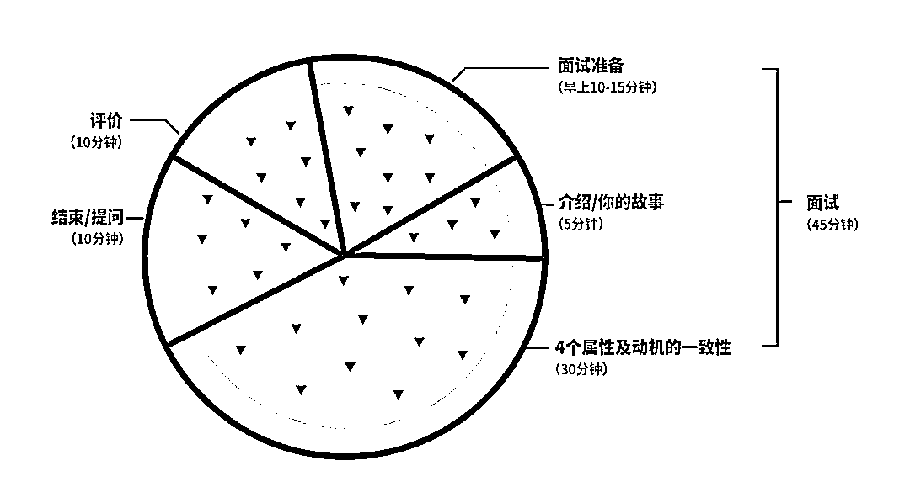
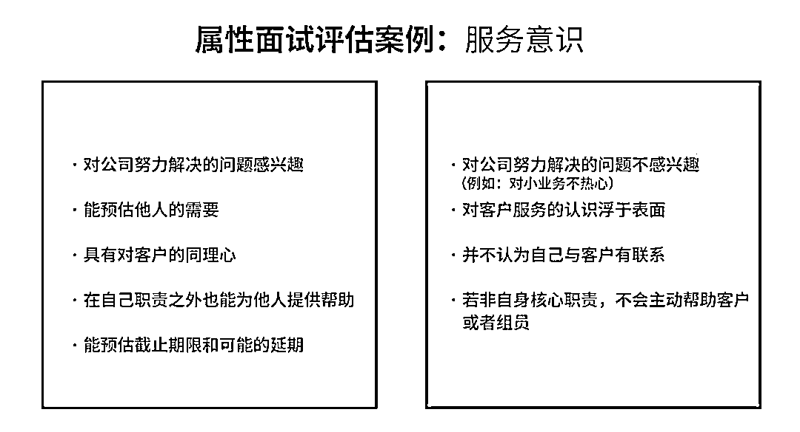

# 从 3 个人到 600 人，这家初创企业如何避免自我迷失？| 首席人才官

> 原文：[`mp.weixin.qq.com/s?__biz=MzAwODE5NDg3NQ==&mid=2651225482&idx=1&sn=8a850f2497f8babb235362202ca3e0ab&chksm=808043deb7f7cac8927a736f0ffe511f261f08b6774437d629f00728a77d7d6b15ae12156202&scene=21#wechat_redirect`](http://mp.weixin.qq.com/s?__biz=MzAwODE5NDg3NQ==&mid=2651225482&idx=1&sn=8a850f2497f8babb235362202ca3e0ab&chksm=808043deb7f7cac8927a736f0ffe511f261f08b6774437d629f00728a77d7d6b15ae12156202&scene=21#wechat_redirect)

“最近的企业文化氛围发生了很大的改变。”

“我觉得自己谁也不认识了。”

“我们面临着越来越严峻的挑战。”

这些困扰常常发生在高速发展期的初创企业。一方面，企业迫切地需要人才，但是从长远角度来说，企业也需要招聘能够融入和发展现有企业文化的员工。那么，如何在不破坏企业精神的前提下，快速招募员工、扩大公司规模呢？

Gusto 的首席执行官兼联合创始人 Josh Reeves 认为：“企业不会说服求职者加入，求职者也不会说服企业雇佣他们。双方都在试着探索：彼此合作能否共创辉煌？”Gusto 公司为小型企业提供薪水计算、福利安排、人力资源服务（之前公司的名字是 ZenPayroll）。仅用六年时间，Reeves 就领导 Gusto 从拥有三名员工的公司，发展为拥有 600 多名员工的独角兽。本文中 Reeves 分享了 Gusto 是如何改善招聘过程中的既定模式、深入分析招聘理念的，并提供了“西瓜面试法”等三个实用的招聘策略。以下是内容要点摘要：

▨ 对于白手起家的创始人而言，第一步是要确定自己的价值观，因为价值观决定了传统。

▨ 企业和求职者需要在三个方面保持一致：价值观、动力来源、技能掌握。

▨ 面试不是互相审问游说，而是一个探讨人生、加深彼此了解、明确想法是否一致的好机会。

▨ 如果没有结构化的方式来进行招聘，很容易就会发展出不同的招聘方法和流程，甚至是完全不同的文化，让公司陷入混乱。

▨ 无论要招聘第 5 个人还是第 5000 个人，都要考虑招聘理念的核心要素，并努力将它们系统化。

**招聘过程就是在**

**寻求共同之处**

传统是自然而然形成的，经过数年时间，发展为企业文化，会成为公司的一部分。Reeves 希望传统不要太过死板、激进，最好可以静观其变、任其发展。因此，传统必须是可靠的，但传统的正误与否没有公式来界定，对每个企业而言，传统的含义不同。

Gusto 的 “无鞋化”办公环境就是一个很好的例子。Gusto 所有员工在公司都是不穿鞋的，丹佛和旧金山办公室的入口都有放鞋的小房间，公司还为访客提供免费的袜子、拖鞋。这个传统起源于公司在帕罗奥多创办的时候，随着公司规模的扩大一直延续至今。Reeves 认为：“公司往往是一个枯燥乏味的地方，一点也没有家的感觉，但是我们希望 Gusto 的每位员工都能在办公时段保持舒适愉悦。不穿鞋能让员工更容易找到这种感觉。我们希望工作可以创造更好的生活条件、员工能有归属感。”

但是 Reeves 也发现，不是所有传统都要保留。早前，公司会为每位新入职员工撰写详细的个人简历，并在他们入职前发给公司的所有员工。尽管这个做法很有意义，但是，随着公司发展壮大，拥有了数百名员工后，就很难再延续这个传统。现在，详细的个人背景只有招聘部门熟悉，但是，公司会确保在全员大会上向全公司介绍新同事。

对于白手起家的创始人而言，第一步是要确定自己的价值观，因为价值观决定了传统。每个公司都要经历一个过程，弄明白什么对于他们来说才是可靠的。Reeves 的建议是，要勇于坚持自己的价值观。他认为发展企业的方式有很多，不分对错，找到最适合自己的才重要。

Gusto 为自己的招聘理念感到骄傲，也为让面试者体验公司价值观与传统感到自豪。“我们的指导原则是，招聘过程就是在寻求共同之处，”Reeves 说，“企业不会说服求职者加入，求职者也不会说服企业雇佣他们。双方都在试着探索：彼此合作能否共创辉煌？”

Reeves 认为企业和求职者需要在三个方面保持一致：价值观、动力来源、技能掌握。多数情况下，企业往往只注重求职者的技能掌握。但价值观、动力来源也应受到重视，否则，面试就成了机械匹配招聘启事的要求。

为此，Gusto 采取了三个策略，既遵循创立初期的传统，又满足了扩大规模后的新需求。这三个策略就是：“西瓜面试法”，建立招聘委员会，把入职通知变成庆祝会。

**策略 1**

****“西瓜面试法”****

****最初的做法：**首席执行官面试每一位求职者，分析他们的动力来源、价值观与公司是否一致。**

****进阶做法：**为求职者精心设计有关价值观、动力来源一致性的面试项目，以计分的形式分析他们的表现。**

**价值观和动力来源对招聘而言十分重要，弄清他们的本质需要很大的工作量。Reeves 已经制定了详细的面试方法来明确求职者的价值观和动力来源。**

**起初，对每位求职者 Reeves 都进行这样的面试，这种面试不涉及他们的技能、工作经验。每次面试都以聊天开始，氛围轻松，旨在了解对方的动力来源、兴趣爱好。这样的谈话经常会因为一些不是刻意安排的内容而产生火花。**

**比如，Reeves 曾经和一位求职者聊起了他们家的厨房翻新。聊天的过程中他了解对方如何与人合作、作出决定。面试不是互相审问游说，而是一个探讨人生、加深彼此了解、明确想法是否一致的好机会。**

**加入 Gusto 的前几周，新员工会收到一个西瓜，这起源于他们在帕罗奥多创办的公司雇佣第一位员工的故事。那时，恰巧厨房里有一个房东给的西瓜，他们把西瓜作为欢迎礼物送给了这位员工。之后这种做法被传承了下来，于是有了“西瓜面试法”这个名字。**

**“西瓜面试法”是打造 Gusto 核心团队的关键一招，但当员工人数达到五六十人以上时，Reeves 明显不可能亲自面试每一位求职者。他在公司里挑选了一些与他面试风格类似的人，并确保其中至少有一位会参与面试。后来，当 Gusto 有 100 名员工时，他们正式推出了 “西瓜面试法”。Reeves 和他的团队的目标是打造一个世界级的面试培训项目。**

**自公司成立初期，Gusto 的价值观就成为了公司的一部分。最后，他们把从员工的沟通调查中的发现和原来的价值观相结合，形成了四个西瓜属性（ Watermelon Attributes）：服务意识、求知欲、拒绝自负和接受变化的能力。在筛选符合使命、能够解决当前问题的应聘者时，这些属性成为了“西瓜面试法”的核心过滤器。尽管这些属性并不能适用于每一家公司，Reeves 对创始人的建议是，花时间找出对你来说最重要的东西，建立自己的西瓜属性。**

**初创公司若想采用 Gusto“西瓜面试法”，应遵循以下步骤：**

**▨ 组建面试小组。**

**与同事一起挑选符合公司价值观的招聘者。组建委员会来筛选合适人选，委员会应为能够代表整个团队的多样化的小组，即要考虑面试经验、任期、团队和地点。**

**▨ 训练面试官。**

**举办互动训练班，进行角色扮演和练习。为新面试官准备大量面试问题，让他们互相练习面试。在 Gusto，面试官可能会问：“你做过的最好的工作或工作过的最好的公司是什么？它为什么适合你？”为了考察求知欲，可以问：“上次当你神游天外或者意识到自己忘记了时间的时候，你在做什么？是什么吸引了你的注意力？”还可以问应聘者：“最近在工作之余学了什么？为什么花时间学习这些东西？”**

**▨ 梳理面试流程。**

**建立起面试官可以遵循的流程，强调面试的互动性质。在 Gusto，面试官通常会在提出一个问题之后不断追问，使用“告诉我更多”或“解释一下你的想法”之类的话语，或者简单地问“为什么”。当应聘者给出后续回答时，面试官可以转到下一个问题，或者就原先的话题继续深入。**

**▨ 熟能生巧。**

**确保学员与已经接受过这种训练和实践的同事进行影子面试。然后反过来，由学员主导，同事监听并给予反馈。**

**▨ 开始面试。**

**让学员从训练项目中毕业，让他们独自主持面试。在 Gusto，除了正常的日常工作外，每周面试官都要花几个小时进行面试。重要的是，员工会被分配去面试他们可能不会与之共事的团队的应聘者。例如，工程师可能会面试市场营销应聘者，也可能反过来。这一举措确保面试的重点是价值观和动机的一致性，而不是技能。**

**▨ 宣传西瓜面试官的福利。**

**除了帮助 Gusto 扩大规模，每个面试官还磨练了自己的面试技巧，并建立了与公司其他不常打交道的部门的联系。西瓜面试官也在公司内部建立了自己的社交圈，互相联系交流。**

**“西瓜面试法”的流程包括以下五个部分：**

****

**好的“西瓜面试法”还要拥有以下几个关键要素：**

**▨ 做足功课，做好准备。**

**在面试之前，通常是在早上或前一天，面试小组人员要花时间去了解应聘者的背景，挑选几个问题作为重点。**

**▨ 创建双向对话。**

**对话需要是双向的。面试官从分享他们自己的旅程开始，然后转到能让应试者兴奋和感兴趣的事情。让应聘者了解面试官加入公司的原因，也能帮助他们了解公司的运作方式，如果达到这个阶段，应试者接受 offer 的可能性就会大增。**

**▨ 根据公司属性进行评估。**

**“西瓜面试法”就是评估四个关键属性，同时探究应聘者的动机。因此，在培训期间，面试官会得到一份清单，列出四个属性的正面和负面指标，以评估应聘者的匹配程度。**

**▨ 使用评分卡。**

**面试结束后，招聘者对照“西瓜属性”对应聘者进行评估，探讨他们的动机，交评分卡，并给出全面的评价。最好当天完成这些评估能更准确地保留下面试时的意见。Reeves 说：“成功的西瓜面试评估是录用的关键。这是我们面试过程的一个重要部分，实际上也是招聘委员会首先要看的东西。”**

****

**▨ 追踪成效。**

**监测和评估规模扩张的工作成效。2017 年，Gusto 的 33 名面试官进行了 740 次西瓜面试，聘用了 242 名新员工，录用率为 85%。Reeves 表示：“目前我们已经有了第四批西瓜面试官。‘西瓜面试法’让我相信我们可以在规模达到 500 人甚至 5000 人时，跟只有 5 人时拥有同样的核心价值观和理念。”**

**当 Reeves 和新来的员工一起讨论时问他们为什么加入 Gusto，几乎每个人都会提到“西瓜面试法”。吸引他们的不仅仅是 Gusto 在做什么，还有公司建立的方式引起的共鸣。因此尽管 Reeves 不能参加每一个面试，但他知道关于价值观匹配和动机匹配的过滤器起了作用。这些与他有着相同价值观的人一起建立了社区，分享面试技巧，改进面试流程，每年帮助培训新一批西瓜面试官。这将帮助 Gusto 以同样的意愿和方式雇用下一批 500 名员工。**

****策略 2****

******建立招聘委员会，确保一致性******

******原始做法：**CEO 面试每个应聘者，决定是否录用。****

******进阶做法：**招聘委员会由四个人组成，代表公司的每个部门，每周花一个小时审批每份 offer。****

****在早期阶段，公司创始人在每一次招聘中都会投入大量的精力。他们从一开始就出现在每一场面试中，甚至没有意识到这一举措提供了名为一致性的暗流，让创者之船得以稳定航行。然而当公司到达一定规模，创始人的日程变得更满，招聘的速度加快，突然之间和每个应聘者见面变得十分困难。****

****但此时，快速扩张的团队如果缺乏中心机构来确保招聘的质量控制，让管理者失去了应聘者和新员工的踪迹，将是十分危险的信号。****

****Gusto 的增长方式截然不同。“随着规模扩大，我们的一大目标是保持招聘的一致性，”Reeves 说道。快速增长的业务可能会有很多意外的结果，这些业务的团队比去年同期扩大了 20%、50%甚至 100%。但其中往往有很多人是第一次负责招聘，因此，如果没有结构化的方式来进行招聘，很容易就会发展出不同的招聘方法和流程，甚至是完全不同的文化，让公司陷入混乱。****

****许多公司都会建立招聘委员会，但 Gusto 希望创建一个适合自己的版本。招聘委员会的目的是检查和确保整体的、始终如一的招聘方法，同时这也为招聘经理创造了一个交流分享的机会，不断提高自己的水平。Gusto 的招聘委员会有四名成员，每个人都代表着 Gusto 内部不同的团队。每周开一次会，每次一个小时，然后把所有的 offer 都看一遍。Reeves 会阅读每一张评分卡和 Gusto 发出的每一份 offer，并且能够在一小时内完成，因为面试信息都已经整理打包在一起。****

****提供职位概述、应聘者背景和面试记分卡不仅能帮助招聘者简化面试过程，还有利于招聘小组对新员工的招聘工作进行清晰的总结和工作汇报，以及制定新员工入职计划。****

******策略 3******

********把入职通知变成庆祝********

******原始做法：**最后一轮的面试过后，通过者被电话通知成功获得这个工作，公司的管理者在通话中为他们喝彩，与他们共享这一激动的时刻，然后向他们介绍招聘的细节。****

******进阶做法：**在每个招聘小组中，由三到四名成员共同确认通过者的录用，为他们喝彩，并分享他们在面试中遇到的趣闻轶事，然后由招聘经理向他们介绍招聘细节。****

****当一个团队很小的时候，每一个新队员的加入都会产生巨大的影响。因此，当一家创业公司发掘一位人才时，拨出聘用电话的确是一件激动人心的事。毕竟，这可能会为团队带来巨大的改变。但是，当一家创业公司发出第 501 份工作邀请时，如何才能维持最初的兴奋程度呢?****

****Reeves 认为，把招聘过程想象成一个漏斗会有所帮助。如果你的公司已经享誉世界，所有的员工都听说过公司，应聘人员要么是主动申请工作的人，要么是你物色的人。接下来的面试、谈话、推荐信核查和工作会议等进一步的筛选过程，都是为了弄清楚：这是我们想纳入团队的那个人吗？因此，到了招聘的最后阶段，参与招聘的每个人其实可能已经花了很多时间，能找到合适的人填补空缺岗位，确实值得庆祝。因此，Gusto 一直把发出工作邀请的行为视为激动人心的时刻。****

****但这不仅仅是一场为新员工加油打气的“拉拉队的比赛”。在最初的掌声和欢呼声逐渐平息后，每个团队成员轮流发言几分钟，讲述他们面试中引起共鸣的时刻，分享他们对于招募到新队员如此激动的原因。然后，Reeves 会进入附近的一个议事室，再就剩下的招聘细节进行更私密的交谈。****

****当然 Reeves 不可能一直面试每一位应聘者，并亲自拨出每一次聘用电话。但 Gusto 为每个空缺职位设立了招聘小组，这是创业公司可以效仿和扩展的 Gusto 方式。****

****创业公司需要更加有意识地扩展自己的文化，并保持招聘过程的严格性，尤其是在公司高速增长时期。首先，把招聘看作是寻找一致性，而不是扩大你团队规模的方式或者拷问潜在员工的机会。无论要招聘第 5 个人还是第 5000 个人，都要考虑招聘理念的核心要素，努力将它们系统化，并对其他人进行培训，让他们对你公司的文化形成一种共同的管理意识。****

****此外，对于有远见的创业公司，Reeves 还提供了一些原则来指导招聘体系中难以扩展的部分：****

****▨ 展望未来。****

****回想你所做的与招聘相关的事情，面试、发出聘书、核对推荐信等，然后设想按照目前的方法，假如以 10 倍工作量完成同样的面试过程，试着找出哪些方法依旧有效，哪些则会中断或被放弃。****

****▨ 找出你想要坚持的东西，留住它。****

****你需要开始思考，随着你的成长，你真正想要留住的是什么，而它背后的理念和精神是什么。Reeves 认为需要将这种做法系统化，并提炼成几句话或几个要点，来说明究竟什么对公司来说是独一无二的，然后确保它不只是创始人所拥有的东西。****

****▨ 重新评估，并确保符合价值观。****

****不能因为以前就是这样做的，就一成不变地保持某种惯例或传统。不断重新评估你所做的是否为最佳方法，并确保它一直符合公司的价值观。** ******

****** 推荐阅读******

****壹****

****[如何将自由职业者完美融入团队？| 首席人才官](http://mp.weixin.qq.com/s?__biz=MzAwODE5NDg3NQ==&mid=2651225454&idx=1&sn=e28b32a7bf32c9dc5ac39fcaf2b0aea2&chksm=8080433ab7f7ca2cea365aac2505004e4fd386fc785d0ede6cf2d7fa09814cbae60980277d96&scene=21#wechat_redirect)****

****贰****

****[为什么小团队会赢，而大团队会输？| 首席人才官](http://mp.weixin.qq.com/s?__biz=MzAwODE5NDg3NQ==&mid=2651225419&idx=1&sn=ca16202d594a2c6b90d269fe846396c2&chksm=8080431fb7f7ca09ad703a5269c2a1bcc7eee463251de6a7995e73f0d99e96b0bca3886fe040&scene=21#wechat_redirect)****

****叁****

****[如何利用社交圈创造职业机会？ | 首席人才官](http://mp.weixin.qq.com/s?__biz=MzAwODE5NDg3NQ==&mid=2651225353&idx=1&sn=0a84b6db8c0146904a34e0bacf30fbc0&chksm=8080435db7f7ca4b21cc4209d811d62421c3a7d9f656ede1d38953eebc3841bf83eb8cc44d32&scene=21#wechat_redirect)****

****肆****

****[电影领导力：英雄给激励团队的启示｜首席人才官](http://mp.weixin.qq.com/s?__biz=MzAwODE5NDg3NQ==&mid=2651225300&idx=1&sn=cda77a88a72de97c2bc0d8025fca32c5&chksm=80804280b7f7cb9662cc5c6079be58e634afd1864db3d0adfc2b41209ad5b0e556c99c9bdba2&scene=21#wechat_redirect)****

****伍****

****[故事怎么讲才更扎心？跟“招聘界的迈克尔・乔丹”学两招｜首席人才官](http://mp.weixin.qq.com/s?__biz=MzAwODE5NDg3NQ==&mid=2651225269&idx=1&sn=fe44d8c51776ce07eb4dabff1c5aaf53&chksm=808042e1b7f7cbf759f4964a3ae46ab7ac5d40584b8f7c460aac0cb9f8f722477add2a4acbf7&scene=21#wechat_redirect)****

********