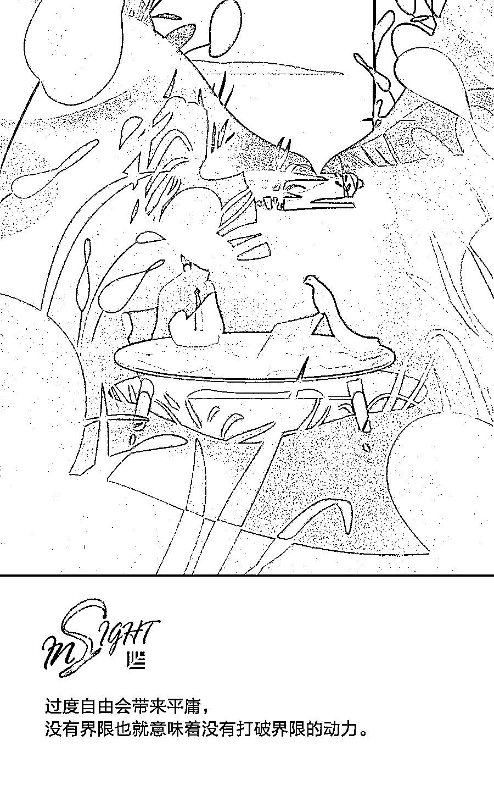
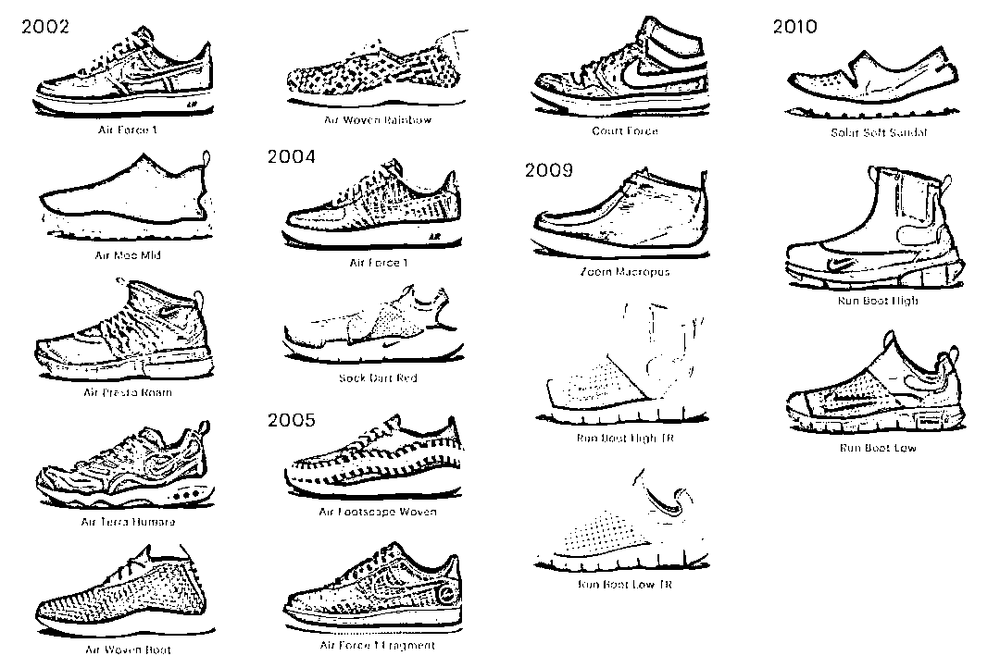
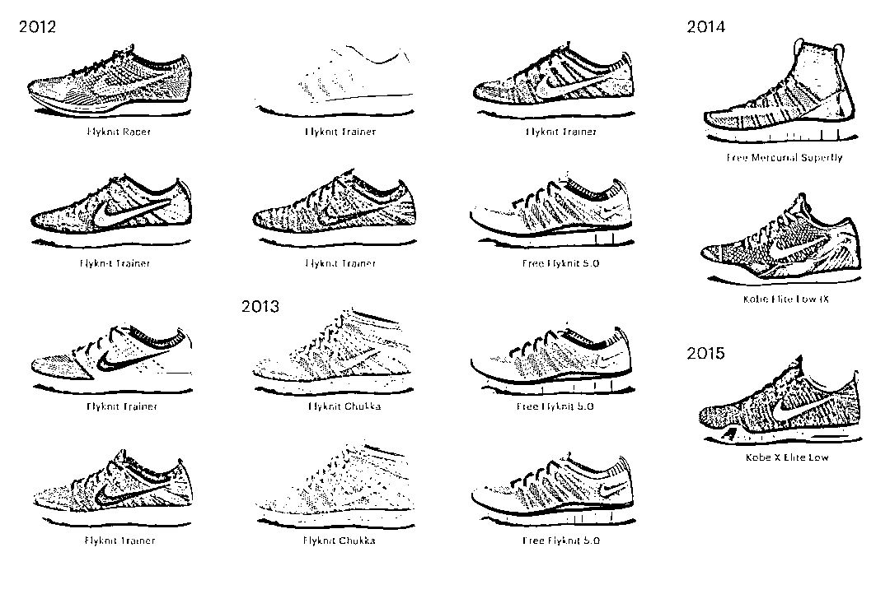

# 为什么小团队会赢，而大团队会输？| 首席人才官

> 原文：[`mp.weixin.qq.com/s?__biz=MzAwODE5NDg3NQ==&mid=2651225419&idx=1&sn=ca16202d594a2c6b90d269fe846396c2&chksm=8080431fb7f7ca09ad703a5269c2a1bcc7eee463251de6a7995e73f0d99e96b0bca3886fe040&scene=21#wechat_redirect`](http://mp.weixin.qq.com/s?__biz=MzAwODE5NDg3NQ==&mid=2651225419&idx=1&sn=ca16202d594a2c6b90d269fe846396c2&chksm=8080431fb7f7ca09ad703a5269c2a1bcc7eee463251de6a7995e73f0d99e96b0bca3886fe040&scene=21#wechat_redirect)

今天我们生活的世界有着丰富的资源，这无疑给我们带来了更多的便利和机会，但是同时却也对我们的思维方式造成不小的负面影响。商业世界的需求越来越多，更多的人、更多的资源、更大的办公室、更多的产品、更多的功能……现在是一个“更多更大”的时代，这让我们逐渐忘却了少而精的好处，忘记了克制的隐蔽优势。

Laroche.co 的设计师和创始人 Eugen Eşanu 认为，“质永远大于量——这一基本设计原则无可动摇。”在本文中他介绍了林格曼效应，并以耐克 HTM 和乐高实验为例，解释为什么在激烈的竞争中，小团队会赢，而大团队会输，以及如何绕开那些扩张团队的坑，迎接那些必然的挑战。以下是部分要点摘要：

▨ 团队人数越多，团队成员实现思维步调一致的时间也就越长。

▨ 当团队试图做“下一件大事”时，你需要在创造性活动中加入一定的限制。

▨ 为了解决问题而加大人力投入是一种“工厂心态”，即投入的人越多，产出也就更多，或者结果会更好。

▨ 如果你无法用一个 3 人团队开发出第一代产品，要么是用人不当，要么是你试图开发的产品过于复杂。

你的团队需要有多少人才能设计出一个好产品？

亚马逊创始人杰夫·贝索斯（Jeff Bezos）有一条定律，或者更恰当地说，是一种哲学：如果两个披萨不够吃，那么这个团队就过于庞大了。

一些公司会迅速雇佣许多设计师，但初衷却只是随波逐流而已。他们在不停地寻找人才，他们想聚拢最多和最棒的人才。这样，他们的团队不知不觉就吸纳了数百人。他们不断扩充人员，增加人力资源的层次，因为他们相信“多即是好”。

你可能会想：像 Facebook 这样用户超过 10 亿人次的大公司，它们的确需要这么多的设计师。因为一个简单的分享按钮就需要一个专门的团队。否则，公司怎么能够为 10 亿人提供服务呢？

看到大公司向设计团队疯狂砸钱，你开始觉得自己也需要几十名甚至上百名的设计师，才能在“设计驱动的时代”中设计出好的产品。但事实并非如此，即便不是百分百如此，疯狂砸下的钱通常也都只是打了水漂。

质永远大于量——这一基本设计原则无可动摇。

**林格曼效应**

林格曼效应是指，随着团队人数的增加，个人的生产力则会逐渐下降。

林格曼的一项实验中，20 名学生分别以个人和集体形式拉一根 5 米长的绳子，绳子的一端为测力计。两个人一起拉绳子时，每个人的平均表现是单独拉绳子时的 93%，三个人时为 85%，四个人时 77%，而到八个人时，平均表现则只是个人最佳表现的 50%。

自此，心理学家将这种效应称为林格曼效应，具体是指：多人合作时，个人努力的作用就会被削弱，因此个人缺乏竭尽全力的动力。个人贡献与团队贡献也难以区分，因此就会有人“滥竽充数”。

说到这里，有人可能会有所怀疑，认为一项有关团队力量测试的实验与创造力之间并无联系。所以，我想以实例说明，人数更少的专攻团队是如何带来最优的创意成果的。

**耐克的 HTM**

HTM 是耐克于 2002 年推出的设计实验项目。它取自三位项目合作者的名字：藤原浩（Hiroshi Fujiwara）中的“H”，汀克·哈特菲尔德（Tinker Hatfield）中的“T”和耐克首席执行官兼设计师马克·帕克（Mark Parker）中的“M”。

HTM 的作用是什么？三位设计师和主要决策者进入一个房间，放下日常的工作，共同努力对现有的产品设计进行重新诠释，开发新的产品设计。这一实例很好地展示了设计师如何才能与企业首席执行官一同合作，而不是仅仅奉命行事。

HTM 的目的就是让这三个人放下各自的常规工作，共同合作，碰撞思想灵感，为耐克注入新鲜血液，带来创新。这三个人没有身份高低、不分权力大小，没有给定要求，只有自由创作。如果你想知道这种三人模式是否成功，或者带来了哪些合作成果，见下图：

2002-2010

2012-2014

只有三个人的团队使他们每个人都充分利用时间，加快创作进程，这是公司标准流程难以企及的。对耐克这样规模的企业来说，从开发到发布，若没有三人团队模式，恐怕难以达到如此高效的程度。直到今天，HTM 仍然会不定期发布新产品。

**乐高实验**

在加州大学洛杉矶分校，三位教授借助乐高积木的搭建进行了一项实验。他们的实验中涉及了乐高积木和 2 人与 4 人的两个团队。实验的目标是看哪个团队能够在更短的时间内搭好一个指定的乐高形状，且搭得更好。2 人团队在 36 分钟内完成了任务，而 4 人团队在 56 分钟内才完成。背后的原因显而易见——团队人数越多，团队成员实现思维步调一致的时间也就越长。

Wesabe 的联合创始人兼首席执行官马克·赫兰德（Marc Hedlund）说过， “尽量减少团队人数。梅特卡夫定律指出，‘电信网络的作用与系统用户数的平方成正比’，类似的应用则是，项目团队的效率与团队人数的平方成反比。我开始觉得 3 个人是发布第一代产品的最佳人数。首先，你要减少自己计划纳入团队的人数，然后再剔除一些人。”

**遭遇困境**

当事情进行不下去的时候，人们自然而然会先想到加大投入来解决问题，通常是投入更多的人力和时间。但增加投入只会使你的主打产品、主要问题或想法变得臃肿庞大。正确的方式应当是删繁就简。

看过《厨房噩梦》的人会发现戈登·拉姆齐（英国名厨、节目主持人、美食品审）在帮助餐厅改造时有一个固定模式。为了帮助餐厅走上正轨，他会首先对菜单进行删减，只留下几道菜。为什么？因为餐厅老板认为每道菜都做能够使餐厅更为成功，但事实上，他们没有一道出色菜品，还会面临库存积压的问题。所以，拉姆齐所做的第一步几乎都是削减菜单。

这一原则不仅适用于餐厅，产品和团队也是如此。当团队试图做“下一件大事”时，你需要在创造性活动中加入一定的限制。但一旦你开始延长期限，增加预算，扩充团队，你就会不断如此，难以自制。因为这就像毒品一样会上瘾。

**为什么很多人**

**喜欢疯狂扩充团队？**

虽然效果常常不理想，但是依旧有很多人乐于在短时间内疯狂扩充团队。这种决策和思维方式受到多种因素的影响，具体包括妒忌心理、投资者或竞争者施加的压力、管理不善或团队中的害群之马等等。但是多数时候也都是因为公司资源富余。

英国奥美副总裁罗里·桑泽兰德（Rory Sutherland）认为，“获得一笔巨大的预算后，你实际上只会想方设法把钱花在那些昂贵之物上。”

到了一定的时机，公司会获得一定经济上和市场上的成功。但一段时间后，企业发展也许就不如初期顺利。这时，企业自然而然会想要加大投入，借此解决问题。投入更多的人力、更多的时间、更多的资源，希望这些努力能够帮助企业渡过难关，进入下一个阶段。

为了解决问题而加大人力投入是一种“工厂心态”，即投入的人越多，产出也就越多，或者结果会越好，但事实往往并非如此。

**必然的挑战**

靠两三个人的团队来开发新产品或新功能必然充满挑战，但这正是约束的美妙之处。多数人都误以为好的画作需要一块大的画布。但每个有创意的人都不以为然。过度自由会带来平庸，没有界限也就意味着没有打破界限的动力。

真正有创造力的人可以在一个资源极其有限的小团队中轻而易举地对任务进行重新定义，甚至打破常规。但自由度过大、人力和资源投入过多往往会使得最后的产品设计过度、预算过高、重点不足。解决这些问题最好的办法就是减少投入。如果你无法用一个 3 人团队开发出第一代产品，要么是用人不当，要么是你试图开发的产品过于复杂。** **

把一个好想法给一个平庸的团队，他们只会把这个想法毁掉。把一个平庸的想法给一个优秀的团队，他们要么会修正问题，要么会抛弃这个想法，提出一个更为优秀的想法。

——**艾德·卡姆尔**(Ed Catmull)

皮克斯联合创始人

** 推荐阅读**

壹

[红杉发布 00 后泛娱乐消费报告：不懂 00 后的创业者们要小心了！](http://mp.weixin.qq.com/s?__biz=MzAwODE5NDg3NQ==&mid=2651225402&idx=1&sn=aedf0fd1209a4471e6bfbeae264a6cdf&chksm=8080436eb7f7ca78480bc7d780f4a50d56c540d78af4ff24e3eb44968fe1cc62ee1cc4975111&scene=21#wechat_redirect)

贰

[天生要强，驱动好奇：红杉成员企业秋季校招盛大开启](http://mp.weixin.qq.com/s?__biz=MzAwODE5NDg3NQ==&mid=2651225394&idx=1&sn=9416ddd724c0208a1ec629519c3ec3bf&chksm=80804366b7f7ca70c2ba64e2cf5d948c40160c1d2c6687618cb9d445b950868806a86e14fb6c&scene=21#wechat_redirect)

叁

[如何利用社交圈创造职业机会？ | 首席人才官](http://mp.weixin.qq.com/s?__biz=MzAwODE5NDg3NQ==&mid=2651225353&idx=1&sn=0a84b6db8c0146904a34e0bacf30fbc0&chksm=8080435db7f7ca4b21cc4209d811d62421c3a7d9f656ede1d38953eebc3841bf83eb8cc44d32&scene=21#wechat_redirect)

肆

[电影领导力：英雄给激励团队的启示｜首席人才官](http://mp.weixin.qq.com/s?__biz=MzAwODE5NDg3NQ==&mid=2651225300&idx=1&sn=cda77a88a72de97c2bc0d8025fca32c5&chksm=80804280b7f7cb9662cc5c6079be58e634afd1864db3d0adfc2b41209ad5b0e556c99c9bdba2&scene=21#wechat_redirect)

伍

[故事怎么讲才更扎心？跟“招聘界的迈克尔・乔丹”学两招｜首席人才官](http://mp.weixin.qq.com/s?__biz=MzAwODE5NDg3NQ==&mid=2651225269&idx=1&sn=fe44d8c51776ce07eb4dabff1c5aaf53&chksm=808042e1b7f7cbf759f4964a3ae46ab7ac5d40584b8f7c460aac0cb9f8f722477add2a4acbf7&scene=21#wechat_redirect)

